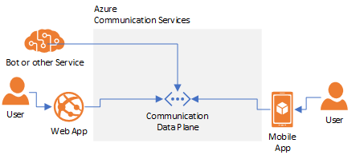

> [!WARNING]
> This is a temporary page.  **This will not be published.*** 

# About Azure Communication Services

Azure Communication Services (ACS) allows you to easily add real-time communications features to your applications.

When you use ACS, you're building on top of the same infrastructure that powers Microsoft Teams and the consumer Skype experiance. These Azure native services seamlessly auto-scale for global deployments of any size. You can use ACS for voice, video, text, and data communication in a variety of scenarios:

- Browser-to-browser, browser-to-app, and app-to-app communication
- Humans engaging bots or other services
- Humans and bots engaging the public switched telephony network 

You can mix communication types intuitively, for example a single call may have end-users enjoying a browser application and interacting with end-users on traditional telephony devices. You can build services and applications to directly interact with the data plane of the voice, video, data, and text channels; for example using Azure Bots to support an interactive voice response systems (IVR).

## Scenarios 
In this section we introduce some scenarios you can build with ACS. The first step for using ACS is making a resource in the Azure portal or via Azure Resource Management APIs:

- **Quick Start:** [Create an Azure Communication Resource](./quickstarts/create-a-communication-resource.md)

### Browser communication
ACS JavaScript SDKs enable browser applications with rich text, voice, and video interaction. A typical browser application will include at least 2 components in addition to the ACS service:

1. User Management Service. This is a trusted service you operate for managing user accounts in ACS. This service uses ACS APIs to create ACS user access tokens and shares those tokens with endpoint devices so they can access ACS securely.
2. Endpoint application. This is the browser application you operate delivering end-user communication. This uses ACS SDKs to access the ACS dataplane and accomplish real-time text, voice, and video communication.

**Resources** 
- **Concept:** [Identity model](./concepts/identity-model.md)
- **Concept:** [User access tokens (UAT)](./concepts/user-access-tokens.md)
- **Quick Start:** [Implement browser voice chat](./quickstarts/get-started-with-voice.md)
- **Concept:** [Calling client samples](./concepts/calling-client-samples.md)

### Native app communication
Many scenarios are best served with native applications. ACS supports both browser-to-app and app-to-app communication. When building a native application experience you'll probably push notifications enabled, so users can receive calls even when the application is not running. ACS makes this easy with integrated push notifications to Google Firebase, Apple Push Notification Service, and Windows Push Notifications.

**Resources** 
- **Concept:** [Integrating push notifications](./concepts/notifications-azure-portal-registration.md)

### Humans communicating with bots and other service
ACS supports human-to-system communication though text and voice channels, with services directly access the ACS dataplane. For example you can have a bot answer incoming phone calls or participate in a web chat.

### Voice and SMS over the public switched telephony network (PSTN)
Communicating over the phone system can dramatically increase the reach of your application. To support PSTN voice and SMS scenarios, ACS helps you acquire phone numbers quickly across a variety of geographies directly from the Azure portal or using REST APIs and SDKs.

**Resources** 
- **Quick Start:** [Search and acquire a phone number](./quickstarts/search-and-aquire-phone-number.md)
- **Quick Start:** [Send an SMS message](./quickstarts/get-started-with-sms.md)
- **Quick Start:** [Place an outgoing telephone call](./quickstarts/get-started-with-phone.md)
- **Quick Start:** [Assigning a phone number to a bot](./quickstarts/assign-a-telephone-number-to-an-acs-bot.md)

### Networking 
You may want to exchange arbitrary data between users, for example to synchronize a shared mixed reality or gaming experience. The real-time dataplane used for text, voice, and video communication is available to you directly in two ways:

- **Calling SDK** - Devices in a call have access to APIs for sending and receiving data over the call channel. This is the easiest way to add data communication to an existing interaction.
- **STUN/TURN** - ACS makes standards-compliant STUN and TURN services available to you. This allows you to build a heavily customized transport layer on top of these standardized primitives. You can author your own standards-compliant client or use open-source libraries such as [WinRTC](https://github.com/microsoft/winrtc)

## Automation and Webhooks
You may want to configure automated workflows based on ACS activity, for example sending an email to an end-user when they are the recipient of a PSTN call. To support these sceanrios ACS generates Azure Event Grid events. You can configure subscriptions to these events and use those subscriptions to fire customized webhooks and drive other automation. 

- [Concept: React to ACS Events using Event Grid](./concepts/acs-event-grid.md)

## Monitoring
You want to make sure that activity is reliably delivered and valid. Integration with Azure Monitor allows you to see visualization of application health, but also access logging data through Azure Data Explorer. 

- [Concept: Azure Monitor Logs](./concepts/logs-schema-list.md)

## Relationship to other Microsoft communication products
There are two other Microsoft communication products you may consider leveraging that are not directly interoperable with ACS at this time.

[Microsoft Graph Cloud Communication APIs](https://docs.microsoft.com/graph/cloud-communications-concept-overview) allow organizations to build communication experiances tied to Azure Active Directory users with M365 licenses. This is ideal for applications tied to AAD or where you want to extend productivity experiances in Microsoft Teams. There are also APIs to build applications and customization within the [Teams experience.](https://docs.microsoft.com/en-us/microsoftteams/platform/?view=msteams-client-js-latest)

[Azure PlayFab Party](https://docs.microsoft.com/en-us/gaming/playfab/features/multiplayer/networking/) simplifies adding low-latency chat and data communication to games. While you can power gaming chat and networking systems with ACS, PlayFab is a tailored option and free on Xbox.
      
