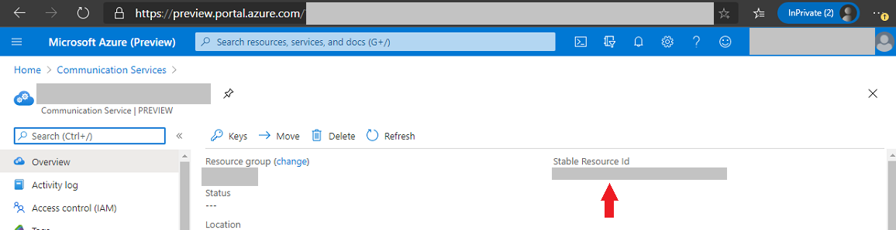

# Get Started With The 1:N Group Chat Sample

This sample application allows multiple users to connect with an agent simultaneously and use different chat features including chat, emoticons, readreceipts, typing indicator among others.

The chat application is a web application implemented with React (client) and .NET core (server) to demonstrate a set of features built on top of the Azure Communication Service platform. It shows how to use the the ACS Chat SDK JS, ACS configuration SDK C# and direct calls from the contoso server to the ACS Chat Gateway Apis.   

> [!WARNING]
> We are actively working on the packaging of this sample to reduce the size and its dependencies with other packages. Please check for the latest artifacts in the [release folder](https://github.com/Azure/communication-preview/release).
>


## Prerequisites
Before you get started, make sure to:

> [!div class="checklist"]
> * [Create an Azure Communication Resource](https://review.docs.microsoft.com/en-us/azure/project-spool/quickstarts/create-a-communication-resource?branch=pr-en-us-104477)
> * Install [npm and Node.js](https://nodejs.org). [npm is distributed with Node.js- which means that when you download Node.js, you automatically get npm installed on your computer.]
> * Install [Visual Studio (2019 and above)](https://visualstudio.microsoft.com/vs/)
> * Download the sample zip file from [Azure Communication Services - Chat SDK sample](https://github.com/Azure/communication-preview/releases/download/0.1.147/acs-samples-chat-e2e.zip).


## Setup the solution
1. After the .zip is extracted, open the solution in visual studio.

2. Open the appSettings.json file under the Chat folder, and replace the AcsResourceConnectionString and AcsResourceId from your Azure Communication Resource found in the Azure Portal (http://portal.azure.com/) as showed below:




## Update settings
On the Chat project, update the following 2 settings on the appSettings.json file:

```http
{
  "ContosoChat": {
    "AcsResourceConnectionString": "<RESOURCE_CONNECTIONSTRING_FROM_ACS_RESOURCE>",
    "AcsResourceId": "<STABLE_RESOURCE_ID>",
    ....
}
```


## Running the chat application
### 1. Set the Chat project as the 'Startup project' in Visual Studio.


### 2. Hit F5 to start a debugging session

A new browser  should launch the 'user interface' on port 5000.
You can simulate different 'users' by opening multiple tabs loading the same URL (https://localhost:5000).


 
### 3. Open a new tab, and go to : https://localhost:5000/agent
This will load the 'Agent' interface, which will allow simultaneous / independent chats between each user and the agent.


## Next steps

> [!div class="checklist"]
> * Enable cognitive services on the sample by setting up a cognitive service resource in Azure Portal.

