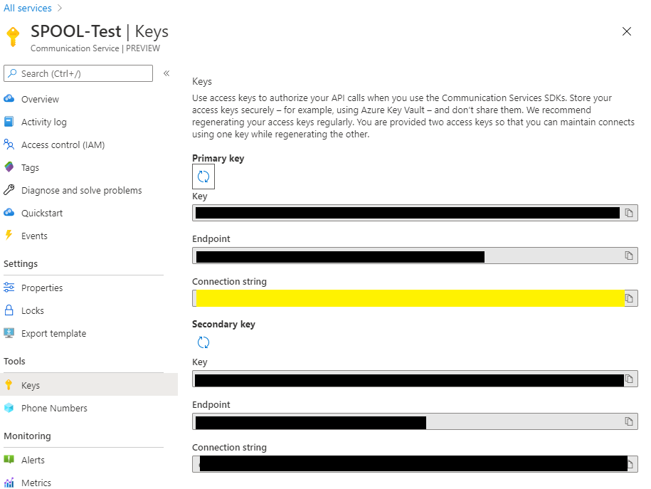

# Quickstart: Start an audio call (C#)
This quickstart helps you make an audio call with a .NET sample application. You will be able to call an echo bot which repeats your audio message, or another instance of the sample application on another PC.

## Prerequisites

If you don’t already have Visual Studio 2019 installed, you can download and use the **free** [Visual Studio 2019 Community Edition](https://www.visualstudio.com/downloads/). Make sure that you enable **Azure development** during the Visual Studio setup.

This quick start also requires:
- **Deployed Azure Communication Service resource.** Check out the quick start for making an ACS resource in the Azure portal: [Create an Azure Communication Resource](./get-started.md).

## Download the .NET Calling SDK and Sample
Download the Calling SDK and sample through the [releases feed in the private preview Github repo](https://github.com/Azure/communication-preview/releases).


## Integrate the Configuration SDK
The `Azure.Communication.Configuration` APIs and SDK are used to create a user access token which authenticates the calling clients. To integrate this package from the private preview feed, create a `nuget.config` file in the sample project directory with the below content. You will need to supply your Github user name and a personal access token. For more detailed instructions see [this link](https://docs.github.com/en/packages/using-github-packages-with-your-projects-ecosystem/configuring-dotnet-cli-for-use-with-github-packages).

```
<?xml version="1.0" encoding="utf-8"?>
<configuration>
    <packageSources>
        <clear />
        <add key="github" value="https://nuget.pkg.github.com/azure/index.json" />
    </packageSources>
    <packageSourceCredentials>
        <github>
            <add key="Username" value="YOUR GITHUB USERNAME" />
            <add key="ClearTextPassword" value="YOUR GITHUB PERSONAL ACCESS TOKEN" />
        </github>
    </packageSourceCredentials>
</configuration>
```
Open up the sample project and nuget package management. 


You should see `Azure.Communication` packages from the private preview feed. Add it to the solution.


## Create a user access token 
Update `InitializeClient()` in the sample with the following code that generates a user access token. This requires a connection string you obtain through the Azure portal.

**Connection strings and user access key management should NOT be integrated with end-user clients. In production you should deploy a trusted service to perform these operations and share user access tokens with clients when required. Inclusion in the client sample is done here for simplicity.** 
```cs
private void InitializeClient()
        {
            var userClient = new UserTokenClient("<endpoint key>");

            // create a user access token for the provided identity
            Azure.Communication.Configuration.Models.TokenResponse tokenResult = userClient.Issue(null, new[] {"voip"});
                        
            var clientTask = CallClientFactory.Create(tokenResult.Token);
            Task.WhenAll(clientTask).Wait();
            Tuple<AdHocCallClient, DeviceManager> resultTuple = clientTask.Result;
            callClient = resultTuple.Item1;
            deviceManager = resultTuple.Item2;
        }
```

Getting the connection string from the key page:



## Use the echo test to make an audio call
Build and deploy the sample application. You can supply an arbitrary user id for yourself (e.g. Chris in the sample below). Calling `8:echo:123` connects you with a echo bot, this is great for getting started and verifying your audio devices are working.

```
Enter a User ID in order to initialize the SDK:
Chris
Please choose an option from the menu:
Enter 1 to place a P2P audio call.
Enter 2 to test an incoming call scenario.
1
P2P Audio Call
Type the callee name, and then press Enter
8:echo123
Please wait for client initialization.
Placing call:
Added participant: 8:echo123
Press 'h' to hang up.
Call state changed to Connecting
Call state changed to Ringing
Call state changed to Connected
Call state changed to Disconnected
```


To connect two instances of the sample for person-to-person communication, supply the identity of the remote user.
```cs
Azure.Communication.Configuration.Models.TokenResponse tokenResult = userClient.Issue(null, new[] {"voip"});
string identity = tokenResult.Identity;
```        
