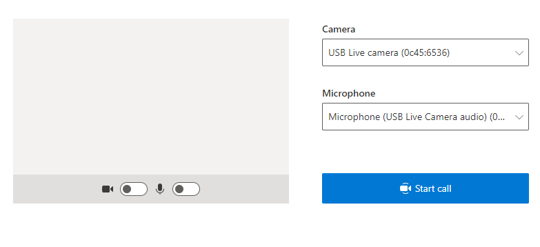
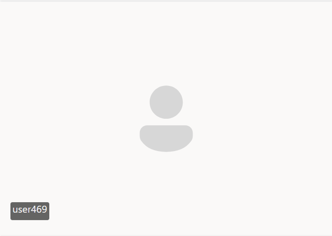

# Spool Group Calling Sample

### You can find the hero sample and documentation to run it here: [Sample Calling App](https://skype.visualstudio.com/SCC/_git/internal_service_spool-e2e?version=GBalkwa%2Fprivate-preview-group)

This is a sample application to show how the ACS Calling Web SDK can be used to build a group calling experience. The client-side application is a React based user interface which uses Redux for handling complex state while leveraging Microsoft Fluent UI for how things look. Powering this front-end is a C# web application powered by ASP.net Core to connect this application with Azure. 


The app allows users to place a call. When you press the button, the react app calls on the backend service to retrieve the user access token that will be used to connect to Azure Communication Services.


As with most online calling applications, you have the ability to specify the camera and microphone you want to use. You can also add/remove camera and mute/unmute your microphone.



Once you start the call, you will see the URL of your page now has a **groupId** as a parameter. That **groupId** is used to define the call session that you started. **To invite other people to join, you can share that URL with them**. 

Once on the call, you will see a couple of different components:

1. **Header**: Home of the controls for the call such as mute/unmute, add/remove camera, settings and leave meeting. The header itself is a react component in this project which can be modified as well as the buttons in it.


2. **Media Gallery**: Main stage where participants are shown and where if they have their cameras on, video feed is shown.



Feel free to test the sample around. Open multiple windows and try adding yourself into the call to see more participants. Below you will find links to download the sample, pre-requisites, steps to set up and some excercises to familarize yourself with it.

# Locally deploying the service & client app

The grouping calling sample is essentially two "applications" the ClientApp and the Service.Net app.
When we want to deploy locally we need to start up both applications. When the server app is visited
from the browser, it will use the locally deployed ClientApp for the user experience.

## Prerequisites

1. [Node.js (8.11.2 and above)](https://nodejs.org/en/download/)
2. [Visual Studio (2017 and above)](https://visualstudio.microsoft.com/vs/)
3. [.Net Core 2.2](https://dotnet.microsoft.com/download/dotnet-core/2.2) (Make sure to install version that corresponds with your visual studio instance, 32 vs 64 bit)

## Before running the sample for the first time
1. `git clone` the repo
2. Go to the ClientApp folder and run `npm install`
3. Get the primaryConnectionString using steps provided in [Qickstart-SpoolResource.md](./Quickstart-SpoolResource.md) or visit [How to create a spool resource](https://skype.visualstudio.com/SCC/_wiki/wikis/SCC.wiki/9198/Dogfooding). Once you get the Connection String you will append at the end the resourceId (found on the Azure portal, in the Azure overview page) in the following format: {connectionString} + ";issuer=" + {ResourceId}

## Local run
1. Go to the ClientApp folder
2. npm install
3. npm run start

4. Go to the Service.NET folder
5. Open the `SpoolCPaaSSamples.sln` solution in Visual Studio
6. Run the `ServiceSampleDotNet` project. 

* The browser will open at localhost:5000 (where the node is deploying the client app)

### Troubleshooting

1. Solution doesn\'t build, it throws errors during NPM installation/build
>
> Clean/rebuild the C# solution
>
2. Sample page returns 500 in browser
>
> Make sure you are running the ClientApp. Run 'npm run start' from ClientApp folder
>

## Publish to Azure

1. Right click the `ServiceSampleDotNet` project -> publish
2. Create a new publish profile and select your app name, Azure subscription, resource group and etc.
3. Before publish, add your connection string with `Edit App Service Settings`, and fill in `ResourceConnectionString` as key and connection string (copy from appsettings.json) as value


# How To
If you want to dive deeper into the sample, here are a couple of walkthroughs with the objective of helping you familiarize yourself with the ACS libraries and the apps components.

1. **Changing the Media Gallery:** First lets start by modifying the media gallery component to change the behavior with which tiles are generated. To do this lets go to the components folder and look for MediaGallery. Lets try the following:

	1. **Let's change the number of columns that the participants are organized on:** 
		- Lets identify the variable called **calculateNumberOfColumns**. 
		- We can then modify that variable from its current logic trying to optimize column number to a set value like 1. 
		```javascript
		  const calculateNumberOfColumns = React.useCallback(
				(participants) =>
				participants && participants.length > 0
					? Math.ceil(Math.sqrt(participants.length + 1))
					: 1,
				[]
			);
		```
		- Similar action can be taken with **calculateNumberOfRows** to change the behavior of this variable.

	2. **Let's change local user in the Media Gallery:** 
		- By default the local user is on the first tile (top left). The media gallery logic, start by aggregating all remove participants and then placing the local user at the beginning of the array.
		- Look at the function **getMediaGalleryTilesForParticipants**. This is where the logic to how the media gallery populated is.
		- Inside this function you see logic that maps the participants information to <div> objects to then be rendered.
		- At the end of the function look for **localParticipantMediaGalleryItem** which is the item for the local user. Look at how it is being added to **remoteParticipantsMediaGalleryItems** before being returned. Modify it to make it the last item. 
		```javascript
		    remoteParticipantsMediaGalleryItems.push(
				localParticipantMediaGalleryItem
			);
		```
		- Finally lets modify the stream card for the local user by modifying **StreamLocalMedia** which renders the local user. There you can see items like the source of the static image shown, the text and other parameters. For example the default image:
		```javascript
		    const imageProps = {
				src: 'https://lh3.googleusercontent.com/proxy/j4vH_J7T0-Nw29YN4zXVaAIpGxk9lV12O5fBhAn65ScoALduK3RpttAqvtxTG_u7sqy30vU_uZf6TjeARqudgM_eSLFNk1YfU9SmxJkp3LVJ',
				imageFit: ImageFit.contain,
				maximizeFrame: true,
				style: {
					maxHeight: 168, 
					maxWidth: 160
				}
			};
		```

	3. **Let's reorganize participants on the gallery by whether they have a video stream or not:**
		- The media gallery populates the participants by taking the participants information and mapping it to <div> objects. 
		- It first runs participants through a mapping function to join participant information with stream information create **remoteParticipantsStreamInfo**.
		- The **remoteParticipantsStreamInfo** is then mapped onto <div> to create **remoteParticipantsMediaGalleryItems**
		- In order to reorganize participants by whether they have video stream or not, we must then first map participant information stream information to create **remoteParticipantsStreamInfo**.
		- We can then take **remoteParticipantsStreamInfo** and before mapping to **remoteParticipantsMediaGalleryItems**, we can use a sort function to organize by the whether the stream object is *undefined* or not.
		```javascript
		    const remoteParticipantsMediaGalleryItems = remoteParticipantsStreamInfo
			.sort( (participant:ParticipantStream) => (
				participant.stream === undefined ? 1 : -1))
		```
		- We can further reorganize participants by adding more logic to the sort function.

2. **Modifying the header component:** Lets modify the header component to change the buttons found on it as well add functionality. To do this lets start by going to the component folder and finding the **Header** file. Lets then try the following:
	1. **Let's add a new button to the header:**
		- To start lets look for the **MediaControls** component inside th header. This component takes care of the camera, mute, share screen and leave components. We will add a button to the media controls component.
		- Inside the media controls component we find a **stack** full of **command buttons**. To add a new button, we will add a new command button item. (Make sure to add the *controlButtonStyle* class to mantain style.)
		- Using the Fluent UI library included (More info [here](https://developer.microsoft.com/en-us/fluentui#/)]) We will import an icon to use for our new button, for example *EyeIcon*.
		- Once you added it, the button is rendered. Next we will add functionality to the button

	2. **Let's add functionality to the button we created:**
		- For this example we will make the button remove everyone from the call. Once you have the steps above completed, lets head into adding functionality.
		- Let's start by adding an *onclick* function to the button component. In this case we will need the function to be part of our *props* in order to surface it.
		```javascript
			export interface MediaControlsProps {
					onEyeClick():void;
			} 
		```
		- Once we surface it as part of the **MediaControlsProps**, we will need to surface it as well as part the **HeaderProps** in order to act on the request to remove all participants.
		```javascript
			export interface HeaderProps {
					removeAll():void;
			} 
		```
		- Once exposed in the **HeaderProps**, we will need to map out the click function to the action function. To do this we will go to the **Header.ts** file and add the prop to **mapStateToProps**. We will then need to map the action function to the prop. This action function will be implemented in the next step.
		```javascript
		const mapStateToProps = (state: State, props: HeaderProps) => ({
			actionable:
				removeAll:() => {
					state.calls.call && removeAll(state.calls.call);
				}
		});
		```
		- To create the action function, we need to modify the **sideEffects.ts** file and add a function to remove participants. We will reuse the existing *removeParticipant* function as well as the *call* object which contains the list of participants. The function we need to add will look something like this:
		```javascript
		export const removeAll = async (call: Call) => {
			call.remoteParticipants.forEach((p) => {
				removeParticipant(call,p.userId);
			});
		}
		```
		- Now the button should remove all participants from the call. You can further play around with this concept by adding more logic or creating button that removes a random participant.
		- The **sideEffects.ts** file is where you will find a lot of the SDK functionality as well as the **Utils.ts** file. 

# Additional Reading

- [Azure Communication Preview](https://github.com/Azure/communication-preview) - To learn more about the  calling web sdk
- [Redux](https://redux.js.org/) - Client-side state management
- [FluentUI](https://developer.microsoft.com/en-us/fluentui#/) - Microsoft powered UI library
- [React](https://reactjs.org/) - Library for building user interfaces
- [ASP.net Core](https://docs.microsoft.com/en-us/aspnet/core/introduction-to-aspnet-core?view=aspnetcore-3.1) - Framework for building web applications
