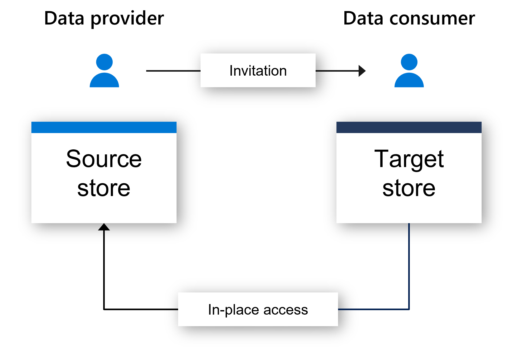

# Azure Storage in-place data share with Microsoft Purview Data Sharing (preview)

Seamless data sharing between organizations eliminates data silos, facilitates data-empowered decisions and unlocks tremendous competitive advantages. Traditionally, organizations have shared data with internal teams or external partners by generating data feeds requiring investment in data copy and refresh pipelines. The result is higher cost for data storage and movement, data proliferation (i.e. multiple copies of data) and delay in access to time-sensitive data. Near-real time access to data is the key to harnessing the true power and scale of big data in enterprise data lakes to effectively realize consistent and reliable data driven decisions.

With Microsoft Purview Data Sharing, data providers can now share data in-place from ADLS Gen2 and Blob storage accounts, both within and across organizations without data duplication, and centrally manage sharing activities within Microsoft Purview, a unified data governance solution. Data consumers can now have near real-time access to shared data. They can also use this shared data for any of their processing and insights needs and gain value at cloud scale faster than ever before. Storage data access and transactions are charged to the data consumers based on what they use, and at no additional cost to the data providers.

## Data sharing scenarios

Microsoft Purview Data Sharing can help with a variety of data sharing scenarios, including:

* Collaborate with external business partners to enable richer data insights, optimize operational efficiency and improve agility 
* Outsource data transformation and processing to third party ISVs or data aggregators by sharing raw data and receiving normalized data and analytics results back
* Automate sharing of big data (for example: IoT data, scientific data, satellite and surveillance images or videos, financial market data) in near real time and without data duplication. 
* Share data between different departments within the organization to improve data-driven decisions  

## Key capabilities

* Share data within the organization or with partners and customers outside of the organization (within the same Azure tenant or across different Azure tenants)
* Share data in-place without data duplication from ADLS Gen2 or Blob storage
* Share data with multiple recipients
* Access shared data in near real time
* Centrally manage sharing relationships and keep track of who the data is shared with/from
* Revoke or terminate share access at any time
* Flexible experience through Microsoft Purview governance portal or via REST APIs

## How in-place data sharing works

Microsoft Purview enables sharing of files and folders in-place from ADLS Gen2 and Blob storage accounts. A data provider creates a share by specifying files and folders to be shared, and who to share them with (one or more data consumers). Microsoft Purview sends an invitation to each data consumer, who accepts the invitation and specifies the target storage account in their own Azure subscription to access the shared data. This establishes a sharing relationship between the provider and consumer storage accounts. This sharing relationship provides data consumer read-only access to shared data through the consumer’s target storage account. Any changes to the data in the provider’s source storage account is reflected in near real-time in the consumer’s target storage account. The data provider pays for data storage and their own data access, while the data consumer pays for their own data access transactions.  Data provider can revoke access to the share or set a share expiration time for time-bound access to data. Data consumer can also terminate access to the share at any time.

 

## Where data is stored

Microsoft Purview Data Sharing only stores metadata about your share. It does not store a copy of the shared data itself. The data is stored in the underlying source storage account that is being shared. You can have your storage accounts in a different Azure region than your Microsoft Purview account. 

## Get started

Get started with Microsoft Purview in-place data sharing for Azure Storage by watching a [demo](https://aka.ms/purview-data-share/overview-demo) and following the [Data Sharing Quickstart](quickstart-data-share.md).

## Additional resources
* [FAQ for Data Sharing](how-to-data-share-faq.md)
* [How to Share Data](how-to-share-data.md)
* [How to Receive Share](how-to-receive-share.md)