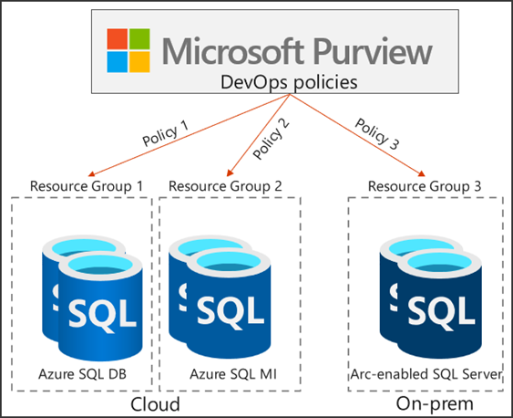

# What can I accomplish with Microsoft Purview DevOps policies?

This article discusses concepts related to managing access to data sources in your data estate using the Microsoft Purview governance portal. In particular, it focuses on DevOps policies.

> [!Note]
> This capability is different from the internal access control for Microsoft Purview itself, which is described in [Access control in Microsoft Purview](./catalog-permissions.md).

## Overview
Access to system metadata is crucial for IT/DevOps personnel to ensure that critical database systems are healthy, are performing to expectations and are secure. That access can be granted and revoked efficiently and at-scale through Microsoft Purview DevOps policies.

### Microsoft Purview access policies vs. DevOps policies
Microsoft Purview access policies enable customers to manage access to different data systems across their entire data estate, all from a central location in the cloud. You can think about these policies as access grants that can be created through Microsoft Purview Studio, avoiding the need for code. They dictate whether a list of Azure AD principals (users, groups, etc.) should be allowed or denied a specific type of access to a data source or asset within it. These policies get communicated by Microsoft Purview to the data sources, where they get natively enforced.

DevOps policies are a special type of Microsoft Purview access policies. They grant access to database system metadata instead of user data. They simplify access provisioning for IT operations and security auditing personnel. DevOps policies only grant access, that is, they don't deny access.

## Elements of a DevOps policy
A DevOps policy is defined by three elements: The *subject*, the *data resource* and the *role*. In essence, the DevOps policy assigns the *role*'s related permissions to the *subject* and gets enforced in the scope of the *data resource*'s path.
    
#### The subject
This is a list of Azure AD users, groups or service principals that are granted access.

#### The data resource
This is the scope where the policy gets enforced. The data resource path is the composition of subscription > resource group > data source. Microsoft Purview DevOps policies currently support SQL-type data sources and can be configured on individual data sources, but also entire resource groups and subscriptions. DevOps policies can only be created after the data resource is registered in Microsoft Purview with the option *Data use management* enabled.

#### The role
The role maps to a set of actions that the policy permits on the data resource. DevOps policies support a couple of roles: *SQL Performance Monitor* and *SQL Security Auditor*. Both these roles provide access to SQL's system metadata, and more specifically to Dynamic Management Views (DMFs) and Dynamic Management Functions (DMFs). But the set of DMVs/DMFs granted by these roles is different. We provide some popular examples at the end of this document. Also, the DevOps policies how-to docs detail the role definition for each data source type, that is, the mapping between the role in Microsoft Purview and the actions that get permitted in that type of data source. For example, the role definition for SQL Performance Monitor and SQL Security Auditor includes Connect actions at server and database level on the data source side.

## Hierarchical enforcement of policies
A DevOps policy on a data resource is enforced on the data resource itself and all children contained by it. For example, a DevOps policy on an Azure subscription applies to all resource groups, to all policy-enabled data sources within each resource group, and to all databases contained within each data source.

## A sample scenario to demonstrate the concept and the benefits
Bob and Alice are involved with the DevOps process at their company. Given their role, they need to log in to dozens of SQL servers on-premises and Azure SQL logical servers to monitor their performance so that critical DevOps processes don’t break. Their manager, Mateo, puts all these SQL data sources into Resource Group 1. He then creates an Azure AD group and includes Alice and Bob. Next, he uses Microsoft Purview DevOps policies (Policy 1 in the diagram below) to grant this Azure AD group access to Resource Group 1, which hosts the Azure SQL servers.

.

#### These are the benefits:
- Mateo doesn't have to create local logins in each SQL server.
- The policies from Microsoft Purview improve security by limiting local privileged access. They support the Principle of Least Privilege (PoLP). In the scenario, Mateo only grants the minimum access necessary that Bob and Alice need to perform the task of monitoring system health and performance.
- When new SQL servers are added to the resource group, Mateo doesn't need to update the policy in Microsoft Purview for it to be enforced on the new SQL servers.
- If Alice or Bob leaves their job and get backfilled, Mateo just updates the Azure AD group, without having to make any changes to the servers or to the policies he created in Microsoft Purview.
- At any point in time, Mateo or the company’s auditor can see all the permissions that were granted directly in Microsoft Purview Studio.

| **Principle** | **Benefit** |
|-|-|
|*Simplify*        |The role definitions SQL Performance Monitor and SQL Security AuditorData capture the permissions that typical IT/DevOps personas need to execute their job.|
|                  |Reduce the need of permission expertise for each data source type.|
|||
|*Reduce effort*   |Graphical interface lets you navigate the data object hierarchy quickly.|
|                  |Supports policies on entire Azure resource groups and subscriptions.|
|||
|*Enhance security*|Access is granted centrally and can be easily reviewed and revoked.|
|                  |Reduces the need for privileged accounts to configure access directly at the data source.|
|                  |Supports the Principle of Least Privilege via data resource scopes and the role definitions.|
|||

## Mapping of popular DMVs and DMFs
SQL dynamic metadata includes a list of more than 700 DMVs/DMFs. We list here as an illustration some of the most popular ones, mapped to their role definition in Microsoft Purview DevOps policies and provide a URL link to the document that describes them.

| **DevOps role** | **Category** | **Example DMV / DMF** |
|-|-|-|
||||
| **SQL Performance Monitor** | Query system parameters to understand your system | [sys.configurations](/sql/relational-databases/system-catalog-views/sys-configurations-transact-sql) |
| | | [sys.dm_os_sys_info](/sql/relational-databases/system-dynamic-management-views/sys-dm-os-sys-info-transact-sql) |
|   | Identify performance bottlenecks | [sys.dm_os_wait_stats](/sql/relational-databases/system-dynamic-management-views/sys-dm-os-wait-stats-transact-sql) |
| | Analyze currently running queries | [sys.dm_exec_query_stats](/sql/relational-databases/system-dynamic-management-views/sys-dm-exec-query-stats-transact-sql) |
| | Analyze blocking issues | [sys.dm_tran_locks](/sql/relational-databases/system-dynamic-management-views/sys-dm-tran-locks-transact-sql) |
| | | [sys.dm_exec_requests](/sql/relational-databases/system-dynamic-management-views/sys-dm-exec-requests-transact-sql) |
| | | [sys.dm_os_waiting_tasks](/sql/relational-databases/system-dynamic-management-views/sys-dm-os-waiting-tasks-transact-sql) |
| | Analyze memory usage | [sys.dm_os_memory_clerks](/sql/relational-databases/system-dynamic-management-views/sys-dm-os-memory-clerks-transact-sql) |
| | Analyze file-usage and performance| [sys.master_files](/sql/relational-databases/system-catalog-views/sys-master-files-transact-sql) |
| | | [sys.dm_io_virtual_file_stats](/sql/relational-databases/system-dynamic-management-views/sys-dm-io-virtual-file-stats-transact-sql) |
| | Analyze index-usage and fragmentation | [sys.indexes](/sql/relational-databases/system-catalog-views/sys-indexes-transact-sql) |
| | | [sys.dm_db_index_usage_stats](/sql/relational-databases/system-dynamic-management-views/sys-dm-db-index-usage-stats-transact-sql) |
| | | [sys.dm_db_index_physical_stats](/sql/relational-databases/system-dynamic-management-views/sys-dm-db-index-physical-stats-transact-sql) |
| | Active user connections and internal tasks | [sys.dm_exec_sessions](/sql/relational-databases/system-dynamic-management-views/sys-dm-exec-sessions-transact-sql) |
| | Procedure execution stats | [sys.dm_exec_procedure_stats](/sql/relational-databases/system-dynamic-management-views/sys-dm-exec-procedure-stats-transact-sql) |
| | Use the Query Store | [sys.query_store_plan](/sql/relational-databases/system-catalog-views/sys-query-store-plan-transact-sql) |
| | | [sys.query_store_query](/sql/relational-databases/system-catalog-views/sys-query-store-query-transact-sql) |
| | | [sys.query_store_query_text](/sql/relational-databases/system-catalog-views/sys-query-store-query-text-transact-sql) |
||||
| **SQL Security Auditor** | Returns audit details | [sys.dm_server_audit_status](/sql/relational-databases/system-dynamic-management-views/sys-dm-server-audit-status-transact-sql) |
||||
| Both **SQL Performance Monitor** and **SQL Security Auditor**| | [sys.dm_audit_actions](/sql/relational-databases/system-dynamic-management-views/sys-dm-audit-actions-transact-sql) |
|||[sys.dm_audit_class_type_map](/sql/relational-databases/system-dynamic-management-views/sys-dm-audit-class-type-map-transact-sql) |
||||

For more on these DMVs/DMFs you can check these docs
- [Monitoring Microsoft Azure SQL Database performance using dynamic management views](/azure/azure-sql/database/monitoring-with-dmvs)
- [Security-Related Dynamic Management Views and Functions](/sql/relational-databases/system-dynamic-management-views/security-related-dynamic-management-views-and-functions-transact-sql)

## More info
- DevOps policies can be created, updated and deleted by any user holding *Policy Author* role at root collection level in Microsoft Purview.
- Once saved, DevOps policies get automatically published.

## Next steps
To get started with DevOps policies, consult the following blogs, videos and guides:
* Try DevOps policies for Azure SQL Database: [Quick start guide](https://aka.ms/quickstart-DevOps-policies)
* See [other videos, blogs and documents](./how-to-policies-devops-authoring-generic.md#next-steps)
