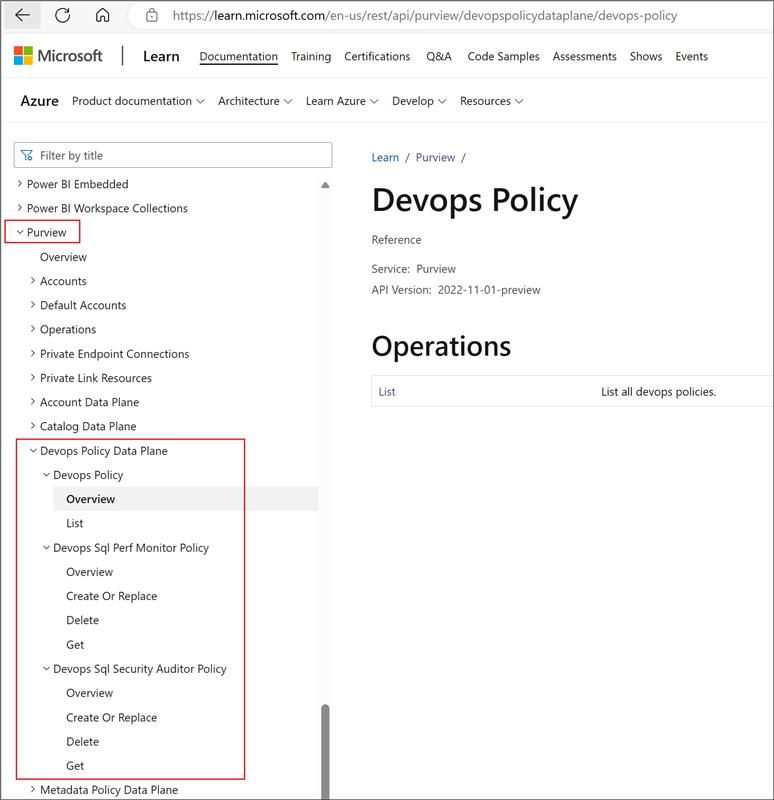

# What can I accomplish with Microsoft Purview DevOps policies?

This article describes how to manage access to data sources in your data estate by using the Microsoft Purview governance portal. It focuses on basic concepts of DevOps policies. That is, it provides background information about DevOps policies that you should know before you follow other articles to get configuration steps.

> [!NOTE]
> This capability is different from the [internal access control in the Microsoft Purview governance portal](./catalog-permissions.md).

Access to system metadata is crucial for IT and DevOps personnel to ensure that critical database systems are healthy, are performing to expectations, and are secure. You can grant and revoke that access efficiently and at scale through Microsoft Purview DevOps policies.

Any user who holds the Policy Author role at the root collection level in Microsoft Purview can create, update, and delete DevOps policies. After DevOps policies are saved, they're published automatically.

## Access policies vs. DevOps policies

Microsoft Purview access policies enable customers to manage access to data systems across their entire data estate, all from a central location in the cloud. You can think of these policies as access grants that can be created through Microsoft Purview Studio, avoiding the need for code. They dictate whether a list of Azure Active Directory (Azure AD) principals, such as users and groups, should be allowed or denied a specific type of access to a data source or an asset within it. Microsoft Purview communicates these policies to the data sources, where they're natively enforced.

DevOps policies are a special type of Microsoft Purview access policies. They grant access to database system metadata instead of user data. They simplify access provisioning for IT operations and security auditing personnel. DevOps policies only grant access. They don't deny access.

## Elements of a DevOps policy

Three elements define a DevOps policy:

- **Subject**

  This is a list of Azure AD users, groups, or service principals that are granted access.
- **Data resource**

  This is the scope where the policy is enforced. The data resource path is the composition of subscription > resource group > data source.

  Microsoft Purview DevOps policies currently support SQL-type data sources. You can configure them on individual data sources and on entire resource groups and subscriptions. You can create DevOps policies only after you register the data resource in Microsoft Purview with the **Data use management** option turned on.
- **Role**

  A role maps to a set of actions that the policy permits on the data resource. DevOps policies support the SQL Performance Monitor and SQL Security Auditor roles. Both of these roles provide access to SQL system metadata, and more specifically to dynamic management views (DMVs) and dynamic management functions (DMFs). But the set of DMVs and DMFs that these roles grant is different. We provide some popular examples [later in this article](#mapping-of-popular-dmvs-and-dmfs).

  The [Create, list, update, and delete Microsoft Purview DevOps policies](how-to-policies-devops-authoring-generic.md) article details the role definition for each data source type. That is, it provides a mapping of roles in Microsoft Purview to the actions that are permitted in that type of data source. For example, the role definition for SQL Performance Monitor and SQL Security Auditor includes *Connect* actions at the server and database level on the data source side.

In essence, the DevOps policy assigns the role's related permissions to the subject and is enforced in the scope of the data resource's path.

## Hierarchical enforcement of policies

A DevOps policy on a data resource is enforced on the data resource itself and all child resources that it contains. For example, a DevOps policy on an Azure subscription applies to all resource groups, to all policy-enabled data sources within each resource group, and to all databases within each data source.

## Example scenario to demonstrate the concept and the benefits

Bob and Alice are involved with the DevOps process at their company. They need to log in to dozens of SQL Server instances on-premises and Azure SQL logical servers to monitor their performance so that critical DevOps processes don't break. Their manager, Mateo, puts all these SQL data sources into Resource Group 1. He then creates an Azure AD group and includes Alice and Bob. Next, he uses Microsoft Purview DevOps policies (Policy 1 in the following diagram) to grant this Azure AD group access to Resource Group 1, which hosts the logical servers.

.

These are the benefits:

- Mateo doesn't have to create local logins in each server.
- The policies from Microsoft Purview improve security by limiting local privileged access. They support the principle of least privilege. In the scenario, Mateo grants only the minimum access that Bob and Alice need to perform the task of monitoring system health and performance.
- When new servers are added to the resource group, Mateo doesn't need to update the policy in Microsoft Purview for it to be enforced on the new servers.
- If Alice or Bob leaves the organization and the job is backfilled, Mateo just updates the Azure AD group. He doesn't have to make any changes to the servers or to the policies that he created in Microsoft Purview.
- At any point in time, Mateo or the company's auditor can see all the permissions that were granted directly in Microsoft Purview Studio.

| Principle | Benefit |
|-|-|
|Simplify        |The role definitions SQL Performance Monitor and SQL Security Auditor capture the permissions that typical IT and DevOps personas need to execute their job.|
|                  |There's less need for permission expertise on each data source type.|
|||
|Reduce effort   |A graphical interface lets you move through the data object hierarchy quickly.|
|                  |Microsoft Purview supports policies on entire Azure resource groups and subscriptions.|
|||
|Enhance security|Access is granted centrally and can be easily reviewed and revoked.|
|                  |There's less need for privileged accounts to configure access directly at the data source.|
|                  |DevOps policies support the principle of least privilege via data resource scopes and role definitions.|
|||

## DevOps policies API

Many sophisticated customers prefer to interact with Microsoft Purview via scripts rather than via the UI. Microsoft Purview DevOps policies now support a REST API that offers full create, read, update, and delete (CRUD) capability. This capability includes listing, policies for SQL Performance Monitor, and policies for SQL Security Auditor. For more information, see the [API specification](/rest/api/purview/devopspolicydataplane/devops-policy).

.

## Mapping of popular DMVs and DMFs

SQL dynamic metadata includes a list of more than 700 DMVs and DMFs. The following table illustrates some of the most popular ones. The table maps the DMVs and DMFs to their role definitions in Microsoft Purview DevOps policies. It also provides links to reference content.

| DevOps role | Category | Example DMV or DMF |
|-|-|-|
||||
| SQL Performance Monitor | Query system parameters to understand your system | [sys.configurations](/sql/relational-databases/system-catalog-views/sys-configurations-transact-sql) |
| | | [sys.dm_os_sys_info](/sql/relational-databases/system-dynamic-management-views/sys-dm-os-sys-info-transact-sql) |
|   | Identify performance bottlenecks | [sys.dm_os_wait_stats](/sql/relational-databases/system-dynamic-management-views/sys-dm-os-wait-stats-transact-sql) |
| | Analyze currently running queries | [sys.dm_exec_query_stats](/sql/relational-databases/system-dynamic-management-views/sys-dm-exec-query-stats-transact-sql) |
| | Analyze blocking issues | [sys.dm_tran_locks](/sql/relational-databases/system-dynamic-management-views/sys-dm-tran-locks-transact-sql) |
| | | [sys.dm_exec_requests](/sql/relational-databases/system-dynamic-management-views/sys-dm-exec-requests-transact-sql) |
| | | [sys.dm_os_waiting_tasks](/sql/relational-databases/system-dynamic-management-views/sys-dm-os-waiting-tasks-transact-sql) |
| | Analyze memory usage | [sys.dm_os_memory_clerks](/sql/relational-databases/system-dynamic-management-views/sys-dm-os-memory-clerks-transact-sql) |
| | Analyze file usage and performance| [sys.master_files](/sql/relational-databases/system-catalog-views/sys-master-files-transact-sql) |
| | | [sys.dm_io_virtual_file_stats](/sql/relational-databases/system-dynamic-management-views/sys-dm-io-virtual-file-stats-transact-sql) |
| | Analyze index usage and fragmentation | [sys.indexes](/sql/relational-databases/system-catalog-views/sys-indexes-transact-sql) |
| | | [sys.dm_db_index_usage_stats](/sql/relational-databases/system-dynamic-management-views/sys-dm-db-index-usage-stats-transact-sql) |
| | | [sys.dm_db_index_physical_stats](/sql/relational-databases/system-dynamic-management-views/sys-dm-db-index-physical-stats-transact-sql) |
| | Manage active user connections and internal tasks | [sys.dm_exec_sessions](/sql/relational-databases/system-dynamic-management-views/sys-dm-exec-sessions-transact-sql) |
| | Get procedure execution statistics | [sys.dm_exec_procedure_stats](/sql/relational-databases/system-dynamic-management-views/sys-dm-exec-procedure-stats-transact-sql) |
| | Use the Query Store | [sys.query_store_plan](/sql/relational-databases/system-catalog-views/sys-query-store-plan-transact-sql) |
| | | [sys.query_store_query](/sql/relational-databases/system-catalog-views/sys-query-store-query-transact-sql) |
| | | [sys.query_store_query_text](/sql/relational-databases/system-catalog-views/sys-query-store-query-text-transact-sql) |
| | Get Error Log (not yet supported)| [sys.sp_readerrorlog](/sql/relational-databases/system-stored-procedures/sp-readerrorlog-transact-sql) | 
||||
| SQL Security Auditor | Get audit details | [sys.dm_server_audit_status](/sql/relational-databases/system-dynamic-management-views/sys-dm-server-audit-status-transact-sql) |
||||
| Both SQL Performance Monitor and SQL Security Auditor| | [sys.dm_audit_actions](/sql/relational-databases/system-dynamic-management-views/sys-dm-audit-actions-transact-sql) |
|||[sys.dm_audit_class_type_map](/sql/relational-databases/system-dynamic-management-views/sys-dm-audit-class-type-map-transact-sql) |
||||

For more information on what IT support personnel can do when you grant them access via the Microsoft Purview roles, see the following resources:

- SQL Performance Monitor: [Use Microsoft Purview to provide at-scale access to performance data in Azure SQL and SQL Server](https://techcommunity.microsoft.com/t5/azure-sql-blog/use-microsoft-purview-to-provide-at-scale-access-to-performance/ba-p/3812839)
- SQL Security Auditor: [Security-related dynamic management views and functions](/sql/relational-databases/system-dynamic-management-views/security-related-dynamic-management-views-and-functions-transact-sql)

## Next steps

To get started with DevOps policies, consult the following resources:

* Try DevOps policies for Azure SQL Database: [Quickstart guide](https://aka.ms/quickstart-DevOps-policies).
* See [other videos, blogs, and articles](./how-to-policies-devops-authoring-generic.md#next-steps).
