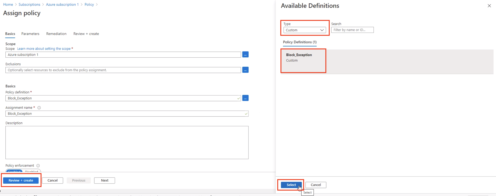

# Quickstart: Create an Azure Purview account in the Azure portal

> [!IMPORTANT]
> Azure Purview is currently in PREVIEW. The [Supplemental Terms of Use for Microsoft Azure Previews](https://azure.microsoft.com/support/legal/preview-supplemental-terms/) include additional legal terms that apply to Azure features that are in beta, preview, or otherwise not yet released into general availability.

In this quickstart, you create an Azure Purview account.

## Prerequisites

* An Azure account with an active subscription. [Create an account for free](https://azure.microsoft.com/free/?WT.mc_id=A261C142F).

* Your own [Azure Active Directory tenant](../active-directory/fundamentals/active-directory-access-create-new-tenant.md).

* Your account must have permission to create resources in the subscription

* If you have **Azure Policy** blocking all applications from creating **Storage account** and **EventHub namespace**, you need to make policy exception using tag, which can be entered during the process of creating a Purview account. The main reason is that for each Purview Account created, it needs to create a managed Resource Group and within this resource group, a Storage account and an
EventHub namespace.

    > [!important]
    > You don't have to follow this step if you don't have Azure Policy or an existing Azure Policy is not blocking the creation of **Storage account** and **EventHub namespace**.

    1. Navigate to the Azure portal and search for **Policy**
    1. Follow [Create a custom policy definition](../governance/policy/tutorials/create-custom-policy-definition.md) or modify existing policy to add two exceptions with `not` operator and `resourceBypass` tag:

        ```json
        {
          "mode": "All",
          "policyRule": {
            "if": {
              "anyOf": [
              {
                "allOf": [
                {
                  "field": "type",
                  "equals": "Microsoft.Storage/storageAccounts"
                },
                {
                  "not": {
                    "field": "tags['<resourceBypass>']",
                    "exists": true
                  }
                }]
              },
              {
                "allOf": [
                {
                  "field": "type",
                  "equals": "Microsoft.EventHub/namespaces"
                },
                {
                  "not": {
                    "field": "tags['<resourceBypass>']",
                    "exists": true
                  }
                }]
              }]
            },
            "then": {
              "effect": "deny"
            }
          },
          "parameters": {}
        }
        ```
        
        > [!Note]
        > The tag could be anything beside `resourceBypass` and it's up to you to define value when creating Purview in latter steps as long as the policy can detect the tag.

        :::image type="content" source="./media/create-catalog-portal/policy-definition.png" alt-text="Screenshot showing how to create policy definition.":::

    1. [Create a policy assignment](../governance/policy/assign-policy-portal.md) using the custom policy created.

        [ ](./media/create-catalog-portal/policy-assignment.png#lightbox)

## Sign in to Azure

Sign in to the [Azure portal](https://portal.azure.com) with your Azure account.

## Configure your subscription

If necessary, follow these steps to configure your subscription to enable Azure Purview to run in your subscription:

   1. In the Azure portal, search for and select **Subscriptions**.

   1. From the list of subscriptions, select the subscription you want to use. Administrative access permission for the subscription is required.

      :::image type="content" source="./media/create-catalog-portal/select-subscription.png" alt-text="Screenshot showing how to select a subscription in the Azure portal.":::

   1. For your subscription, select **Resource providers**. On the **Resource providers** pane, search and register all three resource providers: 
       1. **Microsoft.Purview**
       1. **Microsoft.Storage**
       1. **Microsoft.EventHub** 
      
      If they are not registered, register it by selecting **Register**.

      :::image type="content" source="./media/create-catalog-portal/register-purview-resource-provider.png" alt-text="Screenshot showing how to register the  Microsoft dot Azure Purview resource provider in the Azure portal.":::

## Create an Azure Purview account instance

1. Go to the **Purview accounts** page in the Azure portal, and then select **Add** to create a new Azure Purview account. Alternatively, you can go to marketplace search for **Purview Accounts** and select **Create**. Note that you can add only one Azure Purview account at a time.

   :::image type="content" source="./media/create-catalog-portal/add-purview-instance.png" alt-text="Screenshot showing how to create an Azure Purview account instance in the Azure portal.":::

    > [!Note] 
    > Azure Purview does not support moving its account across regions. You can find out more information about this in [Azure supported services page](../azure-resource-manager/management/region-move-support.md).

1. On the **Basics** tab, do the following:
    1. Select a **Resource group**.
    1. Enter a **Purview account name** for your catalog. Spaces and symbols aren't allowed.
    1. Choose a  **Location**, and then select **Next: Configuration**.
1. On the **Configuration** tab, select the desired **Platform size** - the allowed values are 4 capacity units (CU) and 16 CU. Select **Next: Tags**.
1. On the **Tags** tab, you can optionally add one or more tags. These tags are for use only in the Azure portal, not Azure Purview. 

    > [!Note] 
    > If you have **Azure Policy** and need to add exception as in **Prerequisites**, you need to add the correct tag. For example, you can add `resourceBypass` tag:
    > :::image type="content" source="./media/create-catalog-portal/add-purview-tag.png" alt-text="Add tag to Purview account.":::

1. Select **Review & Create**, and then select **Create**. It takes a few minutes to complete the creation. The newly created Azure Purview account instance appears in the list on your **Purview accounts** page.
1. When the new account provisioning is complete select **Go to resource**.

    > [!Note]
    > If the provisioning failed with `Conflict` status, that means there is an Azure policy blocking Purview from creating a **Storage account** and **EventHub namespace**. You need to go through the **Prerequisites** steps to add exceptions.
    > :::image type="content" source="./media/create-catalog-portal/purview-conflict-error.png" alt-text="Purview conflict error message":::

1. Select **Launch purview account**.

   :::image type="content" source="./media/use-purview-studio/launch-from-portal.png" alt-text="Screenshot of the selection to launch the Azure Purview account catalog.":::

## Add a security principal to a data plane role

Before you or your team can begin to use Azure Purview, one or more security principals must be added to one of the pre-defined Data Plane roles: **Purview Data Reader**, **Purview Data Curator** or **Purview Data Source Administrator**. For more information on Azure Purview Data Catalog permissions, see [Catalog permissions](catalog-permissions.md).

To add a security principal to the **Purview Data Curator** data plane role in an Azure Purview account:

1. Go to the [**Purview accounts**](https://aka.ms/purviewportal) page in the Azure portal.

1. Select the Azure Purview account you want to modify.

1. On the **Purview account** page, select the tab **Access control (IAM)**

1. Click **+ Add**

If upon clicking Add you see two choices showing both marked (disabled) then this means you do not have the right permissions to add anyone to a data plane role on the Azure Purview account. You must find an Owner, User Access Administrator or someone else with role assignment authority on your Azure Purview account. You can look for the right people by selecting **Role assignments** tab and then scrolling down to look for Owner or User Access Administrator and contacting those people.

1. Select **Add role assignment**.

1. For the Role type in **Purview Data Curator Role** or **Purview Data Source Administrator Role** depending on what the security principal is going to be used for (please see [Catalog Permissions](catalog-permissions.md) and [Application and service principal objects in Azure Active Directory](../active-directory/develop/app-objects-and-service-principals.md) for details).

1. For **Assign access to** leave the default, **User, group, or service principal**.

1. For **Select** enter the name of the user, Azure Active Directory group or service principal you wish to assign and then click on their name in the results pane.

1. Click on **Save**.

## Clean up resources

If you no longer need this Azure Purview account, delete it with the following steps:

1. Go to the **Purview accounts** page in the Azure portal.

2. Select the Azure Purview account that you created at the beginning of this quickstart. Select **Delete**, enter the name of the account, and then select **Delete**.

## Next steps

In this quickstart, you learned how to create an Azure Purview account.

Advance to the next article to learn how to allow users to access your Azure Purview Account. 

> [!div class="nextstepaction"]
> [Add users to your Azure Purview Account](catalog-permissions.md)
