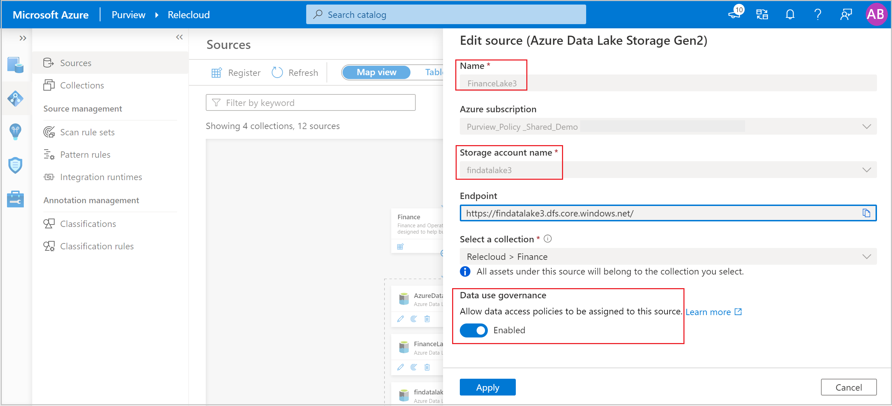
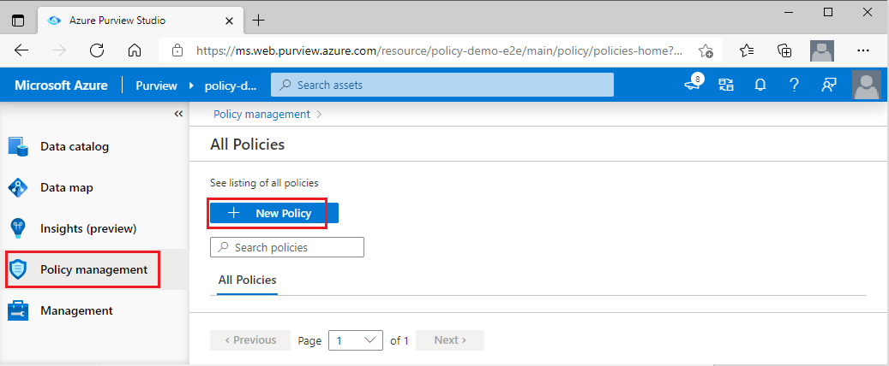
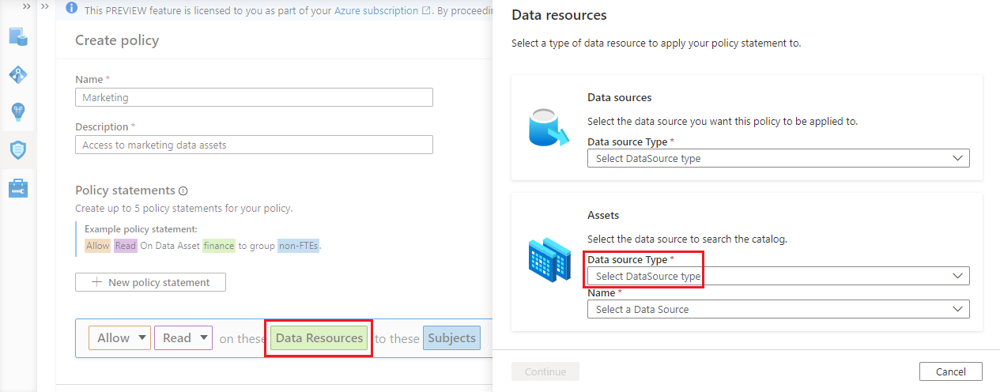
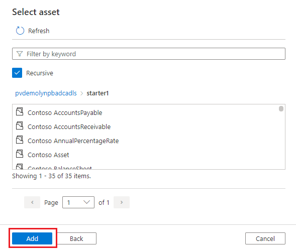
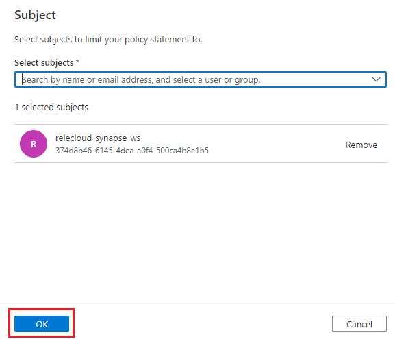
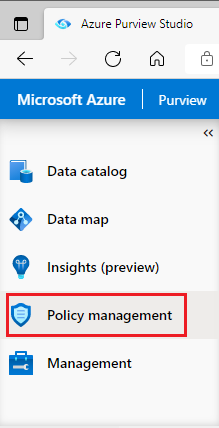
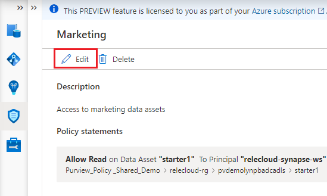
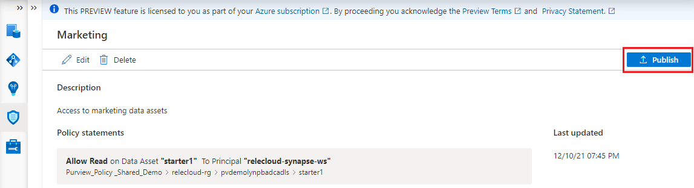
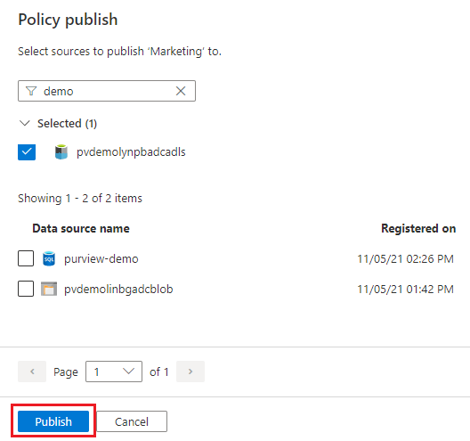

# Dataset provisioning by data owner for Azure Storage (preview)

This guide describes how a data owner can enable access to data stored in Azure Storage from Azure Purview. The Azure Purview policy authoring supports the following capabilities:
-   Allow access to data stored in Blob and Azure Data Lake Storage (ADLS) Gen2.

> [!Note]
> These capabilities are currently in preview. This preview version is provided without a service level agreement, and should not be used for production workloads. Certain features might not be supported or might have constrained capabilities. For more information, see [Supplemental Terms of Use for Microsoft Azure
Previews](https://azure.microsoft.com/support/legal/preview-supplemental-terms/).

## Prerequisites
>[!IMPORTANT]
> The access policy feature is only available on **new** Azure Purview and Azure Storage accounts.
- Create a new or use an existing isolated test subscription. You can [follow this guide to create one](../cost-management-billing/manage/create-subscription.md).
- Create a new or use an existing Azure Purview account. You can [follow our quick-start guide to create one](create-catalog-portal.md).
- Create a new Azure Storage account in one of the regions listed below. You can [follow this guide to create one](../storage/common/storage-account-create.md). Only Storage account versions >= 81.x.x support policy enforcement.

[!INCLUDE [supported regions](./includes/storage-access-policy-regions.md)]

## Configuration
[!INCLUDE [access policy enablement storage](./includes/storage-access-policy-enable.md)]

### Register Azure Purview as a resource provider in other subscriptions
Execute this step only if the Storage and Azure Purview accounts are in different subscriptions. Register Azure Purview as a resource provider in the subscription for the Azure Storage account by following this guide: [Azure resource providers and types](../azure-resource-manager/management/resource-providers-and-types.md)

### Configure permissions for policy management actions
#### Storage account permissions
User needs to have **either one of these** role combinations in the Azure Storage account to be able to register it for *Data use Governance* in Azure Purview:
- IAM *Owner* 
- Both IAM *Contributor* + IAM *User Access Administrator*
 
You can follow this [guide to configure Azure RBAC permissions](../role-based-access-control/check-access.md)

#### Azure Purview account permissions
>[!IMPORTANT]
> - Policy operations are only supported at **root collection level** and not child collection level.
- User needs Azure Purview *Data source admins* role at the root collection level to:
  - Register a source for *Data use governance*.
  - Publish a policy.
- User needs Azure Purview *Policy authors* role at root collection level to create or edit policies.

Check the section on managing Azure Purview role assignments in this [guide](how-to-create-and-manage-collections.md).

>[!WARNING]
> **Known issues** related to permissions
> - In addition to Azure Purview *Policy authors* role, user requires *Directory Reader* permission in Azure Active Directory to create data owner policy. Learn more about permissions for [Azure AD Directory Reader](../active-directory/roles/permissions-reference.md#directory-readers)
> - Azure Purview *Policy author* role is not sufficient to create policies. It also requires Azure Purview *Data source admin* role as well.

### Register and scan data sources in Azure Purview
Register and scan each data source with Azure Purview to later define access policies. You can follow these guides:

-   [Register and scan Azure Storage Blob - Azure Purview](register-scan-azure-blob-storage-source.md)

-   [Register and scan Azure Data Lake Storage (ADLS) Gen2 - Azure Purview](register-scan-adls-gen2.md)

>[!Important]
> Make sure you write down the **Name** you use when registering a source in Azure Purview. You will need it when you publish a policy. The recommended practice is to make the registered name exactly the same as the endpoint name (i.e. the Storage account name).

If you would like to use a data source to create access policies in Azure Purview, enable it for access policy through the **Data use governance** toggle, as shown in the picture.

>[!Note]
> - To disable a source for *Data use Governance*, remove it first from being bound (i.e. published) in any policy.
> - While user needs to have both Azure Storage *Owner* and Azure Purview *Data source admin* to enable a source for *Data use governance*, any of those roles can independently disable it.
> - Disabling *Data use governance* for a subscription will disable it also for all assets registered in that subscription.

> [!WARNING]
> **Known issues** related to source registration
> - Moving data sources to a different resource group or subscription is not yet supported. If want to do that, de-register the data source in Azure Purview before moving it and then register it again after that happens.

### Data use governance best practices
- We highly encourage registering data sources for *Data use governance* and managing all associated access policies in a single Azure Purview account.
- Should you have multiple Azure Purview accounts, be aware that **all** data sources belonging to a subscription must be registered for *Data use governance* in a single Azure Purview account. That Azure Purview account can be in any subscription in the tenant. The *Data use governance* toggle will become greyed out when there are invalid configurations. Some examples of valid and invalid configurations follow in the diagram below:
    - **Case 1** shows a valid configuration where a Storage account is registered in an Azure Purview account in the same subscription.
    - **Case 2** shows a valid configuration where a Storage account is registered in an Azure Purview account in a different subscription. 
    - **Case 3** shows an invalid configuration arising because Storage accounts S3SA1 and S3SA2 both belong to Subscription 3, but are registered to different Azure Purview accounts. In that case, the *Data use governance* toggle will only work in the Azure Purview account that wins and registers a data source in that subscription first. The toggle will then be greyed out for the other data source.

"

## Policy authoring

This section describes the steps for creating, updating, and publishing Azure Purview access policies.

### Create a new policy

This section describes the steps to create a new policy in Azure Purview.

1. Log in to Azure Purview portal.

1. Navigate to **Policy management** app using the left side panel.

1. Select the **New Policy** button in the policy page.

    

1. The new policy page will appear. Enter the policy **Name** and **Description**.

1. To add policy statements to the new policy, select the **New policy statement** button. This will bring up the policy statement builder.

    "

1. Select the **Effect** button and choose *Allow* from the drop-down list.

1. Select the **Action** button and choose *Read* or *Modify* from the drop-down list.

1. Select the **Data Resources** button to bring up the options to provide the data asset path, which will open on the right.

1. Use the **Assets** box if you scanned the data source, otherwise use the **Data sources** box above. Assuming the first, in the **Assets** box, enter the **Data Source Type** and select the **Name** of a previously registered data source.

    

1. Select the **Continue** button and transverse the hierarchy to select the folder or file. Then select the **Add** button. This will take you back to the policy editor.

    "

1. Select the **Subjects** button and enter the subject identity as a principal, group, or MSI. Then select the **OK** button. This will take you back to the policy editor

    

1. Repeat the steps #5 to #11 to enter any more policy statements.

1. Select the **Save** button to save the policy

> [!Note]
> - Policy statements set below container level on a Storage account are supported. If no access has been provided at Storage account level or container level, then the App that will execute the access will need to provide a fully qualified name (i.e., a direct absolute path) to the data object. The following documents show examples of how to do that:
>   - [*abfs* for ADLS Gen2](../hdinsight/hdinsight-hadoop-use-data-lake-storage-gen2.md#access-files-from-the-cluster)
>   - [*az storage blob download* for Blob Storage](../storage/blobs/storage-quickstart-blobs-cli.md#download-a-blob)
> - Creating a policy at Storage account level will enable the Subjects to access system containers e.g., *$logs*. If this is undesired, first scan the data source and then create the policy at container or sub-container level.

> [!WARNING]
> **Known issues** related to Policy creation
> - Do not create policy statements based on Azure Purview resource sets. Even if displayed in Azure Purview policy authoring UI, they are not yet enforced. Learn more about [resource sets](concept-resource-sets.md).
> - Once subscription gets disabled for *Data use governance* any underlying assets that are enabled for *Data use governance* will be disabled, which is the right behavior. However, policy statements based on those assets will still be allowed after that.

### Update or delete a policy

Steps to create a new policy in Azure Purview are as follows.

1. Log in to Azure Purview portal.

1. Navigate to Azure Purview Policy management app using the left side panel.

    

1. The Policy portal will present the list of existing policies in Azure Purview. Select the policy that needs to be updated.

1. The policy details page will appear, including Edit and Delete options. Select the **Edit** button, which brings up the policy statement builder for the statements in this policy. Now, any parts of the statements in this policy can be updated. To delete the policy, use the **Delete** button.

    

### Publish the policy

A newly created policy is in the draft state. The process of publishing associates the new policy with one or more data sources under governance. This is called "binding" a policy to a data source.

The steps to publish a policy are as follows

1. Log in to Azure Purview portal.

1. Navigate to the Azure Purview Policy management app using the left side panel.

    

1. The Policy portal will present the list of existing policies in Azure Purview. Locate the policy that needs to be published. Select the **Publish** button on the right top corner of the page.

    

1. A list of data sources is displayed. You can enter a name to filter the list. Then, select each data source where this policy is to be published and then select the **Publish** button.

    

>[!Important]
> - Publish is a background operation. It can take up to **2 hours** for the changes to be reflected in the data source.
> - There is no need to publish a policy again for it to take effect if the data resource continues to be the same.

## Additional information

### Limits
The limit for Azure Purview policies that can be enforced by Storage accounts is 100MB per subscription, which roughly equates to 5000 policies.

### Policy action mapping

This section contains a reference of how actions in Azure Purview data policies map to specific actions in Azure Storage.

| **Azure Purview policy action** | **Data source specific actions**                                                        |
|---------------------------|-----------------------------------------------------------------------------------------|
|||
| *Read*                    |Microsoft.Storage/storageAccounts/blobServices/containers/read                      |
|                           |Microsoft.Storage/storageAccounts/blobServices/containers/blobs/read                |
|||
| *Modify*                  |Microsoft.Storage/storageAccounts/blobServices/containers/blobs/read                |
|                           |Microsoft.Storage/storageAccounts/blobServices/containers/blobs/write               |
|                           |Microsoft.Storage/storageAccounts/blobServices/containers/blobs/add/action          |
|                           |Microsoft.Storage/storageAccounts/blobServices/containers/blobs/move/action         |
|                           |Microsoft.Storage/storageAccounts/blobServices/containers/blobs/delete              |
|                           |Microsoft.Storage/storageAccounts/blobServices/containers/read                      |
|                           |Microsoft.Storage/storageAccounts/blobServices/containers/write                     |
|                           |Microsoft.Storage/storageAccounts/blobServices/containers/delete                    |
|||

## Next steps
Check the blog and demo related to the capabilities mentioned in this how-to guide

* [What's New in Azure Purview at Microsoft Ignite 2021](https://techcommunity.microsoft.com/t5/azure-purview/what-s-new-in-azure-purview-at-microsoft-ignite-2021/ba-p/2915954)
* [Demo of access policy for Azure Storage](https://www.youtube.com/watch?v=CFE8ltT19Ss)
