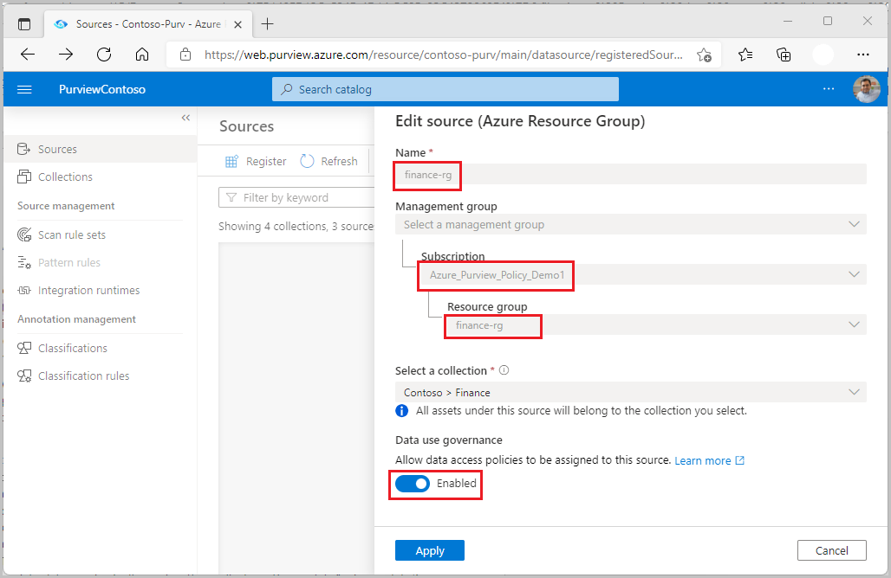
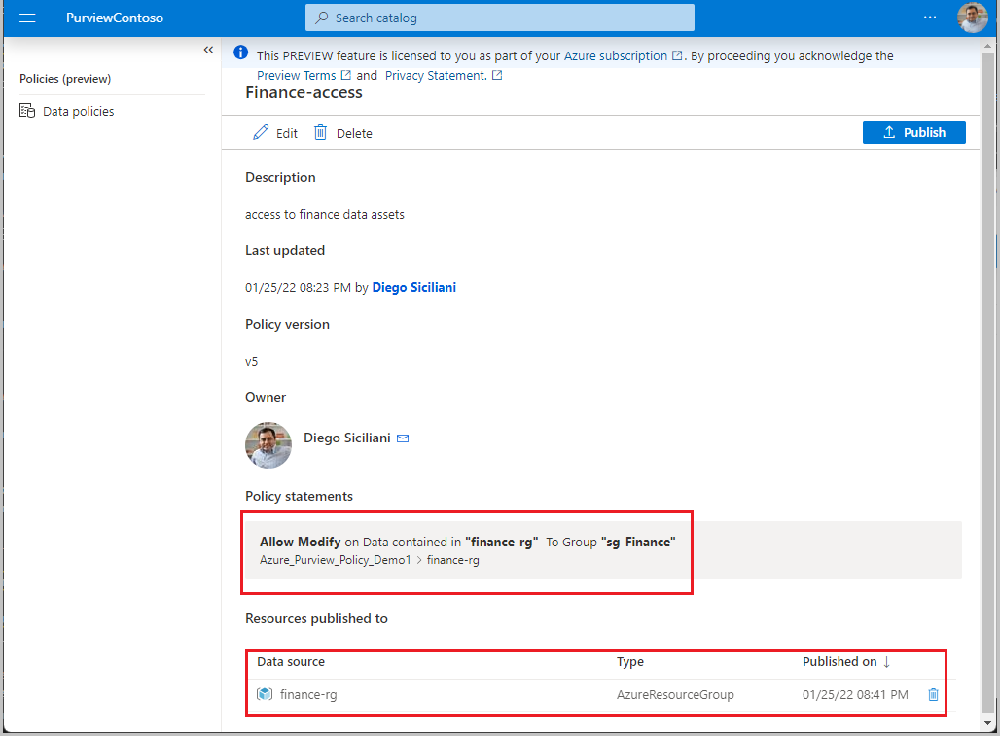

# Resource group and subscription access provisioning by data owner (preview)
[!INCLUDE [feature-in-preview](includes/feature-in-preview.md)]

[Access policies](concept-data-owner-policies.md) allow you to manage access from Microsoft Purview to data sources that have been registered for *Data Use Management*.

You can also [register an entire resource group or subscription](register-scan-azure-multiple-sources.md), and create a single policy that will manage access to **all** data sources in that resource group or subscription. That single policy will cover all existing data sources and any data sources that are created afterwards. This article describes how this is done. 

## Prerequisites
[!INCLUDE [Access policies generic pre-requisites](./includes/access-policies-prerequisites-generic.md)]

**Only these data sources are enabled for access policies on resource group or subscription**. Follow the **Prerequisites** section that is specific to the data source(s) in these guides:
* [Data owner policies on an Azure Storage account](./how-to-data-owner-policies-storage.md#prerequisites)
* [Data owner policies on an Azure SQL Database](./how-to-data-owner-policies-azure-sql-db.md#prerequisites)*
* [Data owner policies on an Arc-enabled SQL Server](./how-to-data-owner-policies-arc-sql-server.md#prerequisites)*

(*) Only the *SQL Performance monitoring* and *Security auditing* actions are fully supported for SQL-type data sources. The *Read* action needs a workaround described later in this guide. The *Modify* action is not currently supported for SQL-type data sources.

## Configuration
[!INCLUDE [Access policies generic configuration](./includes/access-policies-configuration-generic.md)]

### Register the subscription or resource group for Data Use Management
The subscription or resource group needs to be registered with Microsoft Purview to later define access policies.

To register your subscription or resource group, follow the **Prerequisites** and **Register** sections of this guide:

- [Register multiple sources in Microsoft Purview](register-scan-azure-multiple-sources.md#prerequisites)

After you've registered your resources, you'll need to enable Data Use Management. Data Use Management affects the security of your data, as it delegates to certain users to manage access to data resources from within Microsoft Purview.

To ensure you securely enable Data Use Management, and follow best practices, follow this guide to enable Data Use Management for your resource group or subscription:

- [How to enable Data Use Management](./how-to-enable-data-use-management.md) 

In the end, your resource will have the  **Data Use Management** toggle **Enabled**, as shown in the picture:

## Create and publish a data owner policy
Execute the steps in the **Create a new policy** and **Publish a policy** sections of the [data-owner policy authoring tutorial](./how-to-data-owner-policy-authoring-generic.md#create-a-new-policy). The result will be a data owner policy similar to the example shown in the image: a policy that provides security group *sg-Finance* *modify* access to resource group *finance-rg*. Use the Data source box in the Policy user experience.

>[!Important]
> - Publish is a background operation. For example, Azure Storage accounts can take up to **2 hours** to reflect the changes.

>[!Warning]
> **Known Issues**
> - No implicit connect permission is provided to SQL type data sources (e.g.: Azure SQL DB, SQL server on Azure Arc-enabled servers) when creating a policy with *Read* action on a resource group or subscription. To support this scenario, provide the connect permission to the Azure AD principals locally, i.e. directly in the SQL-type data sources.

## Additional information
- Creating a policy at subscription or resource group level will enable the Subjects to access Azure Storage system containers,  for example, *$logs*. If this is undesired, first scan the data source and then create finer-grained policies for each (that is, at container or sub-container level).

### Limits
The limit for Microsoft Purview policies that can be enforced by Storage accounts is 100 MB per subscription, which roughly equates to 5000 policies.

## Next steps
Check blog, demo and related tutorials:

* [Concepts for Microsoft Purview data owner policies](./concept-data-owner-policies.md)
* [Blog: resource group-level governance can significantly reduce effort](https://techcommunity.microsoft.com/t5/azure-purview-blog/data-policy-features-resource-group-level-governance-can/ba-p/3096314)
* [Video: Demo of data owner access policies for Azure Storage](https://www.youtube.com/watch?v=CFE8ltT19Ss)
