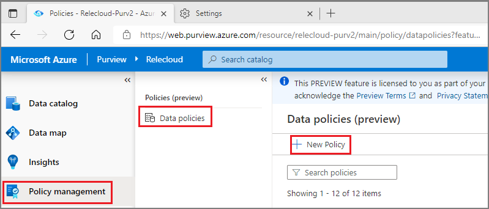
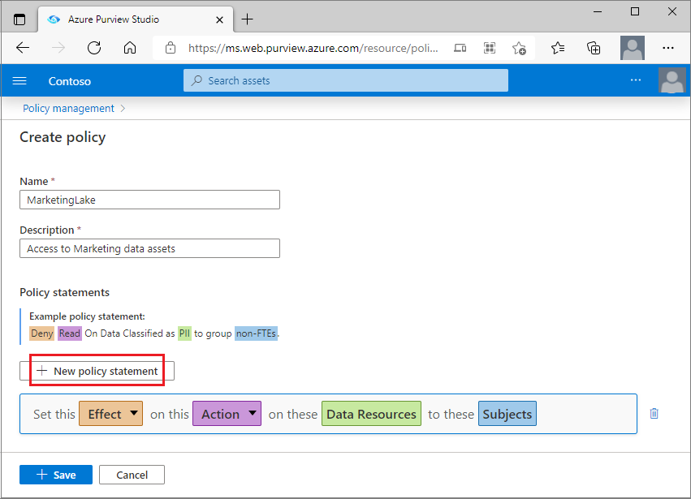
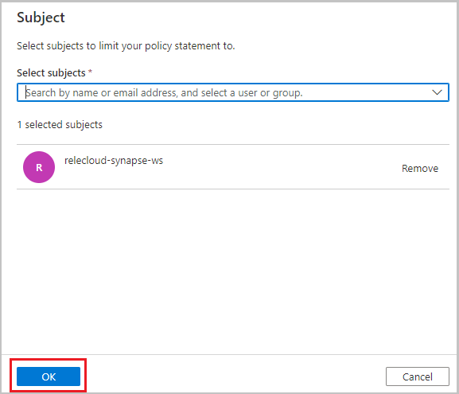
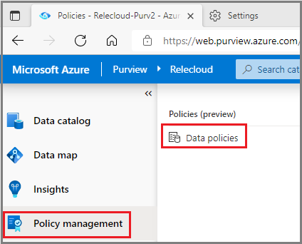
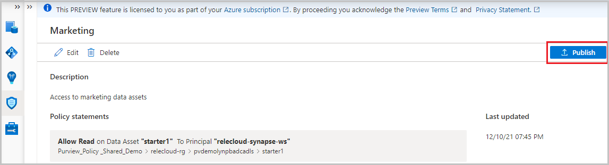

# Authoring and publishing data owner access policies (preview)

This tutorial describes how a data owner can create, update and publish access policies in Azure Purview.

## Create a new policy

This section describes the steps to create a new policy in Azure Purview.

1. Sign in to Azure Purview Studio.

1. Navigate to the **Data policy** feature using the left side panel. Then select **Data policies**.

1. Select the **New Policy** button in the policy page.

    

1. The new policy page will appear. Enter the policy **Name** and **Description**.

1. To add policy statements to the new policy, select the **New policy statement** button. This will bring up the policy statement builder.

    

1. Select the **Effect** button and choose *Allow* from the drop-down list.

1. Select the **Action** button and choose *Read* or *Modify* from the drop-down list.

1. Select the **Data Resources** button to bring up the window to enter Data resource information, which will open to the right.

1. Under the **Data Resources** Panel do one of two things depending on the granularity of the policy:
    - To create a broad policy statement that covers an entire data source, resource group, or subscription that was previously registered, use the **Data sources** box and select its **Type**.
    - To create a fine-grained policy, use the **Assets** box instead. Enter the **Data Source Type** and the **Name** of a previously registered and scanned data source. See example in the image.

    

1. Select the **Continue** button and transverse the hierarchy to select and underlying data-object (e.g. folder, file, etc).  Select **Recursive** to apply the policy from that point in the hierarchy down to any child data-objects. Then select the **Add** button. This will take you back to the policy editor.

    

1. Select the **Subjects** button and enter the subject identity as a principal, group, or MSI. Then select the **OK** button. This will take you back to the policy editor

    

1. Repeat the steps #5 to #11 to enter any more policy statements.

1. Select the **Save** button to save the policy

## Update or delete a policy

Steps to create a new policy in Azure Purview are as follows.

1. Sign in to Azure Purview Studio.

1. Navigate to the **Data policy** feature using the left side panel. Then select **Data policies**.

    

1. The Policy portal will present the list of existing policies in Azure Purview. Select the policy that needs to be updated.

1. The policy details page will appear, including Edit and Delete options. Select the **Edit** button, which brings up the policy statement builder. Now, any parts of the statements in this policy can be updated. To delete the policy, use the **Delete** button.

    

## Publish the policy

A newly created policy is in the draft state. The process of publishing associates the new policy with one or more data sources under governance. This is called "binding" a policy to a data source.

The steps to publish a policy are as follows

1. Sign in to Azure Purview Studio.

1. Navigate to the **Data policy** feature using the left side panel. Then select **Data policies**.

    

1. The Policy portal will present the list of existing policies in Azure Purview. Locate the policy that needs to be published. Select the **Publish** button on the right top corner of the page.

    

1. A list of data sources is displayed. You can enter a name to filter the list. Then, select each data source where this policy is to be published and then select the **Publish** button.

    

>[!Note]
> - After making changes to a policy, there is no need to publish it again for it to take effect if the data source(s) continues to be the same.

## Next steps
Check blog, demo and related tutorials

* [What's New in Azure Purview at Microsoft Ignite 2021](https://techcommunity.microsoft.com/t5/azure-purview/what-s-new-in-azure-purview-at-microsoft-ignite-2021/ba-p/2915954)
* [Demo of data owner access policies for Azure Storage](https://www.youtube.com/watch?v=CFE8ltT19Ss)
* [Enable Azure Purview data owner policies on all data sources in a subscription or a resource group](./tutorial-data-owner-policies-resource-group.md)
* [Enable Azure Purview data owner policies on an Azure Storage account](./tutorial-data-owner-policies-storage.md)
