# Microsoft Purview - Profisee Integration
Master data management (MDM) is a key pillar of any unified data governance solution. Microsoft Purview now supports master data management with partners such as Profisee, CluedIn, Tamr, and Semarchy. This tutorial compiles reference and integration deployment materials in one place to get you started on your MDM journey with Microsoft Purview through our integration with Profisee.

## What, why and how of MDM - Master Data Management?
Master data management (MDM) arose out of the necessity for businesses to improve the consistency and quality of their key data assets, such as products, assets, customers, location data, and so on. Many businesses today, especially global enterprises, have hundreds of separate applications and systems (like SAP, ERP and CRM) where data that crosses organizational departments or divisions can easily become fragmented, duplicated, and most commonly out of date. In such cases, answering even the most basic, but critical questions about any type of performance metric or KPI for a business accurately becomes difficult.
Getting answers to basic questions such as “who are our most profitable customers?”, “what product(s) have the best margins?” or in some cases, “how many employees do we have”? become tough to answer – at least with any degree of accuracy.
Basically, the need for accurate, timely information is acute and as sources of data increase, managing it consistently and keeping data definitions up to date so all parts of a business use the same information is a never ending challenge.
To meet such challenges, businesses turn to master data management (MDM).
More Details on [Profisee MDM](https://profisee.com/master-data-management-what-why-how-who/)

## Why Profisee?
PROFISEE MDM SAAS: TRUE SAAS EXPERIENCE - A fully managed instance of Profisee MDM hosted in the Azure cloud. Full turn-key service for the easiest and fastest MDM deployment.

- Platform and Management in One -
Leverage a true, end-to-end SaaS platform with one agreement and no third parties

- Industry-leading Cloud Service -
Hosted on Azure for industry-leading scalability and availability

- The Fastest Path to Trusted Data -
Leave the networking, firewalls and storage to us so you can deploy in minutes

PROFISEE MDM: ULTIMATE PAAS FLEXIBILITY - Complete deployment flexibility and control, using the most efficient and low-maintenance option on [Microsoft Azure](https://azure.microsoft.com/) cloud-or on-prem.

- Modern Cloud Architecture -
Platform available as a containerized Kubernetes service

- Complete Flexibility & Autonomy -
Available in Azure, AWS, Google Cloud or on-prem.

- Fast to Deploy, Easy to Maintain -
Fully containerized configuration streamlines patches and upgrades

More Details on [Profisee MDM Benefits On Modern Cloud Architecture](https://profisee.com/our-technology/modern-cloud-architecture/) and [Profisee Advantage Videos](https://profisee.com/profisee-advantage/) and why it fits best with [Microsoft Azure](https://azure.microsoft.com/) cloud deployments!

## Profisee <> Purview Reference Architecture

### Profisee <> Purview Reference Architecture - Guides/Reference Docs
1. [Data Governance with Profisee and Microsoft Purview](/azure/architecture/reference-architectures/data/profisee-master-data-management-purview)
1. [Operationalize Profisee with ADF Azure Data Factory, Azure Synapse Analytics and Power BI](/azure/architecture/reference-architectures/data/profisee-master-data-management-data-factory)
1. [MDM on Azure Overview](/azure/cloud-adoption-framework/scenarios/cloud-scale-analytics/govern-master-data)

### Business & Technical Use Case (Example)
Let's take an example of a sample manufacturing company working across multiple data sources; it uses ADF to load the business critical data sources into Profisee, which is when Profisee works its magic and finds out the golden records and matching records and then we finally are able to enrich the metadata with Purview (updates  made by Purview on Classifications, Sensitivity Labels, Glossary and all other Catalog features are reflected seamlessly into Profisee). Finally, they connect the enriched metadata detected by Purview and cleansed/curated data by Profisee with Power BI or Azure ML for advanced analytics.

## Microsoft Purview - Profisee Integration SaaS Deployment on AKS Azure Kubernetes Infrastructure How-To Guide

1. Create a managed identity in Azure. You must have a Managed Identity created to run the deployment. This Managed Identity must have the following permissions when running a deployment. After it's done, the Managed Identity can be deleted. Based on your ARM template choices, you'll need some or all of the following permissions assigned to your Managed Identity:
- Contributor role to the Resource Group where AKS will be deployed. It can either be assigned directly to the Resource Group OR at Subscription level down.
- DNS Zone Contributor role to the particular DNS zone where the entry will be created OR Contributor role to the DNS Zone Resource Group. This DNS role is needed only if updating DNS hosted in Azure.
- Application Administrator role in Azure Active Directory so the required permissions that are needed for the Application Registration can be assigned.
- Managed Identity Contributor and User Access Administrator at the Subscription level. Required in order for the ARM template Managed Identity to be able to create the Key Vault specific Managed Identity that will be used by Profisee to pull the values stored in the Key Vault.
- Data Curator Role added for the Purview account for the Purview specific Application Registration.
2. Assign roles and permissions as per the list below and final state should look like this (attach image)
3. Go to https://github.com/Profisee/kubernetes and click "Azure ARM". The readme includes troubleshooting steps as well. Read all the steps and troubleshooting wiki page very carefully.
4. Get the license file from Profisee by raising a support ticket on https://support.profisee.com/. Only pre-req for this step is your need to pre-determine the URL your Profisee setup on Azure. This is a load balanced AKS (Azure Kubernetes) deployment using an ingress controller. In other words, keep handy the DNS HOST NAME of the load balancer used in the deployment. It will be something like "[profisee_name].[region].cloudapp.azure.com". For instance, DNSHOSTNAME="purviewprofiseeintegration.southcentralus.cloudapp.azure.com". Supply this DNSHOSTNAME to Profisee support when you raise the support ticket and Profisee will revert with the license file. You'll need to supply this file during the next configuration steps below. 
5. Click "Deploy to Azure"

- The configurator wizard will ask for the inputs as described here - [Deploying the AKS Cluster using the ARM Template](https://support.profisee.com/wikis/2022_r1_support/deploying_the_AKS_cluster_with_the_arm_template)
- Make sure to give the exact same RG (Resource Group) in the deployment as you gave permissions to the managed identity in Step1.
- Once deployment completes, click "Go to Resource Group" and open the Profisee AKS Cluster.
- Profisee ARM Deployment Wizard - Managed Identity for installation; its role assignments and permissions should look like the image below.
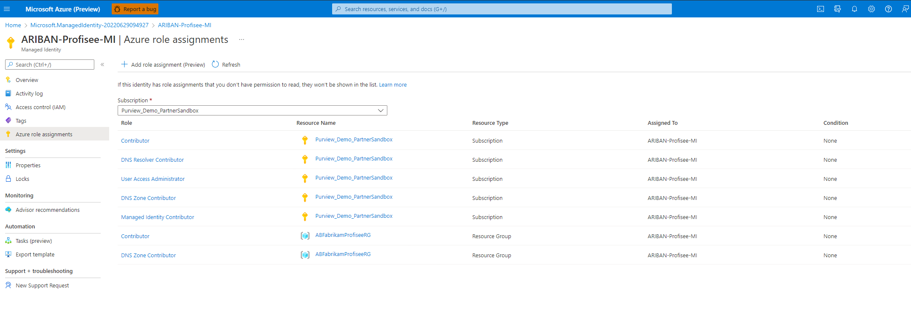
- Profisee ARM Deployment Wizard - App Registration Configuration
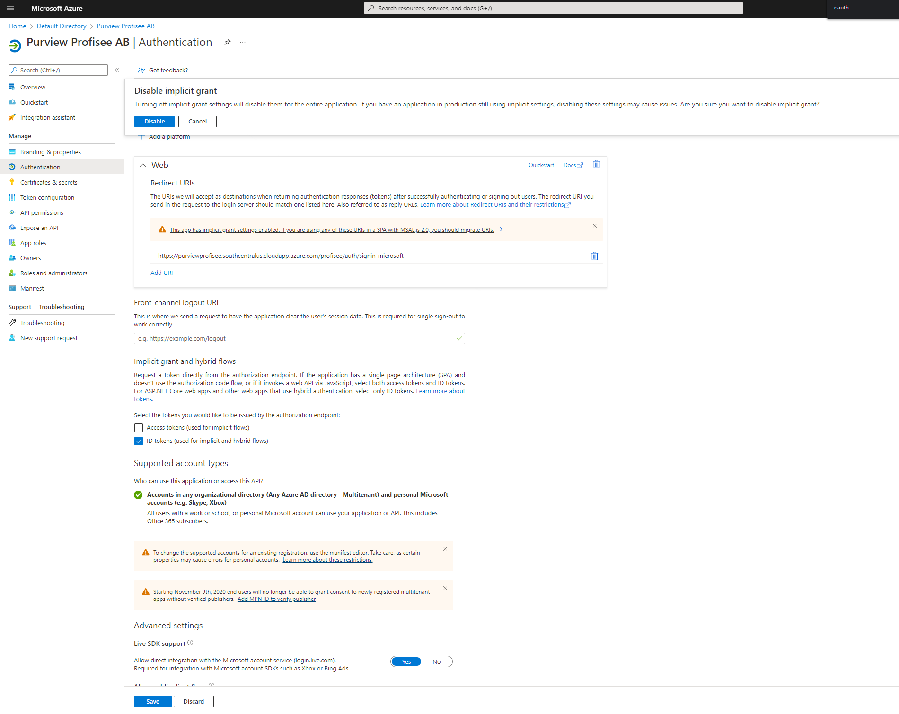
- Profisee ARM Deployment Wizard - Profisee Configuration and supplying Admin account username
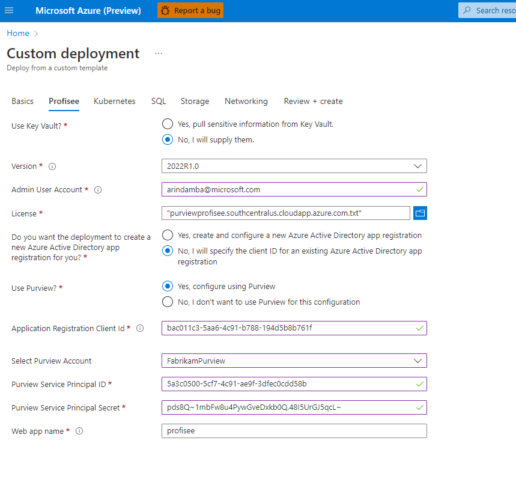
- Profisee ARM Deployment Wizard - Kubernetes Configuration - You may choose an older version of Kubernetes but leave the field BLANK to deploy the LATEST version.
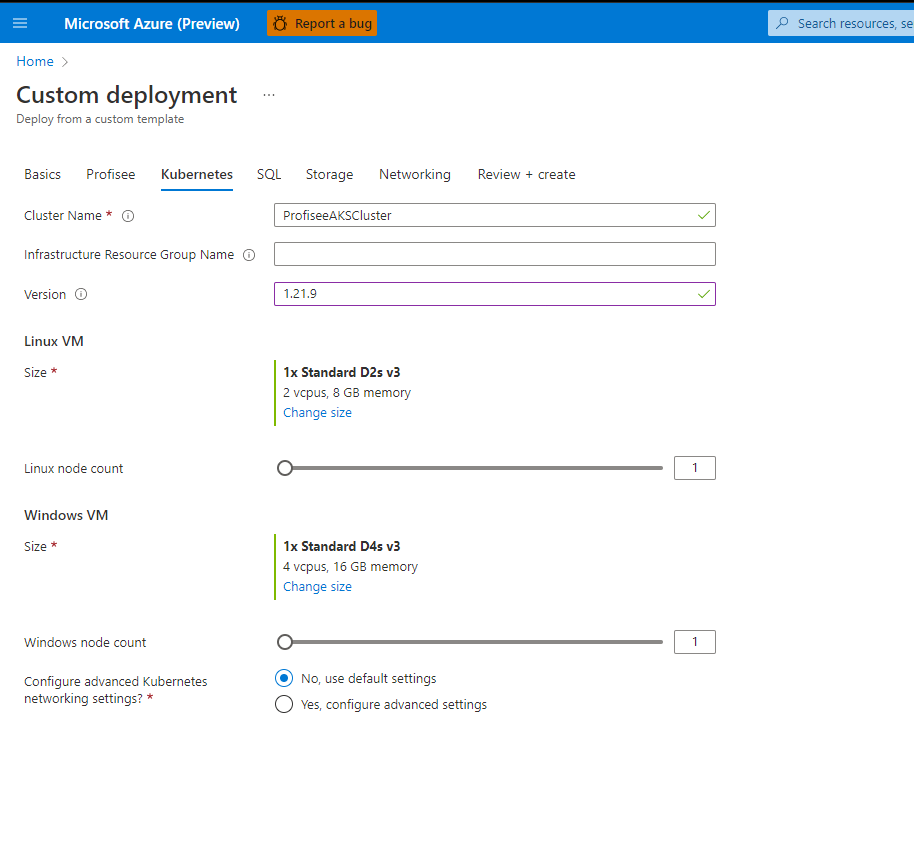
- Profisee ARM Deployment Wizard - SQL Server

- Profisee ARM Deployment Wizard - Azure DNS

- Profisee ARM Deployment Wizard - Azure Storage
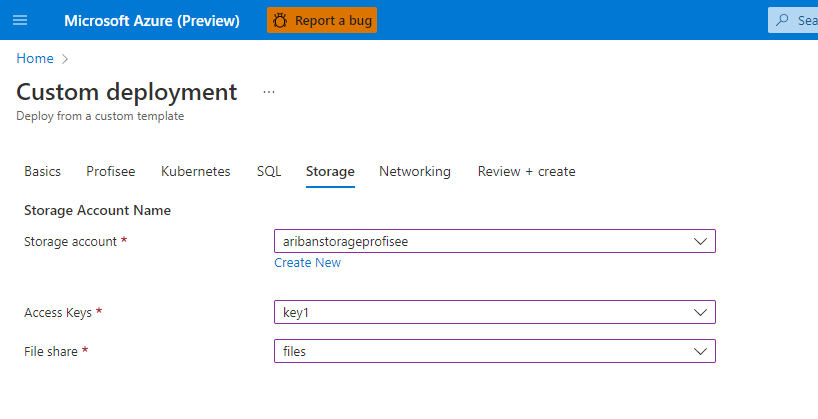
- Profisee ARM Deployment Wizard - Final Validation Stages
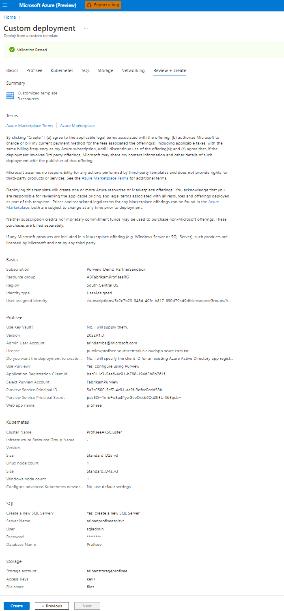
- Profisee ARM Deployment Wizard - Final Validation
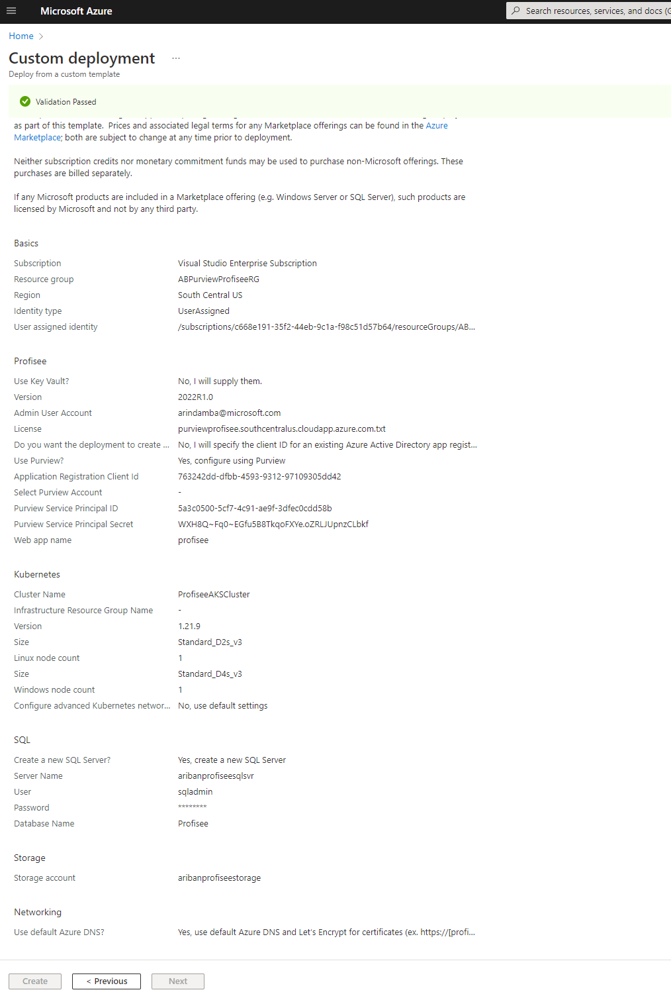
- Around 5-10 Minutes into the ARM deployment

- Final Stages of Deployment. You need to wait around 45-50 minutes for the deployment to complete installing Profisee
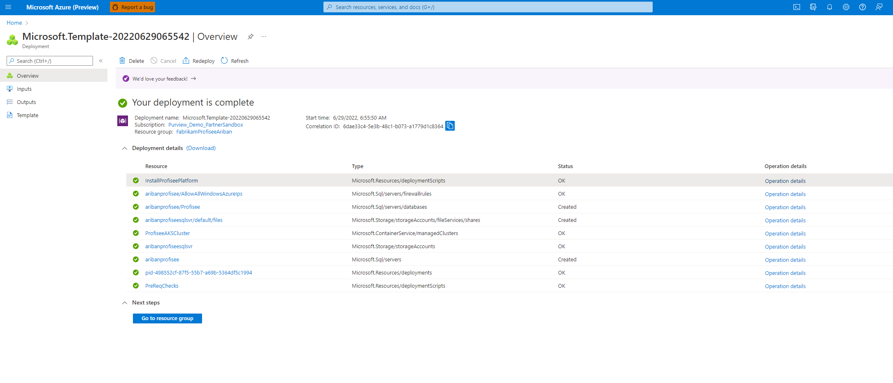
- Deployment Complete
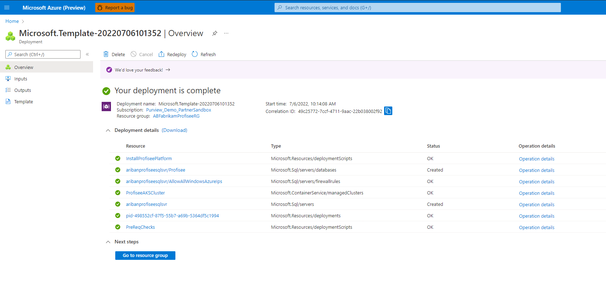
- Open the resource group once deployment completes.
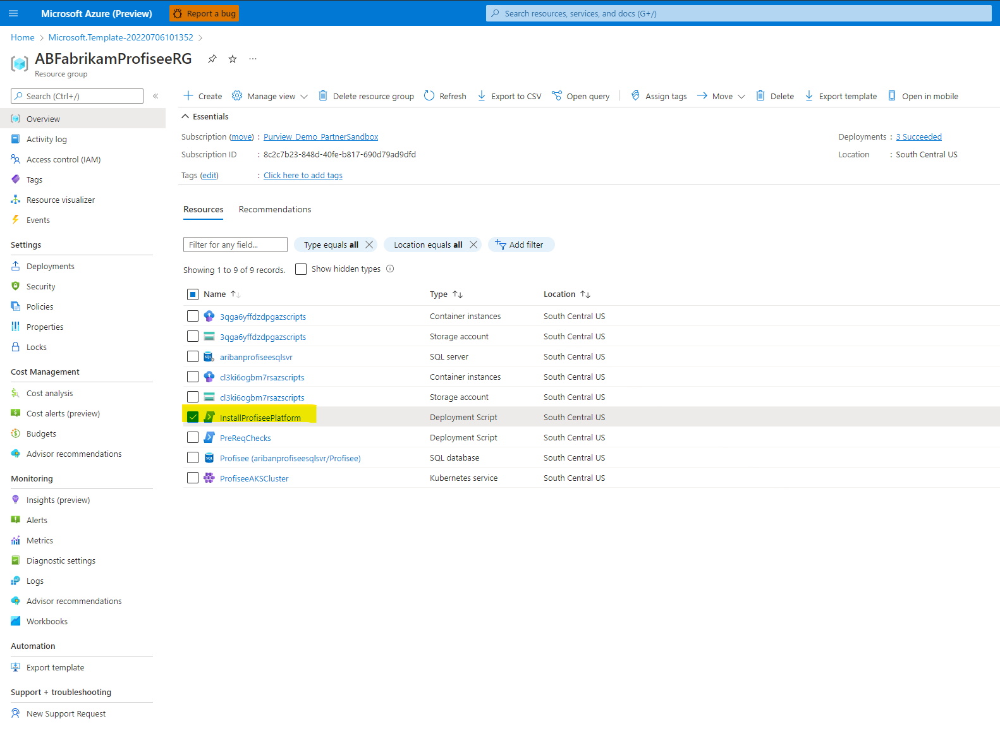
- Fetch the final deployment URL
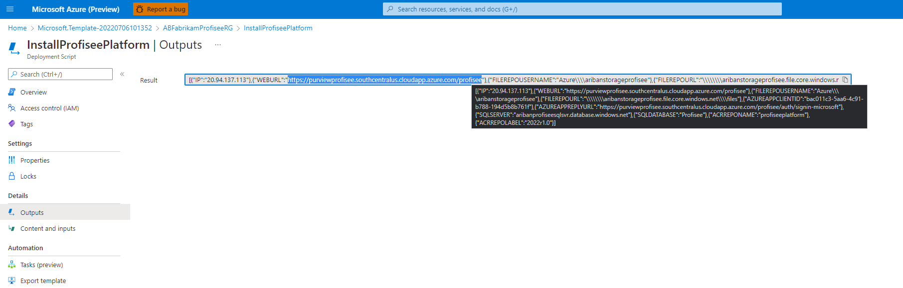
- Populate and hydrate data to the newly installed profisee environment by installing FastApp. Go to your Profisee SaaS deployment URL and select **/Profisee/api/client**. It should look something like - "https://[profisee_name].[region].cloudapp.azure.com/profisee/api/client".

## Next Steps
Through this guide, we learned how to set up and deploy a Microsoft Purview-Profisee integration.
For more usage details on Profisee and Profisee FastApp, especially how to configure data models, data quality, MDM and various other features of Profisee - Register on https://profisee.com/demo/ for further detailed tutorials!
