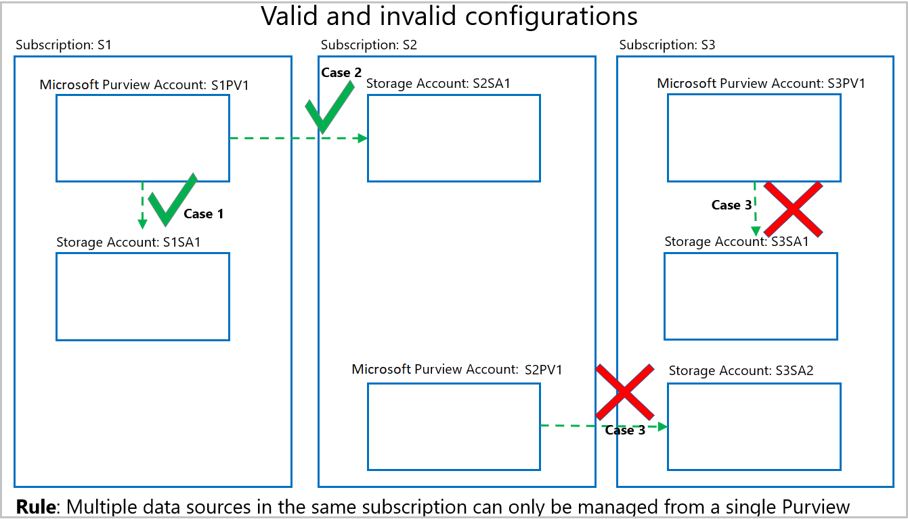

# Enable Data use management on your Microsoft Purview sources

*Data use management* is an option within the data source registration in Microsoft Purview. This option lets Microsoft Purview manage data access for your resources. The high level concept is that the data owner allows its data resource to be available for access policies by enabling *Data use management*. 

Currently, a data owner can enable Data use management on a data resource, which enables it for these types of access policies:
* [DevOps policies](concept-policies-devops.md) 
* [Data owner access policies](concept-policies-data-owner.md)
* [Self-service access policies](concept-self-service-data-access-policy.md) - access policies automatically generated by Microsoft Purview after a [self-service access request](how-to-request-access.md) is approved.

To be able to create any data policy on a resource, Data use management must first be enabled on that resource. This article will explain how to enable Data use management on your resources in Microsoft Purview.

>[!IMPORTANT]
>Because Data use management directly affects access to your data, it directly affects your data security. Review [**additional considerations**](#additional-considerations-related-to-data-use-management) and [**best practices**](#data-use-management-best-practices) below before enabling Data use management in your environment.

## Prerequisites
[!INCLUDE [Access policies generic configuration](./includes/access-policies-configuration-generic.md)]

## Enable Data use management

To enable *Data use management* for a resource, the resource will first need to be registered in Microsoft Purview.
To register a resource, follow the **Prerequisites** and **Register** sections of the [source pages](azure-purview-connector-overview.md) for your resources.

Once you have your resource registered, follow the rest of the steps to enable an individual resource for *Data use management*.

1. Go to the [Microsoft Purview governance portal](https://web.purview.azure.com/resource/).

1. Select the **Data map** tab in the left menu.

1. Select the **Sources** tab in the left menu.

1. Select the source where you want to enable *Data use management*.

1. At the top of the source page, select **Edit source**.

1. Set the *Data use management* toggle to **Enabled**, as shown in the image below.

:::image type="content" source="./media/tutorial-data-owner-policies-storage/register-data-source-for-policy-storage.png" alt-text="Set Data use management toggle to **Enabled** at the bottom of the menu.":::

## Disable Data use management

To disable Data use management for a source, resource group, or subscription, a user needs to either be a resource IAM **Owner** or a Microsoft Purview **Data source admin**. Once you have those permissions follow these steps:

1. Go to the [Microsoft Purview governance portal](https://web.purview.azure.com/resource/).

1. Select the **Data map** tab in the left menu.

1. Select the **Sources** tab in the left menu.

1. Select the source you want to disable Data use management for.

1. At the top of the source page, select **Edit source**.

1. Set the **Data use management** toggle to **Disabled**.

## Additional considerations related to Data use management
- Make sure you write down the **Name** you use when registering in Microsoft Purview. You will need it when you publish a policy. The recommended practice is to make the registered name exactly the same as the endpoint name.
- To disable a source for *Data use management*, you first have to remove any published policies on that data source.
- While user needs to have both data source *Owner* and Microsoft Purview *Data source admin* to enable a source for *Data use management*, **any** Data Source admin for the collection can disable it.
- Disabling *Data use management* for a subscription will disable it also for all assets registered in that subscription.

> [!WARNING]
> **Known issues** related to source registration
> - Moving data sources to a different resource group or subscription is not supported. If want to do that, de-register the data source in Microsoft Purview before moving it and then register it again after that happens. Note that policies are bound to the data source ARM path. Changing the data source subscription or resource group makes policies ineffective.
> - Once a subscription gets disabled for *Data use management* any underlying assets that are enabled for *Data use management* will be disabled, which is the right behavior. However, policy statements based on those assets will still be allowed after that.

## Data use management best practices
- We highly encourage registering data sources for *Data use management* and managing all associated access policies in a single Microsoft Purview account.
- Should you have multiple Microsoft Purview accounts, be aware that **all** data sources belonging to a subscription must be registered for *Data use management* in a single Microsoft Purview account. That Microsoft Purview account can be in any subscription in the tenant. The *Data use management* toggle will become greyed out when there are invalid configurations. Some examples of valid and invalid configurations follow in the diagram below:
    - **Case 1** shows a valid configuration where a Storage account is registered in a Microsoft Purview account in the same subscription.
    - **Case 2** shows a valid configuration where a Storage account is registered in a Microsoft Purview account in a different subscription. 
    - **Case 3** shows an invalid configuration arising because Storage accounts S3SA1 and S3SA2 both belong to Subscription 3, but are registered to different Microsoft Purview accounts. In that case, the *Data use management* toggle will only enable in the Microsoft Purview account that wins and registers a data source in that subscription first. The toggle will then be greyed out for the other data source.
- If the *Data use management* toggle is greyed out and cannot be enabled, hover over it to know the name of the Microsoft Purview account that has registered the data resource first.

## Next steps

- [Create data owner policies for your resources](how-to-policies-data-owner-authoring-generic.md)
- [Enable Microsoft Purview data owner policies on all data sources in a subscription or a resource group](./how-to-policies-data-owner-resource-group.md)
- [Enable Microsoft Purview data owner policies on an Azure Storage account](./how-to-policies-data-owner-storage.md)
