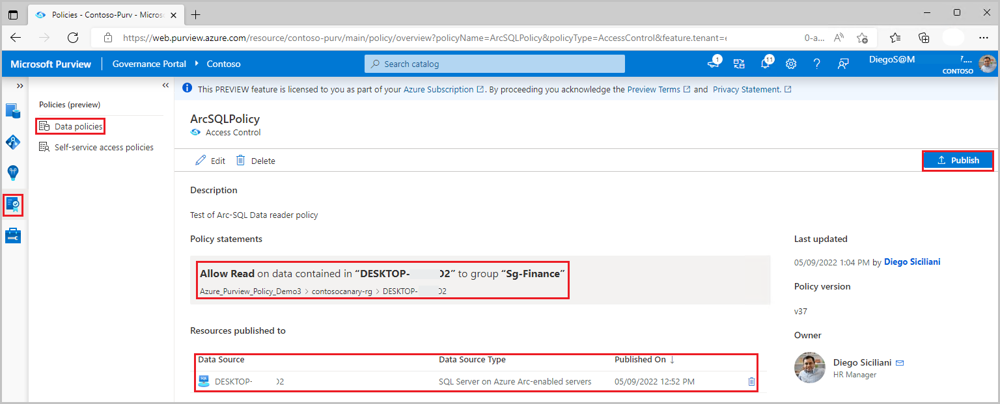

# Provision access by data owner for Azure Arc-enabled SQL Server (preview)

[!INCLUDE [feature-in-preview](includes/feature-in-preview.md)]

[Data owner policies](concept-policies-data-owner.md) are a type of Microsoft Purview access policies. They allow you to manage access to user data in sources that have been registered for *Data Use Management* in Microsoft Purview. These policies can be authored directly in the Microsoft Purview governance portal, and after publishing, they get enforced by the data source.

This guide covers how a data owner can delegate authoring policies in Microsoft Purview to enable access to Azure Arc-enabled SQL Server. The following actions are currently enabled: *Read*. This action is only supported for policies at server level. *Modify* is not supported at this point.

## Prerequisites
[!INCLUDE [Access policies generic pre-requisites](./includes/access-policies-prerequisites-generic.md)]
[!INCLUDE [Access policies Arc enabled SQL Server pre-requisites](./includes/access-policies-prerequisites-arc-sql-server.md)]

## Microsoft Purview configuration
[!INCLUDE [Access policies generic configuration](./includes/access-policies-configuration-generic.md)]

### Register data sources in Microsoft Purview
Register each data source with Microsoft Purview to later define access policies. 

1. Sign in to Microsoft Purview Studio.

1. Navigate to the **Data map** feature on the left pane, select **Sources**, then select **Register**. Type "Azure Arc" in the search box and select **SQL Server on Azure Arc**. Then select **Continue**


1. Enter a **Name** for this registration. It is best practice to make the name of the registration the same as the server name in the next step.

1. select an **Azure subscription**, **Server name** and **Server endpoint**.

1. **Select a collection** to put this registration in. 

1. Enable Data Use Management. Data Use Management needs certain permissions and can affect the security of your data, as it delegates to certain Microsoft Purview roles to manage access to the data sources. **Go through the secure practices related to Data Use Management in this guide**: [How to enable Data Use Management](./how-to-enable-data-use-management.md)

1. Upon enabling Data Use Management, Microsoft Purview will automatically capture the **Application ID** of the App Registration related to this Azure Arc-enabled SQL Server if one has been configured. Come back to this screen and hit the refresh button on the side of it to refresh, in case the association between the Azure Arc-enabled SQL Server and the App Registration changes in the future.

1. Select **Register** or **Apply** at the bottom

Once your data source has the **Data Use Management** toggle *Enabled*, it will look like this picture.


## Enable policies in Azure Arc-enabled SQL Server
[!INCLUDE [Access policies Arc enabled SQL Server configuration](./includes/access-policies-configuration-arc-sql-server.md)]

## Create and publish a Data owner policy

Execute the steps in the **Create a new policy** and **Publish a policy** sections of the [data-owner policy authoring tutorial](./how-to-policies-data-owner-authoring-generic.md#create-a-new-policy). The result will be a data owner policy similar to the example:

**Example: Read policy**. This policy assigns the Azure AD principal 'sg-Finance' to the *SQL Data reader* action, in the scope of SQL server *DESKTOP-xxx*. This policy has also been published to that server. Note that policies related to this action are not supported below server level.



> [!Note]
> - Given that scan is not currently available for this data source, data reader policies can only be created at server level. Use the **Data sources** box instead of the Asset box when authoring the **data resources** part of the policy.
> - There is a know issue with SQL Server Management Studio that prevents right-clicking on a table and choosing option “Select Top 1000 rows”.


>[!Important]
> - Publish is a background operation. It can take up to **5 minutes** for the changes to be reflected in this data source.
> - Changing a policy does not require a new publish operation. The changes will be picked up with the next pull.


## Unpublish a data owner policy
Follow this link for the steps to [unpublish a data owner policy in Microsoft Purview](how-to-policies-data-owner-authoring-generic.md#unpublish-a-policy).

## Update or delete a data owner policy
Follow this link for the steps to [update or delete a data owner policy in Microsoft Purview](how-to-policies-data-owner-authoring-generic.md#update-or-delete-a-policy).

## Test the policy

The Azure AD Accounts referenced in the access policies should now be able to connect to any database in the server to which the policies are published.

### Force policy download
It is possible to force an immediate download of the latest published policies to the current SQL database by running the following command. The minimal permission required to run it is membership in ##MS_ServerStateManager##-server role.

```sql
-- Force immediate download of latest published policies
exec sp_external_policy_refresh reload
```  

### Analyze downloaded policy state from SQL
The following DMVs can be used to analyze which policies have been downloaded and are currently assigned to Azure AD accounts. The minimal permission required to run them is VIEW DATABASE SECURITY STATE - or assigned Action Group *SQL Security Auditor*.

```sql

-- Lists generally supported actions
SELECT * FROM sys.dm_server_external_policy_actions

-- Lists the roles that are part of a policy published to this server
SELECT * FROM sys.dm_server_external_policy_roles

-- Lists the links between the roles and actions, could be used to join the two
SELECT * FROM sys.dm_server_external_policy_role_actions

-- Lists all Azure AD principals that were given connect permissions  
SELECT * FROM sys.dm_server_external_policy_principals

-- Lists Azure AD principals assigned to a given role on a given resource scope
SELECT * FROM sys.dm_server_external_policy_role_members

-- Lists Azure AD principals, joined with roles, joined with their data actions
SELECT * FROM sys.dm_server_external_policy_principal_assigned_actions
```


## Additional information

### Policy action mapping

This section contains a reference of how actions in Microsoft Purview data policies map to specific actions in Azure Arc-enabled SQL Server.

| **Microsoft Purview policy action** | **Data source specific actions**     |
|-------------------------------------|--------------------------------------|
|||
| *Read* |Microsoft.Sql/sqlservers/Connect |
||Microsoft.Sql/sqlservers/databases/Connect |
||Microsoft.Sql/Sqlservers/Databases/Schemas/Tables/Rows|
||Microsoft.Sql/Sqlservers/Databases/Schemas/Views/Rows |
|||


## Next steps
Check blog, demo and related how-to guides
* [Concepts for Microsoft Purview data owner policies](./concept-policies-data-owner.md)
* [Enable Microsoft Purview data owner policies on all data sources in a subscription or a resource group](./how-to-policies-data-owner-resource-group.md)
* [Enable Microsoft Purview data owner policies on an Azure SQL DB](./how-to-policies-data-owner-azure-sql-db.md)
