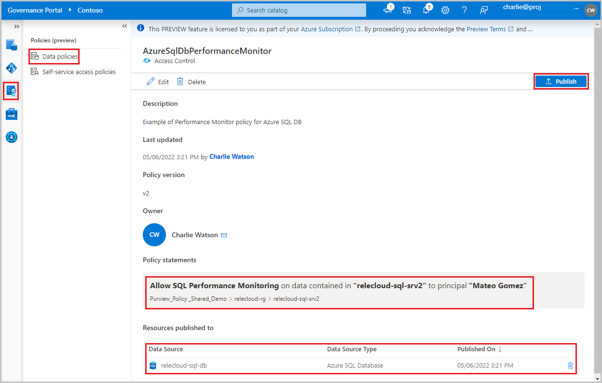
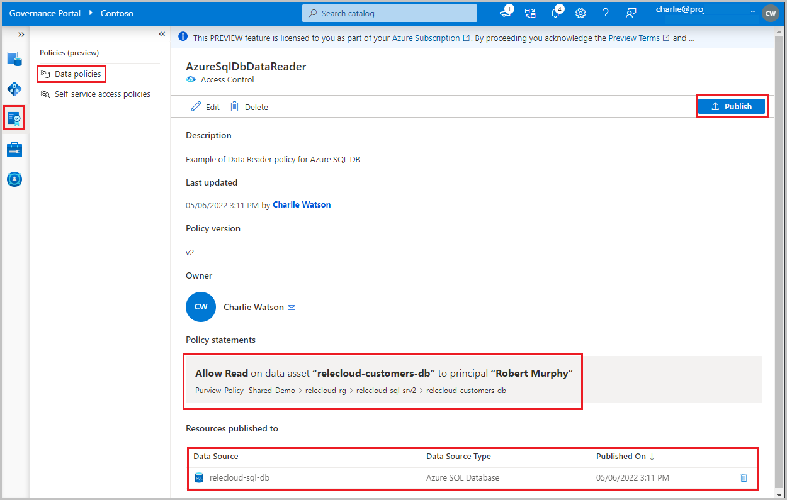

# Provision access by data owner for Azure SQL DB (preview)

[!INCLUDE [feature-in-preview](includes/feature-in-preview.md)]

[Access policies](concept-policies-data-owner.md) allow you to manage access from Microsoft Purview to data sources that have been registered for *Data Use Management*.

This how-to guide describes how a data owner can delegate authoring policies in Microsoft Purview to enable access to Azure SQL DB. The following actions are currently enabled: *SQL Performance Monitoring*, *SQL Security Auditing* and *Read*. The first two actions are supported only at server level. *Modify* is not supported at this point. 

## Prerequisites
[!INCLUDE [Access policies generic pre-requisites](./includes/access-policies-prerequisites-generic.md)]
[!INCLUDE [Access policies Azure SQL DB pre-requisites](./includes/access-policies-prerequisites-azure-sql-db.md)]

## Microsoft Purview Configuration
[!INCLUDE [Access policies generic configuration](./includes/access-policies-configuration-generic.md)]

### Register the data sources in Microsoft Purview
The Azure SQL DB resources need to be registered first with Microsoft Purview to later define access policies. You can follow these guides:

[Register and scan Azure SQL DB](./register-scan-azure-sql-database.md)

After you've registered your resources, you'll need to enable Data Use Management. Data Use Management can affect the security of your data, as it delegates to certain Microsoft Purview roles to manage access to the data sources. **Go through the secure practices related to Data Use Management in this guide**:

[How to enable Data Use Management](./how-to-enable-data-use-management.md)

Once your data source has the **Data Use Management** toggle *Enabled*, it will look like this picture. This will enable the access policies to be used with the given SQL server and all its contained databases.


## Create and publish a data owner policy

Execute the steps in the **Create a new policy** and **Publish a policy** sections of the [data-owner policy authoring tutorial](./how-to-policies-data-owner-authoring-generic.md#create-a-new-policy). The result will be a data owner policy similar to one of the examples shown in the images.

**Example #1: SQL Performance Monitor policy**. This policy assigns the Azure AD principal 'Mateo Gomez' to the *SQL Performance monitoring* action, in the scope of SQL server *relecloud-sql-srv2*. This policy has also been published to that server. Note: Policies related to this action are not supported below server level.



**Example #2: SQL Security Auditor policy**. Similar to example 1, but choose the *SQL Security auditing* action (instead of *SQL Performance monitoring*), when authoring the policy. Note: Policies related to this action are not supported below server level.

**Example #3: Read policy**. This policy assigns the Azure AD principal 'Robert Murphy' to the *SQL Data reader* action, in the scope of SQL server *relecloud-sql-srv2*. This policy has also been published to that server. Note: Policies related to this action are supported below server level (e.g., database, table)




>[!Important]
> - Publish is a background operation. It can take up to **5 minutes** for the changes to be reflected in this data source.
> - Changing a policy does not require a new publish operation. The changes will be picked up with the next pull.

### Test the policy

The Azure AD Accounts referenced in the access policies should now be able to connect to any database in the server to which the policies are published.

#### Force policy download
It is possible to force an immediate download of the latest published policies to the current SQL database by running the following command. The minimal permission required to run it is membership in ##MS_ServerStateManager##-server role.

```sql
-- Force immediate download of latest published policies
exec sp_external_policy_refresh reload
```  

#### Analyze downloaded policy state from SQL
The following DMVs can be used to analyze which policies have been downloaded and are currently assigned to Azure AD accounts. The minimal permission required to run them is VIEW DATABASE SECURITY STATE - or assigned Action Group *SQL Security Auditor*.

```sql

-- Lists generally supported actions
SELECT * FROM sys.dm_server_external_policy_actions

-- Lists the roles that are part of a policy published to this server
SELECT * FROM sys.dm_server_external_policy_roles

-- Lists the links between the roles and actions, could be used to join the two
SELECT * FROM sys.dm_server_external_policy_role_actions

-- Lists all Azure AD principals that were given connect permissions  
SELECT * FROM sys.dm_server_external_policy_principals

-- Lists Azure AD principals assigned to a given role on a given resource scope
SELECT * FROM sys.dm_server_external_policy_role_members

-- Lists Azure AD principals, joined with roles, joined with their data actions
SELECT * FROM sys.dm_server_external_policy_principal_assigned_actions
```

## Additional information

### Policy action mapping

This section contains a reference of how actions in Microsoft Purview data policies map to specific actions in Azure SQL DB.

| **Microsoft Purview policy action** | **Data source specific actions**     |
|-------------------------------------|--------------------------------------|
|||
| *Read* |Microsoft.Sql/sqlservers/Connect |
||Microsoft.Sql/sqlservers/databases/Connect |
||Microsoft.Sql/Sqlservers/Databases/Schemas/Tables/Rows|
||Microsoft.Sql/Sqlservers/Databases/Schemas/Views/Rows |
|||
| *SQL Performance Monitor* |Microsoft.Sql/sqlservers/Connect |
||Microsoft.Sql/sqlservers/databases/Connect |
||Microsoft.Sql/sqlservers/databases/SystemViewsAndFunctions/DatabasePerformanceState/rows/select |
||Microsoft.Sql/sqlservers/databases/SystemViewsAndFunctions/ServerPerformanceState/rows/select |
|||               
| *SQL Security Auditor* |Microsoft.Sql/sqlservers/Connect |
||Microsoft.Sql/sqlservers/databases/Connect |
||Microsoft.Sql/sqlservers/SystemViewsAndFunctions/ServerSecurityState/rows/select |
||Microsoft.Sql/sqlservers/databases/SystemViewsAndFunctions/DatabaseSecurityState/rows/select |
||Microsoft.Sql/sqlservers/SystemViewsAndFunctions/ServerSecurityMetadata/rows/select |
||Microsoft.Sql/sqlservers/databases/SystemViewsAndFunctions/DatabaseSecurityMetadata/rows/select |
|||

## Next steps
Check blog, demo and related how-to guides
* [Demo of access policy for Azure Storage](https://learn-video.azurefd.net/vod/player?id=caa25ad3-7927-4dcc-88dd-6b74bcae98a2)
* [Concepts for Microsoft Purview data owner policies](./concept-policies-data-owner.md)
* Blog: [Microsoft Purview Data Policy for SQL DevOps access provisioning now in public preview](https://techcommunity.microsoft.com/t5/microsoft-purview-blog/microsoft-purview-data-policy-for-sql-devops-access-provisioning/ba-p/3403174)
* Blog: [Controlling access to Azure SQL at scale with policies in Purview](https://techcommunity.microsoft.com/t5/azure-sql-blog/private-preview-controlling-access-to-azure-sql-at-scale-with/ba-p/2945491)
* [Enable Microsoft Purview data owner policies on all data sources in a subscription or a resource group](./how-to-policies-data-owner-resource-group.md)
* [Enable Microsoft Purview data owner policies on an Arc-enabled SQL Server](./how-to-policies-data-owner-arc-sql-server.md)
