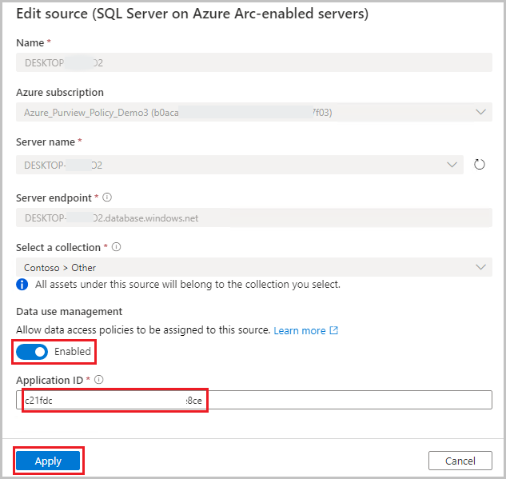

# Provision access to system metadata in Azure Arc-enabled SQL Server 2022

[DevOps policies](concept-policies-devops.md) are a type of Microsoft Purview access policies. They allow you to manage access to system metadata on data sources that have been registered for *Data use management* in Microsoft Purview. These policies are configured directly from the Microsoft Purview governance portal, and after they are saved, they get automatically published and then enforced by the data source. Microsoft Purview policies only manage access for Azure AD principals.

This how-to guide covers how to configure SQL Server 2022 to enforce policies created in Microsoft Purview. It covers onboarding with Azure Arc, enabling Azure AD on the SQL Server, and provisioning access to its system metadata (DMVs and DMFs) using the DevOps policies actions *SQL Performance Monitoring* or *SQL Security Auditing*.

## Prerequisites
[!INCLUDE [Access policies generic pre-requisites](./includes/access-policies-prerequisites-generic.md)]
[!INCLUDE [Access policies Arc enabled SQL Server pre-requisites](./includes/access-policies-prerequisites-arc-sql-server.md)]

## Microsoft Purview configuration
[!INCLUDE [Access policies generic configuration](./includes/access-policies-configuration-generic.md)]

### Register data sources in Microsoft Purview
The Azure Arc-enabled SQL Server data source needs to be registered first with Microsoft Purview, before policies can be created.

1. Sign in to Microsoft Purview Studio.

1. Navigate to the **Data map** feature on the left pane, select **Sources**, then select **Register**. Type "Azure Arc" in the search box and select **SQL Server on Azure Arc**. Then select **Continue**

1. Enter a **Name** for this registration. It is best practice to make the name of the registration the same as the server name in the next step.

1. select an **Azure subscription**, **Server name** and **Server endpoint**.

1. **Select a collection** to put this registration in. 

1. Enable Data Use Management. Data Use Management needs certain permissions and can affect the security of your data, as it delegates to certain Microsoft Purview roles to manage access to the data sources. **Go through the secure practices related to Data Use Management in this guide**: [How to enable Data Use Management](./how-to-enable-data-use-management.md)

1. Upon enabling Data Use Management, Microsoft Purview will automatically capture the **Application ID** of the App Registration related to this Azure Arc-enabled SQL Server if one has been configured. Come back to this screen and hit the refresh button on the side of it to refresh, in case the association between the Azure Arc-enabled SQL Server and the App Registration changes in the future.

1. Select **Register** or **Apply** at the bottom

Once your data source has the **Data Use Management** toggle *Enabled*, it will look like this picture.

## Enable policies in Azure Arc-enabled SQL Server
[!INCLUDE [Access policies Arc enabled SQL Server configuration](./includes/access-policies-configuration-arc-sql-server.md)]

## Create a new DevOps policy
Follow this link for the steps to [create a new DevOps policy in Microsoft Purview](how-to-policies-devops-authoring-generic.md#create-a-new-devops-policy).

## List DevOps policies
Follow this link for the steps to [list DevOps policies in Microsoft Purview](how-to-policies-devops-authoring-generic.md#list-devops-policies).

## Update a DevOps policy
Follow this link for the steps to [update a DevOps policies in Microsoft Purview](how-to-policies-devops-authoring-generic.md#update-a-devops-policy).

## Delete a DevOps policy
Follow this link for the steps to [delete a DevOps policies in Microsoft Purview](how-to-policies-devops-authoring-generic.md#delete-a-devops-policy).

>[!Important]
> DevOps policies are auto-published and changes can take up to **5 minutes** to be enforced by the data source.

## Test the DevOps policy
See how to [test the policy you created](./how-to-policies-devops-authoring-generic.md#test-the-devops-policy)

## Role definition detail
See the [mapping of DevOps role to data source actions](./how-to-policies-devops-authoring-generic.md#role-definition-detail)

## Next steps
See [related videos, blogs and documents](./how-to-policies-devops-authoring-generic.md#next-steps)

