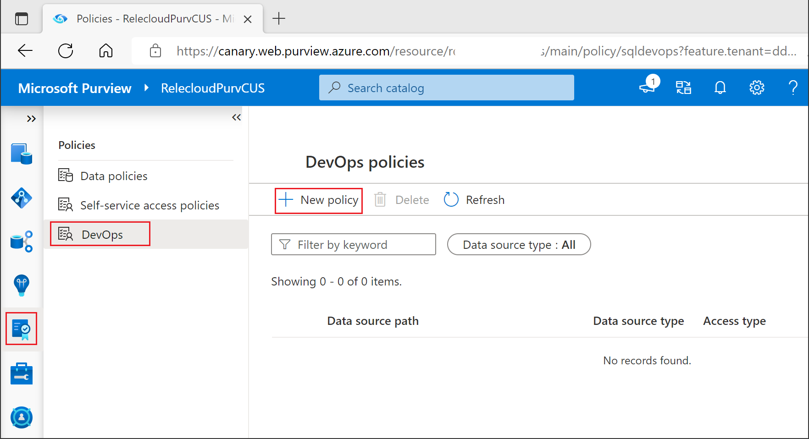
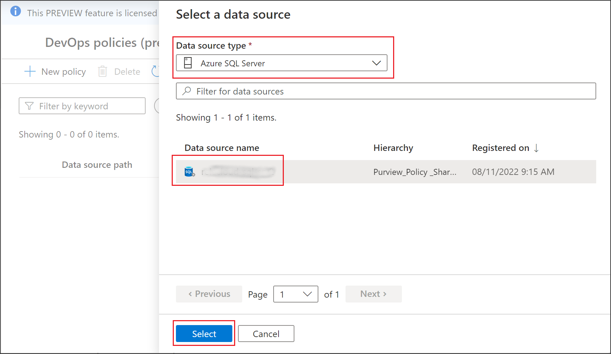
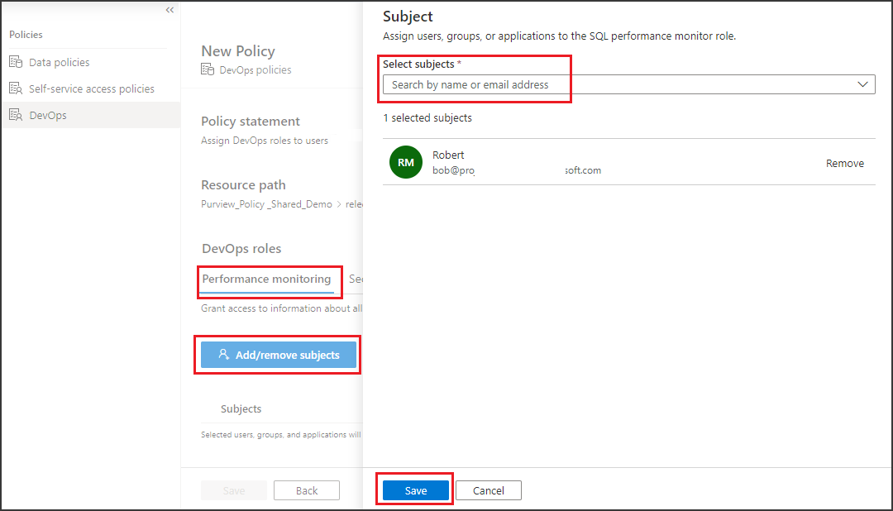
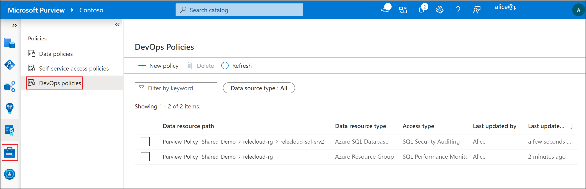
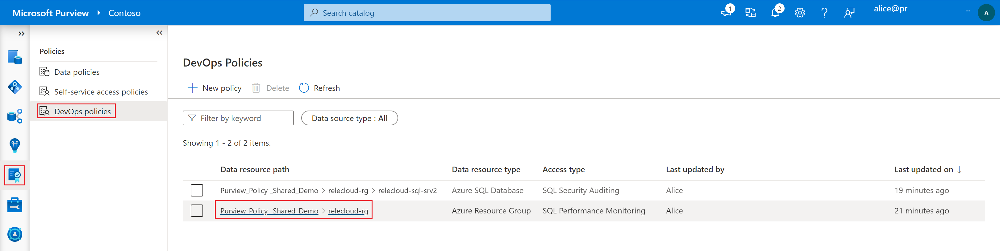
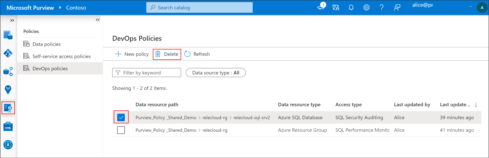
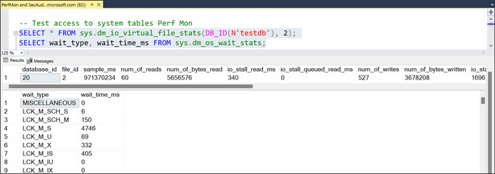
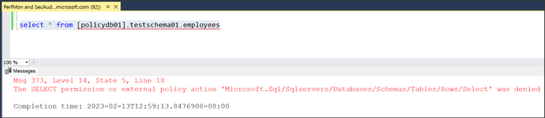

# Create, list, update and delete Microsoft Purview DevOps policies

[DevOps policies](concept-policies-devops.md) are a type of Microsoft Purview access policies. They allow you to manage access to system metadata on data sources that have been registered for *Data use management* in Microsoft Purview. These policies are configured directly from the Microsoft Purview governance portal, and after they are saved, they get automatically published and then enforced by the data source. Microsoft Purview policies only manage access for Azure AD principals.

This guide covers the configuration steps in Microsoft Purview to provision access to database system metadata using the DevOps policies actions *SQL Performance Monitoring* or *SQL Security Auditing*. It goes into detail on creating, listing, updating and deleting DevOps policies.

## Prerequisites
[!INCLUDE [Access policies generic pre-requisites](./includes/access-policies-prerequisites-generic.md)]

### Configuration
Before authoring policies in the Microsoft Purview policy portal, you'll need to configure the data sources so that they can enforce those policies.

1. Follow any policy-specific prerequisites for your source. Check the [Microsoft Purview supported data sources table](./microsoft-purview-connector-overview.md) and select the link in the **Access Policy** column for sources where access policies are available. Follow any steps listed in the Access policy or Prerequisites sections.
1. Register the data source in Microsoft Purview. Follow the **Prerequisites** and **Register** sections of the [source pages](./microsoft-purview-connector-overview.md) for your resources.
1. [Enable the "Data use management" toggle in the data source registration](how-to-enable-data-use-management.md). Additional permissions for this step are described in the linked document.


## Create a new DevOps policy
To create a new DevOps policy, ensure first that you have the Microsoft Purview Policy author role at **root collection level**. Check the section on managing Microsoft Purview role assignments in this [guide](./how-to-create-and-manage-collections.md#add-roles-and-restrict-access-through-collections).

1. Sign in to the [Microsoft Purview governance portal](https://web.purview.azure.com/resource/).

1. Navigate to the **Data policy** feature using the left side panel. Then select **DevOps policies**.

1. Select the **New Policy** button in the policy page. After that, the policy detail page will open.


1.  Select the **Data source type** and then one of the listed data sources under **Data source name**. Then click on **Select**. This will take you back to the New Policy experience


1. Select one of two roles, *SQL Performance monitor* or *SQL Security auditor*. Then select **Add/remove subjects**. This will open the Subject window. Type the name of an Azure AD principal (user, group or service principal) in the **Select subjects** box. Note that Microsoft 365 groups are supported but updates to group membership take up to 1 hour to get reflected by Azure AD. Keep adding or removing subjects until you are satisfied. Select **Save**. This will take you back to the prior window.


1. Select **Save** to save the policy. A policy has been created and automatically published. Enforcement will start at the data source within 5 minutes.

## List DevOps policies
To update a DevOps policy, ensure first that you have one of the following Microsoft Purview roles at **root collection level**: Policy author, Data source admin, Data curator or Data reader. Check the section on managing Microsoft Purview role assignments in this [guide](./how-to-create-and-manage-collections.md#add-roles-and-restrict-access-through-collections).

1. Sign in to the [Microsoft Purview governance portal](https://web.purview.azure.com/resource/).

1. Navigate to the **Data policy** feature using the left side panel. Then select **DevOps policies**.

1. If any DevOps policies have been created they will be listed as shown in the following screenshot



## Update a DevOps policy
To update a DevOps policy, ensure first that you have the Microsoft Purview Policy author role at **root collection level**. Check the section on managing Microsoft Purview role assignments in this [guide](./how-to-create-and-manage-collections.md#add-roles-and-restrict-access-through-collections).

1. Sign in to the [Microsoft Purview governance portal](https://web.purview.azure.com/resource/).

1. Navigate to the **Data policy** feature using the left side panel. Then select **DevOps policies**.

1. Enter the policy detail for one of the policies by selecting it from its Data resource path as shown in the following screenshot


1. In the policy detail page, select **Edit**.

1. Continue same as with step 5 and 6 of the policy create.

## Delete a DevOps policy
To delete a DevOps policy, ensure first that you have the Microsoft Purview Policy author role at **root collection level**. Check the section on managing Microsoft Purview role assignments in this [guide](./how-to-create-and-manage-collections.md#add-roles-and-restrict-access-through-collections).

1. Sign in to the [Microsoft Purview governance portal](https://web.purview.azure.com/resource/).

1. Navigate to the **Data policy** feature using the left side panel. Then select **DevOps policies**.

1. Check one of the policies and then select **Delete** as shown in the following screenshot:


## Test the DevOps policy
After creating the policy, any of the Azure AD users in the Subject should now be able to connect to the data sources in the scope of the policy. To test, use SSMS or any SQL client and try to query some DMVs/DMFs. We list here a few examples. For more, you can consult the mapping of popular DMVs/DMFs in the [Microsoft Purview DevOps policies concept guide](./concept-policies-devops.md#mapping-of-popular-dmvs-and-dmfs)

If you require additional troubleshooting, see the [Next steps](#next-steps) section in this guide.

### Testing SQL Performance Monitor access
If you provided the Subject(s) of the policy SQL Performance Monitor role, you can issue the following commands
```sql
-- Returns I/O statistics for data and log files
SELECT * FROM sys.dm_io_virtual_file_stats(DB_ID(N'testdb'), 2)
-- Waits encountered by threads that executed. Used to diagnose performance issues
SELECT wait_type, wait_time_ms FROM sys.dm_os_wait_stats
```


### Testing SQL Security Auditor access
If you provided the Subject(s) of the policy SQL Security Auditor role, you can issue the following commands from SSMS or any SQL client
```sql
-- Returns the current state of the audit
SELECT * FROM sys.dm_server_audit_status
-- Returns information about the encryption state of a database and its associated database encryption keys
SELECT * FROM sys.dm_database_encryption_keys
```

### Ensure no access to user data
Next, try accessing a table in one of the databases. The Azure AD principal you are testing with should be denied, which means the data is protected from insider threat

```sql
-- Test access to user data
SELECT * FROM [databaseName].schemaName.tableName
```




## Role definition detail
This section contains a reference of how relevant Microsoft Purview data policy roles map to specific actions in SQL data sources.

>[!NOTE]
> The roles below may be expanded in the future to include additional actions that become available as long as they are are consistent with the spirit of the role.

| **Microsoft Purview policy role definition** | **Data source specific actions**     |
|-------------------------------------|--------------------------------------|
|                                     |                                      |
| *SQL Performance Monitor* |Microsoft.Sql/sqlservers/Connect |
||Microsoft.Sql/sqlservers/databases/Connect |
||Microsoft.Sql/sqlservers/databases/SystemViewsAndFunctions/DatabasePerformanceState/rows/select |
||Microsoft.Sql/sqlservers/databases/SystemViewsAndFunctions/ServerPerformanceState/rows/select |
|||               
| *SQL Security Auditor* |Microsoft.Sql/sqlservers/Connect |
||Microsoft.Sql/sqlservers/databases/Connect |
||Microsoft.Sql/sqlservers/SystemViewsAndFunctions/ServerSecurityState/rows/select |
||Microsoft.Sql/sqlservers/databases/SystemViewsAndFunctions/DatabaseSecurityState/rows/select |
||Microsoft.Sql/sqlservers/SystemViewsAndFunctions/ServerSecurityMetadata/rows/select |
||Microsoft.Sql/sqlservers/databases/SystemViewsAndFunctions/DatabaseSecurityMetadata/rows/select |
|||

>[!NOTE]
> The role definition for SQL Performance Monitor will be expanded around April 2023 to include the following actions.

- /Sqlservers/Databases/SystemViewsAndFunctions/DatabasePerformanceState/Rows/Select
- /Sqlservers/SystemViewsAndFunctions/ServerPerformanceState/Rows/Select
- /Sqlservers/Databases/SystemViewsAndFunctions/DatabaseGeneralMetadata/Rows/Select
- /Sqlservers/SystemViewsAndFunctions/ServerGeneralMetadata/Rows/Select
- /Sqlservers/Databases/DBCCs/ViewDatabasePerformanceState/Execute
- /Sqlservers/DBCCs/ViewServerPerformanceState/Execute
- /Sqlservers/Databases/ExtendedEventSessions/Create
- /Sqlservers/Databases/ExtendedEventSessions/Options/Alter
- /Sqlservers/Databases/ExtendedEventSessions/Events/Add
- /Sqlservers/Databases/ExtendedEventSessions/Events/Drop
- /Sqlservers/Databases/ExtendedEventSessions/State/Enable
- /Sqlservers/Databases/ExtendedEventSessions/State/Disable
- /Sqlservers/Databases/ExtendedEventSessions/Drop
- /Sqlservers/Databases/ExtendedEventSessions/Target/Add
- /Sqlservers/Databases/ExtendedEventSessions/Target/Drop
- /Sqlservers/ExtendedEventSessions/Create
- /Sqlservers/ExtendedEventSessions/Options/Alter
- /Sqlservers/ExtendedEventSessions/Events/Add
- /Sqlservers/ExtendedEventSessions/Events/Drop
- /Sqlservers/ExtendedEventSessions/State/Enable
- /Sqlservers/ExtendedEventSessions/State/Disable
- /Sqlservers/ExtendedEventSessions/Drop
- /Sqlservers/ExtendedEventSessions/Target/Add
- /Sqlservers/ExtendedEventSessions/Target/Drop


## Next steps
Check the blogs, videos and related documents
* Blog: [Inexpensive solution for managing access to SQL health, performance and security information](https://techcommunity.microsoft.com/t5/security-compliance-and-identity/inexpensive-solution-for-managing-access-to-sql-health/ba-p/3750512)
* Blog: [Microsoft Purview DevOps policies enable at scale access provisioning for IT operations](https://techcommunity.microsoft.com/t5/microsoft-purview-blog/microsoft-purview-devops-policies-enable-at-scale-access/ba-p/3604725)
* Blog: [Microsoft Purview DevOps policies enter General Availability](https://techcommunity.microsoft.com/t5/security-compliance-and-identity/microsoft-purview-devops-policies-enter-ga-simplify-access/ba-p/3674057)
* Video: [Pre-requisite for policies: The "Data use management" option](https://youtu.be/v_lOzevLW-Q)
* Video: [DevOps policies quick overview](https://aka.ms/Microsoft-Purview-DevOps-Policies-Video)
* Video: [DevOps policies deep dive](https://youtu.be/UvClpdIb-6g)
* Doc: [Microsoft Purview DevOps policies concept guide](./concept-policies-devops.md)
* Doc: [Microsoft Purview DevOps policies on Azure Arc-enabled SQL Server](./how-to-policies-devops-arc-sql-server.md)
* Doc: [Microsoft Purview DevOps policies on Azure SQL Database](./how-to-policies-devops-azure-sql-db.md)
* Doc: [Microsoft Purview DevOps policies on entire resource groups or subscriptions](./how-to-policies-devops-resource-group.md)
* Doc: [Troubleshoot Microsoft Purview policies for SQL data sources](./troubleshoot-policy-sql.md)
