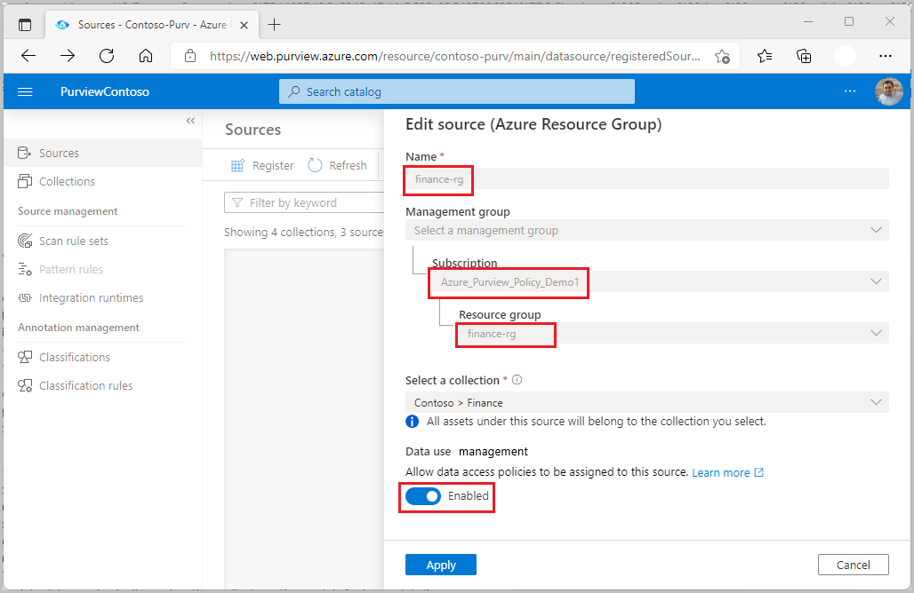

# Provision access to system metadata in resource groups or subscriptions

[DevOps policies](concept-policies-devops.md) are a type of Microsoft Purview access policies. They allow you to manage access to system metadata on data sources that have been registered for *Data use management* in Microsoft Purview. These policies are configured directly in the Microsoft Purview governance portal, and after they are saved, they get automatically published and then enforced by the data source. Microsoft Purview policies only manage access for Azure AD principals.

This how-to guide covers how to register an entire resource group or subscription and then create a single policy that will provision access to **all** data sources in that resource group or subscription. That single policy will cover all existing data sources and any data sources that are created afterwards. and provisioning access to its system metadata (DMVs and DMFs) using the DevOps policies actions *SQL Performance Monitoring* or *SQL Security Auditing*.

## Prerequisites
[!INCLUDE [Access policies generic pre-requisites](./includes/access-policies-prerequisites-generic.md)]

**Only these data sources are enabled for access policies on resource group or subscription**. Follow the **Prerequisites** section that is specific to the data source(s) in these guides:
* [DevOps policies on an Azure SQL Database](./how-to-policies-devops-azure-sql-db.md#prerequisites)
* [DevOps policies on an Azure Arc-enabled SQL Server](./how-to-policies-devops-arc-sql-server.md#prerequisites)

## Microsoft Purview Configuration
[!INCLUDE [Access policies generic configuration](./includes/access-policies-configuration-generic.md)]

### Register the subscription or resource group for Data Use Management
The subscription or resource group needs to be registered with Microsoft Purview before you can create access policies. To register your subscription or resource group, follow the **Prerequisites** and **Register** sections of this guide:

- [Register multiple sources in Microsoft Purview](register-scan-azure-multiple-sources.md#prerequisites)

After you've registered your resources, you'll need to enable the Data Use Management option. Data Use Management needs certain permissions and can affect the security of your data, as it delegates to certain Microsoft Purview roles to manage access to the data sources. **Go through the secure practices related to Data Use Management in this guide**: [How to enable Data Use Management](./how-to-enable-data-use-management.md) 

In the end, your resource will have the  **Data Use Management** toggle **Enabled**, as shown in the screenshot:

>[!Important]
> - If you create a policy on a resource group or subscription and want to have it enforced in Azure Arc-enabled SQL Servers, you will need to also register those servers independently and enable *Data use management* which captures their App ID: [See this document](./how-to-policies-devops-arc-sql-server.md#register-data-sources-in-microsoft-purview).

## Create a new DevOps policy
Follow this link for the steps to [create a new DevOps policy in Microsoft Purview](how-to-policies-devops-authoring-generic.md#create-a-new-devops-policy).

## List DevOps policies
Follow this link for the steps to [list DevOps policies in Microsoft Purview](how-to-policies-devops-authoring-generic.md#list-devops-policies).

## Update a DevOps policy
Follow this link for the steps to [update a DevOps policies in Microsoft Purview](how-to-policies-devops-authoring-generic.md#update-a-devops-policy).

## Delete a DevOps policy
Follow this link for the steps to [delete a DevOps policies in Microsoft Purview](how-to-policies-devops-authoring-generic.md#delete-a-devops-policy).

## Test the DevOps policy
See how to [test the policy you created](./how-to-policies-devops-authoring-generic.md#test-the-devops-policy)

## Role definition detail
See the [mapping of DevOps role to data source actions](./how-to-policies-devops-authoring-generic.md#role-definition-detail)

## Next steps
See [related videos, blogs and documents](./how-to-policies-devops-authoring-generic.md#next-steps)