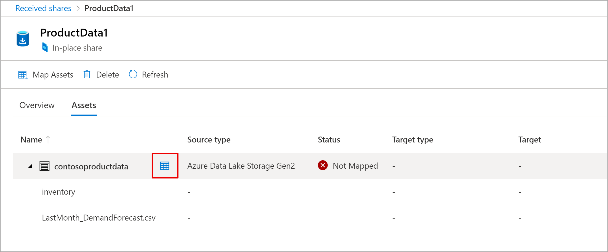
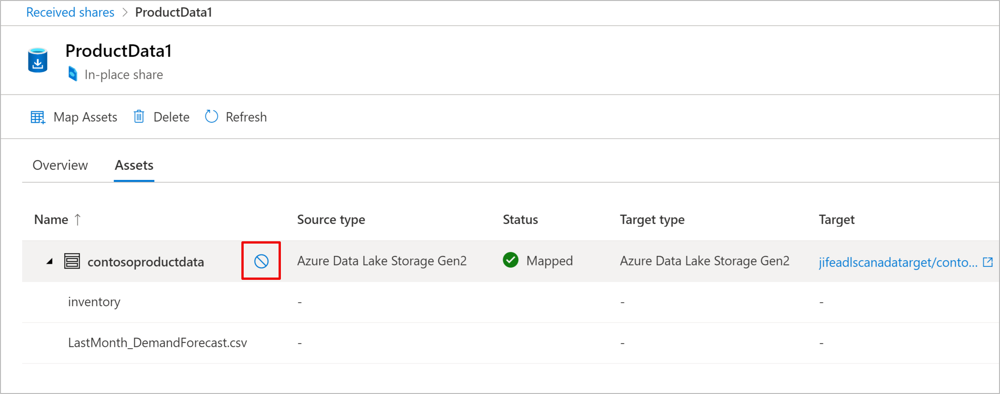
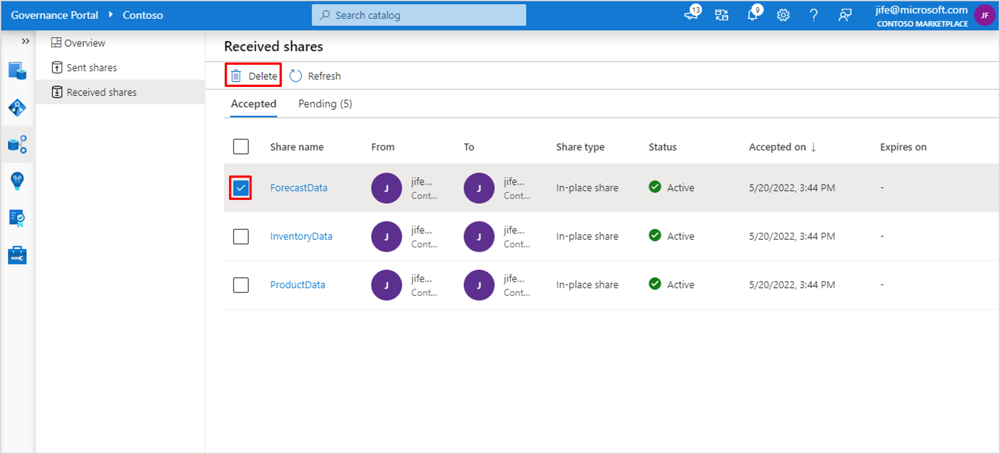

# Receive Azure Storage in-place share with Microsoft Purview Data Sharing (preview)

Microsoft Purview Data Sharing supports in-place data sharing from Azure Data Lake Storage (ADLS Gen2) to ADLS Gen2, and Blob storage account to Blob storage account. This article explains how to receive share and access shared data.

[!INCLUDE [feature-in-preview](includes/feature-in-preview.md)]

## Prerequisites to receive shared data

### Microsoft Purview prerequisites

* [A Microsoft Purview account](create-catalog-portal.md). 
* **Data Share Contributor** role to a Microsoft Purview collection. If you created the Microsoft Purview account, you are automatically assigned this role to the root collection. Refer to [Microsoft Purview permissions](catalog-permissions.md) to learn more about the Microsoft Purview collection and roles.

### Azure Storage account prerequisites

* Your Azure subscription must be registered for the **AllowDataSharing** preview feature. Follow the below steps using Azure portal or PowerShell. 

    # [Portal](#tab/azure-portal)
    1. In Azure portal, select your Azure subscription which you will use to create the source and target storage account.
    1. From the left menu, select **Preview features** under *Settings*.
    1. Select **AllowDataSharing** and *Register*. 
    1. Refresh the *Preview features* screen to verify the *State* is **Registered**. It could take 15 minutes to 1 hour for registration to complete.

    For additional details, refer to [Register preview feature](../azure-resource-manager/management/preview-features.md?tabs=azure-portal#register-preview-feature).

    # [PowerShell](#tab/powershell)
    ```azurepowershell
    Set-AzContext -SubscriptionId [Your Azure subscription ID]
    ```
    ```azurepowershell
    Register-AzProviderFeature -FeatureName "AllowDataSharing" -ProviderNamespace "Microsoft.Storage"​
    ```
    ```azurepowershell
    Get-AzProviderFeature -FeatureName "AllowDataSharing" -ProviderNamespace "Microsoft.Storage"   
    ```
    The *RegistrationState* should be **Registered**. It could take 15 minutes to 1 hour for registration to complete. For additional details, refer to [Register preview feature](../azure-resource-manager/management/preview-features.md?tabs=azure-portal#register-preview-feature).

* A target storage account created after the registration step is completed. The target storage account must be in the same Azure region as the source storage account. If you do not know the Azure region of the source storage account, you will be able to find out during the asset mapping step later in the process. Target storage account can be in a different Azure region from your Microsoft Purview account.

    > [!NOTE]
    > The following are supported storage account configurations:
    >
    > - Azure regions: Canada Central, Canada East, UK South, UK West, Australia East, Japan East, Korea South, and South Africa North 
    > - Performance: Standard
    > - Redundancy options: LRS, GRS, RA-GRS
 
* **Owner** or **Blob Storage Data Owner** role to the target storage account. You can find additional details on the [ADLS Gen2](register-scan-adls-gen2.md#data-sharing) or [Blob storage](register-scan-azure-blob-storage-source.md#data-sharing) data source page.
* If the target storage account is in a different Azure subscription than the one for Microsoft Purview account, [register the Microsoft.Purview resource provider](../azure-resource-manager/management/resource-providers-and-types.md) in the Azure subscription where the Azure data store is located.
* Latest version of the storage SDK, PowerShell, CLI and Azure Storage Explorer. Storage REST API version must be February 2020 or later. 

## Receive share

1. You can view pending share in any Microsoft Purview account. Select a Microsoft Purview account you want to use to receive the share, and open Microsoft Purview governance portal. Select **Data Share** icon from the left navigation. Then select **pending received share**. If you received an email invitation, you can click on the **View pending share** link in the email to select a Microsoft Purview account. 

    If you're a guest user of a tenant, you'll be asked to verify your email address for the tenant prior to viewing pending received share for the first time. Once verified, it's valid for 12 months.

    

1. Select name of the pending share you want to view. 

    


1. Specify a **Received share name** and a collection. Select **Accept and configure**. If you do not want to accept the invitation, select *Reject*.

       

1. Continue to map asset. Select **Map** next to the asset to specify a target data store to receive or access shared data. 
 
        

1. For in-place sharing, target type and locations are determined by the data provider's source type and location. Select a storage account with the same type and location as the source.

    If you do not see a storage account from the drop down list, click on the **Register a new data store to map assets** link below to register your storage account. Azure resource needs to be registered with Microsoft Purview before you can receive data into that resource. Your storage account needs to be registered in the same collection as the received share.

    Enter additional information required to map asset. Select **Map to target**.

    > [!NOTE] 
    > The container where shared data is mapped to is read-only. You cannot write to the container. You can map multiple shares into the same container. 

        

1. The screen will show *Mapping* in progress. Asset mapping can take a few minutes. Select **Close**. 

    You can select "Close" after you have configured the asset mapping. You don't need to wait for the mapping to complete.

      

1. Select **Assets** tab to monitor mapping status. Once mapping is completed, you'll get a notification in the screen. The status will change from *Mapping* to *Mapped*. 

     

    You can now access the data in the target storage account. 

    > [!NOTE] 
    > Storage REST API version should be February 2020 or later. Ensure you are using the latest version of the storage SDK, PowerShell, CLI and Azure Storage Explorer.


## Update received share
Once you accepted a share, you can update asset mapping, or stop the sharing relationship by deleting the received share.

### Update asset mapping
You can map asset or unmap asset within a received share.

You can map an asset in the *unmapped* state. To map asset, first select the received share, and then select **Assets** tab. Locate the asset you want to map, and select the **Map** action next to the asset name. You can now specify a target data store where you want to access the shared data. Once you confirm your selection, it will take a few minutes for the asset mapping to complete, and your will see the shared data in your target data store. 

 

You can unmap an asset in the *mapped* or *Failed* state. To unmap an asset, first select the received share, and then select **Assets** tab. Locate the asset you want to unmap, and select the **Unmap** action next to the asset name. It will take a few minutes to complete. Once asset is unmapped, you can no longer access the shared data.

 

## Delete received share
To delete a *received share*, select the share and then select **Delete**.
 
Deleting a received share will stop the sharing relationship, and you'll no longer be able to access shared data. Deleting a received share can take a few minutes.

## Troubleshoot
Here are some common issues for receiving share and how to troubleshoot.

### Cannot create Microsoft Purview account
If you are getting an error related to *quota* when creating a Microsoft Purview account, it means your organization has exceeded [Microsoft Purview service limit](how-to-manage-quotas.md). If you require an increase in limit, contact support.

### Both Sent Shares and Received Shares are disabled
If both *sent shares* and *received shares* are disabled in the navigation, you don't have **Data Share Contributor** role to any collections in this Microsoft Purview account. 

### Can't view pending share
If you've been notified that you've received a share, but can't view pending share in your Microsoft Purview account, it could be due to the following reasons:

* You do not have **Data Share Contributor** role to any collections in this Microsoft Purview account. Contact your *Microsoft Purview Collection Admin* to grant you access to **Data Share Contributor** role to view, accept and configure the received share. 
* Pending share invitation is sent to your email alias instead of your Azure login email.  Contact your data provider and ensure that they have sent the invitation to your Azure login e-mail address and not your e-mail alias.
* Share has already been accepted.  If you have already accepted the share, it will no longer show up in *Pending* tab. Select *Accepted* tab under *Received shares* to see your active shares.
* You are a guest user of the tenant. If you are a guest user of a tenant, you need to verify your email address for the tenant in order to view pending share for the first time. Once verified, it is valid for 12 months.

### Cannot select a collection when accepting a pending share or register a data source
If you cannot select a collection when accepting a pending share or register a data source, you do not have proper permission to the collection. You need to have **Data Share Contributor** role to a Microsoft Purview collection in order to register data source and receive share. 

### Cannot select target storage account when mapping an asset
When you map an asset to a target, if your storage account is not listed for you to select, it is likely due to the following reasons:
* The storage account is not supported. Microsoft Purview Data share only [supports storage accounts with specific configurations](#storage-account-prerequisites).
* You do not have **Data Share Contributor** role to the collection where the storage account is registered in. Data Share Contributor role is required to view the list of registered storage account in a collection. 


### Failed to map asset
If you failed to map an asset, it's likely due to the following reasons:
* Permission issue to the target data store. Check [Prerequisite](#prerequisites-to-receive-shared-data) for required data store permissions.
* The share and target data store do not belong to the same Microsoft Purview collection. In order to receive data into a data store, the share and target data store need to belong to the same Microsoft Purview collection. 
* The *Path* you specified includes container created outside of Microsoft Purview Data Sharing. You can only receive data into containers created during asset mapping.
* The *New Folder* you specified to receive storage data is not empty.
* Source and target storage account is the same. Sharing from the same source storage account to the same target is not supported.
* Exceeding limit. Source storage account can support up to 20 targets, and target storage account can support up to 100 sources. If you require an increase in limit, please contact Support.

### Cannot access shared data in the target data store
If you cannot access shared data, it is likely due to the following reasons:
* After asset mapping is successful, it may take some time for the data to appear in the target data store. Try again in a few minutes. Likewise, after you delete asset mapping, it may take a few minutes for the data to disappear in the target data store.
* You are accessing shared data using a storage API version prior to February 2020. Only storage API version February 2020 and later are supported for accessing shared data. Ensure you are using the latest version of the storage SDK, PowerShell, CLI and Azure Storage Explorer.


## Next steps

* [How to Share Data](how-to-share-data.md)
* [FAQ for Data Sharing](how-to-data-share-faq.md)
* [REST API reference](/rest/api/purview/)

