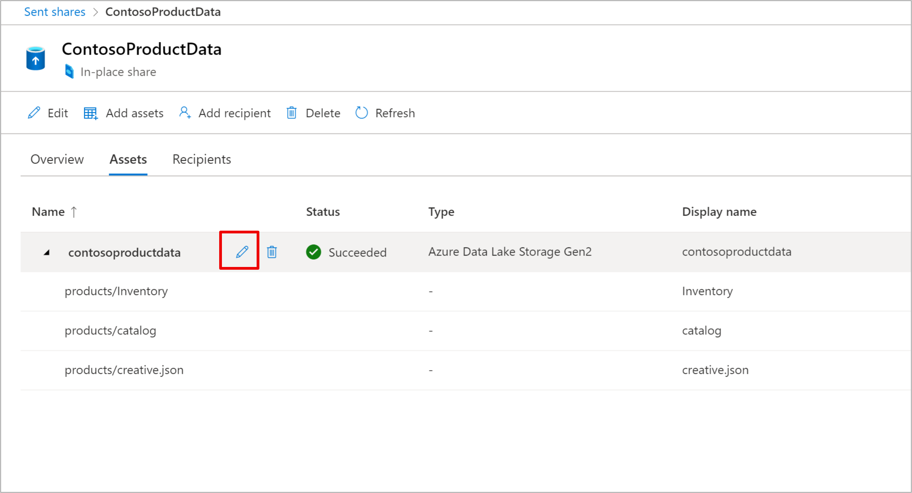
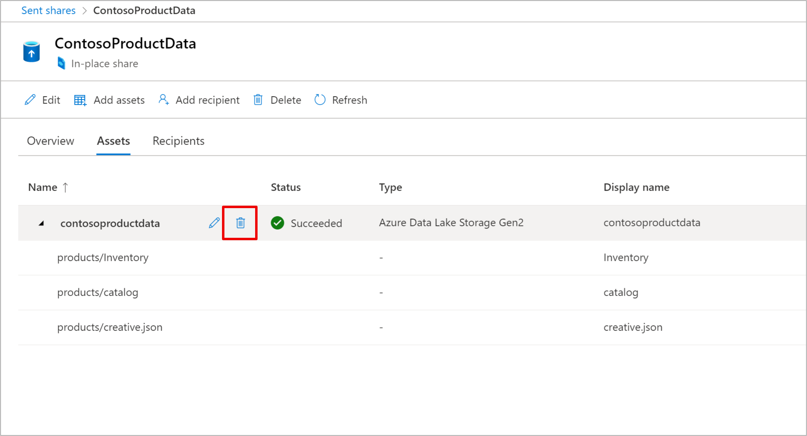
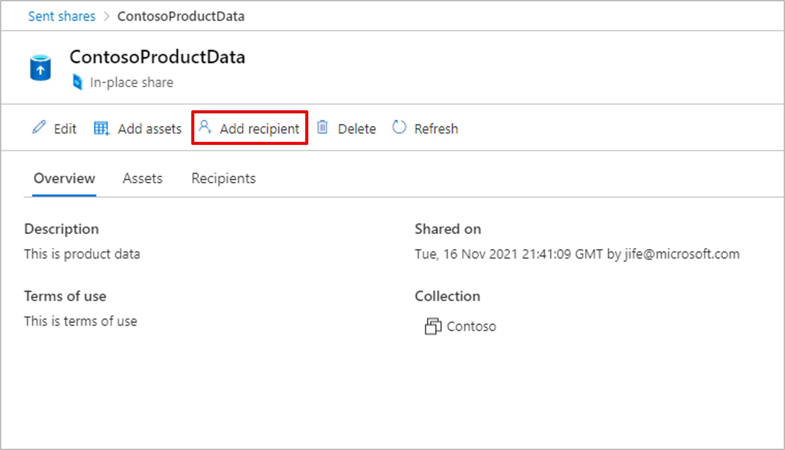
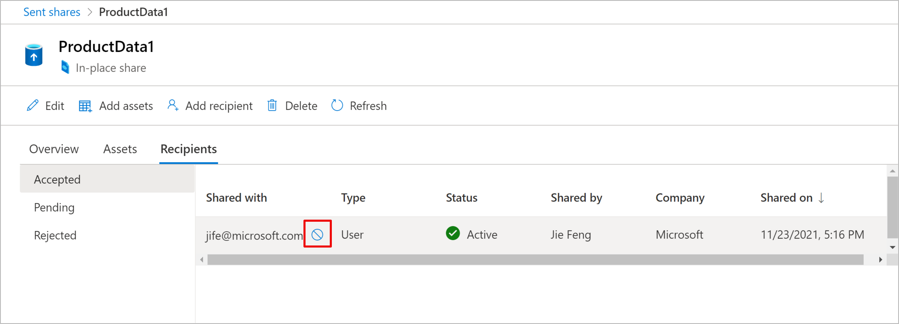
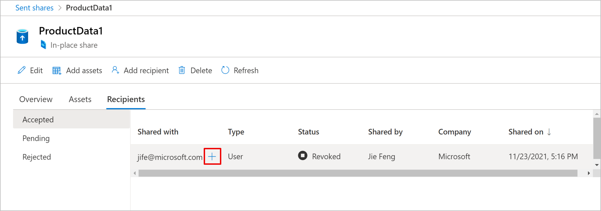
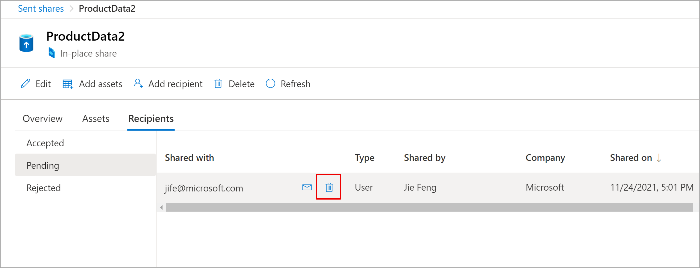

# Share Data with Microsoft Purview Data Sharing (preview)

Microsoft Purview Data Sharing supports in-place data sharing from Azure Data Lake Storage Gen2 (ADLS Gen2) to ADLS Gen2, and Blob storage account to Blob storage account. This article explains how to share data.

## Prerequisites to share data

### Purview prerequisites

* [A Purview account](create-catalog-portal.md). If you are getting an error related to *quota* when creating a Purview account, open a support ticket to increase the service limit. 
* **Data Share Contributor** roles to a Purview collection. If you created the Purview account, you are automatically assigned this role to the root collection. Refer to [Azure Purview permissions](catalog-permissions.md) to learn more about the Purview collection and roles.
* Your recipient's Azure sign-in email address which you can use to send the invitation to. The recipient's email alias won't work.

### Storage account prerequisites

* Your Azure subscription must be registered for the **AllowDataSharing** preview feature. Follow the below steps using Azure portal or PowerShell. 


    1. In Azure portal, select your Azure subscription which you will use to create the source and target storage account.
    1. From the left menu, select **Preview features** under *Settings*.
    1. Select **AllowDataSharing** and *Register*. 
    1. Refresh the *Preview features* screen to verify the *State* is **Registered**.

    ```azurepowershell-interactive
    Set-AzContext -SubscriptionId [Your Azure subscription ID]
    Register-AzProviderFeature -FeatureName "AllowDataSharing" -ProviderNamespace "Microsoft.Storage"​
    Get-AzProviderFeature -FeatureName "AllowDataSharing" -ProviderNamespace "Microsoft.Storage"   
    ```

    The *RegistrationState* should be **Registered**.

    For additional details, refer to [Register preview feature](../azure-resource-manager/management/preview-features.md?tabs=azure-portal#register-preview-feature).

* A source storage account created after the registration step is completed. 
* The following are supported storage account configurations:

    * Azure regions: Canada Central, Canada East, UK South, UK West, Australia East, Japan East, Korea South, and South Africa North 
    * Performance: Standard
    * Redundancy options: LRS, GRS, RA-GRS

* **Owner** or **Blob Storage Data Owner** role to the source storage account. You can find additional details on the [ADLS Gen2](register-scan-adls-gen2.md#data-share) or [Blob storage](register-scan-azure-blob-storage-source.md#data-share) data source page.
* If the source storage account is in a different Azure subscription than the one for Purview account, [register the Microsoft.Purview resource provider](../azure-resource-manager/management/resource-providers-and-types.md) in the Azure subscription where the Azure data store is located.

## Create a share

1. Within Microsoft Purview governance portal, select **Data share** icon from the left navigation, and then **Create a new share**.

   :::image type="content" source="./media/how-to-share-data/create-share.png" alt-text="Screenshot showing the data share overview.":::

1. Provide the details for your share. Specify a name, share type, description of share contents (optional), and collection. Then select **Continue**.

    Note: If you don't see a collection from the drop-down list, it means you don't have Data Share Contributor role access to any Purview collection to share data. Contact your Collection Admin to grant you access. 

    

1. To select data to share, select **Add Assets**. 

    

1. Select an asset type, and a data source that has already been registered with Purview. Select **Continue**. 

    Note: If you do not see a data source from the drop down list, click on the **Register a new source to share from** link below to register your data source. Azure resource needs to be registered with Purview before you can share data from that resource. Your data source needs to be registered in the same collection as the share. 

    

1. Browse your data source hierarchy and select (check) the objects you want to share. Then select **Add**. When sharing from storage account, only files and folders are currently supported. Sharing from container isn't currently supported. 

      

1. Review the assets selected. Optionally, edit **Name** and **Display name** which the recipient will see. Select **Continue**.

       

1. Select **Add Recipient**. Enter the Azure login email address of who you want to share data with. Select **Create and Share**. Optionally, you can specify an expiration date for when to terminate the share. You can share the same data with multiple recipients by clicking on **Add Recipient** multiple times. 

    Note in Microsoft Purview governance portal, you can only use user's Azure login email address as recipient. In Purview SDK or API, you can use object ID of the user or service principal as a recipient, and you can also optionally specify a target tenant ID (i.e. the Azure tenant recipient can receive the share into).

       

You've now created your share. The recipients of your share will receive an invitation and they can view the pending share in their Purview account. 

## Update a sent share
Once a share is created, you can update description, assets and recipients. 

### Update asset
You can edit or delete asset in a sent share. Each sent share can include maximum of one asset (e.g. one storage account asset).

To edit the asset (for example for a storage, to add or remove shared files and folders), first select the share, and then select **Assets** tab. Locate the asset you want to edit, and select the **Edit** action next to the asset name. You can now add or remove shared files and folders. Once you confirm your selection, it will take a few minutes for the change to take place. Once update is completed, recipients of your share will see the updated list of files and folders in their target storage account. 

 

To delete the asset, first select the share, and then select **Assets** tab. Locate the asset you want to delete, and select the **Delete** action next to the asset name. Delete an asset can take a few minutes.

 

### Update recipients
You can add more recipient, view status of your existing recipients, or revoke access.

To share the same data with more recipients, first select the share, and then select **Add recipient**.

 

To view status of existing recipients, first select the share, and then select **Recipients** tab. You can select **Accepted**, **Pending**, and **Rejected** to view status of these recipients. If you want to terminate,  access to a specific recipient, you can revoke access to a recipient in *accepted* state by locating the recipient and selecting **Revoke** action next to it. 

 

Once access is revoked, you can reinstate it by locating the recipient and selecting **Reinstate** action next to it. 

 

When a recipient is in *pending* state, you can resend the invitation email. You can also delete it by locating the recipient and selecting **Delete** next to it. 

 

## Delete a sent share
Deleting a sent share will delete the share and revoke access to all the existing recipients. Deleting a sent share can take a few minutes.

## Troubleshoot
Here are some common issues for sharing data and how to troubleshoot.

### Both Sent Shares and Received Shares are disabled
If both *sent shares* and *received shares* are disabled in the navigation, you don't have **Data Share Contributor** role to any collections in this Purview account. 

### Cannot select a collection when creating a share or register a data source
If you cannot select a collection when creating a share or register a data source, you do not have proper permission to the collection. You need to have **Data Share Contributor** role to a Purview collection in order to register data source and add asset to a share. 

### Issue add or update asset
If your storage account is not listed for you to select, it is likely due to the following reasons:
1. The storage account is not supported. Microsoft Purview Data sharing only [supports storage accounts with specific configurations](#storage-account-prerequisites).
1. You do not have **Data Share Contributor** role to the collection where the storage account is registered in. Data Share Contributor role is required to view the list of registered storage account in a collection and share data.

If you failed to add or update asset, it's likely due to the following reasons:
1. Permission issue to the data store where you want to share data from. Check [Prerequisite](#prerequisites-to-share-data) for required data store permissions.
1. The share and source data store don't belong to the same Purview collection. In order to share data from a data store, the share and source data store need to belong to the same Purview collection. 
1. You tried to share data from a *storage container*. Sharing from container isn't currently supported. You can select all files and folders within the container to share.
1. Exceeding limit. Source storage account can support up to 20 targets, and target storage account can support up to 100 sources. If you require an increase in limit, contact Support.

### Failed to reinstate a recipient
After successfully revoking access to a recipient, you'll need to wait for a minute before reinstating the recipient.

## Next steps
* [How to Receive Shared Data](how-to-receive-share.md)
* [FAQ for Data Share](how-to-data-share-faq.md)
* [REST API reference](/rest/api/purview/)
