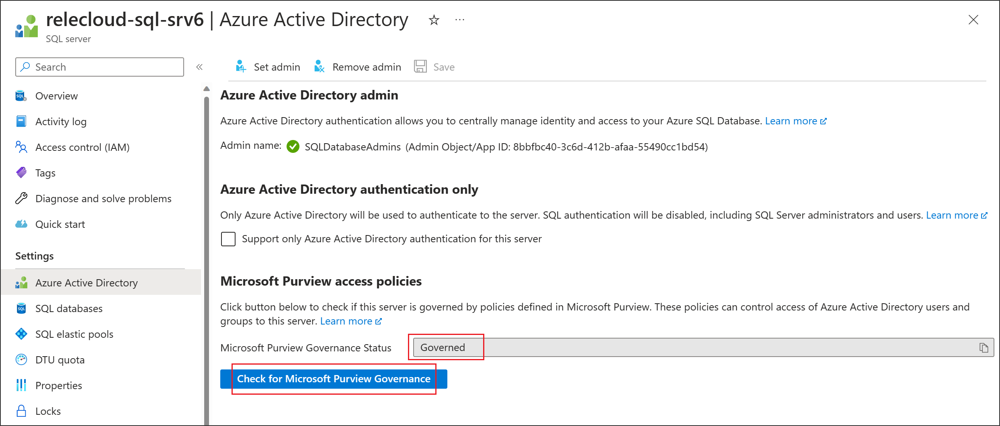

Return to the Azure portal for Azure SQL Database to verify it is now governed by Microsoft Purview
1. Sign in to the Azure portal through [this link](https://portal.azure.com/#view/HubsExtension/BrowseResource/resourceType/Microsoft.Sql%2Fservers)

1. Select the Azure SQL Server that you want to configure.

1. Go to **Azure Active Directory** on the left pane.

1. Scroll down to **Microsoft Purview access policies**.

1. Select the button to **Check for Microsoft Purview Governance**. Wait while the request is processed. It may take a few minutes.
   

1. Confirm that the Microsoft Purview Governance Status shows `Governed`. Note that **it may take a few minutes** after you enable *Data use management* in Microsoft Purview for the correct status to be reflected.

>[!NOTE]
> If you disable Data use management for this Azure SQL Database data source, it might take up to 24 hours for the Microsoft Purview Governance Status to be updated automatically to `Not Governed`. This can be accelerated by selecting **Check for Microsoft Purview Governance**. Before you enable *Data use management* for the data source in another Microsoft Purview account, ensure that the Purview Governance Status shows as `Not Governed`. Then repeat the steps above with the new Microsoft Purview account.
