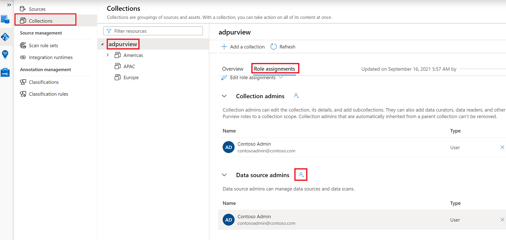

#### Register the data source in Microsoft Purview
Before a policy can be created in Microsoft Purview for a data resource, you must register that data resource in Microsoft Purview Studio. You will find the instructions related to registering the data resource later in this guide.
>[!NOTE]
> If a data source is moved to a new resource group or subscription it first needs to be de-registered and then re-registered for Microsoft Purview's policies to continue to work, as they rely on the data source's ARM path.

#### Configure permissions to enable Data use management on the data source

Once a resource is registered, but before a policy can be created in Microsoft Purview for that resource, you must configure permissions. A set of permissions are needed to enable the **Data use management**. This applies to data sources, resource groups, or subscriptions. To enable *Data use management*, the **same user** must have **both** specific identity and access management (IAM) privileges on the resource and specific Microsoft Purview privileges: 

- The user must have *either one* of the following IAM role combinations on the resource's Azure Resource Manager path or any parent of it (that is, using IAM permission inheritance):
   - IAM Owner
   - Both IAM Contributor and IAM User Access Administrator

   To configure Azure role-based access control (RBAC) permissions, follow [this guide](../../role-based-access-control/check-access.md). The following screenshot shows how to access the **Access Control** section in the Azure portal for the data resource to add a role assignment.

   

- The same user needs to have the Microsoft Purview *Data source admin* role for the collection or a parent collection (if inheritance is enabled). For more information, see the [guide on managing Microsoft Purview role assignments](../catalog-permissions.md#assign-permissions-to-your-users). 

  The following screenshot shows how to assign the *Data source admin* role at the root collection level.

  

#### Configure Microsoft Purview permissions to create, update, or delete access policies

The following permissions are needed in Microsoft Purview at the *root collection level*:

- The *Policy author* role can create, update, and delete DevOps and Data Owner policies.
- The *Policy author* role can delete self-service access policies.

For more information about managing Microsoft Purview role assignments, see [Create and manage collections in the Microsoft Purview Data Map](../how-to-create-and-manage-collections.md#add-roles-and-restrict-access-through-collections).

>[!NOTE]
> Currently, Microsoft Purview roles related to creating, updating, and deleting policies must be configured at the root collection level.

In addition, to easily search Azure AD users or groups when creating or updating the subject of a policy, the Policy Author may greatly benefit from having the [Directory Readers](../../active-directory/roles/permissions-reference.md#directory-readers) permission in Azure AD. This is a common permission for users in an Azure tenant. Without the Directory Reader permission, the Policy Author will have to type the complete username or email for all the principals included in the subject.

#### Configure Microsoft Purview permissions for publishing Data Owner policies

Data Owner policies allow for checks and balances if you assign the Microsoft Purview *Policy author* and *Data source admin* roles to different people in the organization. Before a data policy takes effect, a second person (*Data source admin*) must review it and explicitly approve it by publishing it. Publishing is automatic after DevOps or self-service access policies are created or updated, so it doesn't apply to these types of policies.

The following permissions are needed in Microsoft Purview at the *root collection level*:

- The *Data source admin* role can publish a policy.

For more information about managing Microsoft Purview role assignments, see [Create and manage collections in the Microsoft Purview Data Map](../how-to-create-and-manage-collections.md#add-roles-and-restrict-access-through-collections).

>[!NOTE]
> Currently, Microsoft Purview roles related to publishing Data Owner policies must be configured at the root collection level.

#### Delegate access provisioning responsibility to roles in Microsoft Purview

After a resource has been enabled for **Data use management**, any Microsoft Purview user with the *Policy author* role at the root collection level can provision access to that data source from Microsoft Purview.

The *IAM Owner* role for a data resource can be inherited from a parent resource group, a subscription, or a subscription management group. Check which Azure AD users, groups, and service principals hold or are inheriting the *IAM Owner* role for the resource.

> [!NOTE]
> Any Microsoft Purview root *Collection admin* can assign new users to root *Policy author* roles. Any *Collection admin* can assign new users to a *Data source admin* role under the collection. Minimize and carefully vet the users who hold Microsoft Purview *Collection admin*, *Data source admin*, or *Policy author* roles.

If a Microsoft Purview account with published policies is deleted, such policies will stop being enforced within an amount of time that depends on the specific data source. This change can have implications on both security and data access availability. The Contributor and Owner roles in IAM can delete Microsoft Purview accounts. 

You can check these permissions by going to the **Access control (IAM)** section for your Microsoft Purview account and selecting **Role Assignments**. You can also use a lock to prevent the Microsoft Purview account from being deleted through [Resource Manager locks](../../azure-resource-manager/management/lock-resources.md).
