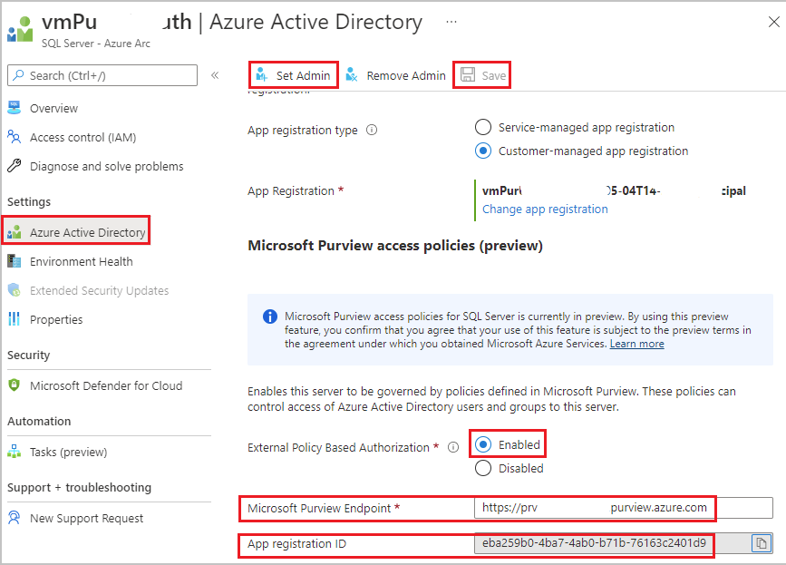

- Get SQL server version 2022 RC 1 or later running on Windows and install it. [Follow this link](https://www.microsoft.com/sql-server/sql-server-2022).
- Complete process to onboard that [SQL server with Azure Arc](/sql/sql-server/azure-arc/connect).
- Enable [Azure AD Authentication in SQL server](/sql/relational-databases/security/authentication-access/azure-ad-authentication-sql-server-setup-tutorial). For a simpler setup [follow this article](/sql/relational-databases/security/authentication-access/azure-ad-authentication-sql-server-automation-setup-tutorial#setting-up-azure-ad-admin-using-the-azure-portal).

**Enforcement of policies for this data source is available only in the following regions for Microsoft Purview**
- East US
- East US 2
- South Central US
- West US3
- Canada Central
- Brazil South
- North Europe
- West Europe
- France Central
- UK South
- UAE North
- Central India
- Korea Central
- Japan East
- Australia East

### Security considerations
- The Server admin can turn off the Microsoft Purview policy enforcement.
- Arc Admin/Server admin permissions empower the Arc admin or Server admin with the ability to change the ARM path of the given server. Given that mappings in Microsoft Purview use ARM paths, this can lead to wrong policy enforcements. 
- SQL Admin (DBA) can gain the power of Server admin and can tamper with the cached policies from Microsoft Purview.
- The recommended configuration is to create a separate App Registration per SQL server instance. This prevents SQL server2 from reading the policies meant for SQL server1, in case a rogue admin in SQL server2 tampers with the ARM path.

### SQL Server on Azure Arc-enabled server configuration
This section describes the steps to configure the SQL Server on Azure Arc to use Microsoft Purview.

1. Sign in to Azure portal through this [link](https://portal.azure.com/#view/Microsoft_Azure_HybridCompute/AzureArcCenterBlade/~/sqlServers) which lists SQL Servers on Azure Arc.

1. Select the SQL Server you want to configure

1. Navigate to **Azure Active Directory** feature on the left pane

1. Verify that Azure Active Directory Authentication is configured. This means that all these have been entered: an admin login, a SQL Server service certificate, and a SQL Server app registration.

1. Scroll down to set **External Policy Based Authorization** to enabled

1. Enter **Microsoft Purview Endpoint** in the format *https://\<purview-account-name\>.purview.azure.com*. You can see the names of Microsoft Purview accounts in your tenant through [this link](https://portal.azure.com/#blade/HubsExtension/BrowseResource/resourceType/Microsoft.Purview%2FAccounts). Optionally, you can confirm the endpoint by navigating to the Microsoft Purview account, then  to the Properties section on the left menu and scrolling down until you see "Scan endpoint". The full endpoint path will be the one listed without the "/Scan" at the end.

1. Make a note of the **App registration ID**, as you will need it when you register and enable this data source for *Data Use Management* in Microsoft Purview.
   
1. Select the **Save** button to save the configuration.
