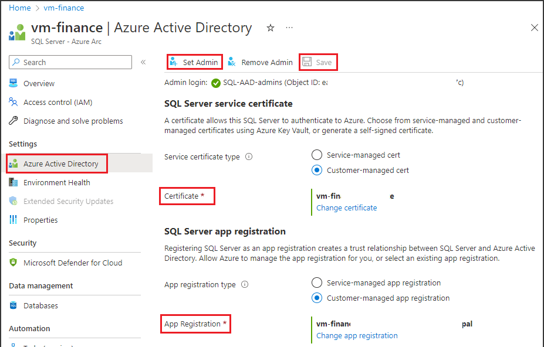

- Get [SQL Server on-premises version 2022](https://www.microsoft.com/en-us/sql-server/sql-server-downloads) running on Windows and install it. You can try the free Developer edition.
- [Register a list of resource providers](/azure/azure-arc/servers/prerequisites#azure-resource-providers) in the subscription you will use to onboard the SQL Server instance to Azure Arc
- Configure your permissions and then onboard the [SQL Server instance with Azure Arc](/sql/sql-server/azure-arc/connect-with-installer).
- Enable [Azure Active Directory authentication in SQL Server](/sql/relational-databases/security/authentication-access/azure-ad-authentication-sql-server-setup-tutorial). For a simpler setup, follow [this article](/sql/relational-databases/security/authentication-access/azure-ad-authentication-sql-server-automation-setup-tutorial#setting-up-azure-ad-admin-using-the-azure-portal).

#### Region support

Policy enforcement is available in all Microsoft Purview regions except:
- West US2
- East Asia
- US Gov Virginia
- China North 3

#### Security considerations for Azure Arc-enabled SQL Server

- The server admin can turn off the Microsoft Purview policy enforcement.
- Azure Arc admin and server admin permissions provide the ability to change the Azure Resource Manager path of the server. Because mappings in Microsoft Purview use Resource Manager paths, this can lead to wrong policy enforcements. 
- A SQL Server admin (database admin) can gain the power of a server admin and can tamper with the cached policies from Microsoft Purview.
- The recommended configuration is to create a separate app registration for each SQL server instance. This configuration prevents the second SQL Server instance from reading the policies meant for the first SQL Server instance, in case a rogue admin in the second SQL Server instance tampers with the Resource Manager path.

#### Verify the pre-requisites

1. Sign in to the Azure portal through [this link](https://portal.azure.com/#view/Microsoft_Azure_HybridCompute/AzureArcCenterBlade/~/overview)

1. Navigate to **SQL servers** on the left pane. You will see a list of SQL Server instances on Azure Arc.

1. Select the SQL Server instance that you want to configure.

1. Go to **Azure Active Directory** on the left pane.

1. Ensure that Azure Active Directory authentication is configured with an admin login. If not, refer to the access policy prerequisites section in this guide.

1. Ensure that a certificate has been provided to for SQL Server to authenticate to Azure. If not, refer to the access policy prerequisites section in this guide.

1. Ensure that an app registration has been entered to create a trust relationship between SQL Server and Azure AD. If not, refer to the access policy prerequisites section in this guide.

1. If you made any changes, select the **Save** button to save the configuration and wait until the operation completes successfully. This may take a few minutes. The message *"Saved successfully"* will be displayed at the top of the page in green background. You may need to scroll up to see it.

   
