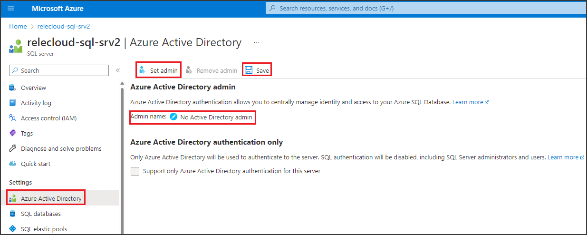
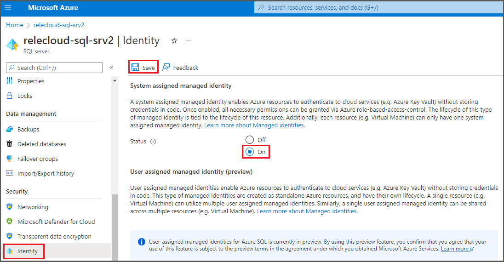

- Create a new Azure SQL DB or use an existing one in one of the currently available regions for this preview feature. You can [follow this guide to create a new Azure SQL DB](/azure/azure-sql/database/single-database-create-quickstart).

**Enforcement of Microsoft Purview policies is available only in the following regions for Azure SQL Database**
-	Australia East
-	Canada Central
-	West US3
-	West Central US
-	Central India

### Azure SQL Database configuration
Azure SQL Database needs an Azure Active Directory Admin to be configured to honor policies from Microsoft Purview. In Azure portal navigate to the Azure SQL Server that hosts the Azure SQL DB and then navigate to Azure Active Directory on the side menu. Set an Admin name and then select **Save**. See screenshot:


Then navigate to Identity on the side menu. Under System assigned managed identity check status to *On* and then select **Save**. See screenshot:


You'll also need to enable (and verify) external policy based authorization on the Azure SQL server. You can do this in PowerShell:

```powershell
Connect-AzAccount -TenantId xxxx-xxxx-xxxx-xxxx-xxxx -SubscriptionId xxxx-xxxx-xxxx-xxxx

$server = Get-AzSqlServer -ResourceGroupName "RESOURCEGROUPNAME" -ServerName "SERVERNAME"

#Initiate the call to the REST API to set externalPolicyBasedAuthorization to true
Invoke-AzRestMethod -Method PUT -Path "$($server.ResourceId)/externalPolicyBasedAuthorizations/MicrosoftPurview?api-version=2021-11-01-preview" -Payload '{"properties":{"externalPolicyBasedAuthorization":true}}'

# Now, verify that the property "externalPolicyBasedAuthorization" has been set to true
Invoke-AzRestMethod -Method GET -Path "$($server.ResourceId)/externalPolicyBasedAuthorizations/MicrosoftPurview?api-version=2021-11-01-preview"
```
After issuing the GET, you should see in the response, under Content, "properties":{"externalPolicyBasedAuthorization":true}
