# Azure Purview connector for Amazon S3

This how-to guide provides an explanation of how to use Azure Purview to scan your unstructured data currently stored in Amazon S3 standard buckets and discover what types of sensitive information exists in your data. This how-to guide also describes how to identify the Amazon S3 Buckets where the data is currently stored for easy information protection and data compliance.

For this service, use Purview to provide a Microsoft account with secure access to AWS, where the Purview scanner will run. The Purview scanner uses this access to your Amazon S3 buckets to read your data, and then reports the scanning results, including only the metadata and classification, back to Azure. Use the Purview classification and labeling reports to analyze and review your data scan results.

In this how-to guide, you'll learn about how to add Amazon S3 buckets as Purview resources and create a scan for your Amazon S3 data.

## Purview scope for Amazon S3

The following scope is specific for the registering and scanning Amazon S3 buckets as Purview data sources.

|Scope  |Description  |
|---------|---------|
|**Data limits**     |    The Purview scanner service currently supports scanning Amazon S3 buckets for up to 100 GB of data per tenant.     |
|**File types**     | The Purview scanner service currently supports the following file types: <br><br>.avro, .csv, .doc, .docm, .docx, .dot, .json, .odp, .ods, .odt, .orc, .parquet, .pdf, .pot, .pps, .ppsx, .ppt, .pptm, .pptx, .psv, .ssv, .tsv, .txt, .xlc, .xls, .xlsb, .xlsm, .xlsx, .xlt, .xml        |
|**Regions**     | The Purview connector for the Amazon S3 service is currently deployed only in the **AWS US East (Ohio)** and **Europe (Frankfurt)** regions. <br><br>For more information, see [Storage and scanning regions](#storage-and-scanning-regions).   |
|     |         |

For more information, see the documented Purview limits at:

- [Manage and increase quotas for resources with Azure Purview](how-to-manage-quotas.md)
- [Supported data sources and file types in Azure Purview](sources-and-scans.md)
- [Use private endpoints for your Purview account](catalog-private-link.md)
### Storage and scanning regions

The following table maps the regions where you data is stored to the region where it would be scanned by Azure Purview.

> [!IMPORTANT]
> Customers will be charged for all related data transfer charges according to the region of their bucket.
>

| Storage region | Scanning region |
| ------------------------------- | ------------------------------------- |
| US East (Ohio)                  | US East (Ohio)                        |
| US East (N. Virginia)           | US East (N. Virginia)                       |
| US West (N. California)         | US East (Ohio)                        |
| US West (Oregon)                | US East (Ohio)                        |
| Africa (Cape Town)              | Europe (Frankfurt)                    |
| Asia Pacific (Hong Kong)        | Asia Pacific (Sydney)                   |
| Asia Pacific (Mumbai)           | Asia Pacific (Sydney)                   |
| Asia Pacific (Osaka-Local)      | Asia Pacific (Sydney)                   |
| Asia Pacific (Seoul)            | Asia Pacific (Sydney)                   |
| Asia Pacific (Singapore)        | Asia Pacific (Sydney)                   |
| Asia Pacific (Sydney)           | Asia Pacific (Sydney)                  |
| Asia Pacific (Tokyo)            | Asia Pacific (Sydney)                 |
| Canada (Central)                | US East (Ohio)                        |
| China (Beijing)                 | Not supported                    |
| China (Ningxia)                 | Not supported                   |
| Europe (Frankfurt)              | Europe (Frankfurt)                    |
| Europe (Ireland)                | Europe (Ireland)                   |
| Europe (London)                 | Europe (Ireland)                   |
| Europe (Milan)                  | Europe (Frankfurt)                    |
| Europe (Paris)                  | Europe (Frankfurt)                    |
| Europe (Stockholm)              | Europe (Frankfurt)                    |
| Middle East (Bahrain)           | Europe (Frankfurt)                    |
| South America (São Paulo)       | US East (Ohio)                        |
| | |

## Prerequisites

Ensure that you've performed the following prerequisites before adding your Amazon S3 buckets as Purview data sources and scanning your S3 data.

> [!div class="checklist"]
> * You need to be an Azure Purview Data Source Admin.
> * [Create a Purview account](#create-a-purview-account) if you don't yet have one
> * [Create a Purview credential for your AWS bucket scan](#create-a-purview-credential-for-your-aws-bucket-scan)
> * [Create a new AWS role for use with Purview](#create-a-new-aws-role-for-purview)
> * [Configure scanning for encrypted Amazon S3 buckets](#configure-scanning-for-encrypted-amazon-s3-buckets), if relevant
> * When adding your buckets as Purview resources, you'll need the values of your [AWS ARN](#retrieve-your-new-role-arn), [bucket name](#retrieve-your-amazon-s3-bucket-name), and sometimes your [AWS account ID](#locate-your-aws-account-id).

### Create a Purview account

- **If you already have a Purview account,** you can continue with the configurations required for AWS S3 support. Start with [Create a Purview credential for your AWS bucket scan](#create-a-purview-credential-for-your-aws-bucket-scan).

- **If you need to create a Purview account,** follow the instructions in [Create an Azure Purview account instance](create-catalog-portal.md). After creating your account, return here to complete configuration and begin using Purview connector for Amazon S3.

### Create a Purview credential for your AWS bucket scan

This procedure describes how to create a new Purview credential to use when scanning your AWS buckets.

> [!TIP]
> You can also create a new credential in the middle of the process, while [configuring your scan](#create-a-scan-for-one-or-more-amazon-s3-buckets). In that case, in the **Credential** field, select **New**.
>

1. In Purview, navigate to the **Management Center**, and under **Security and access**, select **Credentials**.

1. Select **New**, and in the **New credential** pane that appears on the right, use the following fields to create your Purview credential:

    |Field |Description  |
    |---------|---------|
    |**Name**     |Enter a meaningful name for this credential, or use the default.        |
    |**Description**     |Enter a optional description for this credential, such as `Used to scan the tutorial S3 buckets`         |
    |**Authentication method**     |Select **Role ARN**, since you're using a role ARN to access your bucket.         |
    |**Microsoft account ID**     |Click to copy this value to the clipboard. Use this value as the **Microsoft account ID** when [creating your Role ARN in AWS](#create-a-new-aws-role-for-purview).           |
    |**External ID**     |Click to copy this value to the clipboard. Use this value as the **External ID** when [creating your Role ARN in AWS.](#create-a-new-aws-role-for-purview)        |
    |**Role ARN**     | Once you've [created your Amazon IAM role](#create-a-new-aws-role-for-purview), navigate to your role in the IAM area, copy the **Role ARN** value, and enter it here. For example: `arn:aws:iam::284759281674:role/S3Role`. <br><br>For more information, see [Retrieve your new Role ARN](#retrieve-your-new-role-arn). |
    | | |

    Select **Create** when you're done to finish creating the credential.

1. If you haven't yet, copy and paste the **Microsoft account ID** and **External ID** values for use when [creating a new AWS role for Purview](#create-a-new-aws-role-for-purview), which is your next step.

For more information about Purview credentials, see [Credentials for source authentication in Azure Purview](manage-credentials.md).

### Create a new AWS role for Purview

This procedure requires that you enter the values for your Azure Account ID and External ID when creating your AWS role.

If you don't have these values, locate them first in your [Purview credential](#create-a-purview-credential-for-your-aws-bucket-scan).

**To locate your Microsoft Account ID and External ID**:

1. In Purview, navigate to the **Management Center** > **Security and access** > **Credentials**.

1. Select the credential that you [created for your AWS bucket scan](#create-a-purview-credential-for-your-aws-bucket-scan), and then in the toolbar, select **Edit**.

1. In the **Edit credential** pane that appears on the right, copy the **Microsoft account ID** and **External ID** values to a separate file, or have them handy for pasting into the relevant field in AWS.

    For example:

    [ 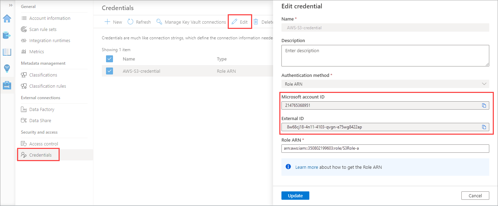 ](./media/register-scan-amazon-s3/locate-account-id-external-id.png#lightbox)


**To create your AWS role for Purview**:

1.	Open your **Amazon Web Services** console, and under **Security, Identity, and Compliance**, select **IAM**.

1. Select **Roles** and then **Create role**.

1. Select **Another AWS account**, and then enter the following values:

    |Field  |Description  |
    |---------|---------|
    |**Account ID**     |    Enter your Microsoft Account ID. For example: `615019938638`     |
    |**External ID**     |   Under options, select **Require external ID...**, and then enter your External ID in the designated field. <br>For example: `e7e2b8a3-0a9f-414f-a065-afaf4ac6d994`     |
    | | |

    For example:

    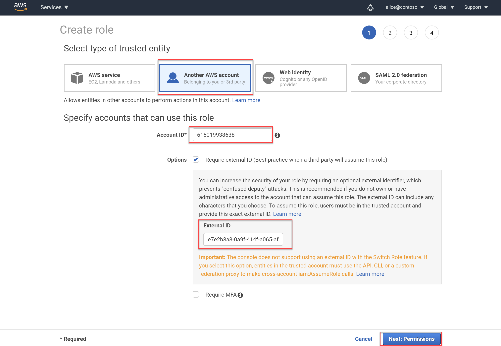

1. In the **Create role > Attach permissions policies** area, filter the permissions displayed to **S3**. Select **AmazonS3ReadOnlyAccess**, and then select **Next: Tags**.

    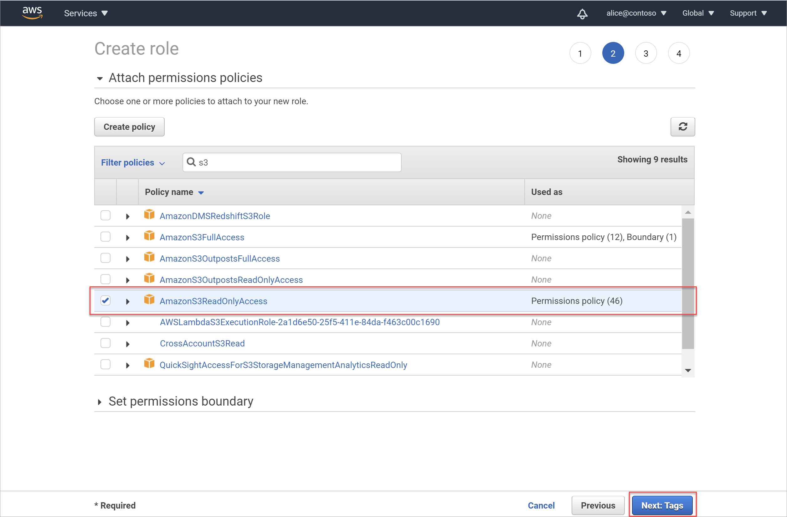

    > [!IMPORTANT]
    > The **AmazonS3ReadOnlyAccess** policy provides minimum permissions required for scanning your S3 buckets, and may include other permissions as well.
    >
    >To apply only the minimum permissions required for scanning your buckets, create a new policy with the permissions listed in [Minimum permissions for your AWS policy](#minimum-permissions-for-your-aws-policy), depending on whether you want to scan a single bucket or all the buckets in your account. 
    >
    >Apply your new policy to the role instead of **AmazonS3ReadOnlyAccess.**

1. In the **Add tags (optional)** area, you can optionally choose to create a meaningful tag for this new role. Useful tags enable you to organize, track, and control access for each role you create.

    Enter a new key and value for your tag as needed. When you're done, or if you want to skip this step, select **Next: Review** to review the role details and complete the role creation.

    

1. In the **Review** area, do the following:

    - In the **Role name** field, enter a meaningful name for your role
    - In the **Role description** box, enter an optional description to identify the role's purpose
    - In the **Policies** section, confirm that the correct policy (**AmazonS3ReadOnlyAccess**) is attached to the role.

    Then select **Create role** to complete the process.

    For example:

    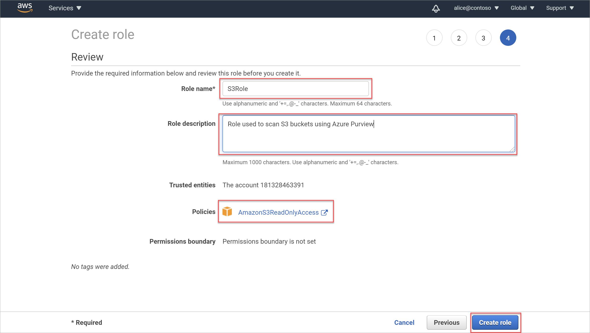


### Configure scanning for encrypted Amazon S3 buckets

AWS buckets support multiple encryption types. For buckets that use **AWS-KMS** encryption, special configuration is required to enable scanning.

> [!NOTE]
> For buckets that use no encryption, AES-256 or AWS-KMS S3 encryption, skip this section and continue to [Retrieve your Amazon S3 bucket name](#retrieve-your-amazon-s3-bucket-name).
>

**To check the type of encryption used in your Amazon S3 buckets:**

1. In AWS, navigate to **Storage** > **S3** > and select **Buckets** from the menu on the left.

    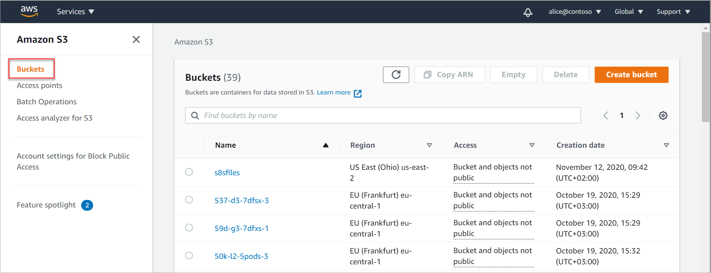

1. Select the bucket you want to check. On the bucket's details page, select the **Properties** tab and scroll down to the **Default encryption** area.

    - If the bucket you selected is configured for anything but **AWS-KMS** encryption, including if default encryption for your bucket is **Disabled**, skip the rest of this procedure and continue with [Retrieve your Amazon S3 bucket name](#retrieve-your-amazon-s3-bucket-name).

    - If the bucket you selected is configured for **AWS-KMS** encryption, continue as described below to add a new policy that allows for scanning a bucket with custom **AWS-KMS** encryption.

    For example:

    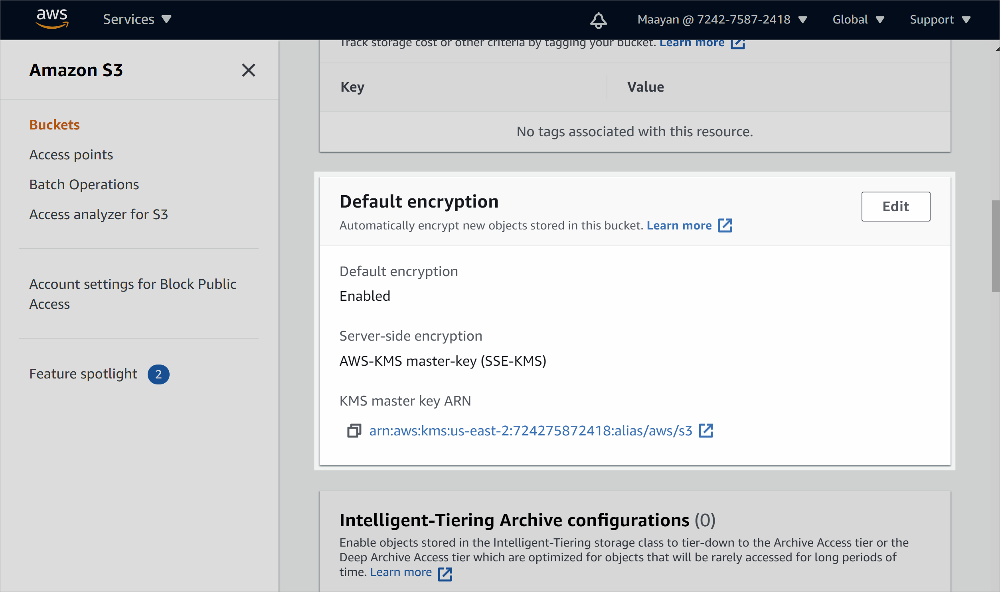

**To add a new policy to allow for scanning a bucket with custom AWS-KMS encryption:**

1. In AWS, navigate to **Services** >  **IAM** >  **Policies**, and select **Create policy**.

1. On the **Create policy** > **Visual editor** tab, define your policy with the following values:

    |Field  |Description  |
    |---------|---------|
    |**Service**     |  Enter and select **KMS**.       |
    |**Actions**     | Under **Access level**, select **Write** to expand the **Write** section.<br>Once expanded, select only the **Decrypt** option.        |
    |**Resources**     |Select a specific resource or **All resources**.         |
    | | |

    When you're done, select **Review policy** to continue.

    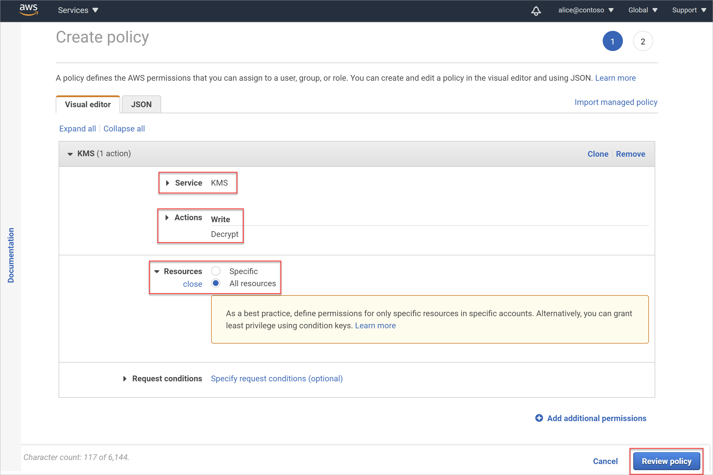

1. On the **Review policy** page, enter a meaningful name for your policy and an optional description, and then select **Create policy**.

    The newly created policy is added to your list of policies.

1. Attach your new policy to the role you added for scanning.

    1. Navigate back to the **IAM** > **Roles** page, and select the role you added [earlier](#create-a-new-aws-role-for-purview).

    1. On the **Permissions** tab, select **Attach policies**.

        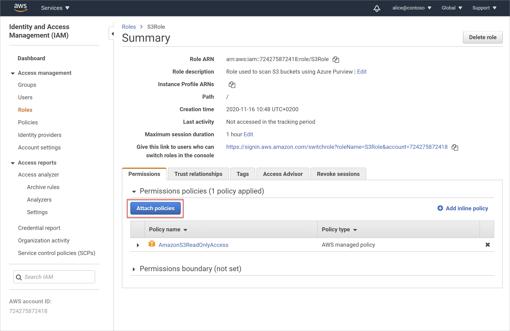

    1. On the **Attach Permissions** page, search for and select the new policy you created above. Select **Attach policy** to attach your policy to the role.

        The **Summary** page is updated, with your new policy attached to your role.

        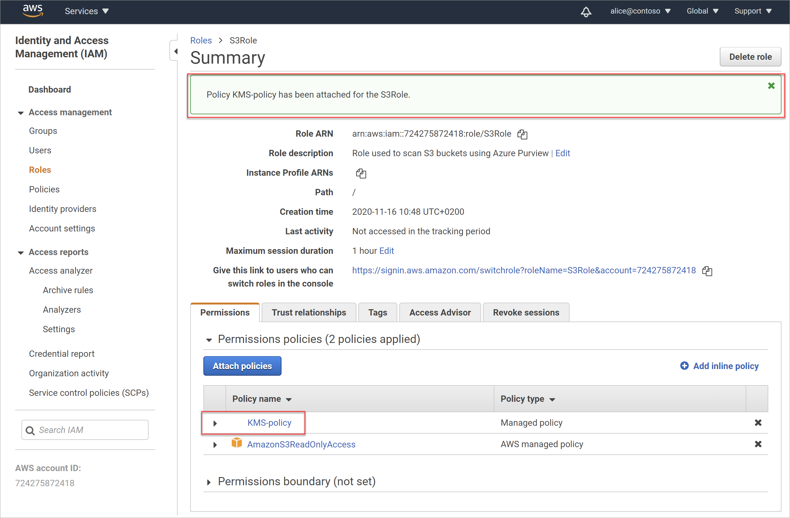

### Retrieve your new Role ARN

You'll need to record your AWS Role ARN and copy it in to Purview when [creating a scan for your Amazon S3 bucket](#create-a-scan-for-one-or-more-amazon-s3-buckets).

**To retrieve your role ARN:**

1. In the AWS **Identity and Access Management (IAM)** > **Roles** area, search for and select the new role you [created for Purview](#create-a-purview-credential-for-your-aws-bucket-scan).

1. On the role's **Summary** page, select the **Copy to clipboard** button to the right of the **Role ARN** value.

    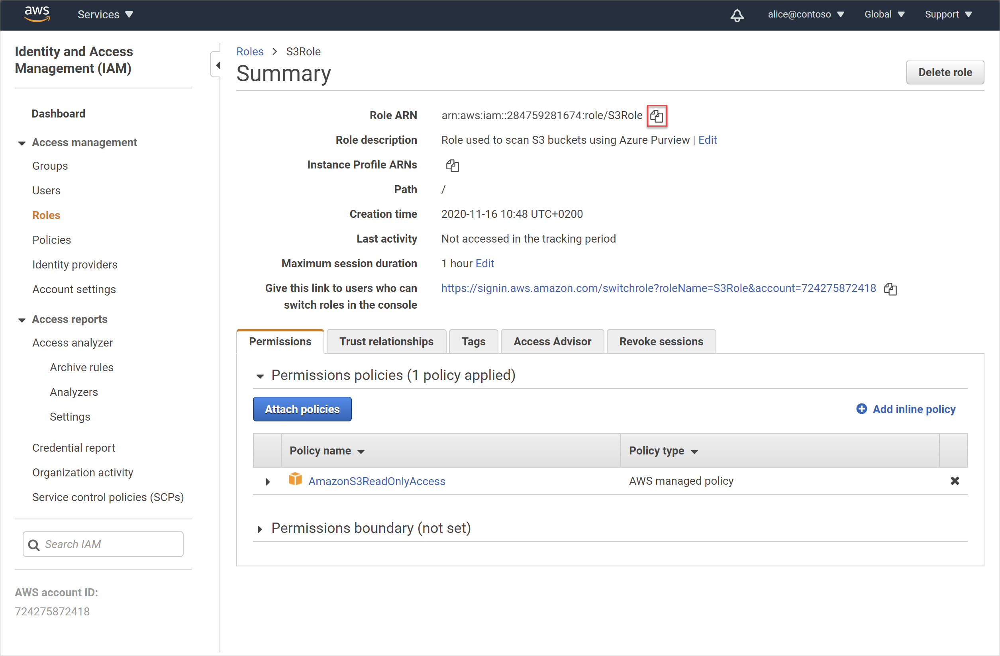

1. Paste this value in a secure location, ready to use when [creating a scan for your Amazon S3 bucket](#create-a-scan-for-one-or-more-amazon-s3-buckets).

### Retrieve your Amazon S3 bucket name

You'll need the name of your Amazon S3 bucket to copy it in to Purview when [creating a scan for your Amazon S3 bucket](#create-a-scan-for-one-or-more-amazon-s3-buckets)

**To retrieve your bucket name:**

1. In AWS, navigate to **Storage** > **S3** > and select **Buckets** from the menu on the left.

    

1. Search for and select your bucket to view the bucket details page, and then copy the bucket name to the clipboard.

    For example:

    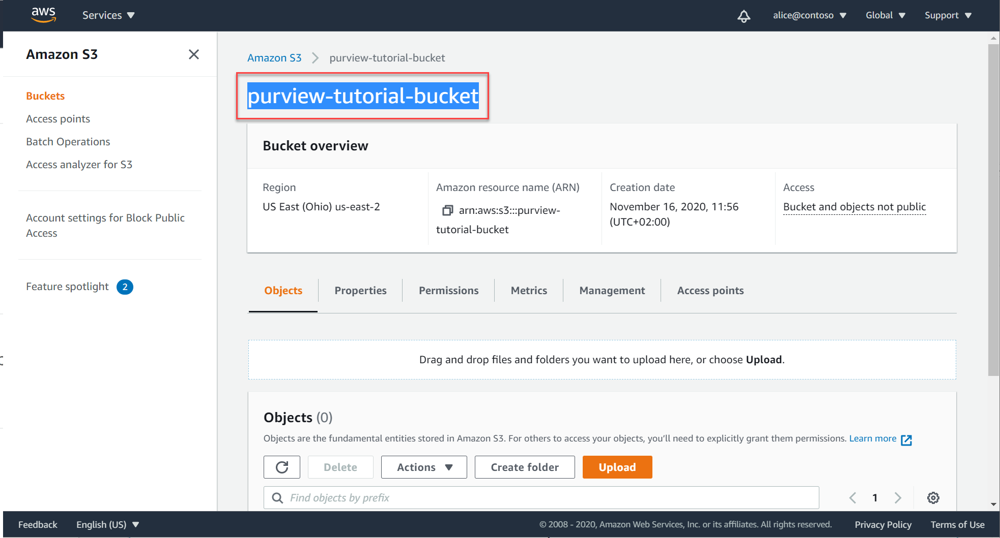

    Paste your bucket name in a secure file, and add an `s3://` prefix to it to create the value you'll need to enter when configuring your bucket as a Purview resource.

    For example: `s3://purview-tutorial-bucket`

> [!NOTE]
> Only the root level of your bucket is supported as a Purview data source. For example, the following URL, which includes a sub-folder is *not* supported: `s3://purview-tutorial-bucket/view-data`
>

### Locate your AWS account ID

You'll need your AWS account ID to register your AWS account as a Purview data source, together with all of its buckets.

Your AWS account ID is the ID you use to log in to the AWS console. You can also find it once you're logged in on the IAM dashboard, on the left under the navigation options, and at the top, as the numerical part of your sign-in URL:

For example:

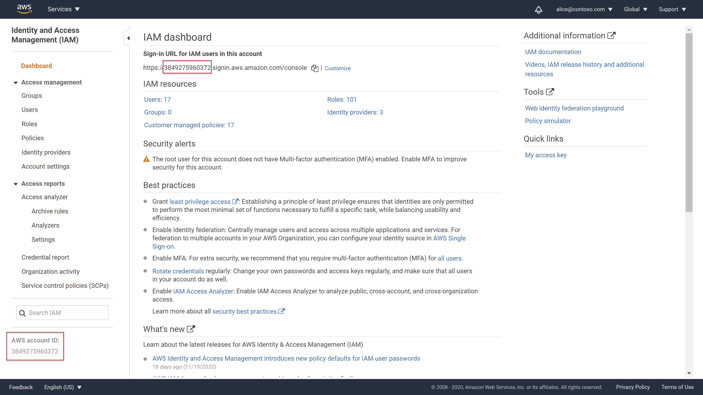


## Add a single Amazon S3 bucket as a Purview resource

Use this procedure if you only have a single S3 bucket that you want to register to Purview as a data source, or if you have multiple buckets in your AWS account, but do not want to register all of them to Purview.

**To add your bucket**: 

1. Launch the Purview portal using the dedicated Purview connector for Amazon S3 URL. This URL was provided to you by the Amazon S3 Purview connector product management team.

    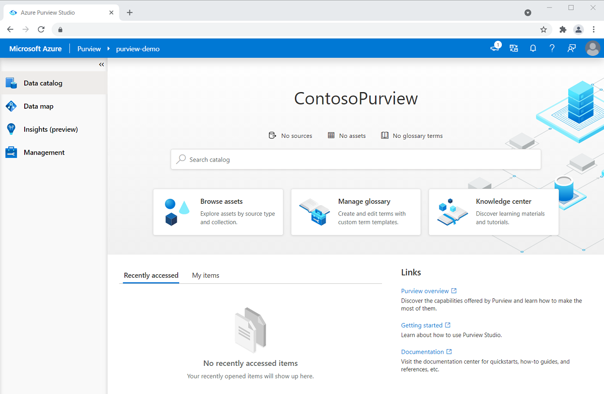

1. Navigate to the Azure Purview **Sources** page, and select **Register**  > **Amazon S3** > **Continue**.

    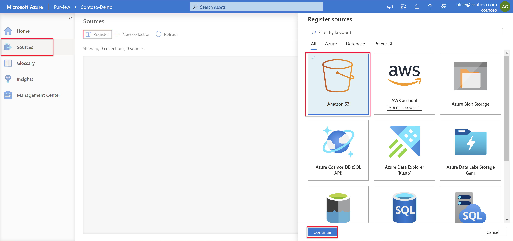

    > [!TIP]
    > If you have multiple [collections](manage-data-sources.md#manage-collections) and want to add your Amazon S3 to a specific collection, select the **Map view** at the top right, and then select the **Register**  button inside your collection.
    >

1. In the **Register sources (Amazon S3)** pane that opens, enter the following details:

    |Field  |Description  |
    |---------|---------|
    |**Name**     |Enter a meaningful name, or use the default provided.         |
    |**Bucket URL**     | Enter your AWS bucket URL, using the following syntax:   `s3://<bucketName>`     <br><br>**Note**: Make sure to use only the root level of your bucket, without any sub-folders. For more information, see [Retrieve your Amazon S3 bucket name](#retrieve-your-amazon-s3-bucket-name). |
    |**Select a collection** |If you selected to register a data source from within a collection, that collection already listed. <br><br>Select a different collection as needed, **None** to assign no collection, or **New** to create a new collection now. <br><br>For more information about Purview collections, see [Manage data sources in Azure Purview](manage-data-sources.md#manage-collections).|
    | | |

    When you're done, select **Finish** to complete the registration.

Continue with [Create a scan for one or more Amazon S3 buckets.](#create-a-scan-for-one-or-more-amazon-s3-buckets).

## Add an Amazon account as a Purview resource

Use this procedure if you have multiple S3 buckets in your Amazon account, and you want to register all of them  as Purview data sources.

When [configuring your scan](#create-a-scan-for-one-or-more-amazon-s3-buckets), you'll be able to select the specific buckets you want to scan, if you don't want to scan all of them together.

**To add your Amazon account**:
1. Launch the Purview portal using the dedicated Purview connector for Amazon S3 URL. This URL was provided to you by the Amazon S3 Purview connector product management team.

    

1. Navigate to the Azure Purview **Sources** page, and select **Register**  > **Amazon accounts** > **Continue**.

    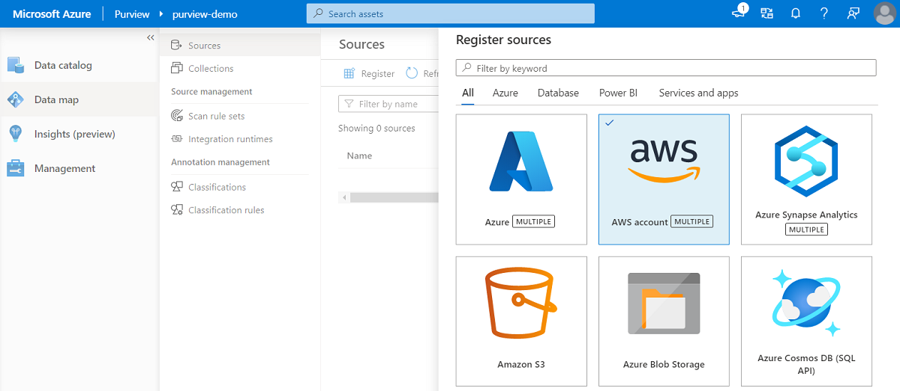

    > [!TIP]
    > If you have multiple [collections](manage-data-sources.md#manage-collections) and want to add your Amazon S3 to a specific collection, select the **Map view** at the top right, and then select the **Register**  button inside your collection.
    >

1. In the **Register sources (Amazon S3)** pane that opens, enter the following details:

    |Field  |Description  |
    |---------|---------|
    |**Name**     |Enter a meaningful name, or use the default provided.         |
    |**AWS account ID**     | Enter your AWS account ID. For more information, see [Locate your AWS account ID](#locate-your-aws-account-id)|
    |**Select a collection** |If you selected to register a data source from within a collection, that collection already listed. <br><br>Select a different collection as needed, **None** to assign no collection, or **New** to create a new collection now. <br><br>For more information about Purview collections, see [Manage data sources in Azure Purview](manage-data-sources.md#manage-collections).|
    | | |

    When you're done, select **Finish** to complete the registration.

Continue with [Create a scan for one or more Amazon S3 buckets](#create-a-scan-for-one-or-more-amazon-s3-buckets).

## Create a scan for one or more Amazon S3 buckets

Once you've added your buckets as Purview data sources, you can configure a scan to run at scheduled intervals or immediately.

1. Navigate to the Azure Purview **Sources** area, and then do one of the following:

    - In the **Map view**, select **New scan**  in your data source box.
    - In the **List view**, hover over the row for your data source, and select **New scan** .

1. On the **Scan...** pane that opens on the right, define the following fields and then select **Continue**:

    |Field  |Description  |
    |---------|---------|
    |**Name**     |  Enter a meaningful name for your scan or use the default.       |
    |**Type** |Displayed only if you've added your AWS account, with all buckets included. <br><br>Current options include only **All** > **Amazon S3**. Stay tuned for more options to select as Purview's support matrix expands. |
    |**Credential**     |  Select a Purview credential with your role ARN. <br><br>**Tip**: If you want to create a new credential at this time, select **New**. For more information, see [Create a Purview credential for your AWS bucket scan](#create-a-purview-credential-for-your-aws-bucket-scan).     |
    | **Amazon S3**    |   Displayed only if you've added your AWS account, with all buckets included. <br><br>Select one or more buckets to scan, or **Select all** to scan all the buckets in your account.      |
    | | |

    Purview automatically checks that the role ARN is valid, and that the buckets and objects within the buckets are accessible, and then continues if the connection succeeds.

    > [!TIP]
    > To enter different values and test the connection yourself before continuing, select **Test connection** at the bottom right before selecting **Continue**.
    >

1. On the **Select a scan rule set** pane, either select the **AmazonS3** default rule set, or select **New scan rule set** to  create a new custom rule set. Once you have your rule set selected, select **Continue**.

    If you select to create a new custom scan rule set, use the wizard to define the following settings:

    |Pane  |Description  |
    |---------|---------|
    |**New scan rule set** /<br>**Scan rule description**    |   Enter a meaningful name and an optional description for your rule set      |
    |**Select file types**     | Select all the file types you want to include in the scan, and then select **Continue**.<br><br>To add a new file type, select **New file type**, and define the following: <br>- The file extension you want to add <br>- An optional description  <br>- Whether the file contents have a custom delimiter, or are a system file type. Then, enter your custom delimiter, or select your system file type. <br><br>Select **Create** to create your custom file type.     |
    |**Select classification rules**     |   Navigate to and select the classification rules you want to run on your dataset.      |
    |     |         |

    Select **Create** when you're done to create your rule set.

1. On the **Set a scan trigger** pane, select one of the following, and then select **Continue**:

    - **Recurring** to configure a schedule for a recurring scan
    - **Once** to configure a scan that starts immediately

1. On the **Review your scan** pane, check your scanning details to confirm that they're correct, and then select **Save** or **Save and Run** if you selected **Once** in the previous pane.

    > [!NOTE]
    > Once started, scanning can take up to 24 hours to complete. You'll be able to review your **Insight Reports** and search the catalog 24 hours after you started each scan.
    >

For more information, see [Explore Purview scanning results](#explore-purview-scanning-results).

## Explore Purview scanning results

Once a Purview scan is complete on your Amazon S3 buckets, drill down in the Purview **Sources** area to view the scan history.

Select a data source to view its details, and then select the **Scans** tab to view any currently running or completed scans.
If you've added an AWS account with multiple buckets, the scan history for each bucket is shown under the account.

For example:


Use the other areas of Purview to find out details about the content in your data estate, including your Amazon S3 buckets:

- **Search the Purview data catalog,** and filter for a specific bucket. For example:

    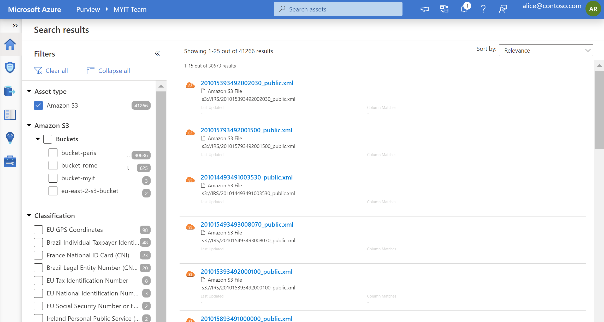

- **View Insight reports** to view statistics for the classification, sensitivity labels, file types, and more details about your content.

    All Purview Insight reports include the Amazon S3 scanning results, along with the rest of the results from your Azure data sources. When relevant, an additional **Amazon S3** asset type was added to the report filtering options.

    For more information, see the [Understand Insights in Azure Purview](concept-insights.md).

## Minimum permissions for your AWS policy

The default procedure for [creating an AWS role for Purview](#create-a-new-aws-role-for-purview) to use when scanning your S3 buckets uses the **AmazonS3ReadOnlyAccess** policy.

The **AmazonS3ReadOnlyAccess** policy provides minimum permissions required for scanning your S3 buckets, and may include other permissions as well.

To apply only the minimum permissions required for scanning your buckets, create a new policy with the permissions listed in the following sections, depending on whether you want to scan a single bucket or all the buckets in your account.

Apply your new policy to the role instead of **AmazonS3ReadOnlyAccess.**

### Individual buckets

When scanning individual S3 buckets, minimum AWS permissions include:

- `GetBucketLocation`
- `GetBucketPublicAccessBlock`
- `GetObject`
- `ListBucket`

Make sure to define your resource with the specific bucket name. 
For example:

```json
{
"Version": "2012-10-17",
"Statement": [
        {
            "Effect": "Allow",
            "Action": [
                "s3:GetBucketLocation",
                "s3:GetBucketPublicAccessBlock",
                "s3:GetObject",
                "s3:ListBucket"
            ],
            "Resource": "arn:aws:s3:::<bucketname>"
        },
        {
            "Effect": "Allow",
            "Action": [
                "s3:GetObject"
            ],
            "Resource": "arn:aws:s3::: <bucketname>/*"
        }
    ]
}
```

### All buckets in your account

When scanning all the buckets in your AWS account, minimum AWS permissions include:

- `GetBucketLocation`
- `GetBucketPublicAccessBlock`
- `GetObject`
- `ListAllMyBuckets`
- `ListBucket`.

Make sure to define your resource with a wildcard. For example:

```json
{
"Version": "2012-10-17",
"Statement": [
        {
            "Effect": "Allow",
            "Action": [
                "s3:GetBucketLocation",
                "s3:GetBucketPublicAccessBlock",
                "s3:GetObject",
                "s3:ListAllMyBuckets",
                "s3:ListBucket"
            ],
            "Resource": "*"
        },
        {
            "Effect": "Allow",
            "Action": [
                "s3:GetObject"
            ],
            "Resource": "*"
        }
    ]
}
```

## Next steps

Learn more about Azure Purview Insight reports:

> [!div class="nextstepaction"]
> [Understand Insights in Azure Purview](concept-insights.md)
