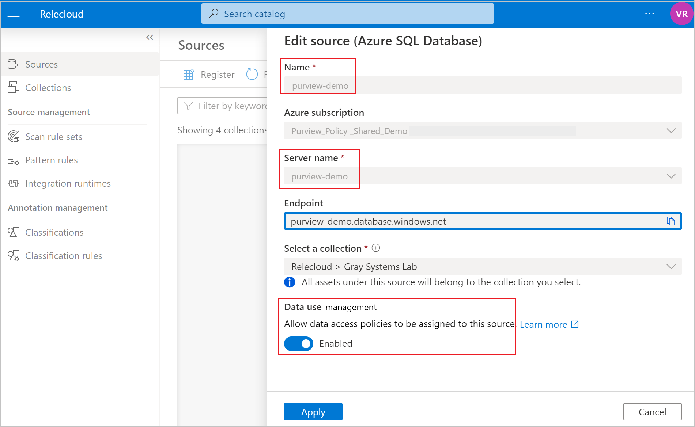

# Connect to Azure SQL Database in Microsoft Purview

This article outlines the process to register an Azure SQL data source in Microsoft Purview including instructions to authenticate and interact with the Azure SQL database source

## Supported capabilities

|**Metadata Extraction**|  **Full Scan**  |**Incremental Scan**|**Scoped Scan**|**Classification**|**Access Policy**|**Lineage**|**Data Sharing**|
|---|---|---|---|---|---|---|---|
| [Yes](#register) | [Yes](#scan)|[Yes](#scan) | [Yes](#scan)|[Yes](#scan)| [Yes (Preview)](#access-policy) | [Yes](#lineagepreview)(Preview)** | No |

\** Lineage is also supported if Azure SQL tables/views used as source/sink in [Data Factory Copy and Data Flow activities](how-to-link-azure-data-factory.md) 

* Data lineage extraction is currently supported only for Stored procedure runs

When scanning Azure SQL Database, Microsoft Purview supports:

- Extracting technical metadata including:

	- Server
	- Database
	- Schemas
	- Tables including the columns
	- Views including the columns
	- Store procedures (with lineage extraction enabled)
	- Store procedure runs (with lineage extraction enabled)

When setting up scan, you can further scope the scan after providing the database name by selecting tables and views as needed. 

### Known limitations

* Microsoft Purview doesn't support over 300 columns in the Schema tab and it will show "Additional-Columns-Truncated" if there are more than 300 columns.
* Column level lineage is currently not supported in the lineage tab. However, the columnMapping attribute in properties tab of Azure SQL Stored Procedure Run captures column lineage in plain text.
* Stored procedures running remotely from data integration tools like Azure Data Factory is currently not supported
* Data lineage extraction is currently not supported for Functions, Triggers.
* Lineage extraction scan is scheduled and defaulted to run every six hours. Frequency can't be changed.
* If sql views are referenced in stored procedures, they're captured as sql tables currently.
* Lineage extraction is currently not supported, if Azure SQL Server is configured behind a private endpoint.

## Prerequisites

* An Azure account with an active subscription. [Create an account for free](https://azure.microsoft.com/free/?WT.mc_id=A261C142F).

* An active [Microsoft Purview account](create-catalog-portal.md).

* You'll need to be a Data Source Administrator and Data Reader to register a source and manage it in the Microsoft Purview governance portal. See our [Microsoft Purview Permissions page](catalog-permissions.md) for details.

## Register

This section will enable you to register the Azure SQL DB data source and set up authentication to scan.

### Steps to register

It's important to register the data source in Microsoft Purview before setting up a scan.

1. Go to the [Azure portal](https://portal.azure.com), and navigate to the **Microsoft Purview accounts** page and select your _Purview account_

1. **Open Microsoft Purview governance portal** and navigate to the **Data Map**

    :::image type="content" source="media/register-scan-azure-sql-database/register-scan-azure-sql-db-open-purview-studio.png" alt-text="Screenshot that navigates to the Sources link in the Data Map.":::

1. Create the [Collection hierarchy](./quickstart-create-collection.md) using the **Collections** menu and assign permissions to individual subcollections, as required

    :::image type="content" source="media/register-scan-azure-sql-database/register-scan-azure-sql-db-collections.png" alt-text="Screenshot that shows the collection menu to assign access control permissions to the collection hierarchy.":::

1. Navigate to the appropriate collection under the **Sources** menu and select the **Register** icon to register a new Azure SQL DB

    :::image type="content" source="media/register-scan-azure-sql-database/register-scan-azure-sql-db-data-source.png" alt-text="Screenshot that shows the collection used to register the data source.":::

1. Select the **Azure SQL Database** data source and select **Continue**

1. Provide a suitable **Name** for the data source, select the relevant **Azure subscription**, **Server name** for the SQL server and the **collection** and select on **Apply**

    :::image type="content" source="media/register-scan-azure-sql-database/register-scan-azure-sql-db-ds-details.png" alt-text="Screenshot that shows the details to be entered in order to register the data source.":::

1. The Azure SQL Server Database will be shown under the selected Collection

    :::image type="content" source="media/register-scan-azure-sql-database/register-scan-azure-sql-db-ds-collections.png" alt-text="Screenshot that shows the data source mapped to the collection to initiate scanning.":::

## Scan

> [!TIP]
> To troubleshoot any issues with scanning:
> 1. Confirm you have followed all [**prerequisites**](#prerequisites).
> 1. Check network by confirming [firewall](#firewall-settings), [Azure connections](#allow-azure-connections), or [integration runtime](#self-hosted-integration-runtime) settings.
> 1. Confirm [authentication](#authentication-for-a-scan) is properly set up.
> 1. Review our [**scan troubleshooting documentation**](troubleshoot-connections.md).

### Firewall settings

If your database server has a firewall enabled, you'll need to update the firewall to allow access in one of two ways:

1. [Allow Azure connections through the firewall](#allow-azure-connections) - a straightforward option to route traffic through Azure networking, without needing to manage virtual machines.
1. [Install a Self-Hosted Integration Runtime on a machine in your network and give it access through the firewall](#self-hosted-integration-runtime) - if you have a private VNet set up within Azure, or have any other closed network set up, using a self-hosted integration runtime on a machine within that network will allow you to fully manage traffic flow and utilize your existing network.
1. [Use a managed virtual network](catalog-managed-vnet.md) - setting up a managed virtual network with your Microsoft Purview account will allow you to connect to Azure SQL using the Azure integration runtime in a closed network.

For more information about the Azure SQL Firewall, see the [SQL Database firewall documentation.](/azure/azure-sql/database/firewall-configure) To connect Microsoft Purview through the firewall, follow the steps below.

#### Allow Azure Connections

Enabling Azure connections will allow Microsoft Purview to reach and connect the server without updating the firewall itself. You can follow the How-to guide for [Connections from inside Azure](/azure/azure-sql/database/firewall-configure#connections-from-inside-azure).

1. Navigate to your database account
1. Select the server name in the **Overview** page
1. Select **Security > Firewalls and virtual networks**
1. Select **Yes** for **Allow Azure services and resources to access this server**
:::image type="content" source="media/register-scan-azure-sql-database/register-scan-azure-sql-db-firewall.png" alt-text="Allow Azure services and resources to access this server." border="true.":::

#### Self-Hosted Integration Runtime

A self-hosted integration runtime (SHIR) can be installed on a machine to connect with a resource in a private network.

1. [Create and install a self-hosted integration runtime](./manage-integration-runtimes.md) on a personal machine, or a machine inside the same VNet as your database server.
1. Check your database server networking configuration to confirm that there's a private endpoint accessible to the SHIR machine. Add the IP of the machine if it doesn't already have access.
1. If your Azure SQL Server is behind a private endpoint or in a VNet, you can use an [ingestion private endpoint](catalog-private-link-ingestion.md#deploy-self-hosted-integration-runtime-ir-and-scan-your-data-sources) to ensure end-to-end network isolation.

### Authentication for a scan

To scan your data source, you'll need to configure an authentication method in the Azure SQL Database.

>[!IMPORTANT]
> If you are using a [self-hosted integration runtime](manage-integration-runtimes.md) to connect to your resource, **system-assigned and user-assigned managed identities will not work**. You need to use Service Principal authentication or SQL authentication.

The following options are supported:

* **System-assigned managed identity** (Recommended) - This is an identity associated directly with your Microsoft Purview account that allows you to authenticate directly with other Azure resources without needing to manage a go-between user or credential set. The **system-assigned** managed identity is created when your Microsoft Purview resource is created, is managed by Azure, and uses your Microsoft Purview account's name. The SAMI can't currently be used with a self-hosted integration runtime for Azure SQL. For more information, see the [managed identity overview](../active-directory/managed-identities-azure-resources/overview.md).

* **User-assigned managed identity** (preview) - Similar to a SAMI, a user-assigned managed identity (UAMI) is a credential resource that allows Microsoft Purview to authenticate against Azure Active Directory. The **user-assigned** managed by users in Azure, rather than by Azure itself, which gives you more control over security. The UAMI can't currently be used with a self-hosted integration runtime for Azure SQL. For more information, see our [guide for user-assigned managed identities.](manage-credentials.md#create-a-user-assigned-managed-identity)

* **Service Principal**- A service principal is an application that can be assigned permissions like any other group or user, without being associated directly with a person. Their authentication has an expiration date, and so can be useful for temporary projects. For more information, see the [service principal documentation](../active-directory/develop/app-objects-and-service-principals.md).

* **SQL Authentication** - connect to the SQL database with a username and password. For more information about SQL Authentication, you can [follow the SQL authentication documentation](/sql/relational-databases/security/choose-an-authentication-mode#connecting-through-sql-server-authentication). If you need to create a login, follow this [guide to query an Azure SQL database](/azure/azure-sql/database/connect-query-portal), and use [this guide to create a login using T-SQL.](/sql/t-sql/statements/create-login-transact-sql)
    > [!NOTE]
    > Be sure to select the Azure SQL Database option on the page.

Select your chosen method of authentication from the tabs below for steps to authenticate with your Azure SQL Database.

# [SQL authentication](#tab/sql-authentication)

> [!Note]
> Only the server-level principal login (created by the provisioning process) or members of the `loginmanager` database role in the master database can create new logins. It takes about **15 minutes** after granting permission, the Microsoft Purview account should have the appropriate permissions to be able to scan the resource(s).

1. You'll need a SQL login with at least `db_datareader` permissions to be able to access the information Microsoft Purview needs to scan the database. You can follow the instructions in [CREATE LOGIN](/sql/t-sql/statements/create-login-transact-sql?view=azuresqldb-current&preserve-view=true#examples-1) to create a sign-in for Azure SQL Database. You'll need to save the **username** and **password** for the next steps.

1. Navigate to your key vault in the Azure portal.

1. Select **Settings > Secrets** and select **+ Generate/Import**

    :::image type="content" source="media/register-scan-azure-sql-database/register-scan-azure-sql-db-secret.png" alt-text="Screenshot that shows the key vault option to generate a secret.":::

1. Enter the **Name** and **Value** as the *password* from your Azure SQL Database.

1. Select **Create** to complete

1. If your key vault isn't connected to Microsoft Purview yet, you'll need to [create a new key vault connection](manage-credentials.md#create-azure-key-vaults-connections-in-your-microsoft-purview-account)

1. Finally, [create a new credential](manage-credentials.md#create-a-new-credential) using the key to set up your scan.

    :::image type="content" source="media/register-scan-azure-sql-database/register-scan-azure-sql-db-credentials.png" alt-text="Screenshot that shows the key vault option to set up credentials.":::

    :::image type="content" source="media/register-scan-azure-sql-database/register-scan-azure-sql-db-key-vault-options.png" alt-text="Screenshot that shows the key vault option to create a secret.":::

# [Managed identity](#tab/managed-identity)

>[!IMPORTANT]
> If you are using a [self-hosted integration runtime](manage-integration-runtimes.md) to connect to your resource, system-assigned and user-assigned managed identities will not work. You need to use SQL Authentication or Service Principal Authentication.

##### Configure Azure AD authentication in the database account

The managed identity needs permission to get metadata for the database, schemas, and tables. It must also be authorized to query the tables to sample for classification.

- If you haven't already, [configure Azure AD authentication with Azure SQL](/azure/azure-sql/database/authentication-aad-configure)
- Create Azure AD user in Azure SQL Database with the exact Microsoft Purview's managed identity by following tutorial on [create the user in Azure SQL Database](/azure/azure-sql/database/authentication-aad-service-principal-tutorial#create-the-service-principal-user-in-azure-sql-database). Assign proper permission (for example: `db_datareader`) to the identity. Example SQL syntax to create user and grant permission:

    ```sql
    CREATE USER [Username] FROM EXTERNAL PROVIDER
    GO
    
    EXEC sp_addrolemember 'db_datareader', [Username]
    GO
    ```

    > [!Note]
    > The `Username` is your Microsoft Purview's managed identity name. You can read more about [fixed-database roles and their capabilities](/sql/relational-databases/security/authentication-access/database-level-roles#fixed-database-roles).

##### Configure Portal Authentication

It's important to give your Microsoft Purview account's system-managed identity or [user-assigned managed identity](manage-credentials.md#create-a-user-assigned-managed-identity) the permission to scan the Azure SQL DB. You can add the SAMI or UAMI at the Subscription, Resource Group, or Resource level, depending on the breadth of the scan.

> [!Note]
> You need to be an owner of the subscription to be able to add a managed identity on an Azure resource.

1. From the [Azure portal](https://portal.azure.com), find either the subscription, resource group, or resource (for example, an Azure SQL Database) that the catalog should scan.

1. Select **Access Control (IAM)** in the left navigation and then select **+ Add** --> **Add role assignment**

    :::image type="content" source="media/register-scan-azure-sql-database/register-scan-azure-sql-db-sql-ds.png" alt-text="Screenshot that shows the Azure SQL database.":::

1. Set the **Role** to **Reader** and enter your _Microsoft Purview account name_ or _[user-assigned managed identity](manage-credentials.md#create-a-user-assigned-managed-identity)_ under **Select** input box. Then, select **Save** to give this role assignment to your Microsoft Purview account.

    :::image type="content" source="media/register-scan-azure-sql-database/register-scan-azure-sql-db-access-managed-identity.png" alt-text="Screenshot that shows the details to assign permissions for the Microsoft Purview account.":::

# [Service principal](#tab/service-principal)

##### Creating a new service principal

If you don't have a service principal, you can [follow the service principal guide to create one.](./create-service-principal-azure.md)

> [!NOTE]
> To create a service principal, it's required to register an application in your Azure AD tenant. If you do not have access to do this, your Azure AD Global Administrator, or other roles like Application Administrator can perform this operation.

##### Granting the Service Principal access to your Azure SQL Database

The service principal needs permission to get metadata for the database, schemas, and tables. It must also be authorized to query the tables to sample for classification.

- If you haven't already, [configure Azure AD authentication with Azure SQL](/azure/azure-sql/database/authentication-aad-configure)
- Create Azure AD user in Azure SQL Database with your service principal by following tutorial on [Create the service principal user in Azure SQL Database](/azure/azure-sql/database/authentication-aad-service-principal-tutorial#create-the-service-principal-user-in-azure-sql-database). Assign proper permission (for example: `db_datareader`) to the identity. Example SQL syntax to create user and grant permission:

    ```sql
    CREATE USER [Username] FROM EXTERNAL PROVIDER
    GO
    
    EXEC sp_addrolemember 'db_datareader', [Username]
    GO
    ```

    > [!Note]
    > The `Username` is your own service principal's name. You can read more about [fixed-database roles and their capabilities](/sql/relational-databases/security/authentication-access/database-level-roles#fixed-database-roles).

##### Create the credential

1. Navigate to your key vault in the Azure portal

1. Select **Settings > Secrets** and select **+ Generate/Import**

    :::image type="content" source="media/register-scan-azure-sql-database/register-scan-azure-sql-db-secret.png" alt-text="Screenshot that shows the key vault option to generate a secret for Service Principal.":::

1. Give the secret a **Name** of your choice.

1. The secret's **Value** will be the Service Principal's **Secret Value**. If you've already created a secret for your service principal, you can find its value in **Client credentials** on your secret's overview page.

    If you need to create a secret, you can follow the steps in the [service principal guide](create-service-principal-azure.md#adding-a-secret-to-the-client-credentials).

    :::image type="content" source="media/register-scan-azure-sql-database/register-scan-azure-sql-db-sp-client-credentials.png" alt-text="Screenshot that shows the Client credentials for the Service Principal.":::

1. Select **Create** to create the secret.

1. If your key vault isn't connected to Microsoft Purview yet, you'll need to [create a new key vault connection](manage-credentials.md#create-azure-key-vaults-connections-in-your-microsoft-purview-account)

1. Then, [create a new credential](manage-credentials.md#create-a-new-credential).

    :::image type="content" source="media/register-scan-azure-sql-database/register-scan-azure-sql-db-credentials.png" alt-text="Screenshot that shows the key vault option to add a credential for Service Principal.":::

1. The **Service Principal ID** will be the **Application ID** of your service principal. The **Secret name** will be the name of the secret you created in the previous steps.

    :::image type="content" source="media/register-scan-azure-sql-database/register-scan-azure-sql-db-sp-appln-id.png" alt-text="Screenshot that shows the Application (client) ID for the Service Principal.":::

    :::image type="content" source="media/register-scan-azure-sql-database/register-scan-azure-sql-db-sp-cred.png" alt-text="Screenshot that shows the key vault option to create a secret for Service Principal.":::

---

### Creating the scan

1. Open your **Microsoft Purview account** and select the **Open Microsoft Purview governance portal**
1. Navigate to the **Data map** --> **Sources** to view the collection hierarchy
1. Select the **New Scan** icon under the **Azure SQL DB** registered earlier

    :::image type="content" source="media/register-scan-azure-sql-database/register-scan-azure-sql-db-new-scan.png" alt-text="Screenshot that shows the screen to create a new scan.":::

Navigate to [lineage](#lineagepreview) section to learn more about data lineage from Azure SQL DB

Select your method of authentication from the tabs below for scanning steps.

# [SQL authentication](#tab/sql-authentication)

1. Provide a **Name** for the scan, select **Database selection method** as _Enter manually_, enter the **Database name** and the **Credential** created earlier, choose the appropriate collection for the scan and select **Test connection** to validate the connection. Once the connection is successful, select **Continue**

    :::image type="content" source="media/register-scan-azure-sql-database/register-scan-azure-sql-db-sql-auth.png" alt-text="Screenshot that shows the SQL Authentication option for scanning.":::

# [Managed identity](#tab/managed-identity)

1. Provide a **Name** for the scan, select the SAMI or UAMI under **Credential**, choose the appropriate collection for the scan.

    :::image type="content" source="media/register-scan-azure-sql-database/register-scan-azure-sql-db-managed-id.png" alt-text="Screenshot that shows the managed identity option to run the scan.":::

1. Select **Test connection**. On a successful connection, select **Continue**

    :::image type="content" source="media/register-scan-azure-sql-database/register-scan-azure-sql-db-test.png" alt-text="Screenshot that allows the managed identity option to run the scan.":::

# [Service principal](#tab/service-principal)

1. Provide a **Name** for the scan, choose the appropriate collection for the scan, and select the **Credential** dropdown to select the credential created earlier.

    :::image type="content" source="media/register-scan-azure-sql-database/register-scan-azure-sql-db-sp.png" alt-text="Screenshot that shows the option for service principal to enable scanning.":::

1. Select **Test connection**. On a successful connection, select **Continue**.

---

### Scoping and running the scan

1. You can scope your scan to specific database objects by choosing the appropriate items in the list.

    :::image type="content" source="media/register-scan-azure-sql-database/register-scan-azure-sql-db-scope-scan.png" alt-text="Scope your scan.":::

1. Then select a scan rule set. You can choose between the system default, existing custom rule sets, or create a new rule set inline.

    :::image type="content" source="media/register-scan-azure-sql-database/register-scan-azure-sql-db-scan-rule-set.png" alt-text="Scan rule set.":::

1. If creating a new _scan rule set_

    :::image type="content" source="media/register-scan-azure-sql-database/register-scan-azure-sql-db-new-scan-rule-set.png" alt-text="New Scan rule set.":::

1. You can select the **classification rules** to be included in the scan rule

    :::image type="content" source="media/register-scan-azure-sql-database/register-scan-azure-sql-db-classification.png" alt-text="Scan rule set classification rules.":::

    :::image type="content" source="media/register-scan-azure-sql-database/register-scan-azure-sql-db-sel-scan-rule.png" alt-text="Scan rule set selection.":::

1. Choose your scan trigger. You can set up a schedule or run the scan once.

1. Review your scan and select **Save and run**.

### View Scan

1. Navigate to the _data source_ in the _Collection_ and select **View Details** to check the status of the scan

    :::image type="content" source="media/register-scan-azure-sql-database/register-scan-azure-sql-db-view-scan.png" alt-text="view scan.":::

1. The scan details indicate the progress of the scan in the **Last run status** and the number of assets _scanned_ and _classified_

1. The **Last run status** will be updated to **In progress** and then **Completed** once the entire scan has run successfully

    :::image type="content" source="media/register-scan-azure-sql-database/register-scan-azure-sql-db-scan-complete.png" alt-text="view scan completed.":::

### Manage Scan

Scans can be managed or run again on completion

1. Select the **Scan name** to manage the scan

    :::image type="content" source="media/register-scan-azure-sql-database/register-scan-azure-sql-db-manage scan.png" alt-text="manage scan.":::

1. You can _run the scan_ again, _edit the scan_, _delete the scan_  

    :::image type="content" source="media/register-scan-azure-sql-database/register-scan-azure-sql-db-manage-scan-options.png" alt-text="manage scan options.":::

1. You can _run an incremental scan_ or a _full scan_ again

    :::image type="content" source="media/register-scan-azure-sql-database/register-scan-azure-sql-db-full-inc.png" alt-text="full or incremental scan.":::

## Access policy

### Supported policies
The following types of policies are supported on this data resource from Microsoft Purview:
- [Data owner policies](concept-policies-data-owner.md)

### Access policy pre-requisites on Azure SQL Database
[!INCLUDE [Access policies specific Azure SQL DB pre-requisites](./includes/access-policies-prerequisites-azure-sql-db.md)]

### Configure the Microsoft Purview account for policies
[!INCLUDE [Access policies generic configuration](./includes/access-policies-configuration-generic.md)]

### Register the data source and enable Data use management
The Azure SQL Database resource needs to be registered first with Microsoft Purview before you can create access policies. 
To register your resources, follow the **Prerequisites** and **Register** sections of this guide:
[Register Azure SQL Database in Microsoft Purview](./register-scan-azure-sql-database.md#prerequisites)

After you've registered the data source, you'll need to enable Data Use Management. This is a pre-requisite before you can create policies on the data source. Data Use Management can impact the security of your data, as it delegates to certain Microsoft Purview roles managing access to the data sources. **Go through the secure practices related to Data Use Management in this guide**: [How to enable Data Use Management](./how-to-enable-data-use-management.md)

Once your data source has the **Data Use Management** option *Enabled*, it will look like this screenshot.


### Create a policy
To create an access policy for Azure SQL Database, follow these guides:
* [Data owner policy on a single Azure SQL Database account](./how-to-policies-data-owner-azure-sql-db.md#create-and-publish-a-data-owner-policy) - This guide will allow you to provision access on a single Azure SQL Database account in your subscription.
* [Data owner policy covering all sources in a subscription or resource group](./how-to-policies-data-owner-resource-group.md) - This guide will allow you to provision access on all enabled data sources in a resource group, or across an Azure subscription. The pre-requisite is that the subscription or resource group is registered with the Data use management option enabled. 

## Lineage (Preview) 
<a id="lineagepreview"></a>

Microsoft Purview supports lineage from Azure SQL Database. At the time of setting up a scan, enable lineage extraction toggle button to extract lineage.  

### Prerequisites for setting up scan with Lineage extraction

1. Follow steps under [authentication for a scan using Managed Identity](#authentication-for-a-scan) section to authorize Microsoft Purview scan your Azure SQL Database

2. Sign in to Azure SQL Database with Azure AD account and assign db_owner permissions to the Microsoft Purview Managed identity. Use below example SQL syntax to create user and grant permission by replacing 'purview-account' with your Account name:

    ```sql
    Create user <purview-account> FROM EXTERNAL PROVIDER
    GO
    EXEC sp_addrolemember 'db_owner', <purview-account> 
    GO
    ```
3. Run below command on your Azure SQL Database to create master Key

    ```sql
    Create master key
    Go
    ```

### Creating scan with lineage extraction toggle turned on

1. Enable lineage extraction toggle in the scan screen

    :::image type="content" source="media/register-scan-azure-sql-database/register-scan-azure-sql-db-lineage-extraction.png" alt-text="Screenshot that shows the screen to create a new scan with lineage extraction." lightbox="media/register-scan-azure-sql-database/register-scan-azure-sql-db-lineage-extraction-expanded.png":::

2. Select your method of authentication by following steps in the [scan section](#creating-the-scan)
3. Once the scan is successfully set up from previous step, a new scan type called **Lineage extraction** will run incremental scans every 6 hours to extract lineage from Azure SQL Database. Lineage is extracted based on the actual stored procedure runs in the Azure SQL Database

    :::image type="content" source="media/register-scan-azure-sql-database/register-scan-azure-sql-db-lineage-extraction-runs.png" alt-text="Screenshot that shows the screen that runs lineage extraction every 6 hours."lightbox="media/register-scan-azure-sql-database/register-scan-azure-sql-db-lineage-extraction-runs-expanded.png":::

### Search Azure SQL Database assets and view runtime lineage

You can [browse data catalog](how-to-browse-catalog.md) or [search data catalog](how-to-search-catalog.md) to view asset details for Azure SQL Database. The following steps describe how-to view runtime lineage details.

1. Go to asset -> lineage tab, you can see the asset lineage when applicable. Refer to the [supported capabilities](#supported-capabilities) section on the supported Azure SQL Database lineage scenarios. For more information about lineage in general, see [data lineage](concept-data-lineage.md) and [lineage user guide](catalog-lineage-user-guide.md).


    :::image type="content" source="media/register-scan-azure-sql-database/register-scan-azure-sql-db-lineage.png" alt-text="Screenshot that shows the screen with lineage from stored procedures.":::

2. Go to stored procedure asset -> Properties -> Related assets to see the latest run details of stored procedures.

    :::image type="content" source="media/register-scan-azure-sql-database/register-scan-azure-sql-db-stored-procedure-properties.png" alt-text="Screenshot that shows the screen with stored procedure properties containing runs.":::

3. Select the stored procedure hyperlink next to Runs to see Azure SQL Stored Procedure Run Overview. Go to properties tab to see enhanced run time information from stored procedure. For example: executedTime, rowcount, Client Connection, and so on. 

    :::image type="content" source="media/register-scan-azure-sql-database/register-scan-azure-sql-db-stored-procedure-run-properties.png" alt-text="Screenshot that shows the screen with stored procedure run properties."lightbox="media/register-scan-azure-sql-database/register-scan-azure-sql-db-stored-procedure-run-properties-expanded.png":::

### Troubleshooting steps

* If no lineage is captured after a successful **Lineage extraction** run, it's possible that no stored procedures have run at least once since the scan is set up.
* Lineage is captured for stored procedure runs that happened after a successful scan is set up. Lineage from past Stored procedure runs isn't captured.
* If your database is processing heavy workloads with lots of stored procedure runs, lineage extraction will filter only the most recent runs. Stored procedure runs early in the 6 hour window or the run instances that create heavy query load won't be extracted. Contact support if you're missing lineage from any stored procedure runs.

## Next steps

Follow the below guides to learn more about Microsoft Purview and your data.
- [Data owner policies in Microsoft Purview](concept-policies-data-owner.md)
- [Data Estate Insights in Microsoft Purview](concept-insights.md)
- [Lineage in Microsoft Purview](catalog-lineage-user-guide.md)
- [Search Data Catalog](how-to-search-catalog.md)
