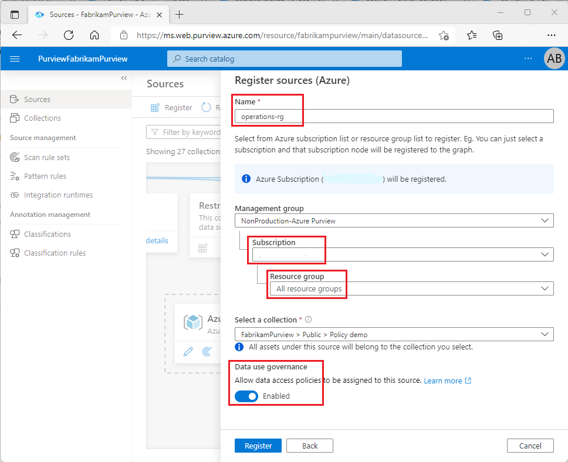

# Resource group and subscription provisioning by data owner (preview)

This guide describes how a data owner can enable access from Azure Purview to ALL datasets in a subscription or a resource group. At this point, only the following data sources are supported:
- Blob storage
- Azure Data Lake Storage (ADLS) Gen2

> [!Note]
> These capabilities are currently in preview. This preview version is provided without a service level agreement, and should not be used for production workloads. Certain features might not be supported or might have constrained capabilities. For more information, see [Supplemental Terms of Use for Microsoft Azure
Previews](https://azure.microsoft.com/support/legal/preview-supplemental-terms/).

## Prerequisites
[!INCLUDE [Access policies generic pre-requisites](./includes/access-policies-prerequisites-generic.md)]

[!INCLUDE [Azure Storage specific pre-requisites](./includes/access-policies-prerequisites-storage.md)]

## Configuration
[!INCLUDE [Access policies generic configuration](./includes/access-policies-configuration-generic.md)]

### Register the subscription or resource group in Azure Purview
The subscription or resource group needs to be registered with Azure Purview to later define access policies. You can follow this guide:

- [Register multiple sources - Azure Purview](register-scan-azure-multiple-sources.md)

Enable the resource group or subscription for access policies in Azure Purview by setting the the **Data use governance** toggle to enable, as shown in the picture.

[!INCLUDE [Access policies generic registration](./includes/access-policies-registration-generic.md)]

## Policy authoring
[!INCLUDE [Access policies generic authoring](./includes/access-policies-authoring-generic.md)]

## Additional information

### Limits
The limit for Azure Purview policies that can be enforced by Storage accounts is 100MB per subscription, which roughly equates to 5000 policies.

>[!Important]
> - Publish is a background operation. It can take up to **2 hours** for the changes to be reflected in the data source.

## Next steps
Check the blog and demo related to the capabilities mentioned in this how-to guide

* [What's New in Azure Purview at Microsoft Ignite 2021](https://techcommunity.microsoft.com/t5/azure-purview/what-s-new-in-azure-purview-at-microsoft-ignite-2021/ba-p/2915954)
* [Demo of access policy for Azure Storage](https://www.youtube.com/watch?v=CFE8ltT19Ss)
* [Enable access policies on an Azure Storage account](./how-to-access-policies-storage.md)
