# Tutorial: What are type definitions and how to create custom ones in Microsoft Purview

This tutorial will explain what type definitions are, how to create custom ones and how to initialize assets of custome types in Microsoft Purview.

In this tutorial, you'll learn:
> [!div class="checklist"]

>* How Microsoft Purview uses the *type system* from [*Apache Atlas*](https://atlas.apache.org/#/)
>* How to create a new custom type
>* How to create relationships between custom types
>* How to initialize new entities of custom types

## Prerequisites

For this tutorial you'll need:

* An Azure account with an active subscription. If you don't have one, you can [create an account for free](https://azure.microsoft.com/free/?WT.mc_id=A261C142F).
* An active Microsoft Purview (formerly Azure Purview) account. If you don't have one, see the [quickstart for creating a Microsoft Purview account](https://learn.microsoft.com/en-us/azure/purview/create-microsoft-purview-portal).
* A bearer token to your Purview account. To establish a bearer token and to call any data plane APIs, see the documentation about how to [call REST APIs for Microsoft Purview data planes](https://learn.microsoft.com/en-us/azure/purview/tutorial-using-rest-apis).
* Atlas endpoint of your Purview account. To get your Atlas endpoint, follow the *Atlas endpoint* section from [here](https://learn.microsoft.com/en-us/azure/purview/tutorial-atlas-2-2-apis#atlas-endpoint).

> [!NOTE]
Before moving to the hands-on part of the tutorial, the first four sections will explain what System Type is and how it is used in Purview.
> All the REST API calls described further will use the **bearer token** and the **endpoint** which are described in the prerequisites.

## 1 - What is a *Type* in Microsoft Purview

Purview relies on the [Type System](https://atlas.apache.org/2.0.0/TypeSystem.html) from Apache Atlas. All metadata objects (assets) managed by Purview (out of the box or through custom types) are modeled using type definitions. Understanding the Type System is fundamental in order to create new custom types in Purview.

Essentially, a *Type* can be seen as a *Class* from Object Oriented Programming (OOP):

* it defines the properties that represent that type
* each type is uniquely identified by its *name*
* a *type* can inherit from a *supertType*. This is an equivalent concept as inheritance from OOP. A type that extends a superType will inherit the attributes of the superType.

You can see all type definitions in your Purview account by sending a `GET` request to [All Type Definitions](https://learn.microsoft.com/en-us/rest/api/purview/catalogdataplane/types/get-all-type-definitions) endpoint:

```
GET {Endpoint}/catalog/api/atlas/v2/types/typedefs
```

Alternatively, you can use the [Microsoft Purview Custom Types Tool](https://github.com/microsoft/Purview-Custom-Types-Tool-Solution-Accelerator) to visualize all the type definitions.

Atlas has few pre-defined system types that are commonly used as supertypes. 

For example:

* **Referenceable**: This type represents all entities that can be searched for using a unique attribute called *qualifiedName*.

* **Asset**: This type extends from Referenceable and has additional attributes such as: *name*, *description* and *owner*.

* **DataSet**: This type extends Referenceable and Asset. Conceptually, it can be used to represent a type that stores data. Types that extend DataSet can be expected to have a Schema. For example, a SQL table.

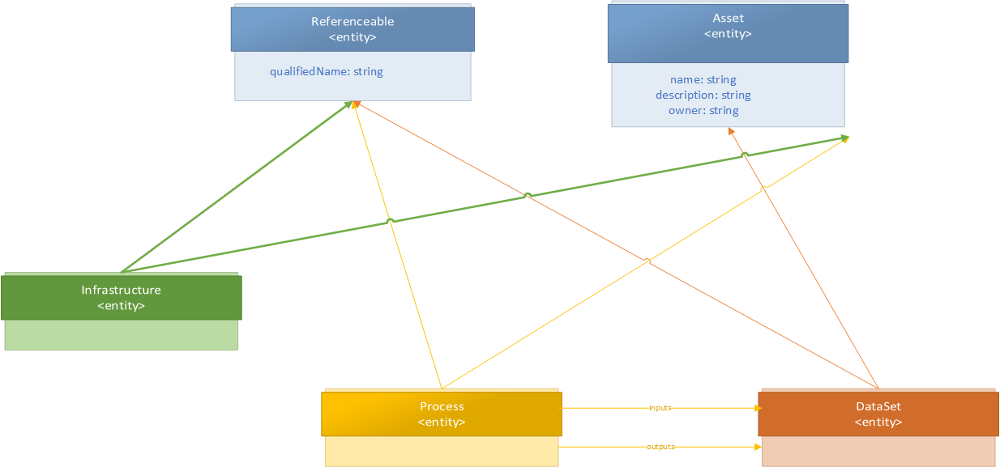

## 2 - Example of a *Type* definition, explained

To better understand the Type system, let us look at an example and see how an **Azure SQL Table** is defined.

You can get the complete type definition by sending a `GET` request to the Type Definition [endpoint](https://learn.microsoft.com/en-us/rest/api/purview/catalogdataplane/types/get-type-definition-by-name?tabs=HTTP):

```
GET {Endpoint}/catalog/api/atlas/v2/types/typedef/name/{name}
```

>[!TIP]
> The **{name}** property tells which defintion you are interested in. In this case, you should use **azure_sql_table**.

Below you can see a simplified JSON result:

```json
{
  "category": "ENTITY",
  "guid": "7d92a449-f7e8-812f-5fc8-ca6127ba90bd",
  "name": "azure_sql_table",
  "description": "azure_sql_table",
  "typeVersion": "1.0",
  "serviceType": "Azure SQL Database",
  "options": {
    "schemaElementsAttribute": "columns",
  },
  "attributeDefs": [
    { "name": "principalId", ...},
    { "name": "objectType", ...},
    { "name": "createTime", ...},
    { "name": "modifiedTime", ... }
  ],
  "superTypes": [
    "DataSet",
    "Purview_Table",
    "Table"
  ],
  "subTypes": [],
  "relationshipAttributeDefs": [
    {
      "name": "dbSchema",
      "typeName": "azure_sql_schema",
      "isOptional": false,
      "cardinality": "SINGLE",
      "relationshipTypeName": "azure_sql_schema_tables",
    },
    {
      "name": "columns",
      "typeName": "array<azure_sql_column>",
      "isOptional": true,
      "cardinality": "SET",
      "relationshipTypeName": "azure_sql_table_columns",
    },
  ]
}
```

Based on the JSON type definition above, let us look at some properties:

* **Category** field describes in what category your type is. The list of categories supported by Atlas can be found [here](https://atlas.apache.org/api/v2/json_TypeCategory.html).

* **ServiceType** lets you group different type definitions in the same group. In our example, a SQL Table is defined under **Azure SQL Database** service type. 

> [!NOTE]
> **Azure SQL Database** is defined with the same *serviceType* as **Azure SQL Table**.

This field is particularly useful when browsing assets *by source type* in Purview:

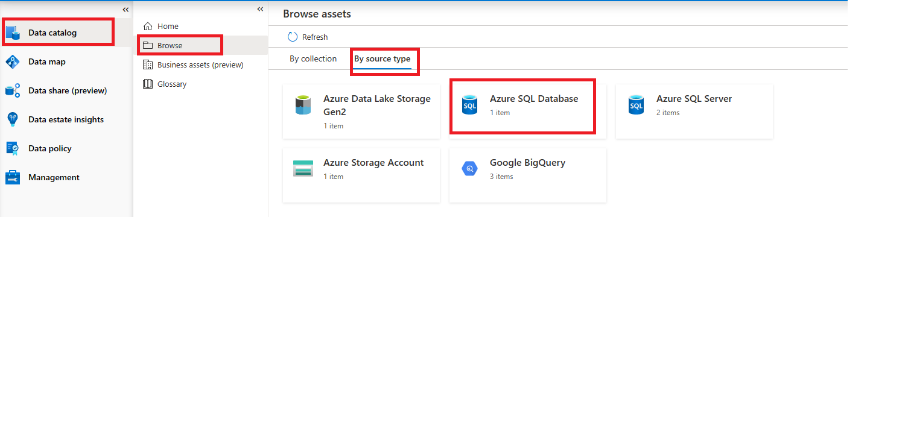

* **SuperTypes** describes the *"parent"* types you want to "*inherit*" from.

* **schemaElementsAttributes** from **options** influences what appears in the **Schema** tab of your asset in Purview.

Below you can see an example of how the **Schema** tab looks like for an asset of type Azure SQL Table:

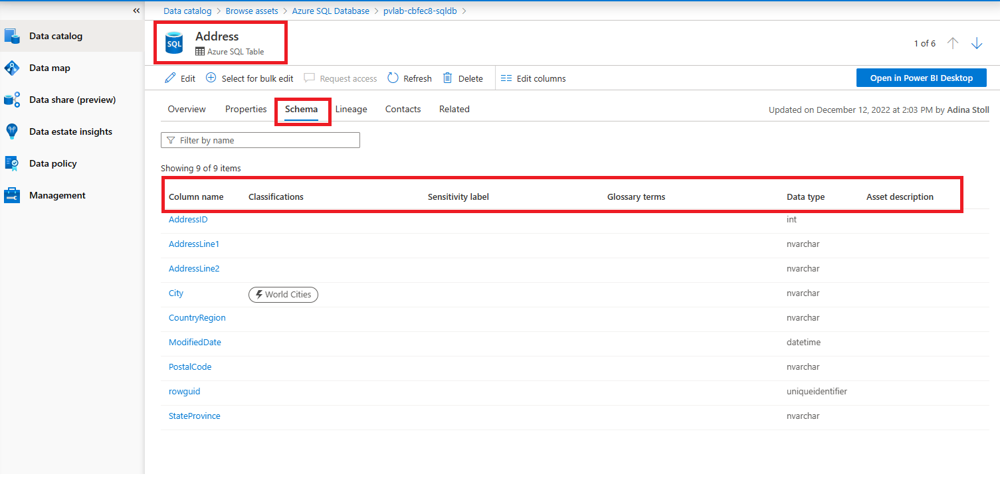

In our JSON above, we can see that **schemaElementsAttributes**  points to the relationship attribute called **columns**, which can be seen in the **relationshipAttributeDefs** array:

```json
...
"relationshipAttributeDefs": [
    ...
    {
      "name": "columns",
      "typeName": "array<azure_sql_column>",
      "isOptional": true,
      "cardinality": "SET",
      "relationshipTypeName": "azure_sql_table_columns",
    },
  ]
```

This relationship has its own definition. The name of the definition is found in **relationshipTypeName** attribute. In this case it is *azure_sql_table_columns*. 

* The **cardinality** of this relationship attribute is set to *SET* which suggests that it holds a list of related assets. 
* The related asset is of type *azure_sql_column*, as visible in the *typeName* attribute.

In other words, the *columns* relationship relates the Azure SQL Table to a list of Azure SQL Columns that show up in the Schema tab.

## 3 - Example of a *relationship Type definition*, explained

Each relationship consists of two ends, called *endDef1* and *endDef2*.

In the example above, *azure_sql_table_columns* is the name of the relationship that characterizes a table (endDef1) and its columns (endDef2).

For the full definition, you can do make a `GET` request to the following [endpoint](https://learn.microsoft.com/en-us/rest/api/purview/catalogdataplane/types/get-type-definition-by-name?tabs=HTTP) using *azure_sql_table_columns* as the name:

```
GET {Endpoint}/catalog/api/atlas/v2/types/typedef/name/azure_sql_table_columns
```

Below you can see a simplified JSON result:

```json
{
  "category": "RELATIONSHIP",
  "guid": "c80d0027-8f29-6855-6395-d243b37d8a93",
  "name": "azure_sql_table_columns",
  "description": "azure_sql_table_columns",
  "serviceType": "Azure SQL Database",
  "relationshipCategory": "COMPOSITION",
  "endDef1": {
    "type": "azure_sql_table",
    "name": "columns",
    "isContainer": true,
    "cardinality": "SET",
  },
  "endDef2": {
    "type": "azure_sql_column",
    "name": "table",
    "isContainer": false,
    "cardinality": "SINGLE",
  }
}
```

* **name** is the name of the relationship definition. The value, in this case *azure_sql_table_columns* is used in the *relationshipTypeName* attribute of the entity that has this relationship, as you can see it referenced in the example above.

* **relationshipCategory** is the category of the relationship and it can be either COMPOSITION, AGGREGATION or ASSOCIATION as described [here](https://atlas.apache.org/api/v2/json_RelationshipCategory.html).

* **enDef1** is the first end of the definition and contains the attributes:

  * **type** is the type of the entity that this relationship expects as end1

  * **name** is the attribute that will appear on this entity's relationship attribute

  * **cardinality** is eithr SINGLE, SET or LIST.

  * **isContainer** is a boolean and is related to the *cardinality* of this relationship. If the *cardinality* is set to **SET** or **LIST** then *isContainer* should be set to True. This describes whether the relationship is a one-to-one relationship or one-to-many. For example, in a SQL Table, *columns* relationship (of type *azure_sql_table_columns*) is a one-to-many relationship between a table and its columns.

**endDef2** is the second end of the definition and describes, similarly to endDef1, the properties of the second part of the relationship.

## 4 - Schema tab

As we understood above, the information that shows up in the Schema tab of an Azure SQL Table comes from the Azure SQL Column themselves.

Clicking on one column item, we would see the following:
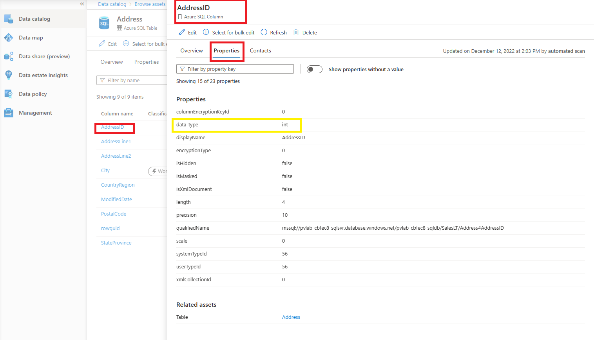

The question is, how did Purview select the *data_tye* property from the column and showed it in the Schema tab of the table?
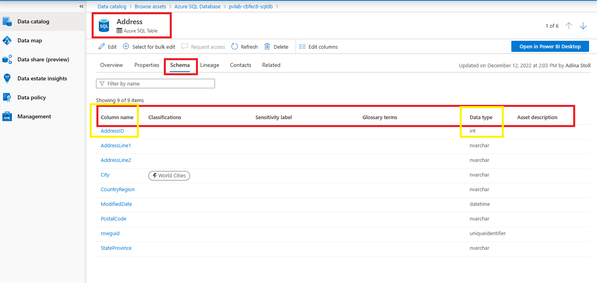

You can get the type definition of an Azure SQL Column by making a `GET` request to the [endpoint](https://learn.microsoft.com/en-us/rest/api/purview/catalogdataplane/types/get-type-definition-by-name?tabs=HTTP):

```
GET {Endpoint}/catalog/api/atlas/v2/types/typedef/name/{name}
```

> [!NOTE] {name} in this case is: azure_sql_column

A simplified JSON result can be seen below:

```json
{
  "category": "ENTITY",
  "guid": "58034a18-fc2c-df30-e474-75803c3a8957",
  "name": "azure_sql_column",
  "description": "azure_sql_column",
  "serviceType": "Azure SQL Database",
  "options": {
    "schemaAttributes": "[\"data_type\"]"
  },
  "attributeDefs": 
  [
    {
      "name": "data_type",
      "typeName": "string",
      "isOptional": false,
      "cardinality": "SINGLE",
      "valuesMinCount": 1,
      "valuesMaxCount": 1,
      "isUnique": false,
      "isIndexable": false,
      "includeInNotification": false
    }, 
  ...
  ]
  ...
}
```

> [!NOTE] serviceType is Azure SQL Database, the same as for the table

* *schemaAttributes* is set to **data_type**, which is one of the attributes of this type. 

Azure SQL Table used *schemaElementAttribute* to point to a relationship consisting of a list of Azure SQL Columns. The type definition of a column has *schemaAttributes* defined.

In this way the Schema tab in the table will display the attribute(s) listed in the *schemaAttributes* of the related assets.

## 5 - Create custom type definitions

Now that we have an understanding of type definitions in general, let us create custom type definitions.

### Scenario

* In this tutorial, we would like to model a 1:n relationship between two types, called *custom_type_parent* and *custom_type_child*.

* A *custom_type_child* should reference one parent, whereas a *custom_type_parent* can reference a list of children.

They should be linked together through a 1:n relationship.

>[!TIP]
> [Here](https://github.com/wjohnson/purview-ingestor-scenarios) you can find few tips when creating a new custom type.

### 5.1 Create the *custom_type_parent* type defininion by making a `POST` request to:

``` 
POST https://{{endpoint}}.purview.azure.com/catalog/api/atlas/v2/types/typedefs
```

with the body:

```json
 {
    "entityDefs": 
    [
        {
            "category": "ENTITY",
            "version": 1,
            "name": "custom_type_parent",
            "description": "Sample custom type of a parent object",
            "typeVersion": "1.0",
            "serviceType": "Sample-Custom-Types",
            "superTypes": [
                "DataSet"
            ],
            "subTypes": [],
            "options":{
                "schemaElementsAttribute": "columns"
            }
        }
    ]
 }
```

### 5.2 Create the *custom_type_child* type defininion by making a `POST` request to:

```
POST https://{{endpoint}}.purview.azure.com/catalog/api/atlas/v2/types/typedefs
```

with the body:

```json
 {
    "entityDefs": 
    [
        {
            "category": "ENTITY",
            "version": 1,
            "name": "custom_type_child",
            "description": "Sample custom type of a CHILD object",
            "typeVersion": "1.0",
            "serviceType": "Sample-Custom-Types",
            "superTypes": [
                "DataSet"
            ],
            "subTypes": [],
            "options":{
               "schemaAttributes": "data_type"
            }
        }
    ]
 }
```

### 5.3 - Create a custom type relationship definition

Create a custom type relationship definition by making a `POST` request to:

```
POST https://{{ENDPOINT}}.purview.azure.com/catalog/api/atlas/v2/types/typedefs
```

with the body:

```json
{
    "relationshipDefs": [
        {
            "category": "RELATIONSHIP",
            "endDef1" : {
                "cardinality" : "SET",
                "isContainer" : true,
                "name" : "Children",
                "type" : "custom_type_parent"
            },
            "endDef2" : {
                "cardinality" : "SINGLE",
                "isContainer" : false,
                "name" : "Parent",
                "type" : "custom_type_child"
            },
            "relationshipCategory" : "COMPOSITION",
            "serviceType": "Sample-Custom-Types",
            "name": "custom_parent_child_relationship"
        }
    ]
}
```

## 6 - Initialize assets of custom type

### 6.1 Initialize a new asset of type *custom_type_parent*

Initialize a new asset of type *custom_type_parent* by making `POST` request to:

```
POST https://{{ENDPOINT}}.purview.azure.com/catalog/api/atlas/v2/entity
```

with the body:

```json

{
    "entity": {
        "typeName":"custom_type_parent",
        "status": "ACTIVE",
        "version": 1,
         "attributes":{
            "name": "First_parent_object",
            "description": "This is the first asset of type custom_type_parent",
            "qualifiedName": "custom//custom_type_parent:First_parent_object"
         }

    }
}
```

Save the *guid* as you will need it later.

### 6.2 Initialize a new asset of type *custom_type_child*

Initialize a new asset of type *custom_type_child* by making `POST` request to:

```
POST https://{{ENDPOINT}}.purview.azure.com/catalog/api/atlas/v2/entity
```

with the body:

```json
{
    "entity": {
        "typeName":"custom_type_child",
        "status": "ACTIVE",
        "version": 1,
         "attributes":{
            "name": "First_child_object",
            "description": "This is the first asset of type custom_type_child",
            "qualifiedName": "custom//custom_type_child:First_child_object"
         }

    }
}
```

Save the *guid* as you will need it later.

### 6.3 Initialize a new relationship between the assets created above

Initialize a new relationship of type *custom_parent_child_relationship* by making a `POST` request to:

```
POST https://{{ENDPOINT}}.purview.azure.com/catalog/api/atlas/v2/relationship/
```

with the follwoing body:

> [!NOTE] The *guid* in end1 must be replaced with the the guid of the object created at step 6.1 The *guid* in end2 must be replaced with the guid of the object created at step 6.2

```json
{
    "typeName": "custom_parent_child_relationship",
    "end1": {
        "guid": "...",
        "typeName": "custom_type_parent"
    },
    "end2": {
        "guid": "...",
        "typeName": "custom_type_child"
    }
}
```

## 7 - View the assets in Microsoft Purview

1. Go to *Data Catalog* in Microsoft Purview.
2. Select *Browse*.
3. Select *By source type*.
4. Select *Sample-Custom-Types*.

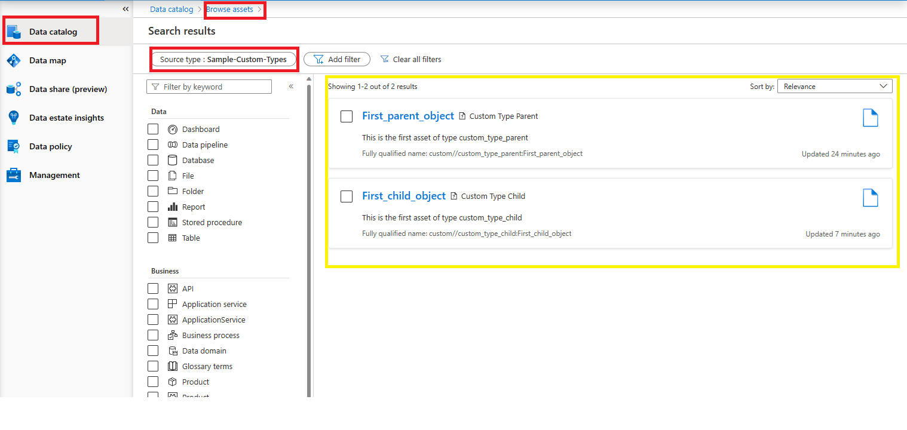

* Select the *First_parent_object*:

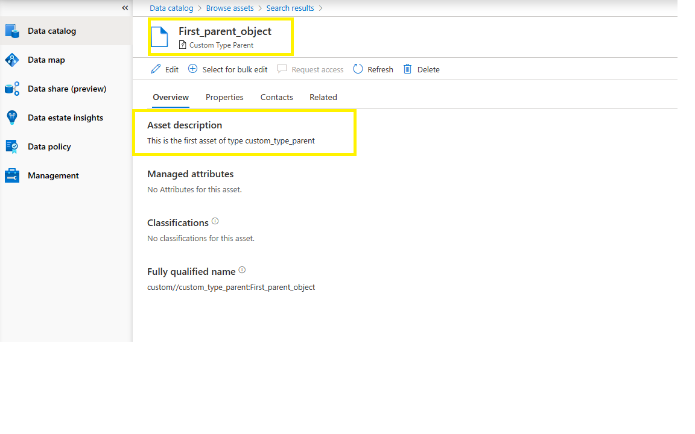

* Select the *Properties* tab:

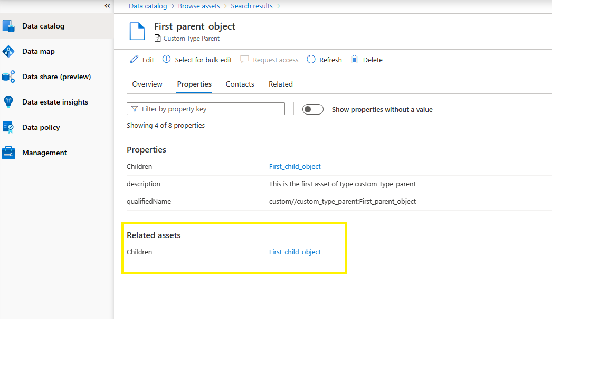
You can see the *First_child_object* being linked there.

* Click on the *First_child_object*:
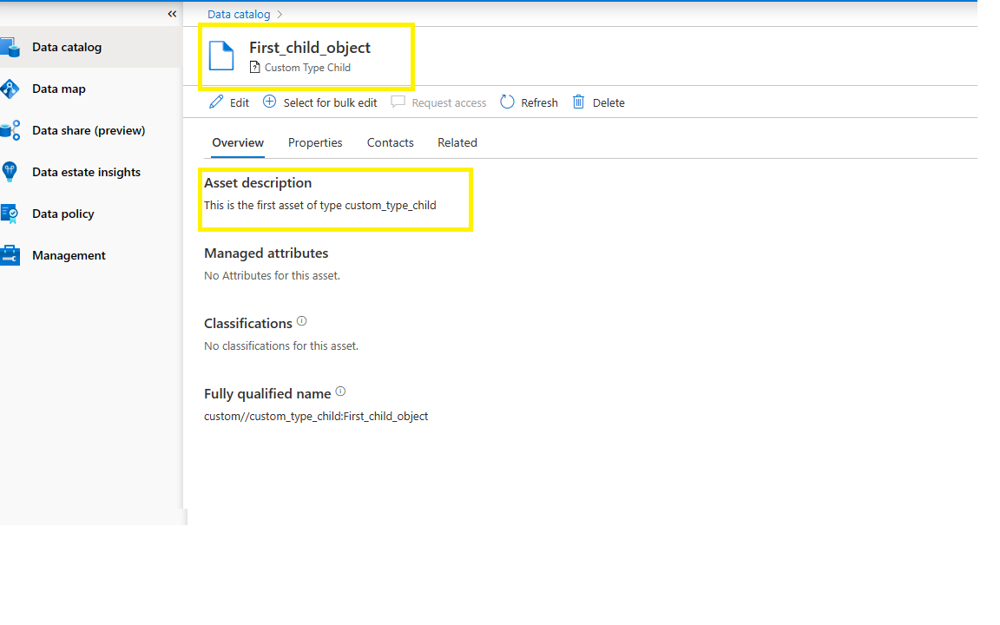

* Click on the *Properties* tab:
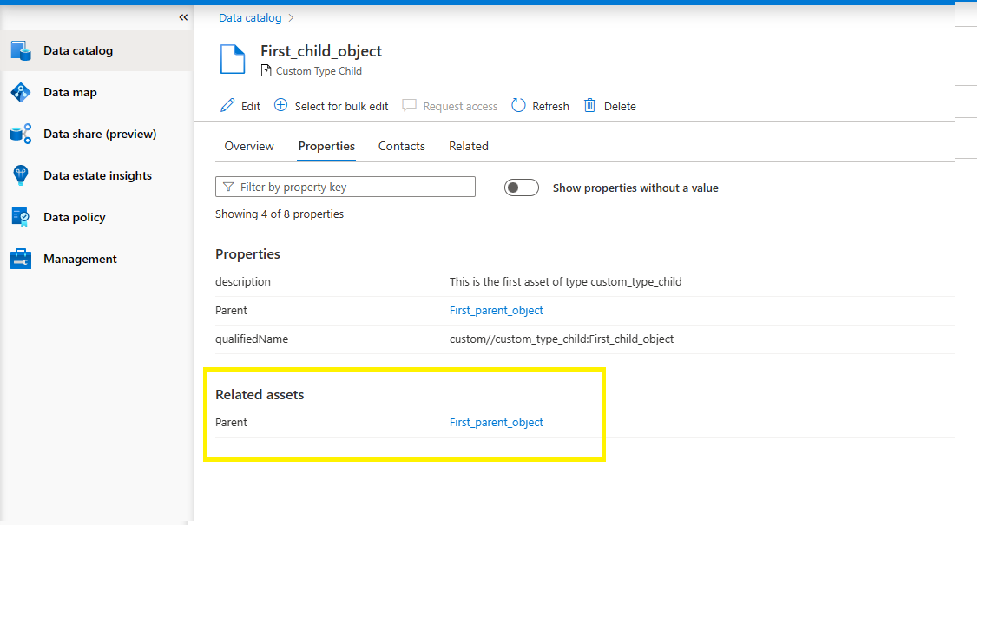

You can see the Parent object being linked there.

Similarly, you can click on the *Related* tab and will see the relationship between the two objects:

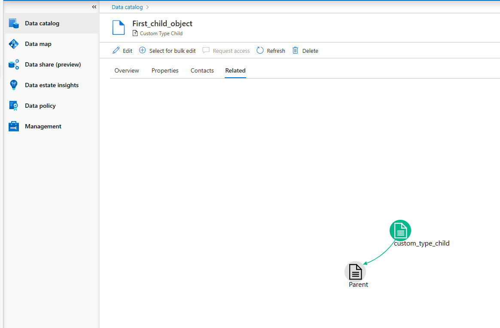

You can create multiple children by following the step 6.2 and 6.3 again.

> [!NOTE] The *qualifiedName* is unique per asset, therefore, the second child should be called differently, such as: *custom//custom_type_child:Second_child_object* 

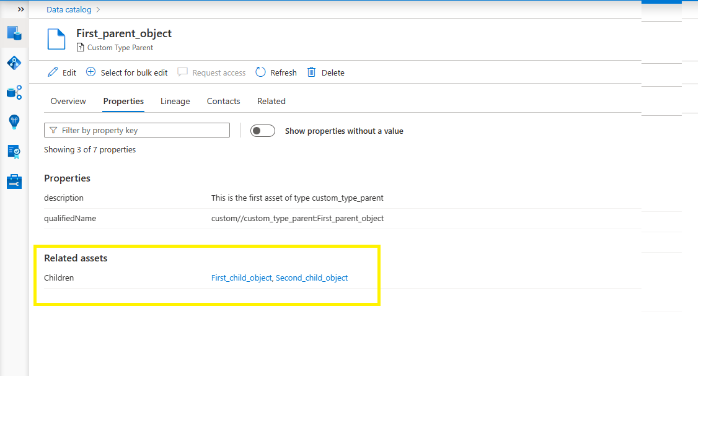

> [!TIP] If you delete the *First_parent_object* you will notice that the children will also be removed, due to the *COMPOSITION* relationship that we chose in the definition.

## Next steps

> [!div class="nextstepaction"]
> [Manage data sources](manage-data-sources.md)
> [Microsoft Purview data plane REST APIs](/rest/api/purview/)