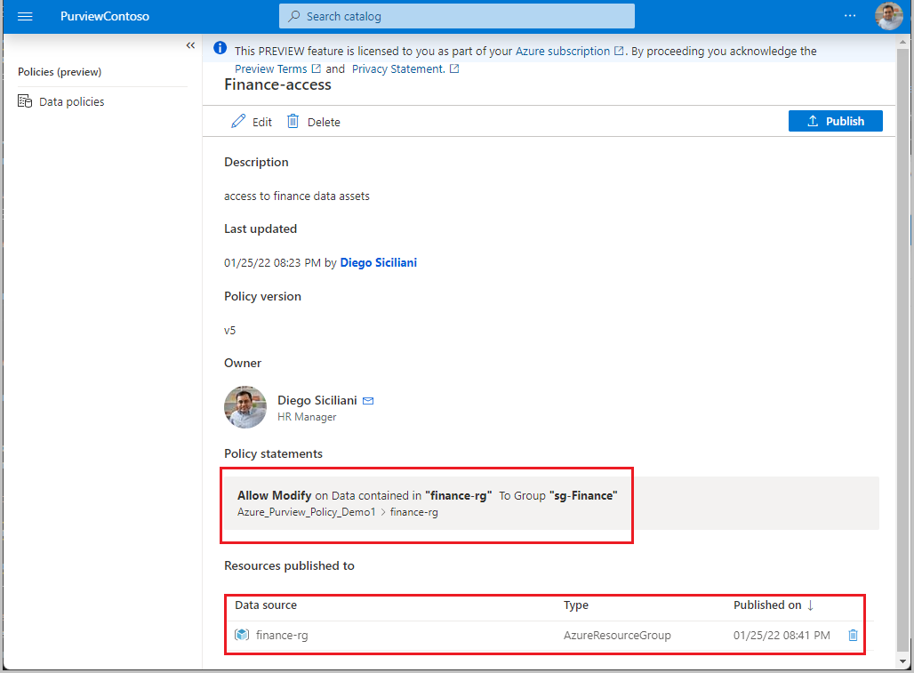

# Tutorial: Resource group and subscription access provisioning by data owner (preview)

This tutorial describes how a data owner can leverage Azure Purview to enable access to ALL data sources in a subscription or a resource group. This can be achieved through a single policy statement, and will cover all existing data sources, as well as data sources that are created afterwards. However, at this point, only the following data sources are supported:
- Blob storage
- Azure Data Lake Storage (ADLS) Gen2

In this tutorial, you learn how to:
> [!div class="checklist"]
> * Prerequisites
> * Configure permissions
> * Register a data asset for Data use governance
> * Create and publish a policy

> [!Note]
> These capabilities are currently in preview. This preview version is provided without a service level agreement, and should not be used for production workloads. Certain features might not be supported or might have constrained capabilities. For more information, see [Supplemental Terms of Use for Microsoft Azure
Previews](https://azure.microsoft.com/support/legal/preview-supplemental-terms/).

## Prerequisites
[!INCLUDE [Access policies generic pre-requisites](./includes/access-policies-prerequisites-generic.md)]

[!INCLUDE [Azure Storage specific pre-requisites](./includes/access-policies-prerequisites-storage.md)]

## Configuration
[!INCLUDE [Access policies generic configuration](./includes/access-policies-configuration-generic.md)]

### Register the subscription or resource group in Azure Purview for Data use governance
The subscription or resource group needs to be registered with Azure Purview to later define access policies. You can follow this guide:

- [Register multiple sources - Azure Purview](register-scan-azure-multiple-sources.md)

Enable the resource group or the subscription for access policies in Azure Purview by setting the **Data use governance** toggle to **Enabled**, as shown in the picture.

[!INCLUDE [Access policies generic registration](./includes/access-policies-registration-generic.md)]

## Create and publish a data owner policy
Execute the steps in the [data-owner policy authoring tutorial](how-to-data-owner-policy-authoring-generic.md) to create and publish a policy similar to the example shown in the image: a policy that provides security group *sg-Finance* *modify* access to resource group *finance-rg*:

>[!Important]
> - Publish is a background operation. It can take up to **2 hours** for the changes to be reflected in Storage account(s).

## Additional information
- Creating a policy at subscription or resource group level will enable the Subjects to access Azure Storage system containers e.g., *$logs*. If this is undesired, first scan the data source and then create finer-grained policies for each (i.e., at container or sub-container level).

### Limits
The limit for Azure Purview policies that can be enforced by Storage accounts is 100MB per subscription, which roughly equates to 5000 policies.

## Next steps
Check blog, demo and related tutorials

* [Blog: resource group-level governance can significantly reduce effort](https://techcommunity.microsoft.com/t5/azure-purview-blog/data-policy-features-resource-group-level-governance-can/ba-p/3096314)
* [Demo of data owner access policies for Azure Storage](https://www.youtube.com/watch?v=CFE8ltT19Ss)
* [Fine-grain data owner policies on an Azure Storage account](./tutorial-data-owner-policies-storage.md)
