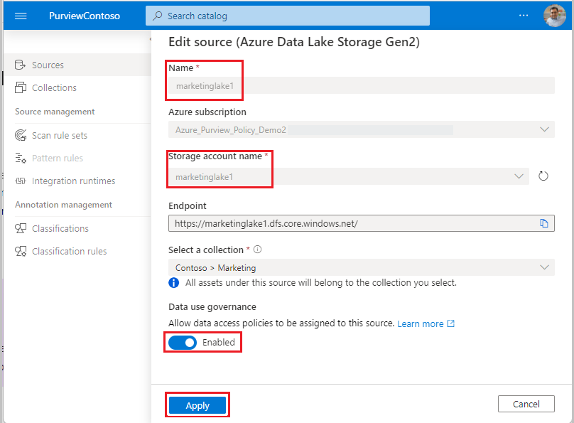
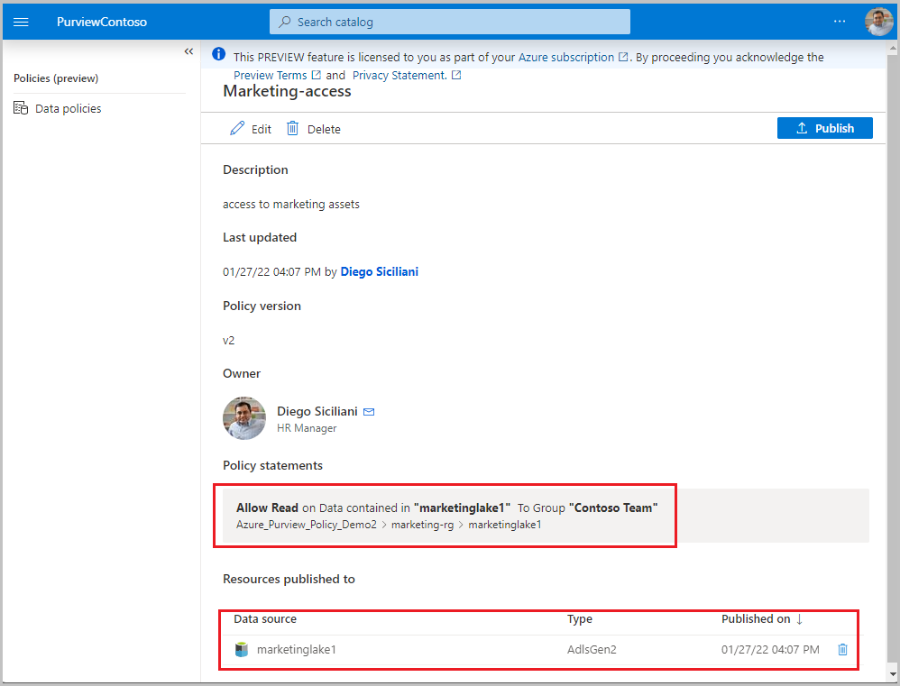

# Tutorial: Access provisioning by data owner to Azure Storage datasets (preview)

This tutorial describes how a data owner can leverage Azure Purview to enable access to datasets in Azure Storage. At this point, only the following data sources are supported:
- Blob storage
- Azure Data Lake Storage (ADLS) Gen2

In this tutorial, you learn how to:
> [!div class="checklist"]
> * Prerequisites
> * Configure permissions
> * Register a data asset for Data use governance
> * Create and publish a policy

> [!Note]
> These capabilities are currently in preview. This preview version is provided without a service level agreement, and should not be used for production workloads. Certain features might not be supported or might have constrained capabilities. For more information, see [Supplemental Terms of Use for Microsoft Azure
Previews](https://azure.microsoft.com/support/legal/preview-supplemental-terms/).

## Prerequisites
[!INCLUDE [Access policies generic pre-requisites](./includes/access-policies-prerequisites-generic.md)]

[!INCLUDE [Azure Storage specific pre-requisites](./includes/access-policies-prerequisites-storage.md)]

## Configuration
[!INCLUDE [Access policies generic configuration](./includes/access-policies-configuration-generic.md)]

### Register the data sources in Azure Purview for Data use governance
Register and scan each Storage account with Azure Purview to later define access policies. You can follow these guides:

-   [Register and scan Azure Storage Blob - Azure Purview](register-scan-azure-blob-storage-source.md)

-   [Register and scan Azure Data Lake Storage (ADLS) Gen2 - Azure Purview](register-scan-adls-gen2.md)

Enable the data source for access policies in Azure Purview by setting the **Data use governance** toggle to **Enabled**, as shown in the picture.

[!INCLUDE [Access policies generic registration](./includes/access-policies-registration-generic.md)]

## Create and publish a data owner policy
Execute the steps in the [data-owner policy authoring tutorial](how-to-data-owner-policy-authoring-generic.md) to create and publish a policy similar to the example shown in the image: a policy that provides group *Contoso Team* *read* access to Storage account *marketinglake1*:

>[!Important]
> - Publish is a background operation. It can take up to **2 hours** for the changes to be reflected in Storage account(s).

## Additional information
- Policy statements set below container level on a Storage account are supported. If no access has been provided at Storage account level or container level, then the App that will execute the access will need to provide a fully qualified name (i.e., a direct absolute path) to the data object. The following documents show examples of how to do that:
  - [*abfs* for ADLS Gen2](../hdinsight/hdinsight-hadoop-use-data-lake-storage-gen2.md#access-files-from-the-cluster)
  - [*az storage blob download* for Blob Storage](../storage/blobs/storage-quickstart-blobs-cli.md#download-a-blob)
- Creating a policy at Storage account level will enable the Subjects to access system containers e.g., *$logs*.  If this is undesired, first scan the data source(s) and then create finer-grained policies for each (i.e., at container or sub-container level).

### Limits
- The limit for Azure Purview policies that can be enforced by Storage accounts is 100MB per subscription, which roughly equates to 5000 policies.

### Known issues

> [!Warning]
> **Known issues** related to Policy creation
> - Do not create policy statements based on Azure Purview resource sets. Even if displayed in Azure Purview policy authoring UI, they are not yet enforced. Learn more about [resource sets](concept-resource-sets.md).

### Policy action mapping

This section contains a reference of how actions in Azure Purview data policies map to specific actions in Azure Storage.

| **Azure Purview policy action** | **Data source specific actions**                                                        |
|---------------------------|-----------------------------------------------------------------------------------------|
|||
| *Read*                    |Microsoft.Storage/storageAccounts/blobServices/containers/read                      |
|                           |Microsoft.Storage/storageAccounts/blobServices/containers/blobs/read                |
|||
| *Modify*                  |Microsoft.Storage/storageAccounts/blobServices/containers/blobs/read                |
|                           |Microsoft.Storage/storageAccounts/blobServices/containers/blobs/write               |
|                           |Microsoft.Storage/storageAccounts/blobServices/containers/blobs/add/action          |
|                           |Microsoft.Storage/storageAccounts/blobServices/containers/blobs/move/action         |
|                           |Microsoft.Storage/storageAccounts/blobServices/containers/blobs/delete              |
|                           |Microsoft.Storage/storageAccounts/blobServices/containers/read                      |
|                           |Microsoft.Storage/storageAccounts/blobServices/containers/write                     |
|                           |Microsoft.Storage/storageAccounts/blobServices/containers/delete                    |
|||

## Next steps
Check blog, demo and related tutorials

* [What's New in Azure Purview at Microsoft Ignite 2021](https://techcommunity.microsoft.com/t5/azure-purview/what-s-new-in-azure-purview-at-microsoft-ignite-2021/ba-p/2915954)
* [Demo of access policy for Azure Storage](https://www.youtube.com/watch?v=CFE8ltT19Ss)
* [Enable Azure Purview data owner policies on all data sources in a subscription or a resource group](./tutorial-data-owner-policies-resource-group.md)

