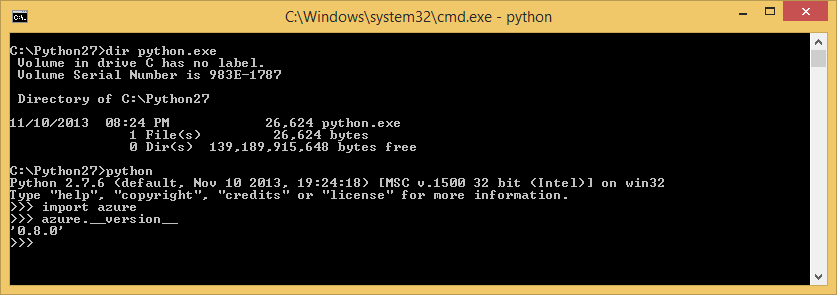
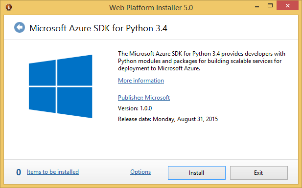

<properties
	pageTitle="Install Python and the SDK - Azure"
	description="Learn how to install Python and the SDK to use with Azure."
	services=""
	documentationCenter="python"
	authors="huguesv"
	manager="wpickett"
	editor=""/>

<tags
	ms.service="multiple"
	ms.workload="na"
	ms.tgt_pltfrm="na"
	ms.devlang="python"
	ms.topic="article"
	ms.date="08/31/2015"
	ms.author="huvalo"/>

# Installing Python and the SDK

Python is pretty easy to setup on Windows and comes pre-installed on Mac and Linux.  This guide walks you through installation and getting your machine ready for use with Azure.

## What's in the Python Azure SDK?

The Azure SDK for Python includes components that allow you to develop, deploy, and manage Python applications for Azure. Specifically, the Azure SDK for Python includes the following:

* **The Python Client Libraries for Azure**. These class libraries provide an interface for accessing Azure features, such as storage and service bus, and managing Azure resources, such as storage accounts, virtual machines, etc.
* **The Azure Emulators (Windows Only)**. The compute and storage emulators are local emulators of Cloud Services and Data Management Services that allow you to test an application locally. The Azure Emulators run on Windows only.

## Which Python and which version to use

There are several flavors of Python interpreters available - examples include:

* CPython - the standard and most commonly used Python interpreter
* IronPython - Python interpreter that runs on .Net/CLR
* Jython - Python interpreter that runs on the JVM

Only **CPython** is tested and supported for the Python Azure SDK and Azure services such as Websites and Cloud Services.  We recommend version 2.7 or 3.4.

## Where to get Python?

There are several ways to get CPython:

* Directly from [www.python.org][]
* From a reputable distro such as [www.continuum.io][], [www.enthought.com][] or [www.activestate.com][]
* Build from source!

Unless you have a specific need, we recommend the first two options, as described below.

## Installation on Windows, Linux and MacOS (client libraries only)

If you already have Python installed, you can use pip to install a bundle of all the client libraries in your existing Python 2.7 or Python 3.3+ environment. This will download the packages from the [Python Package Index][] (PyPI).

Note that you may need to use the `sudo` command on Linux and MacOS ie. `sudo pip install azure`.

	pip install azure

Starting with version 1.0.0, the libraries have been separated into multiple packages. You can now install only the packages that you need, or the bundle.

To install Azure Storage Runtime client libraries:

	pip install azure-storage

To install Azure Service Bus Runtime client libraries:

	pip install azure-servicebus

To install Azure Resource Manager (ARM) client libraries:

	pip install azure-mgmt

To install Azure Service Management (ASM) client libraries:

	pip install azure-servicemanagement-legacy

## Installation on Windows (Python, Azure Emulators and client libraries)

You can use the Web Platform Installer to streamline the installation. These include CPython from [www.python.org][].

* [Microsoft Azure SDK for Python 2.7][]
* [Microsoft Azure SDK for Python 3.4][]

**Note:** On Windows Server, in order to download the WebPI installer you may have to configure IE ESC settings (Start/Administrative Tools/Server Manager/Local Server, then click **IE Enhanced Security Configuration**, set to Off)

### Python 2.7

The WebPI installer provides everything you need to develop Python Azure apps.

After installation is complete, type `python` at the prompt to make sure things went smoothly.  Depending on how you installed, you may need to set your "path" variable to find (the right version of) Python:

After the installation you should have Python and the Client Libraries available at the default location:

		C:\Python27\Lib\site-packages\azure

### Python 3.4

The WebPI installer provides everything you need to develop Python Azure apps.

After installation is complete, type python at the prompt to make sure things went smoothly.  Depending on how you installed, you may need to set your "path" variable to find (the right version of) Python:

After the installation you should have Python and the Client Libraries available at the default location:

		C:\Python34\Lib\site-packages\azure

### Windows Uninstall

The **Azure SDK for Python** WebPI products are not applications in the typical sense, but actually a collection of distinct products such as 32-bit Python 2.7/3.4, Azure client libraries for Python, etc. which are bundled together.  A consequence of this is it has no conventional uninstaller of its own, so you will need to remove the programs that it installs individually from the Windows Control Panel.  

If you ever wish to reinstall **Azure SDK for Python**, simply open a PowerShell command prompt as an administrator and run the following command:

	rm -force "HKLM:\SOFTWARE\Microsoft\Python Tools for Azure"

and then rerun WebPI.

## Getting More Packages

The [Python Package Index][] (PyPI) has a rich selection of Python libraries.  If you chose to install a Distro, you'll already have most of the interesting bits for a variety of scenarios from web development to Technical Computing.

## Python Tools for Visual Studio

[Python Tools for Visual Studio][] (PTVS) is a free/OSS plugin from Microsoft which turns VS into a full-fledged Python IDE:

Using PTVS is optional, but is recommended as it gives you Python and Web Project/Solution support, debugging, profiling, interactive window, Template editing and Intellisense.

PTVS also makes it easy to deploy to Microsoft Azure, with support for deployment to [Cloud Services][] and [Websites][].

PTVS works with your existing Visual Studio 2013 or 2015 installation.  For documentation, downloads and discussions, see [Python Tools for Visual Studio].  

## Python Azure Scenarios for Linux and MacOS

For Linux or MacOS, these are main Azure scenarios that are supported:

1. Consuming Azure Services by using the client libraries for Python

2. Running your app in a Linux VM

3. Developing and publishing to Azure Websites using Git

The first scenario enables you to author rich web apps that take advantage of the Azure PaaS capabilities such as [blob storage][], [queue storage][], [table storage][] etc. via Pythonic wrappers for the Azure REST API's.  These work identically on Windows, Mac and Linux.  You can also use these client libraries from your local development machine or a Linux VM running on Azure.

For the VM scenario, you simply start a Linux VM of your choice (Ubuntu, CentOS, Suse) and run/manage what you like.  As an example, you can run [IPython][] REPL/notebook on your Windows/Mac/Linux machine and point your browser to a Linux or Windows multi-proc VM running the IPython Engine on Azure. See the [IPython Notebook on Azure][] tutorial for more information.

For information on how to setup a Linux VM, please see the [Create a Virtual Machine Running Linux][] tutorial.

Using Git deployment, you can develop a Python web application and publish it to an Azure Website from any operating system.  When you push your repository to Azure, it will automatically create a virtual environment and pip install your required packages.

For more information on developing and publishing Azure Websites, see the tutorials for [Creating Websites with Django][], [Creating Websites with Bottle][] and [Creating Websites with Flask][]. For more general information on using any WSGI compliant framework, see [Configuring Python with Azure Websites][].

## Additional Software and Resources:

* [Continuum Analytics Python Distribution][]
* [Enthought Python Distribution][]
* [ActiveState Python Distribution][]
* [SciPy - A suite of Scientific Python libraries][]
* [NumPy - A numerics library for Python][]
* [Django Project - A mature web framework/CMS][]
* [IPython - an advanced REPL/Notebook for Python][]
* [IPython Notebook on Azure][]
* [Python Tools for Visual Studio on GitHub][]
* [Python Developer Center](/develop/python/)

[Continuum Analytics Python Distribution]: http://continuum.io
[Enthought Python Distribution]: http://www.enthought.com
[ActiveState Python Distribution]: http://www.activestate.com
[www.python.org]: http://www.python.org
[www.continuum.io]: http://continuum.io
[www.enthought.com]: http://www.enthought.com
[www.activestate.com]: http://www.activestate.com
[SciPy - A suite of Scientific Python libraries]: http://www.scipy.org
[NumPy - A numerics library for Python]: http://www.numpy.org
[Django Project - A mature web framework/CMS]: http://www.djangoproject.com
[IPython - an advanced REPL/Notebook for Python]: http://ipython.org
[IPython]: http://ipython.org
[IPython Notebook on Azure]: virtual-machines-linux-jupyter-notebook.md
[Cloud Services]: cloud-services-python-ptvs.md
[Websites]: web-sites-python-ptvs-django-mysql.md
[Python Tools for Visual Studio]: http://aka.ms/ptvs
[Python Tools for Visual Studio on GitHub]: https://github.com/microsoft/ptvs
[Python Package Index]: http://pypi.python.org/pypi
[Microsoft Azure SDK for Python 2.7]: http://go.microsoft.com/fwlink/?LinkId=254281
[Microsoft Azure SDK for Python 3.4]: http://go.microsoft.com/fwlink/?LinkID=516990
[Setting up a Linux VM via the Azure portal]: create-and-configure-opensuse-vm-in-portal.md
[How to use the Azure Command-Line Interface]: crossplat-cmd-tools.md
[Create a Virtual Machine Running Linux]: virtual-machines-linux-quick-create-cli.md
[Creating Websites with Django]: web-sites-python-create-deploy-django-app.md
[Creating Websites with Bottle]: web-sites-python-create-deploy-bottle-app.md
[Creating Websites with Flask]: web-sites-python-create-deploy-flask-app.md
[Configuring Python with Azure Websites]: web-sites-python-configure.md
[table storage]: storage-python-how-to-use-table-storage.md
[queue storage]: storage-python-how-to-use-queue-storage.md
[blob storage]: storage-python-how-to-use-blob-storage.md
