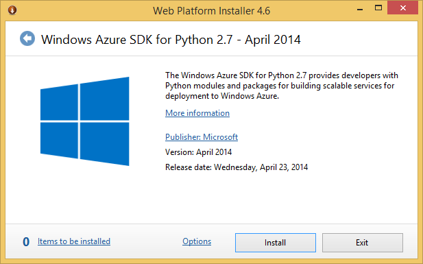
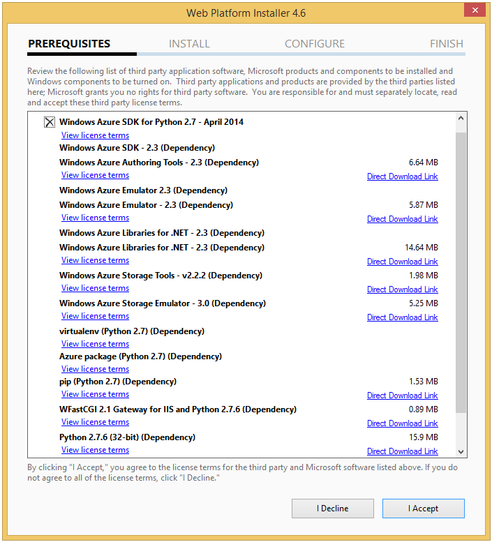
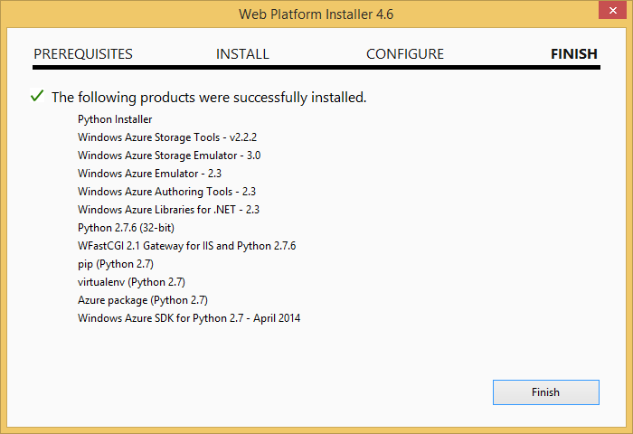
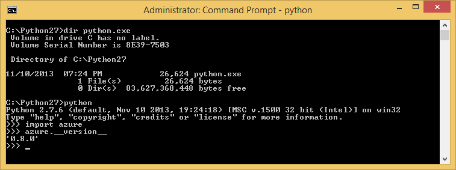
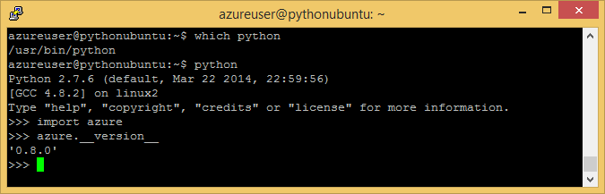
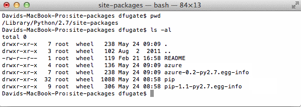

<properties linkid="develop-python-install-python" urlDisplayName="Install Python" pageTitle="Install Python and the SDK - Azure" metaKeywords="Azure Python SDK" description="Learn how to install Python and the SDK to use with Azure." metaCanonical="" services="" documentationCenter="Python" title="Installing Python and the SDK" authors="" solutions="" manager="" editor="" />

# Installing Python and the SDK
Python is pretty easy to setup on Windows and comes pre-installed on Mac and Linux.  This guide walks you through installation and getting your machine ready for use with Azure.  This guide will help you with the following:

* What's in the Python Azure SDK?
* Which Python and which version to use
* Installation on Windows
* Installation on Mac and Linux

## What's in the Python Azure SDK?

The Azure SDK for Python includes components that allow you to develop, deploy, and mangage Python applications for Azure. Specifically, the Azure SDK for Python includes the following:

* **The Python Client Libraries for Azure**. These class libraries provide an interface for accessing Azure features, such as Data Management Services and Cloud Services.  
* **The Azure Command-Line Tools for Mac and Linux**. This is a set of command-line tools for deploying and managing Azure services, such as Azure Web Sites and Azure Virtual Machines. These tools work on any platform, including Mac, Linux, and Windows.
* **PowerShell for Azure (Windows Only)**. This is a set of PowerShell cmdlets for deploying and managing Azure Services, such as Cloud Services and Virtual Machines.
* **The Azure Emulators (Windows Only)**. The compute and storage emulators are local emulators of Cloud Services and Data Management Services that allow you to test an application locally. The Azure Emulators run on Windows only.

The core scenarios for this release are:

* **Windows**: Cloud Service -- for example a Django site using Webroles
* **Mac/Linux**: IaaS -- Run what you like in a VM; Consume Azure Services through Python

## Which Python and which version to use

There are several flavors of Python interpreters available - examples include:

* CPython - the standard and most commonly used Python interpreter
* IronPython - Python interpreter that runs on .Net/CLR
* Jython - Python interpreter that runs on the JVM

For the purposes of this release, only **CPython** is tested and supported.  We also recommend at least version 2.7.  **IronPython** support will be added in the near future as well.

## Where to get Python?

There are several ways to get CPython:

* Directly from www.python.org
* From a reputable distro such as www.enthought.com or www.ActiveState.com
* Build from source!

Unless you have a specific need, we recommend the first two options, as described below.

## Installation on Windows

For Windows you can use the provided [WebPI installer] from the main Python Developer Center to streamline the installation (it will grab CPython from www.python.org).

**Note:** On Windows Server, in order to download the WebPI installer you may have to configure IE ESC settings (Start/Adminstrative Tools/Server Manager, then click **Configure IE ESC**, set to Off)

The WebPI installer provides everything you need to Python Azure apps as well specific support for Django apps:

 

Once finished, you should see this screen confirming your install choices:

After installation is complete, type python at the prompt to make sure things went smoothly.  Depending on how you installed, you may need to set your "path" variable to find (the right version of) Python:

While this release is focused primarily on Web Apps with Django, feel free to browse the [Python Package Index (PyPI)][] for a rich selection of other software.  If you chose to install a Distro, you'll already have most of the interesting bits for a variety of scenarios from web development to Technical Computing.

To see what Python packages are installed in **site-packages** enter the following to find its location:

This will give a list what's been installed on your system.

After the installation you should have Python, Django, the Client Libraries available at the default location:

		C:\Python27\Lib\site-packages\windowsazure
		C:\Python27\Lib\site-packages\django

### Python Tools for Visual Studio

Python Tools for Visual Studio is a free/OSS plugin from Microsoft which turns VS into a full-fledged Python IDE:

Using Python Tools for Visual Studio is optional, but is recommended as it gives you Python and Django Project/Solution support, debugging, profiling, Template editing and Intellisense, deployment to cloud, etc.  This add-in  works with your existing VS2010 install.  If you don't have VS2010, WebPI will install the free Integrated Shell + PTVS which essentially give you a **completely free** "VS Python Express" IDE.  For more information, see [Python Tools for Visual Studio on CodePlex][].  

Note: While the PTVS plug-in is small, the Integrated Shell will increases your download times. The Integrated Shell version also currently doesn't support the "Add Azure Deployment Project" feature.

## Windows Uninstall

The **Azure SDK for Python June 2012** WebPI product is not an application in the typical sense, but actually a collection of distinct products such as 32-bit Python 2.7, Azure client APIs for Python, Django, etc. which are bundled together.  A consequence of this is it has no conventional uninstaller of its own, so you will need to remove the programs that it installs individually from the Windows Control Panel.  

If you ever wish to reinstall **Azure SDK for Python**, simply open a PowerShell command prompt as an administrator and run the following command:

	rm -force "HKLM:\SOFTWARE\Microsoft\Windows Azure SDK for Python - June 2012"

and then rerun WebPI.

## Installation on Linux and MacOS

Python is most likely already installed on your Dev machine.  You can check by entering:

Here we see that this Azure Suse VM has CPython 2.7.2 installed which is fine for running the Azure tutorials and Django samples. If you need to upgrade, follow your OS's recommended package upgrade instructions.  Note however, that in general it's better to leave the system Python alone (others may depend on that version) and install the newer version via [Virtualenv][].

To install the Python Azure Client Libraries, use **pip** to grab it from **PyPI**:

	curl https://raw.github.com/pypa/pip/master/contrib/get-pip.py | sudo python
	
The command above will silently prompt for the root password. Type it and press Enter.  Next:
	
	sudo /usr/local/bin/pip2.7 install azure

You should now see the client libraries installed under **site-packages**.  On MacOS:

When developing from mac/linux, there are two main scenarios supported for this release:

1. Consuming Azure Services by using the client libraries for Python

2. Running your app in a Linux VM

The first scenario enables you to author rich web apps that take advantage of the Azure PaaS capabilities such as blob storage, queues, etc. via Pythonic wrappers for the Azure REST API's.  These work identically on Windows, Mac and Linux.  See the Tutorials and How To Guides for examples.  You can also use these client libraries from within a Linux VM.

For the VM scenario, you simply start a Linux VM of your choice (Ubuntu, CentOS, Suse) and run/manage what you like.  As an example, you can run [IPython](http://ipython.org) REPL/notebook on your Windows/Mac/Linux machine and point your browser to a Linux or Windows multi-proc VM running the IPython Engine on Azure. For more information on IPython installation please see its tutorial.

For information on how to setup a Linux VM, please see the [Linux Management section.](/en-us/manage/linux/)

 

## Additional Software and Resources:

* [Enthought Python Distribution][]
* [ActiveState Python Distribution][]
* [SciPy - A suite of Scientific Python libraries][]
* [NumPy - A numerics library for Python][]
* [Django Project - A mature web framework/CMS][]
* [IPython - an advanced REPL/Notebook for Python][]
* [IPython Notebook on Azure][]
* [Python Tools for Visual Studio on CodePlex][]
* [Virtualenv][]

[Enthought Python Distribution]: http://www.enthought.com 
[ActiveState Python Distribution]: http://www.activestate.com
[SciPy - A suite of Scientific Python libraries]: http://www.scipy.org
[NumPy - A numerics library for Python]: http://www.numpy.org
[Django Project - A mature web framework/CMS]: http://www.djangoproject.com 
[IPython - an advanced REPL/Notebook for Python]: http://ipython.org
[IPython Notebook on Azure]: http://windowsazure.com/en-us/documentation/articles/virtual-machines-python-ipython-notebook
[Python Tools for Visual Studio on CodePlex]: http://pytools.codeplex.com 
[Python Package Index (PyPI)]: http://pypi.python.org/pypi
[Virtualenv]: http://pypi.python.org/pypi/virtualenv 
[WebPI installer]: http://go.microsoft.com/fwlink/?LinkId=254281&clcid=0x409
[Setting up a Linux VM via the Azure portal]: ../../../shared/chunks/create-and-configure-opensuse-vm-in-portal
[How to use the Azure Command-Line Tools for Mac and Linux]: ../../shared/chunks/crossplat-cmd-tools

