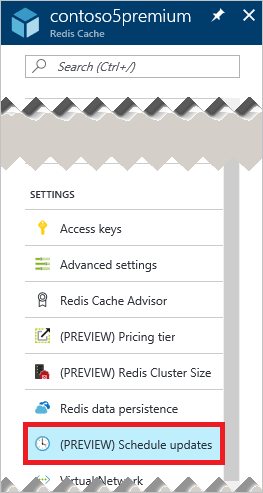
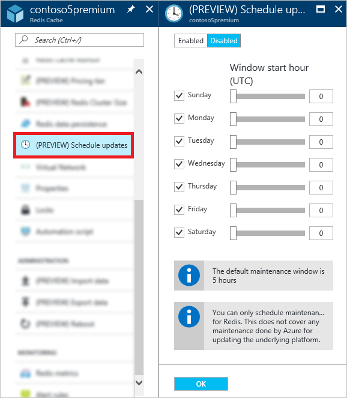

<properties 
	pageTitle="How to administer Azure Redis Cache | Microsoft Azure"
	description="Learn how to perform administration tasks such as reboot and schedule updates for Azure Redis Cache"
	services="redis-cache"
	documentationCenter="na"
	authors="steved0x"
	manager="douge"
	editor="tysonn" />
<tags 
	ms.service="cache"
	ms.devlang="na"
	ms.topic="article"
	ms.tgt_pltfrm="cache-redis"
	ms.workload="tbd"
	ms.date="07/13/2016"
	ms.author="sdanie" />

# How to administer Azure Redis Cache

This topic describes how to perform administration tasks such as rebooting and scheduling updates for your Azure Redis Cache instances.

>[AZURE.IMPORTANT] The settings and features described in this article are only available for Premium tier caches.

## Administration settings

The Azure Redis Cache **Administration** settings allow you to perform the following administrative tasks for your premium cache. To access administration settings, click **Settings** or **All settings** from the Redis Cache blade and scroll to the **Administration** section in the **Settings** blade.

-	[Reboot](#reboot)
-	[Schedule updates](#schedule-updates)

## Reboot

The **Reboot** blade allows you to reboot one or more nodes of your cache. This enables you to test your application for resiliency in the event of a failure.

If you have a premium cache with clustering enabled, you can select which shards of the cache to reboot.

To reboot one or more nodes of your cache, select the desired nodes and click **Reboot**. If you have a premium cache with clustering enabled, select the shard(s) to reboot and then click **Reboot**. After a few minutes, the selected node(s) reboot, and are back online a few minutes later.

The impact on client applications varies depending on the node(s) that you reboot.

-	**Master** - When the master node is rebooted, Azure Redis Cache fails over to the replica node and promotes it to master. During this failover there may be a short interval in which connections may fail to the cache.
-	**Slave** - When the slave node is rebooted, there is typically no impact to cache clients.
-	**Both master and slave** - When both cache nodes are rebooted, all data is lost in the cache and connections to the cache fail until the primary node comes back online. If you have configured [data persistence](cache-how-to-premium-persistence.md), the most recent backup will be restored when the cache comes back online. Note that any cache writes that occurred after the most recent backup are lost.
-	**Node(s) of a premium cache with clustering enabled** - When you reboot the node(s) of a premium cache with clustering enabled, the behavior is the same as when you reboot node(s) of a non-clustered cache.

>[AZURE.IMPORTANT] Reboot is only available for Premium tier caches.

## Reboot FAQ

-	[Which node should I reboot to test my application?](#which-node-should-i-reboot-to-test-my-application)
-	[Can I reboot the cache to clear client connections?](#can-i-reboot-the-cache-to-clear-client-connections)
-	[Will I lose data from my cache if I do a reboot?](#will-i-lose-data-from-my-cache-if-i-do-a-reboot)
-	[Can I reboot my cache using PowerShell, CLI, or other management tools?](#can-i-reboot-my-cache-using-powershell-cli-or-other-management-tools)
-	[What pricing tiers can use the reboot functionality?](#what-pricing-tiers-can-use-the-reboot-functionality)

### Which node should I reboot to test my application?

To test the resiliency of your application against failure of the primary node of your cache, reboot the **Master** node. To test the resiliency of your application against failure of the secondary node, reboot the **Slave** node. To test the resiliency of your application against total failure of the cache, reboot **Both** nodes.

### Can I reboot the cache to clear client connections?

Yes, if you reboot the cache all client connections are cleared. This can useful in the case where all client connections are used up, for example due to a logic error or a bug in the client application. Each pricing tier has different [client connection limits](cache-configure.md#default-redis-server-configuration) for the various sizes, and once these limits are reached, no more client connections are accepted. Rebooting the cache provides a way to clear all client connections.

>[AZURE.IMPORTANT] If your client connections are used up due to a logic error or bug in your client code, note that StackExchange.Redis will automatically reconnect once the Redis node is back online. If the underlying issue is not resolved, the client connections will continue to be used up.

### Will I lose data from my cache if I do a reboot?

If you reboot both the **Master** and **Slave** nodes all data in the cache (or in that shard if you are using a premium cache with clustering enabled) is lost. If you have configured [data persistence](cache-how-to-premium-persistence.md), the most recent backup will be restored when the cache comes back online. Note that any cache writes that have occurred after the backup was made are lost.

If you reboot just one of the nodes, data is not typically lost, but it still may be. For example if the master node is rebooted and a cache write is in progress, the data from the cache write is lost. Another scenario for data loss would be if you reboot one node and the other node happens to go down due to a failure at the same time. For more information about possible causes for data loss, see [What happened to my data in Redis?](https://gist.github.com/JonCole/b6354d92a2d51c141490f10142884ea4#file-whathappenedtomydatainredis-md).

### Can I reboot my cache using PowerShell, CLI, or other management tools?

Yes, for PowerShell instructions see [To reboot a Redis cache](cache-howto-manage-redis-cache-powershell.md#to-reboot-a-redis-cache).

### What pricing tiers can use the reboot functionality?

Reboot is available only in the premium pricing tier.

## Schedule updates

The **Schedule updates** blade allows you to designate a maintenance window for your cache. When the maintenance window is specified, any Redis server updates are made during this window. Note that the maintenance window applies only to Redis server updates, and not to any Azure updates or updates to the operating system of the VMs that host the cache.

To specify a maintenance window, check the desired days and specify the maintenance window start hour for each day, and click **OK**. Note that the maintenance window time is in UTC. 

## Schedule updates FAQ

-	[When do updates occur if I don't use the schedule updates feature?](#when-do-updates-occur-if-i-dont-use-the-schedule-updates-feature)
-	[What type of updates are made during the scheduled maintenance window?](#what-type-of-updates-are-made-during-the-scheduled-maintenance-window)
-	[What pricing tiers can use the schedule updates functionality?](#what-pricing-tiers-can-use-the-schedule-updates-functionality)

### When do updates occur if I don't use the schedule updates feature?

If you don't specify a maintenance window, updates can be made at any time.

### What type of updates are made during the scheduled maintenance window?

Only Redis server updates are made during the scheduled maintenance window. The maintenance window does not apply to Azure updates or updates to the VM operating system.

### What pricing tiers can use the schedule updates functionality?

Schedule updates is available only in the premium pricing tier.

## Next steps

-	Explore more [Azure Redis Cache premium tier](cache-premium-tier-intro.md) features.

