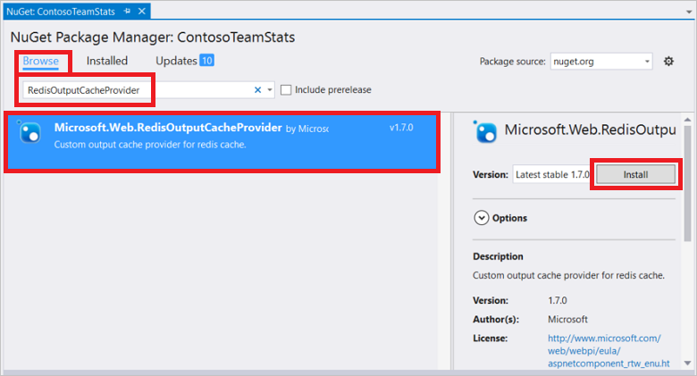

<properties
	pageTitle="Cache ASP.NET Output Cache Provider"
	description="Learn how to cache ASP.NET Page Output using Azure Redis Cache"
	services="redis-cache"
	documentationCenter="na"
	authors="steved0x"
	manager="erikre"
	editor="tysonn" />
<tags
	ms.service="cache"
	ms.devlang="na"
	ms.topic="article"
	ms.tgt_pltfrm="cache-redis"
	ms.workload="tbd"
	ms.date="07/12/2016"
	ms.author="sdanie" />

# ASP.NET Output Cache Provider for Azure Redis Cache

The Redis Output Cache Provider is an out-of-process storage mechanism for output cache data. This data is specifically for full HTTP responses (page output caching). The provider plugs into the new output cache provider extensibility point that was introduced in ASP.NET 4.

To use the Redis Output Cache Provider, first configure your cache, and then configure your ASP.NET application using the Redis Output Cache Provider NuGet package. This topic provides guidance on configuring your application to use the Redis Output Cache Provider. For more information about creating and configuring an Azure Redis Cache instance, see [Create a cache](cache-dotnet-how-to-use-azure-redis-cache.md#create-a-cache).

## Store ASP.NET page output in the cache

To configure a client application in Visual Studio using the Redis Output Cache Provider NuGet package, right-click the project in **Solution Explorer** and choose **Manage NuGet Packages**.

Type **RedisOutputCacheProvider** into the search text box, select it from the results, and click **Install**.

The Redis Output Cache Provider NuGet package has a dependency on the StackExchange.Redis.StrongName package. If the StackExchange.Redis.StrongName package is not present in your project it will be installed. Note that in addition to the strong-named StackExchange.Redis.StrongName package there is also the StackExchange.Redis non-strong-named version. If your project is using the non-strong-named StackExchange.Redis version you must uninstall it, either before or after installing the Redis Output Cache Provider NuGet package, otherwise you will get naming conflicts in your project. For more information about these packages, see [Configure .NET cache clients](cache-dotnet-how-to-use-azure-redis-cache.md#configure-the-cache-clients).

The NuGet package downloads and adds the required assembly references and adds the following section into your web.config file that contains the required configuration for your ASP.NET application to use the Redis Output Cache Provider.

    <caching>
      <outputCachedefault Provider="MyRedisOutputCache">
        <providers>
          <!--
          <add name="MyRedisOutputCache"
            host = "127.0.0.1" [String]
            port = "" [number]
            accessKey = "" [String]
            ssl = "false" [true|false]
            databaseId = "0" [number]
            applicationName = "" [String]
            connectionTimeoutInMilliseconds = "5000" [number]
            operationTimeoutInMilliseconds = "5000" [number]
          />
          -->
          <add name="MyRedisOutputCache" type="Microsoft.Web.Redis.RedisOutputCacheProvider" host="127.0.0.1" accessKey="" ssl="false"/>
        </providers>
      </outputCache>
    </caching>

The commented section provides an example of the attributes and sample settings for each attribute.

Configure the attributes with the values from your cache blade in the Microsoft Azure portal, and configure the other values as desired. For instructions on accessing your cache properties, see [Configure Redis cache settings](cache-configure.md#configure-redis-cache-settings).

-	**host** – specify your cache endpoint.
-	**port** – use either your non-SSL port or your SSL port, depending on the ssl settings.
-	**accessKey** – use either the primary or secondary key for your cache.
-	**ssl** – true if you want to secure cache/client communications with ssl; otherwise false. Be sure to specify the correct port.
	-	The non-SSL port is disabled by default for new caches. Specify true for this setting to use the SSL port. For more information about enabling the non-SSL port, see the [Access Ports](cache-configure.md#access-ports) section in the [Configure a cache](cache-configure.md) topic.
-	**databaseId** – Specified which database to use for cache output data. If not specified, the default value of 0 is used.
-	**applicationName** – Keys are stored in redis as <AppName>_<SessionId>_Data. This enables multiple applications to share the same key. This parameter is optional and if you do not provide it a default value is used.
-	**connectionTimeoutInMilliseconds** – This setting allows you to override the connectTimeout setting in the StackExchange.Redis client. If not specified, the default connectTimeout setting of 5000 is used. For more information, see [StackExchange.Redis configuration model](http://go.microsoft.com/fwlink/?LinkId=398705).
-	**operationTimeoutInMilliseconds** – This setting allows you to override the syncTimeout setting in the StackExchange.Redis client. If not specified, the default syncTimeout setting of 1000 is used. For more information, see [StackExchange.Redis configuration model](http://go.microsoft.com/fwlink/?LinkId=398705).

Add an OutputCache directive to each page for which you wish to cache the output.

    <%@ OutputCache Duration="60" VaryByParam="*" %>

In this example the cached page data will remain in the cache for 60 seconds, and a different version of the page will be cached for each parameter combination. For more information about the OutputCache directive, see [@OutputCache](http://go.microsoft.com/fwlink/?linkid=320837).

Once these steps are performed, your application is configured to use the Redis Output Cache Provider.

## Next steps

Check out the [ASP.NET Session State Provider for Azure Redis Cache](cache-aspnet-session-state-provider.md).
