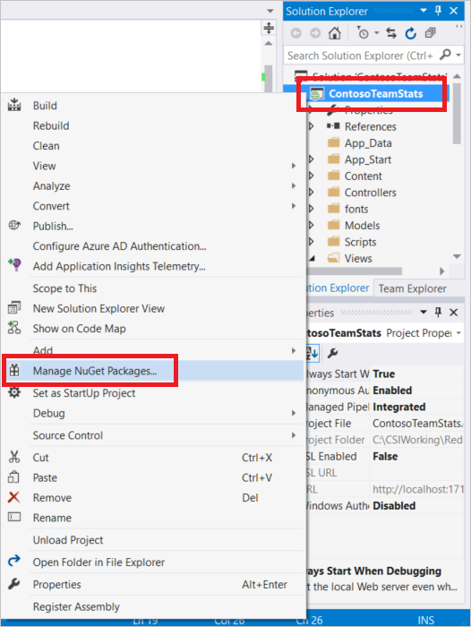
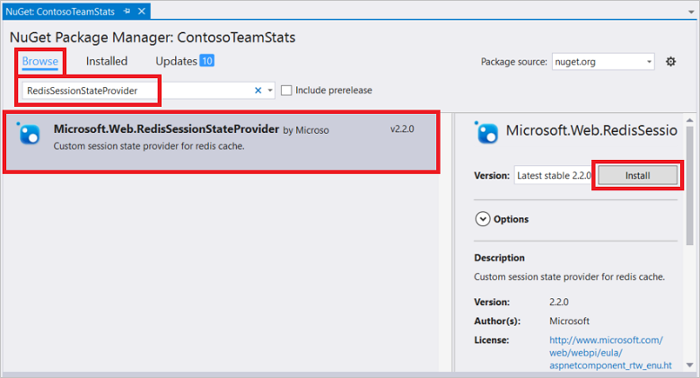

<properties
	pageTitle="Cache ASP.NET Session State Provider | Microsoft Azure"
	description="Learn how to store ASP.NET Session State using Azure Redis Cache"
	services="redis-cache"
	documentationCenter="na"
	authors="steved0x"
	manager="douge"
	editor="tysonn" />
<tags
	ms.service="cache"
	ms.devlang="na"
	ms.topic="article"
	ms.tgt_pltfrm="cache-redis"
	ms.workload="tbd"
	ms.date="07/12/2016"
	ms.author="sdanie" />

# ASP.NET Session State Provider for Azure Redis Cache

Azure Redis Cache provides a session state provider that you can use to store your session state in a cache rather than in-memory or in a SQL Server database. To use the caching session state provider, first configure your cache, and then configure your ASP.NET application for cache using the Redis Cache Session State NuGet package.

It's often not practical in a real-world cloud app to avoid storing some form of state for a user session, but some approaches impact performance and scalability more than others. If you have to store state, the best solution is to keep the amount of state small and store it in cookies. If that isn't feasible, the next best solution is to use ASP.NET session state with a provider for distributed, in-memory cache. The worst solution from a performance and scalability standpoint is to use a database backed session state provider. This topic provides guidance on using the ASP.NET Session State Provider for Azure Redis Cache. For information on other session state options, see [ASP.NET Session State options](#aspnet-session-state-options).

## Store ASP.NET session state in the cache

To configure a client application in Visual Studio using the Redis Cache Session State NuGet package, right-click the project in **Solution Explorer** and choose **Manage NuGet Packages**.

Type **RedisSessionStateProvider** into the search text box, select it from the results, and click **Install**.

>[AZURE.IMPORTANT] If you are using the clustering feature from the premium tier, you must use [RedisSessionStateProvider](https://www.nuget.org/packages/Microsoft.Web.RedisSessionStateProvider) 2.0.1 or higher or an exception is thrown. This is a breaking change; for more information see [v2.0.0 Breaking Change Details](https://github.com/Azure/aspnet-redis-providers/wiki/v2.0.0-Breaking-Change-Details).

The Redis Session State Provider NuGet package has a dependency on the StackExchange.Redis.StrongName package. If the StackExchange.Redis.StrongName package is not present in your project it will be installed. Note that in addition to the strong-named StackExchange.Redis.StrongName package there is also the StackExchange.Redis non-strong-named version. If your project is using the non-strong-named StackExchange.Redis version you must uninstall it, either before or after installing the Redis Session State Provider NuGet package, otherwise you will get naming conflicts in your project. For more information about these packages, see [Configure .NET cache clients](cache-dotnet-how-to-use-azure-redis-cache.md#configure-the-cache-clients).

The NuGet package downloads and adds the required assembly references and adds the following adds the following section into your web.config file that contains the required configuration for your ASP.NET application to use the Redis Cache Session State Provider.

    <sessionState mode="Custom" customProvider="MySessionStateStore">
        <providers>
        <!--
		<add name="MySessionStateStore"
     	  	host = "127.0.0.1" [String]
    		port = "" [number]
    		accessKey = "" [String]
    		ssl = "false" [true|false]
    		throwOnError = "true" [true|false]
    		retryTimeoutInMilliseconds = "0" [number]
    		databaseId = "0" [number]
    		applicationName = "" [String]
    		connectionTimeoutInMilliseconds = "5000" [number]
    		operationTimeoutInMilliseconds = "5000" [number]
		/>
        -->
		<add name="MySessionStateStore" type="Microsoft.Web.Redis.RedisSessionStateProvider" host="127.0.0.1" accessKey="" ssl="false"/>
        </providers>
    </sessionState>

The commented section provides an example of the attributes and sample settings for each attribute.

Configure the attributes with the values from your cache blade in the Microsoft Azure Portal, and configure the other values as desired. For instructions on accessing your cache properties, see [Configure Redis cache settings](cache-configure.md#configure-redis-cache-settings).

-	**host** – specify your cache endpoint.
-	**port** – use either your non-SSL port or your SSL port, depending on the ssl settings.
-	**accessKey** – use either the primary or secondary key for your cache.
-	**ssl** – true if you want to secure cache/client communications with ssl; otherwise false. Be sure to specify the correct port.
	-	The non-SSL port is disabled by default for new caches. Specify true for this setting to use the SSL port. For more information about enabling the non-SSL port, see the [Access Ports](cache-configure.md#access-ports) section in the [Configure a cache](cache-configure.md) topic.
-	**throwOnError** – true if you want an exception to be thrown in the event of a failure, or false if you want the operation to fail silently. You can check for a failure by checking the static Microsoft.Web.Redis.RedisSessionStateProvider.LastException property. The default is true.
-	**retryTimeoutInMilliseconds** – Operations that fail are retried during this interval, specified in milliseconds. The first retry occurs after 20 milliseconds, and then retries occur every second until the retryTimeoutInMilliseconds interval expires. Immediately after this interval, the operation is retried one final time. If the operation still fails, the exception is thrown back to the caller, depending on the throwOnError setting. The default value is 0 which means no retries.
-	**databaseId** – Specifies which database to use for cache output data. If not specified, the default value of 0 is used.
-	**applicationName** – Keys are stored in redis as `{<Application Name>_<Session ID>}_Data`. This enables multiple applications to share the same key. This parameter is optional and if you do not provide it a default value is used.
-	**connectionTimeoutInMilliseconds** – This setting allows you to override the connectTimeout setting in the StackExchange.Redis client. If not specified, the default connectTimeout setting of 5000 is used. For more information, see [StackExchange.Redis configuration model](http://go.microsoft.com/fwlink/?LinkId=398705).
-	**operationTimeoutInMilliseconds** – This setting allows you to override the syncTimeout setting in the StackExchange.Redis client. If not specified, the default syncTimeout setting of 1000 is used. For more information, see [StackExchange.Redis configuration model](http://go.microsoft.com/fwlink/?LinkId=398705).

For more information about these properties, see the original blog post announcement at [Announcing ASP.NET Session State Provider for Redis](http://blogs.msdn.com/b/webdev/archive/2014/05/12/announcing-asp-net-session-state-provider-for-redis-preview-release.aspx).

Don’t forget to comment out the standard InProc session state provider section in your web.config.

    <!-- <sessionState mode="InProc"
         customProvider="DefaultSessionProvider">
         <providers>
            <add name="DefaultSessionProvider"
                  type="System.Web.Providers.DefaultSessionStateProvider,
                        System.Web.Providers, Version=1.0.0.0, Culture=neutral,
                        PublicKeyToken=31bf3856ad364e35"
                  connectionStringName="DefaultConnection" />
          </providers>
    </sessionState> -->

Once these steps are performed, your application is configured to use the Redis Cache Session State Provider. When you use session state in your application, it will be stored in an Azure Redis Cache instance.

>[AZURE.NOTE] Note that data stored in the cache must be serializable, unlike the data that can be stored in the default in-memory ASP.NET Session State Provider. When the Session State Provider for Redis is used, be sure that the data types that are being stored in session state are serializable.

## ASP.NET Session State options

- In Memory Session State Provider - This provider stores the Session State in memory. The benefit of using this provider is it is simple and fast. However you cannot scale your Web Apps if you are using in memory provider since it is not distributed.

- Sql Server Session State Provider - This provider stores the Session State in Sql Server. You should use this provider if you want to persist the Session state in a persistent storage. You can scale your Web App but using Sql Server for Session will have a performance impact on your Web App.

- Distributed In Memory Session State Provider such as Redis Cache Session State Provider - This provider gives you the best of both worlds. Your Web App can have a simple, fast and scalable Session State Provider. However you have to keep in consideration that this provider stores the Session state in a Cache and your app has to take in consideration all the characteristics associated when talking to a Distributed In Memory Cache such as transient network failures. For best practices on using Cache, see [Caching guidance](https://github.com/mspnp/azure-guidance/blob/master/Caching.md) from Microsoft Patterns & Practices [Azure Cloud Application Design and Implementation Guidance](https://github.com/mspnp/azure-guidance).

For more information about session state and other best practices, see [Web Development Best Practices (Building Real-World Cloud Apps with Azure)](http://www.asp.net/aspnet/overview/developing-apps-with-windows-azure/building-real-world-cloud-apps-with-windows-azure/web-development-best-practices).

## Next steps

Check out the [ASP.NET Output Cache Provider for Azure Redis Cache](cache-aspnet-output-cache-provider.md).
