# How to configure Azure Redis Cache
This topic describes the configurations available for your Azure Redis Cache instances. This topic also covers the default Redis server configuration for Azure Redis Cache instances.

> [!NOTE]
> For more information on configuring and using premium cache features, see [How to configure persistence](cache-how-to-premium-persistence.md), [How to configure clustering](cache-how-to-premium-clustering.md), and [How to configure Virtual Network support](cache-how-to-premium-vnet.md).
> 
> 

## Configure Redis cache settings
[!INCLUDE [redis-cache-create](../../includes/redis-cache-browse.md)]

Azure Redis Cache settings are viewed and configured on the **Redis Cache** blade using the **Resource Menu**.

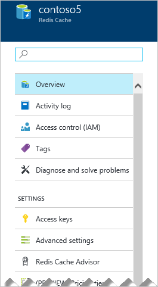

You can view and configure the following settings using the **Resource Menu**.

* [Overview](#overview)
* [Activity log](#activity-log)
* [Access control (IAM)](#access-control-iam)
* [Tags](#tags)
* [Diagnose and solve problems](#diagnose-and-solve-problems)
* [Settings](#settings)
	* [Access keys](#access-keys)
	* [Advanced settings](#advanced-settings)
	* [Redis Cache Advisor](#redis-cache-advisor)
	* [Scale](#scale)
	* [Redis cluster size](#cluster-size)
	* [Redis data persistence](#redis-data-persistence)
	* [Schedule updates](#schedule-updates)
	* [Geo-replication](#geo-replication)
	* [Virtual Network](#virtual-network)
	* [Firewall](#firewall)
	* [Properties](#properties)
	* [Locks](#locks)
	* [Automation script](#automation-script)
* [Administration](#administration)
	* [Import data](#importexport)
	* [Export data](#importexport)
	* [Reboot](#reboot)
* [Monitoring](#monitoring)
	* [Redis metrics](#redis-metrics)
	* [Alert rules](#alert-rules)
	* [Diagnostics](#diagnostics)
* [Support & troubleshooting settings](#support-amp-troubleshooting-settings)
	* [Resource health](#resource-health)
	* [New support request](#new-support-request)


## Overview

**Overview** provides you with basic information about your cache, such as name, ports, pricing tier, and selected cache metrics.

### Activity log

Click **Activity log** to view actions performed on your cache. You can also use filtering to expand this view to include other resources. For more information on working with audit logs, see [Audit operations with Resource Manager](../azure-resource-manager/resource-group-audit.md). For more information on monitoring Azure Redis Cache events, see [Operations and alerts](cache-how-to-monitor.md#operations-and-alerts).

### Access control (IAM)

The **Access control (IAM)** section provides support for role-based access control (RBAC) in the Azure portal. This configuration helps organizations meet their access management requirements simply and precisely. For more information, see [Role-based access control in the Azure portal](../role-based-access-control/role-assignments-portal.md).

### Tags

The **Tags** section helps you organize your resources. For more information, see [Using tags to organize your Azure resources](../azure-resource-manager/resource-group-using-tags.md).


### Diagnose and solve problems

Click **Diagnose and solve problems** to be provided with common issues and strategies for resolving them.


## Settings
The **Settings** section allows you to access and configure the following settings for your cache.

* [Access keys](#access-keys)
* [Advanced settings](#advanced-settings)
* [Redis Cache Advisor](#redis-cache-advisor)
* [Scale](#scale)
* [Redis cluster size](#cluster-size)
* [Redis data persistence](#redis-data-persistence)
* [Schedule updates](#schedule-updates)
* [Geo-replication](#geo-replication)
* [Virtual Network](#virtual-network)
* [Firewall](#firewall)
* [Properties](#properties)
* [Locks](#locks)
* [Automation script](#automation-script)


### Access keys
Click **Access keys** to view or regenerate the access keys for your cache. These keys are used by the clients connecting to your cache.

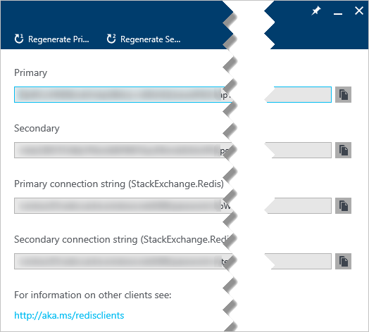

### Advanced settings
The following settings are configured on the **Advanced settings** blade.

* [Access Ports](#access-ports)
* [Memory policies](#memory-policies)
* [Keyspace notifications (advanced settings)](#keyspace-notifications-advanced-settings)

#### Access Ports
By default, non-SSL access is disabled for new caches. To enable the non-SSL port, click **No** for **Allow access only via SSL** on the **Advanced settings** blade and then click **Save**.

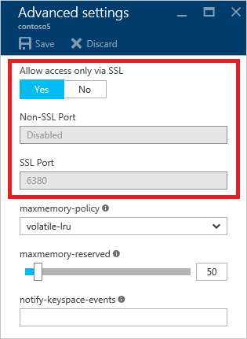

<a name="maxmemory-policy-and-maxmemory-reserved"></a>
#### Memory policies
The **Maxmemory policy**, **maxmemory-reserved**, and **maxfragmentationmemory-reserved** settings on the **Advanced settings** blade configure the memory policies for the cache.

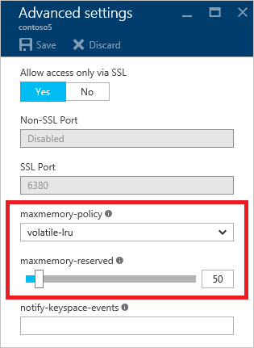

**Maxmemory policy** configures the eviction policy for the cache and allows you to choose from the following eviction policies:

* `volatile-lru` - This is the default eviction policy.
* `allkeys-lru`
* `volatile-random`
* `allkeys-random`
* `volatile-ttl`
* `noeviction`

For more information about `maxmemory` policies, see [Eviction policies](http://redis.io/topics/lru-cache#eviction-policies).

The **maxmemory-reserved** setting configures the amount of memory, in MB, that is reserved for non-cache operations, such as replication during failover. Setting this value allows you to have a more consistent Redis server experience when your load varies. This value should be set higher for workloads that are write heavy. When memory is reserved for such operations, it is unavailable for storage of cached data.

The **maxfragmentationmemory-reserved** setting configures the amount of memory in MB that is reserved to accommodate for memory fragmentation. Setting this value allows you to have a more consistent Redis server experience when the cache is full or close to full and the fragmentation ratio is high. When memory is reserved for such operations, it is unavailable for storage of cached data.

One thing to consider when choosing a new memory reservation value (**maxmemory-reserved** or **maxfragmentationmemory-reserved**) is how this change might affect a cache that is already running with large amounts of data in it. For instance, if you have a 53 GB cache with 49 GB of data, then change the reservation value to 8 GB, this change will drop the max available memory for the system down to 45 GB. If either your current `used_memory` or your `used_memory_rss` values are higher than the new limit of 45 GB, then the system will have to evict data until both `used_memory` and `used_memory_rss` are below 45 GB. Eviction can increase server load and memory fragmentation. For more information on cache metrics such as `used_memory` and `used_memory_rss`, see [Available metrics and reporting intervals](cache-how-to-monitor.md#available-metrics-and-reporting-intervals).

> [!IMPORTANT]
> The **maxmemory-reserved** and **maxfragmentationmemory-reserved** settings are only available for Standard and Premium caches.
> 
> 

#### Keyspace notifications (advanced settings)
Redis keyspace notifications are configured on the **Advanced settings** blade. Keyspace notifications allow clients to receive notifications when certain events occur.

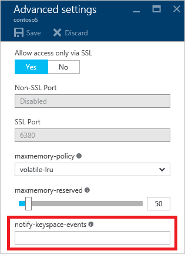

> [!IMPORTANT]
> Keyspace notifications and the **notify-keyspace-events** setting are only available for Standard and Premium caches.
> 
> 

For more information, see [Redis Keyspace Notifications](http://redis.io/topics/notifications). For sample code, see the [KeySpaceNotifications.cs](https://github.com/rustd/RedisSamples/blob/master/HelloWorld/KeySpaceNotifications.cs) file in the [Hello world](https://github.com/rustd/RedisSamples/tree/master/HelloWorld) sample.


<a name="recommendations"></a>
## Redis Cache Advisor
The **Redis Cache Advisor** blade displays recommendations for your cache. During normal operations, no recommendations are displayed. 


If any conditions occur during the operations of your cache such as high memory usage, network bandwidth, or server load, an alert is displayed on the **Redis Cache** blade.

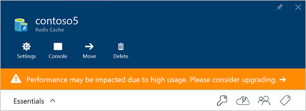

Further information can be found on the **Recommendations** blade.


You can monitor these metrics on the [Monitoring charts](cache-how-to-monitor.md#monitoring-charts) and [Usage charts](cache-how-to-monitor.md#usage-charts) sections of the **Redis Cache** blade.

Each pricing tier has different limits for client connections, memory, and bandwidth. If your cache approaches maximum capacity for these metrics over a sustained period of time, a recommendation is created. For more information about the metrics and limits reviewed by the **Recommendations** tool, see the following table:

| Redis Cache metric | More information |
| --- | --- |
| Network bandwidth usage |[Cache performance - available bandwidth](cache-faq.md#cache-performance) |
| Connected clients |[Default Redis server configuration - maxclients](#maxclients) |
| Server load |[Usage charts - Redis Server Load](cache-how-to-monitor.md#usage-charts) |
| Memory usage |[Cache performance - size](cache-faq.md#cache-performance) |

To upgrade your cache, click **Upgrade now** to change the pricing tier and [scale](#scale) your cache. For more information on choosing a pricing tier, see [What Redis Cache offering and size should I use?](cache-faq.md#what-redis-cache-offering-and-size-should-i-use)


### Scale
Click **Scale** to view or change the pricing tier for your cache. For more information on scaling, see [How to Scale Azure Redis Cache](cache-how-to-scale.md).

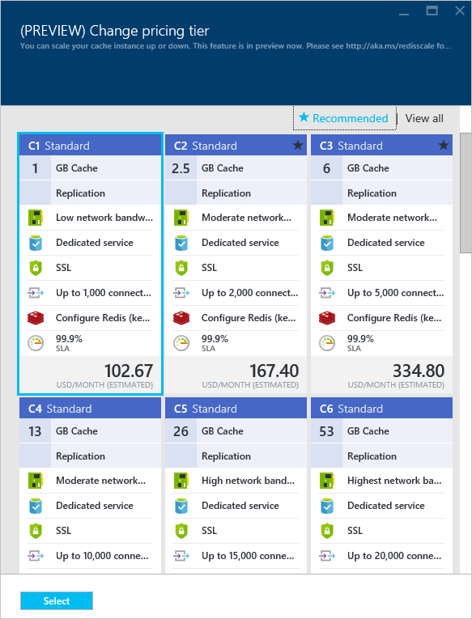

<a name="cluster-size"></a>

### Redis Cluster Size
Click **(PREVIEW) Redis Cluster Size** to change the cluster size for a running premium cache with clustering enabled.

> [!NOTE]
> Note that while the Azure Redis Cache Premium tier has been released to General Availability, the Redis Cluster Size feature is currently in preview.
> 
> 


To change the cluster size, use the slider or type a number between 1 and 10 in the **Shard count** text box and click **OK** to save.

> [!IMPORTANT]
> Redis clustering is only available for Premium caches. For more information, see [How to configure clustering for a Premium Azure Redis Cache](cache-how-to-premium-clustering.md).
> 
> 


### Redis data persistence
Click **Redis data persistence** to enable, disable, or configure data persistence for your premium cache. Azure Redis Cache offers Redis persistence using either [RDB persistence](cache-how-to-premium-persistence.md#configure-rdb-persistence) or [AOF persistence](cache-how-to-premium-persistence.md#configure-aof-persistence).

For more information, see [How to configure persistence for a Premium Azure Redis Cache](cache-how-to-premium-persistence.md).


> [!IMPORTANT]
> Redis data persistence is only available for Premium caches. 
> 
> 

### Schedule updates
The **Schedule updates** blade allows you to designate a maintenance window for Redis server updates for your cache. 

> [!IMPORTANT]
> The maintenance window applies only to Redis server updates, and not to any Azure updates or updates to the operating system of the VMs that host the cache.
> 
> 


To specify a maintenance window, check the desired days and specify the maintenance window start hour for each day, and click **OK**. Note that the maintenance window time is in UTC. 

> [!IMPORTANT]
> The **Schedule updates** functionality is only available for Premium tier caches. For more information and instructions, see [Azure Redis Cache administration - Schedule updates](cache-administration.md#schedule-updates).
> 
> 

### Geo-replication

The **Geo-replication** blade provides a mechanism for linking two Premium tier Azure Redis Cache instances. One cache is designated as the primary linked cache, and the other as the secondary linked cache. The secondary linked cache becomes read-only, and data written to the primary cache is replicated to the secondary linked cache. This functionality can be used to replicate a cache across Azure regions.

> [!IMPORTANT]
> **Geo-replication** is only available for Premium tier caches. For more information and instructions, see [How to configure Geo-replication for Azure Redis Cache](cache-how-to-geo-replication.md).
> 
> 

### Virtual Network
The **Virtual Network** section allows you to configure the virtual network settings for your cache. For information on creating a premium cache with VNET support and updating its settings, see [How to configure Virtual Network Support for a Premium Azure Redis Cache](cache-how-to-premium-vnet.md).

> [!IMPORTANT]
> Virtual network settings are only available for premium caches that were configured with VNET support during cache creation. 
> 
> 

### Firewall

Firewall rules configuration is available for all Azure Redis Cache tiers.

Click **Firewall** to view and configure firewall rules for cache.


You can specify firewall rules with a start and end IP address range. When firewall rules are configured, only client connections from the specified IP address ranges can connect to the cache. When a firewall rule is saved, there is a short delay before the rule is effective. This delay is typically less than one minute.

> [!IMPORTANT]
> Connections from Azure Redis Cache monitoring systems are always permitted, even if firewall rules are configured.
> 
> 

### Properties
Click **Properties** to view information about your cache, including the cache endpoint and ports.

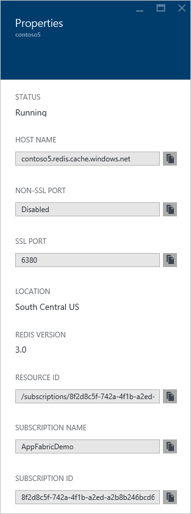

### Locks
The **Locks** section allows you to lock a subscription, resource group, or resource to prevent other users in your organization from accidentally deleting or modifying critical resources. For more information, see [Lock resources with Azure Resource Manager](../azure-resource-manager/resource-group-lock-resources.md).

### Automation script

Click **Automation script** to build and export a template of your deployed resources for future deployments. For more information about working with templates, see [Deploy resources with Azure Resource Manager templates](../azure-resource-manager/resource-group-template-deploy.md).

## Administration settings
The settings in the **Administration** section allow you to perform the following administrative tasks for your cache. 

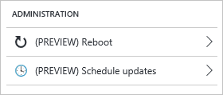

* [Import data](#importexport)
* [Export data](#importexport)
* [Reboot](#reboot)


### Import/Export
Import/Export is an Azure Redis Cache data management operation, which allows you to import and export data in the cache by importing and exporting a Redis Cache Database (RDB) snapshot from a premium cache to a page blob in an Azure Storage Account. Import/Export enables you to migrate between different Azure Redis Cache instances or populate the cache with data before use.

Import can be used to bring Redis compatible RDB files from any Redis server running in any cloud or environment, including Redis running on Linux, Windows, or any cloud provider such as Amazon Web Services and others. Importing data is an easy way to create a cache with pre-populated data. During the import process, Azure Redis Cache loads the RDB files from Azure storage into memory, and then inserts the keys into the cache.

Export allows you to export the data stored in Azure Redis Cache to Redis compatible RDB files. You can use this feature to move data from one Azure Redis Cache instance to another or to another Redis server. During the export process, a temporary file is created on the VM that hosts the Azure Redis Cache server instance, and the file is uploaded to the designated storage account. When the export operation completes with either a status of success or failure, the temporary file is deleted.

> [!IMPORTANT]
> Import/Export is only available for Premium tier caches. For more information and instructions, see [Import and Export data in Azure Redis Cache](cache-how-to-import-export-data.md).
> 
> 

### Reboot
The **Reboot** blade allows you to reboot the nodes of your cache. This reboot capability enables you to test your application for resiliency if there is a failure of a cache node.


If you have a premium cache with clustering enabled, you can select which shards of the cache to reboot.


To reboot one or more nodes of your cache, select the desired nodes and click **Reboot**. If you have a premium cache with clustering enabled, select the shard(s) to reboot and then click **Reboot**. After a few minutes, the selected node(s) reboot, and are back online a few minutes later.

> [!IMPORTANT]
> Reboot is now available for all pricing tiers. For more information and instructions, see [Azure Redis Cache administration - Reboot](cache-administration.md#reboot).
> 
> 


## Monitoring

The **Monitoring** section allows you to configure diagnostics and monitoring for your Redis Cache. 
For more information on Azure Redis Cache monitoring and diagnostics, see [How to monitor Azure Redis Cache](cache-how-to-monitor.md).

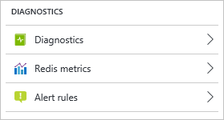

* [Redis metrics](#redis-metrics)
* [Alert rules](#alert-rules)
* [Diagnostics](#diagnostics)

### Redis metrics
Click **Redis metrics** to [view metrics](cache-how-to-monitor.md#view-cache-metrics) for your cache.

### Alert rules

Click **Alert rules** to configure alerts based on Redis Cache metrics. For more information, see [Alerts](cache-how-to-monitor.md#alerts).

### Diagnostics

By default, cache metrics in Azure Monitor are [stored for 30 days](../monitoring/monitoring-data-collection.md#metrics) and then deleted. To persist your cache metrics for longer than 30 days, click **Diagnostics** to [configure the storage account](cache-how-to-monitor.md#export-cache-metrics) used to store cache diagnostics.

>[!NOTE]
>In addition to archiving your cache metrics to storage, you can also [stream them to an Event hub or send them to Log Analytics](../monitoring-and-diagnostics/monitor-stream-monitoring-data-event-hubs.md).
>
>

## Support & troubleshooting settings
The settings in the **Support + troubleshooting** section provide you with options for resolving issues with your cache.

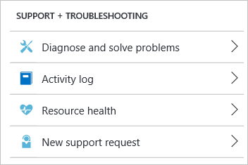

* [Resource health](#resource-health)
* [New support request](#new-support-request)

### Resource health
**Resource health** watches your resource and tells you if it's running as expected. For more information about the Azure Resource health service, see [Azure Resource health overview](../resource-health/resource-health-overview.md).

> [!NOTE]
> Resource health is currently unable to report on the health of Azure Redis Cache instances hosted in a virtual network. For more information, see [Do all cache features work when hosting a cache in a VNET?](cache-how-to-premium-vnet.md#do-all-cache-features-work-when-hosting-a-cache-in-a-vnet)
> 
> 

### New support request
Click **New support request** to open a support request for your cache.


## Default Redis server configuration
New Azure Redis Cache instances are configured with the following default Redis configuration values:

> [!NOTE]
> The settings in this section cannot be changed using the `StackExchange.Redis.IServer.ConfigSet` method. If this method is called with one of the commands in this section, an exception similar to the following example is thrown:  
> 
> `StackExchange.Redis.RedisServerException: ERR unknown command 'CONFIG'`
> 
> Any values that are configurable, such as **max-memory-policy**, are configurable through the Azure portal or command-line management tools such as Azure CLI or PowerShell.
> 
> 

| Setting | Default value | Description |
| --- | --- | --- |
| `databases` |16 |The default number of databases is 16 but you can configure a different number based on the pricing tier.<sup>1</sup> The default database is DB 0, you can select a different one on a per-connection basis using `connection.GetDatabase(dbid)` where `dbid` is a number between `0` and `databases - 1`. |
| `maxclients` |Depends on the pricing tier<sup>2</sup> |This value is the maximum number of connected clients allowed at the same time. Once the limit is reached Redis closes all the new connections, returning a 'max number of clients reached' error. |
| `maxmemory-policy` |`volatile-lru` |Maxmemory policy is the setting for how Redis selects what to remove when `maxmemory` (the size of the cache offering you selected when you created the cache) is reached. With Azure Redis Cache the default setting is `volatile-lru`, which removes the keys with an expiration set using an LRU algorithm. This setting can be configured in the Azure portal. For more information, see [Memory policies](#memory-policies). |
| `maxmemory-samples` |3 |To save memory, LRU and minimal TTL algorithms are approximated algorithms instead of precise algorithms. By default Redis checks three keys and picks the one that was used less recently. |
| `lua-time-limit` |5,000 |Max execution time of a Lua script in milliseconds. If the maximum execution time is reached, Redis logs that a script is still in execution after the maximum allowed time, and starts to reply to queries with an error. |
| `lua-event-limit` |500 |Max size of script event queue. |
| `client-output-buffer-limit` `normalclient-output-buffer-limit` `pubsub` |0 0 032mb 8mb 60 |The client output buffer limits can be used to force disconnection of clients that are not reading data from the server fast enough for some reason (a common reason is that a Pub/Sub client can't consume messages as fast as the publisher can produce them). For more information, see [http://redis.io/topics/clients](http://redis.io/topics/clients). |

<a name="databases"></a>
<sup>1</sup>The limit for `databases` is different for each Azure Redis Cache pricing tier and can be set at cache creation. If no `databases` setting is specified during cache creation, the default is 16.

* Basic and Standard caches
  * C0 (250 MB) cache - up to 16 databases
  * C1 (1 GB) cache - up to 16 databases
  * C2 (2.5 GB) cache - up to 16 databases
  * C3 (6 GB) cache - up to 16 databases
  * C4 (13 GB) cache - up to 32 databases
  * C5 (26 GB) cache - up to 48 databases
  * C6 (53 GB) cache - up to 64 databases
* Premium caches
  * P1 (6 GB - 60 GB) - up to 16 databases
  * P2 (13 GB - 130 GB) - up to 32 databases
  * P3 (26 GB - 260 GB) - up to 48 databases
  * P4 (53 GB - 530 GB) - up to 64 databases
  * All premium caches with Redis cluster enabled - Redis cluster only supports use of database 0 so the `databases` limit for any premium cache with Redis cluster enabled is effectively 1 and the [Select](http://redis.io/commands/select) command is not allowed. For more information, see [Do I need to make any changes to my client application to use clustering?](cache-how-to-premium-clustering.md#do-i-need-to-make-any-changes-to-my-client-application-to-use-clustering)

For more information about databases, see [What are Redis databases?](cache-faq.md#what-are-redis-databases)

> [!NOTE]
> The `databases` setting can be configured only during cache creation and only using PowerShell, CLI, or other management clients. For an example of configuring `databases` during cache creation using PowerShell, see [New-AzureRmRedisCache](cache-howto-manage-redis-cache-powershell.md#databases).
> 
> 

<a name="maxclients"></a>
<sup>2</sup>`maxclients` is different for each Azure Redis Cache pricing tier.

* Basic and Standard caches
  * C0 (250 MB) cache - up to 256 connections
  * C1 (1 GB) cache - up to 1,000 connections
  * C2 (2.5 GB) cache - up to 2,000 connections
  * C3 (6 GB) cache - up to 5,000 connections
  * C4 (13 GB) cache - up to 10,000 connections
  * C5 (26 GB) cache - up to 15,000 connections
  * C6 (53 GB) cache - up to 20,000 connections
* Premium caches
  * P1 (6 GB - 60 GB) - up to 7,500 connections
  * P2 (13 GB - 130 GB) - up to 15,000 connections
  * P3 (26 GB - 260 GB) - up to 30,000 connections
  * P4 (53 GB - 530 GB) - up to 40,000 connections

> [!NOTE]
> While each size of cache allows *up to* a certain number of connections, each connection to Redis has overhead associated with it. An example of such overhead would be CPU and memory usage as a result of TLS/SSL encryption. The maximum connection limit for a given cache size assumes a lightly loaded cache. If load from connection overhead *plus* load from client operations exceeds capacity for the system, the cache can experience capacity issues even if you have not exceeded the connection limit for the current cache size.
> 
> 


## Redis commands not supported in Azure Redis Cache
> [!IMPORTANT]
> Because configuration and management of Azure Redis Cache instances is managed by Microsoft, the following commands are disabled. If you try to invoke them, you receive an error message similar to `"(error) ERR unknown command"`.
> 
> * BGREWRITEAOF
> * BGSAVE
> * CONFIG
> * DEBUG
> * MIGRATE
> * SAVE
> * SHUTDOWN
> * SLAVEOF
> * CLUSTER - Cluster write commands are disabled, but read-only Cluster commands are permitted.
> 
> 

For more information about Redis commands, see [http://redis.io/commands](http://redis.io/commands).

## Redis console
You can securely issue commands to your Azure Redis Cache instances using the **Redis Console**, which is available in the Azure portal for all cache tiers.

> [!IMPORTANT]
> - The Redis Console does not work with [VNET](cache-how-to-premium-vnet.md). When your cache is part of a VNET, only clients in the VNET can access the cache. Because Redis Console runs in your local browser, which is outside the VNET, it can't connect to your cache.
> - Not all Redis commands are supported in Azure Redis Cache. For a list of Redis commands that are disabled for Azure Redis Cache, see the previous [Redis commands not supported in Azure Redis Cache](#redis-commands-not-supported-in-azure-redis-cache) section. For more information about Redis commands, see [http://redis.io/commands](http://redis.io/commands).
> 
> 

To access the Redis Console, click **Console** from the **Redis Cache** blade.

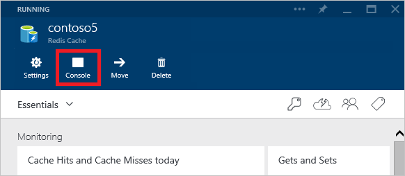

To issue commands against your cache instance, simply type the desired command into the console.

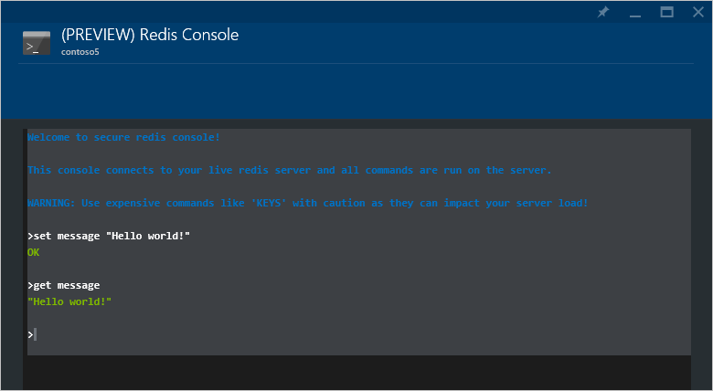


### Using the Redis Console with a premium clustered cache

When using the Redis Console with a premium clustered cache, you can issue commands to a single shard of the cache. To issue a command to a specific shard, first connect to the desired shard by clicking it on the shard picker.


If you attempt to access a key that is stored in a different shard than the connected shard, you receive an error message similar to the following message:

```
shard1>get myKey
(error) MOVED 866 13.90.202.154:13000 (shard 0)
```

In the previous example, shard 1 is the selected shard, but `myKey` is located in shard 0, as indicated by the `(shard 0)` portion of the error message. In this example, to access `myKey`, select shard 0 using the shard picker, and then issue the desired command.


## Move your cache to a new subscription
You can move your cache to a new subscription by clicking **Move**.

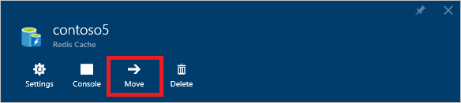

For information on moving resources from one resource group to another, and from one subscription to another, see [Move resources to new resource group or subscription](../azure-resource-manager/resource-group-move-resources.md).

## Next steps
* For more information on working with Redis commands, see [How can I run Redis commands?](cache-faq.md#how-can-i-run-redis-commands)

