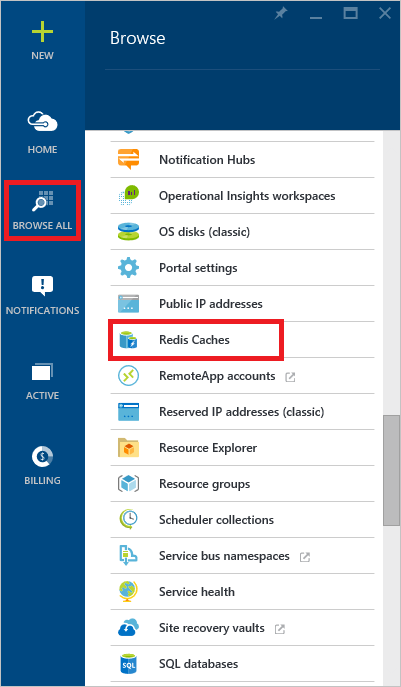
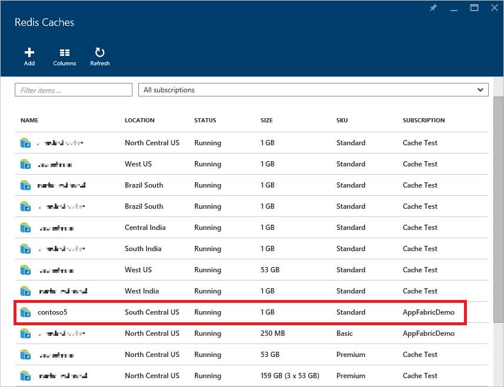
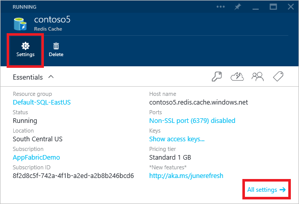
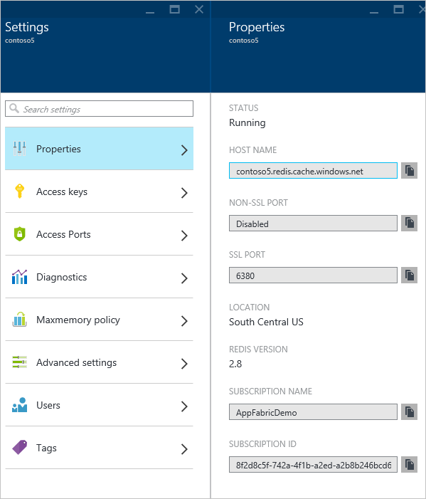
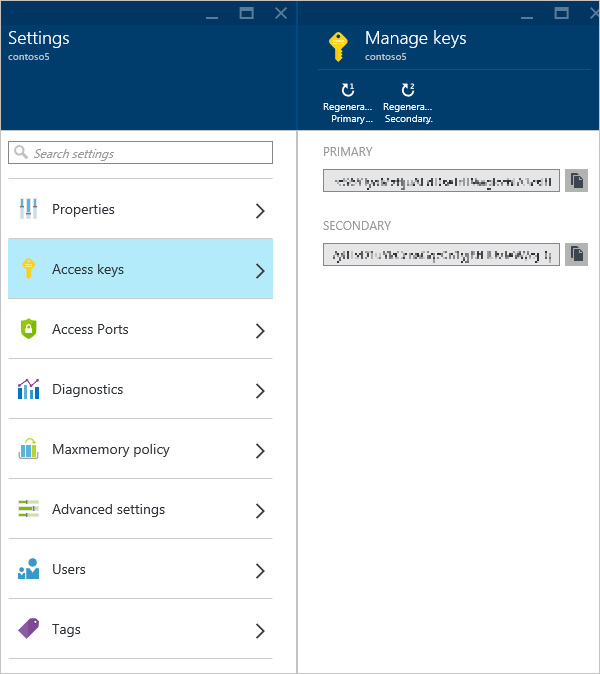
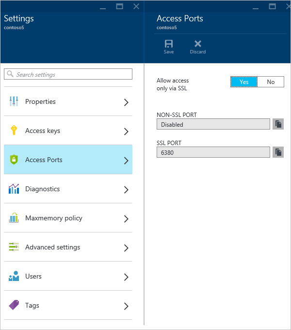
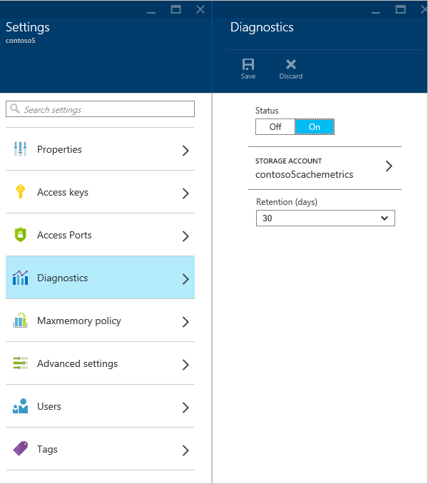
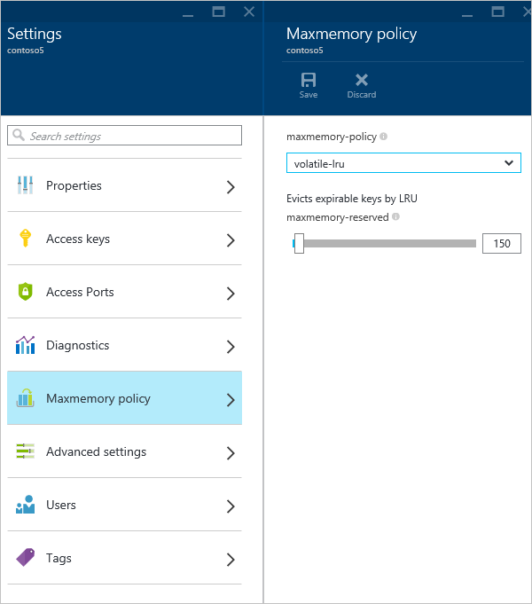
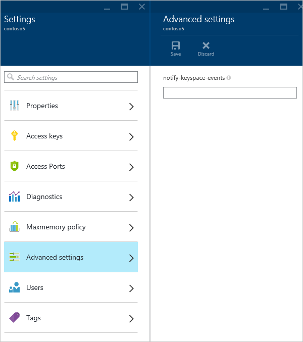
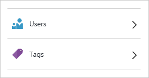

<properties 
   pageTitle="How to configure Azure Redis Cache"
   description="Understand the default Redis configuration for Azure Redis Cache and learn how to configure your Azure Redis Cache instances"
   services="redis-cache"
   documentationCenter="na"
   authors="steved0x"
   manager="dwrede"
   editor="tysonn" />
<tags 
   ms.service="cache"
   ms.devlang="na"
   ms.topic="article"
   ms.tgt_pltfrm="cache-redis"
   ms.workload="tbd"
   ms.date="09/03/2015"
   ms.author="sdanie" />

# How to configure Azure Redis Cache

This topic describes how to review and update the configuration for your Azure Redis Cache instances, and covers the default Redis server configuration for Azure Redis Cache instances.

## Configure Redis cache settings

Caches can be accessed in the [Azure preview portal](https://portal.azure.com) using the **Browse** blade.

Click **Redis Caches** to view your caches.

Select the desired cache to view the properties for that cache.

Click **Settings** or **All settings** to view and configure your cache.

## Properties

Click **Properties** to view information about your cache, including the cache endpoint and ports.

## Access keys

Click **Access keys** to view or regenerate the access keys for your cache. These keys are used along with the host name and ports from the **Properties** blade by the clients connecting to your cache.

## Access Ports

By default, non-SSL access is disabled for new caches. To enable the non-SSL port, click **Access Ports** blade and then click **No**.

## Pricing tier

Click **Pricing tier** to view or change the pricing tier for your cache. For more information on scaling, see [How to Scale Azure Redis Cache](cache-how-to-scale.md).

## Diagnostics

Click **Diagnostics** to configure the storage account used to store cache diagnostics.

For more information, see [How to monitor Azure Redis Cache](cache-how-to-monitor.md).

## Maxmemory-policy and maxmemory-reserved

Click **Maxmemory policy** to configure the memory policies for the cache. The **maxmemory-policy** setting configures the eviction policy for the cache and **maxmemory-reserved** configures the memory reserved for non-cache processes.

**Maxmemory policy** allows you to choose from the following eviction policies.

-	volatile-lru - this is the default.
-	allkeys-lru
-	volatile-random
-	allkeys-random
-	volatile-ttl
-	noeviction

For more information about maxmemory policies, see [Eviction policies](http://redis.io/topics/lru-cache#eviction-policies).

The **maxmemory-reserved** setting configures the amount of memory in MB that is reserved for non-cache operations such as replication during failover. It can also be used when you have a high fragmentation ratio. Setting this value allows you to have a more consistent Redis server experience when your load varies. This value should be set higher for workloads which are write heavy. When memory is reserved for such operations it is unavailable for storage of cached data.

>[AZURE.IMPORTANT] The **maxmemory-reserved** setting is only available for Standard caches.

## Keyspace notifications (advanced settings)

Click **Advanced settings** to configure Redis keyspace notifications. Keyspace notifications allows clients to receive notifications when certain events occur.

>[AZURE.IMPORTANT] Keyspace notifications and the **notify-keyspace-events** setting are only available for Standard caches.

For more information, see [Redis Keyspace Notifications](http://redis.io/topics/notifications). For sample code, see the [KeySpaceNotifications.cs](https://github.com/rustd/RedisSamples/blob/master/HelloWorld/KeySpaceNotifications.cs) file in the [Hello world](https://github.com/rustd/RedisSamples/tree/master/HelloWorld) sample.

## Users and tags

The **Users** section provides support for role-based access control (RBAC) in the preview portal to help organizations meet their access management requirements simply and precisely. For more information, see [Role-based access control in the Azure preview portal](http://go.microsoft.com/fwlink/?LinkId=512803).

The **Tags** section helps you organize your resources. For more information, see [Using tags to organize your Azure resources](../resource-group-using-tags.md).

## Default Redis server configuration

New Azure Redis Cache instances are configured with the following default Redis configuration values.

>[AZURE.NOTE] The settings in this section cannot be changed using the `StackExchange.Redis.IServer.ConfigSet` method. If this method is called with one of the commands in this section, an exception similar to the following is thrown:  
>
>`StackExchange.Redis.RedisServerException: ERR unknown command 'CONFIG'`
>  
>Any values that are configurable, such as **max-memory-policy**, are configurable through the preview portal.

|Setting|Default value|Description|
|---|---|---|
|databases|16|The default database is DB 0, you can select a different one on a per-connection basis using connection.GetDataBase(dbid) where dbid is a number between 0 and 15.|
|maxclients|Depends on the pricing tier1|This is the maximum number of connected clients allowed at the same time. Once the limit is reached Redis will close all the new connections sending an error 'max number of clients reached'.|
|maxmemory-policy|volatile-lru|Maxmemory policy is the setting for how Redis will select what to remove when maxmemory (the size of the cache offering you selected when you created the cache) is reached. With Azure Redis Cache the default setting is volatile-lru, which removes the keys with an expire set using an LRU algorithm. This setting can be configured in the preview portal. For more information, see [Maxmemory-policy and maxmemory-reserved](#maxmemory-policy-and-maxmemory-reserved).|
|maxmemory-samples|3|LRU and minimal TTL algorithms are not precise algorithms but approximated algorithms (in order to save memory), so you can select as well the sample size to check. For instance for default Redis will check three keys and pick the one that was used less recently.|
|lua-time-limit|5,000|Max execution time of a Lua script in milliseconds. If the maximum execution time is reached Redis will log that a script is still in execution after the maximum allowed time and will start to reply to queries with an error.|
|lua-event-limit|500|This is the max size of script event queue.|
|client-output-buffer-limit normalclient-output-buffer-limit pubsub|0 0 032mb 8mb 60|The client output buffer limits can be used to force disconnection of clients that are not reading data from the server fast enough for some reason (a common reason is that a Pub/Sub client can't consume messages as fast as the publisher can produce them). For more information, see [http://redis.io/topics/clients](http://redis.io/topics/clients).|

1`maxclients` is different for each Azure Redis Cache pricing tier.

-	C0 (250 MB) cache - up to 256 connections
-	C1 (1 GB) cache - up to 1,000 connections
-	C2 (2.5 GB) cache - up to 2,000 connections
-	C3 (6 GB) cache - up to 5,000 connections
-	C4 (13 GB) cache - up to 10,000 connections
-	C5 (26 GB) cache - up to 15,000 connections
-	C6 (53 GB) cache - up to 20,000 connections

## Redis commands not supported in Azure Redis Cache

>[AZURE.IMPORTANT] Because configuration and management of Azure Redis Cache instances is done using the preview portal the following commands are disabled. If you try to invoke them you will receive an error message similar to `"(error) ERR unknown command"`.
>
>-	BGREWRITEAOF
>-	BGSAVE
>-	CONFIG
>-	DEBUG
>-	MIGRATE
>-	SAVE
>-	SHUTDOWN
>-	SLAVEOF

For more information about Redis commands, see [http://redis.io/commands](http://redis.io/commands).

## Redis console

You can securely issue commands to your Azure Redis Cache instances using the **Redis Console**, which is available for Standard caches. To access the Redis Console, click **Console** from the **Redis Cache** blade.

>[AZURE.IMPORTANT] The Redis Console is only available for Standard caches.

To issue commands against your cache instance, simply type in the desired command into the console.

For list of Redis commands that are disabled for Azure Redis Cache, see the previous [Redis commands not supported in Azure Redis Cache](#redis-commands-not-supported-in-azure-redis-cache) section. For more information about Redis commands, see [http://redis.io/commands](http://redis.io/commands). 

## Next steps
-	For more information on working with Redis commands, see [How can I run Redis commands?](cache-faq.md#how-can-i-run-redis-commands).