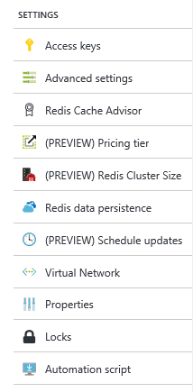
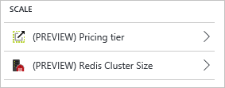
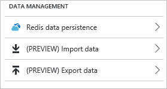
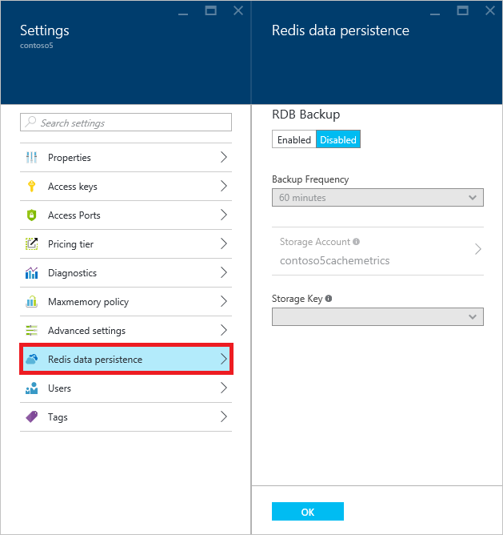
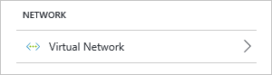
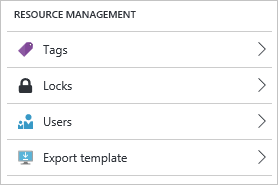

<properties 
	pageTitle="How to configure Azure Redis Cache | Microsoft Azure"
	description="Understand the default Redis configuration for Azure Redis Cache and learn how to configure your Azure Redis Cache instances"
	services="redis-cache"
	documentationCenter="na"
	authors="steved0x"
	manager="douge"
	editor="tysonn" />
<tags 
	ms.service="cache"
	ms.devlang="na"
	ms.topic="article"
	ms.tgt_pltfrm="cache-redis"
	ms.workload="tbd"
	ms.date="07/25/2016"
	ms.author="sdanie" />

# How to configure Azure Redis Cache

This topic describes how to review and update the configuration for your Azure Redis Cache instances, and covers the default Redis server configuration for Azure Redis Cache instances.

>[AZURE.NOTE] For more information on configuring and using premium cache features, see [How to configure persistence for a Premium Azure Redis Cache](cache-how-to-premium-persistence.md), [How to configure clustering for a Premium Azure Redis Cache](cache-how-to-premium-clustering.md), and [How to configure Virtual Network support for a Premium Azure Redis Cache](cache-how-to-premium-vnet.md).

## Configure Redis cache settings

[AZURE.INCLUDE [redis-cache-create](../../includes/redis-cache-browse.md)]

Azure Redis Cache provides the following settings on the **Settings** blade.

-	[Support & troubleshooting settings](#support-amp-troubleshooting-settings)
-	[General settings](#general-settings)
	-	[Properties](#properties)
	-	[Access keys](#access-keys)
	-	[Access ports](#access-ports)
	-	[Maxmemory policy](#maxmemory-policy-and-maxmemory-reserved)
	-	[Advanced settings (keyspace notifications)](#keyspace-notifications-advanced-settings)
	-	[Redis Cache Advisor](#redis-cache-advisor)
-	[Scale settings](#scale-settings)
	-	[Pricing tier](#pricing-tier)
	-	[Redis cluster size](#cluster-size)
-	[Data management settings](#data-management-settings)
	-	[Redis data persistence](#redis-data-persistence)
	-	[Import/Export](#importexport)
-	[Administration settings](#administration-settings)
	-	[Reboot](#reboot)
	-	[Schedule updates](#schedule-updates)
-	[Diagnostics settings](#diagnostics-settings)
-	[Network settings](#network-settings)
-	[Resource management settings](#resource-management-settings)

## Support & troubleshooting settings

The settings in the **Support + troubleshooting** section provide you with options for resolving issues with your cache.

Click **Troubleshoot** to be provided with common issues and strategies for resolving them.

Click **Audit logs** to view actions performed on your cache. You can also use filtering to expand this view to include other resources. For more information on working with audit logs, see [View events and audit logs](../azure-portal/insights-debugging-with-events.md) and [Audit operations with Resource Manager](../resource-group-audit.md). For more information on monitoring Azure Redis Cache events, see [Operations and alerts](cache-how-to-monitor.md#operations-and-alerts).

**Resource health** watches your resource and tells you if it's running as expected. For more information about the Azure Resource health service, see [Azure Resource health overview](../resource-health/resource-health-overview.md).

>[AZURE.NOTE] Resource health is currently unable to report on the health of Azure Redis Cache instances hosted in a virtual network. For more information, see [Do all cache features work when hosting a cache in a VNET?](cache-how-to-premium-vnet.md#do-all-cache-features-work-when-hosting-a-cache-in-a-vnet)

Click **New support request** to open a support request for your cache.

## General settings

The settings in the **General** section allow you to access and configure the following settings for your cache.

-	[Properties](#properties)
-	[Access keys](#access-keys)
-	[Access ports](#access-ports)
-	[Maxmemory policy](#maxmemory-policy-and-maxmemory-reserved)
-	[Advanced settings (keyspace notifications)](#keyspace-notifications-advanced-settings)
-	[Redis Cache Advisor](#redis-cache-advisor)

### Properties

Click **Properties** to view information about your cache, including the cache endpoint and ports.

### Access keys

Click **Access keys** to view or regenerate the access keys for your cache. These keys are used along with the host name and ports from the **Properties** blade by the clients connecting to your cache.

### Access Ports

By default, non-SSL access is disabled for new caches. To enable the non-SSL port, click **Access Ports** blade and then click **No**.

### Maxmemory-policy and maxmemory-reserved

Click **Maxmemory policy** to configure the memory policies for the cache. The **maxmemory-policy** setting configures the eviction policy for the cache and **maxmemory-reserved** configures the memory reserved for non-cache processes.

**Maxmemory policy** allows you to choose from the following eviction policies.

-	volatile-lru - this is the default.
-	allkeys-lru
-	volatile-random
-	allkeys-random
-	volatile-ttl
-	noeviction

For more information about maxmemory policies, see [Eviction policies](http://redis.io/topics/lru-cache#eviction-policies).

The **maxmemory-reserved** setting configures the amount of memory in MB that is reserved for non-cache operations such as replication during failover. It can also be used when you have a high fragmentation ratio. Setting this value allows you to have a more consistent Redis server experience when your load varies. This value should be set higher for workloads which are write heavy. When memory is reserved for such operations it is unavailable for storage of cached data.

>[AZURE.IMPORTANT] The **maxmemory-reserved** setting is only available for Standard and Premium caches.

### Keyspace notifications (advanced settings)

Click **Advanced settings** to configure Redis keyspace notifications. Keyspace notifications allows clients to receive notifications when certain events occur.

>[AZURE.IMPORTANT] Keyspace notifications and the **notify-keyspace-events** setting are only available for Standard and Premium caches.

For more information, see [Redis Keyspace Notifications](http://redis.io/topics/notifications). For sample code, see the [KeySpaceNotifications.cs](https://github.com/rustd/RedisSamples/blob/master/HelloWorld/KeySpaceNotifications.cs) file in the [Hello world](https://github.com/rustd/RedisSamples/tree/master/HelloWorld) sample.

## Redis Cache Advisor

The **Recommendations** blade displays recommendations for your cache. During normal operations, no recommendations are displayed. 

If any conditions occur during the operations of your cache such as high memory usage, network bandwidth, or server load, an alert is displayed on the **Redis Cache** blade.

Further information can be found on the **Recommendations** blade.

You can monitor these metrics on the [Monitoring charts](cache-how-to-monitor.md#monitoring-charts) and [Usage charts](cache-how-to-monitor.md#usage-charts) sections of the **Redis Cache** blade.

Each pricing tier has different limits for client connections, memory, and bandwidth. If your cache approaches maximum capacity for these metrics over a sustained period of time, a recommendation is created. For more information about the metrics and limits reviewed by the **Recommendations** tool, see the following table.

| Redis Cache metric      | For more information see                                                  |
|-------------------------|---------------------------------------------------------------------------|
| Network bandwidth usage | [Cache performance - available bandwidth](cache-faq.md#cache-performance) |
| Connected clients       | [Default Redis server configuration - maxclients](#maxclients)            |
| Server load             | [Usage charts - Redis Server Load](cache-how-to-monitor.md#usage-charts)  |
| Memory usage            | [Cache performance - size](cache-faq.md#cache-performance)                |

To upgrade your cache, click **Upgrade now** to change the [pricing tier](#pricing-tier) and scale your cache. For more information on choosing a pricing tier, see [What Redis Cache offering and size should I use?](cache-faq.md#what-redis-cache-offering-and-size-should-i-use).

## Scale settings

The settings in the **Scale** section allow you to access and configure the following settings for your cache.

-	[Pricing tier](#pricing-tier)
-	[Redis cluster size](#cluster-size)

### Pricing tier

Click **Pricing tier** to view or change the pricing tier for your cache. For more information on scaling, see [How to Scale Azure Redis Cache](cache-how-to-scale.md).

### Redis Cluster Size

Click **(PREVIEW) Redis Cluster Size** to change the cluster size for a running premium cache with clustering enabled.

>[AZURE.NOTE] Note that while the Azure Redis Cache Premium tier has been released to General Availability, the Redis Cluster Size feature is currently in preview.

To change the cluster size, use the slider or type a number between 1 and 10 in the **Shard count** text box and click **OK** to save.

>[AZURE.IMPORTANT] Redis clustering is only available for Premium caches. For more information, see [How to configure clustering for a Premium Azure Redis Cache](cache-how-to-premium-clustering.md).

## Data management settings

The settings in the **Data management** section allow you to access and configure the following settings for your cache.

-	[Redis data persistence](#redis-data-persistence)
-	[Import/Export](#importexport)

### Redis data persistence

Click **Redis data persistence** to enable, disable, or configure data persistence for your premium cache.

To enable Redis persistence, click **Enabled** to enable RDB (Redis database) backup. To disable Redis persistence, click **Disabled**.

To configure the backup interval, select a **Backup Frequency** from the drop-down list. Choices include **15 Minutes**, **30 minutes**, **60 minutes**, **6 hours**, **12 hours**, and **24 hours**. This interval starts counting down after the previous backup operation successfully completes and when it elapses a new backup is initiated.

Click **Storage Account** to select the storage account to use, and choose either the **Primary key** or **Secondary key** to use from the **Storage Key** drop-down. You must choose a storage account in the same region as the cache, and a **Premium Storage** account is recommended because premium storage has higher throughput. Anytime the storage key for your persistence account is regenerated, you must re-choose the desired key from the **Storage Key** drop-down.

Click **OK** to save the persistence configuration.

>[AZURE.IMPORTANT] Redis data persistence is only available for Premium caches. For more information, see [How to configure persistence for a Premium Azure Redis Cache](cache-how-to-premium-persistence.md).

### Import/Export

Import/Export is an Azure Redis Cache data management operation which allows you to import data into Azure Redis Cache or export data from Azure Redis Cache by importing and exporting a Redis Cache Database (RDB) snapshot from a premium cache to a page blob in an Azure Storage Account. This enables you to migrate between different Azure Redis Cache instances or populate the cache with data before use.

Import can be used to bring Redis compatible RDB file(s) from any Redis server running in any cloud or environment, including Redis running on Linux, Windows, or any cloud provider such as Amazon Web Services and others. Importing data is an easy way to create a cache with pre-populated data. During the import process Azure Redis Cache loads the RDB files from Azure storage into memory and then inserts the keys into the cache.

Export allows you to export the data stored in Azure Redis Cache to Redis compatible RDB file(s). You can use this feature to move data from one Azure Redis Cache instance to another or to another Redis server. During the export process a temporary file is created on the VM that hosts the Azure Redis Cache server instance, and the file is uploaded to the designated storage account. When the export operation completes with either a status of success or failure, the temporary file is deleted.

>[AZURE.IMPORTANT] Import/Export is only available for Premium tier caches. For more information and instructions, see [Import and Export data in Azure Redis Cache](cache-how-to-import-export-data.md).

## Administration settings

The settings in the **Administration** section allow you to perform the following administrative tasks for your premium cache. 

-	[Reboot](#reboot)
-	[Schedule updates](#schedule-updates)

>[AZURE.IMPORTANT] The settings in this section are only available for Premium tier caches.

### Reboot

The **Reboot** blade allows you to reboot one or more nodes of your cache. This enables you to test your application for resiliency in the event of a failure.

If you have a premium cache with clustering enabled, you can select which shards of the cache to reboot.

To reboot one ore more nodes of your cache, select the desired nodes and click **Reboot**. If you have a premium cache with clustering enabled, select the shard(s) to reboot and then click **Reboot**. After a few minutes, the selected node(s) reboot, and are back online a few minutes later.

>[AZURE.IMPORTANT] Reboot is only available for Premium tier caches. For more information and instructions, see [Azure Redis Cache administration - Reboot](cache-administration.md#reboot).

### Schedule updates

The **Schedule updates** blade allows you to designate a maintenance window for Redis server updates for your cache. 

>[AZURE.IMPORTANT] Note that the maintenance window applies only to Redis server updates, and not to any Azure updates or updates to the operating system of the VMs that host the cache.

To specify a maintenance window, check the desired days and specify the maintenance window start hour for each day, and click **OK**. Note that the maintenance window time is in UTC. 

>[AZURE.IMPORTANT] Schedule updates is only available for Premium tier caches. For more information and instructions, see [Azure Redis Cache administration - Schedule updates](cache-administration.md#schedule-updates).

## Diagnostics settings

The **Diagnostics** section allows you to configure diagnostics for your Redis Cache.

Click **Diagnostics** to [configure the storage account](cache-how-to-monitor.md#enable-cache-diagnostics) used to store cache diagnostics.

Click **Redis metrics** to [view metrics](cache-how-to-monitor.md#how-to-view-metrics-and-customize-charts) for your cache, and **Alert rules** to [set up alert rules](cache-how-to-monitor.md#operations-and-alerts).

For more information on Azure Redis Cache diagnostics, see [How to monitor Azure Redis Cache](cache-how-to-monitor.md).

## Network settings

The settings in the **Network** section allow you to access and configure the following settings for your cache.

>[AZURE.IMPORTANT] Virtual network settings are only available for premium caches that were configured with VNET support during cache creation. For information on creating a premium cache with VNET support and updating its settings, see [How to configure Virtual Network Support for a Premium Azure Redis Cache](cache-how-to-premium-vnet.md).

## Resource management settings

The **Tags** section helps you organize your resources. For more information, see [Using tags to organize your Azure resources](../resource-group-using-tags.md).

The **Locks** section allows you to lock a subscription, resource group or resource to prevent other users in your organization from accidentally deleting or modifying critical resources. For more information, see [Lock resources with Azure Resource Manager](../resource-group-lock-resources.md).

The **Users** section provides support for role-based access control (RBAC) in the Azure Portal to help organizations meet their access management requirements simply and precisely. For more information, see [Role-based access control in the Azure Portal](../active-directory/role-based-access-control-configure.md).

Click **Export template** to build and export a template of your deployed resources for future deployments. For more information about working with templates, see [Deploy resources with Azure Resource Manager templates](../resource-group-template-deploy.md).

## Default Redis server configuration

New Azure Redis Cache instances are configured with the following default Redis configuration values.

>[AZURE.NOTE] The settings in this section cannot be changed using the `StackExchange.Redis.IServer.ConfigSet` method. If this method is called with one of the commands in this section, an exception similar to the following is thrown:  
>
>`StackExchange.Redis.RedisServerException: ERR unknown command 'CONFIG'`
>  
>Any values that are configurable, such as **max-memory-policy**, are configurable through the Azure Portal or command line management tools such as Azure CLI or PowerShell.

|Setting|Default value|Description|
|---|---|---|
|databases|16|The default number of databases is 16 but you can configure a different number based on the pricing tier.1 The default database is DB 0, you can select a different one on a per-connection basis using `connection.GetDatabase(dbid)` where dbid is a number between `0` and `databases - 1`.|
|maxclients|Depends on the pricing tier2|This is the maximum number of connected clients allowed at the same time. Once the limit is reached Redis will close all the new connections sending an error 'max number of clients reached'.|
|maxmemory-policy|volatile-lru|Maxmemory policy is the setting for how Redis will select what to remove when maxmemory (the size of the cache offering you selected when you created the cache) is reached. With Azure Redis Cache the default setting is volatile-lru, which removes the keys with an expire set using an LRU algorithm. This setting can be configured in the Azure portal. For more information, see [Maxmemory-policy and maxmemory-reserved](#maxmemory-policy-and-maxmemory-reserved).|
|maxmemory-samples|3|LRU and minimal TTL algorithms are not precise algorithms but approximated algorithms (in order to save memory), so you can select as well the sample size to check. For instance for default Redis will check three keys and pick the one that was used less recently.|
|lua-time-limit|5,000|Max execution time of a Lua script in milliseconds. If the maximum execution time is reached Redis will log that a script is still in execution after the maximum allowed time and will start to reply to queries with an error.|
|lua-event-limit|500|This is the max size of script event queue.|
|client-output-buffer-limit normalclient-output-buffer-limit pubsub|0 0 032mb 8mb 60|The client output buffer limits can be used to force disconnection of clients that are not reading data from the server fast enough for some reason (a common reason is that a Pub/Sub client can't consume messages as fast as the publisher can produce them). For more information, see [http://redis.io/topics/clients](http://redis.io/topics/clients).|

1The limit for `databases` is different for each Azure Redis Cache pricing tier and can be set at cache creation. If no `databases` setting is specified during cache creation, the default is 16.

-	Basic and Standard caches
	-	C0 (250 MB) cache - up to 16 databases
	-	C1 (1 GB) cache - up to 16 databases
	-	C2 (2.5 GB) cache - up to 16 databases
	-	C3 (6 GB) cache - up to 16 databases
	-	C4 (13 GB) cache - up to 32 databases
	-	C5 (26 GB) cache - up to 48 databases
	-	C6 (53 GB) cache - up to 64 databases
-	Premium caches
	-	P1 (6 GB - 60 GB) - up to 16 databases
	-	P2 (13 GB - 130 GB) - up to 32 databases
	-	P3 (26 GB - 260 GB) - up to 48 databases
	-	P4 (53 GB - 530 GB) - up to 64 databases
	-   All premium caches with Redis cluster enabled - Redis cluster only supports use of database 0 so the `databases` limit for any premium cache with Redis cluster enabled is effectively 1 and the [Select](http://redis.io/commands/select) command is not allowed. For more information, see [Do I need to make any changes to my client application to use clustering?](#do-i-need-to-make-any-changes-to-my-client-application-to-use-clustering)

>[AZURE.NOTE] The `databases` setting can be configured only during cache creation and only using PowerShell, CLI, or other management clients. For an example of configuring `databases` during cache creation using PowerShell, see [New-AzureRmRedisCache](cache-howto-manage-redis-cache-powershell.md#databases).

2`maxclients` is different for each Azure Redis Cache pricing tier.

-	Basic and Standard caches
	-	C0 (250 MB) cache - up to 256 connections
	-	C1 (1 GB) cache - up to 1,000 connections
	-	C2 (2.5 GB) cache - up to 2,000 connections
	-	C3 (6 GB) cache - up to 5,000 connections
	-	C4 (13 GB) cache - up to 10,000 connections
	-	C5 (26 GB) cache - up to 15,000 connections
	-	C6 (53 GB) cache - up to 20,000 connections
-	Premium caches
	-	P1 (6 GB - 60 GB) - up to 7,500 connections
	-	P2 (13 GB - 130 GB) - up to 15,000 connections
	-	P3 (26 GB - 260 GB) - up to 30,000 connections
	-	P4 (53 GB - 530 GB) - up to 40,000 connections

## Redis commands not supported in Azure Redis Cache

>[AZURE.IMPORTANT] Because configuration and management of Azure Redis Cache instances is managed by Microsoft the following commands are disabled. If you try to invoke them you will receive an error message similar to `"(error) ERR unknown command"`.
>
>-	BGREWRITEAOF
>-	BGSAVE
>-	CONFIG
>-	DEBUG
>-	MIGRATE
>-	SAVE
>-	SHUTDOWN
>-	SLAVEOF
>-	CLUSTER - Cluster write commands are disabled, but read-only Cluster commands are permitted.

For more information about Redis commands, see [http://redis.io/commands](http://redis.io/commands).

## Redis console

You can securely issue commands to your Azure Redis Cache instances using the **Redis Console**, which is available for Standard and Premium caches.

>[AZURE.IMPORTANT] The Redis Console does not work with VNET, clustering, and can only work with database 0. 
>
>-	[VNET](cache-how-to-premium-vnet.md) - When your cache is part of a VNET, only clients in the VNET can access the cache. Because the Redis Console uses the redis-cli.exe client hosted on VMs that are not part of your VNET, it can't connect to your cache.
>-	[Clustering](cache-how-to-premium-clustering.md) - The Redis Console uses the redis-cli.exe client which does not support clustering at this time. The redis-cli utility in the [unstable](http://redis.io/download) branch of the Redis repository at GitHub implements basic support when started with the `-c` switch. For more information see [Playing with the cluster](http://redis.io/topics/cluster-tutorial#playing-with-the-cluster) on [http://redis.io](http://redis.io) in the [Redis cluster tutorial](http://redis.io/topics/cluster-tutorial).
>-	The Redis Console makes a new connection to database 0 each time you submit a command. You can't use the `SELECT` command to select a different database, because the database is reset to 0 with each command. For information on running Redis commands, including changing to a different database, see [How can I run Redis commands?](cache-faq.md#how-can-i-run-redis-commands).

To access the Redis Console, click **Console** from the **Redis Cache** blade.

To issue commands against your cache instance, simply type in the desired command into the console.

For list of Redis commands that are disabled for Azure Redis Cache, see the previous [Redis commands not supported in Azure Redis Cache](#redis-commands-not-supported-in-azure-redis-cache) section. For more information about Redis commands, see [http://redis.io/commands](http://redis.io/commands). 

## Move your cache to a new subscription

You can move your cache to a new subscription by clicking **Move**.

For information on moving resources from one resource group to another, and from one subscription to another, see [Move resources to new resource group or subscription](../resource-group-move-resources.md).

## Next steps
-	For more information on working with Redis commands, see [How can I run Redis commands?](cache-faq.md#how-can-i-run-redis-commands).
