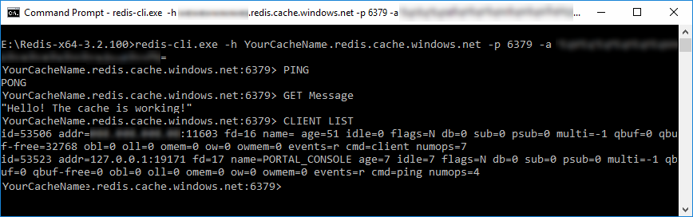

# Quickstart: How to create an Azure Redis Cache


 Microsoft Azure Redis Cache is based on the popular open source [Redis Cache](https://redis.io/). It gives you access to a secure, dedicated Redis cache, managed by Microsoft. A cache created using Azure Redis Cache is accessible from any application within Microsoft Azure. This guide shows you how to get started with Azure Redis Cache by creating your first cache and testing cache commands in the Redis Console.


[!INCLUDE [quickstarts-free-trial-note](../../includes/quickstarts-free-trial-note.md)]


## Create a cache

Getting started with Azure Redis Cache is easy. To get started, you provision and configure a cache. Next, you configure the cache clients so they can access the cache. Once the cache clients are configured, you can begin working with them.


[!INCLUDE [redis-cache-create](../../includes/redis-cache-create.md)]


## Configuring the cache 

For this quickstart, you do not need any special configurations. For detailed information the configuration options available for your cache, see [How to configure Azure Redis Cache](cache-configure.md).

## Finding your cache 

[!INCLUDE [redis-cache-browse](../../includes/redis-cache-browse.md)]

## Testing the cache with the Redis Console

In this section, you use the [Redis Console](cache-configure.md#redis-console) to connect to the cache and issue some test commands directly from the [Azure portal](https://portal.azure.com/). This console can be useful to help isolate a problem if an application is failing to communicate with a cache. 

In your Redis Cache blade, click the **Overview** tab, and then click the **Console** button at the top of the blade.


The Redis Console opens in the [Azure portal](https://portal.azure.com/). In this console, you can issue [Redis Cache commands](https://redis.io/commands)

The following example the cache was tested with these commands:

* `PING`
* `SET Message "Hello! The cache is working!"` 
* `GET Message`
* `CLIENT LIST`


## Testing the cache with the Redis command-line tool

Download the [Redis command-line tools for Windows](https://github.com/MSOpenTech/redis/releases/). If you want to run the command-line tool on another platform, download the package from [http://redis.io/download](https://redis.io/download).

To connect to an Azure Redis Cache instance, cache clients, including the Redis command-line tool, require the following information: *host name*, *port*, and *access key* (primary or secondary) for the cache. Some clients may refer to these items by slightly different names. 

You can retrieve this information in the Azure portal or by using command-line tools such as Azure CLI.

[!INCLUDE [redis-cache-create](../../includes/redis-cache-access-keys.md)]


### Enable access for redis-cli.exe

By default, only the SSL port (6380) is enabled. The `redis-cli.exe` command-line tool doesn't support SSL. So you have two configuration choices in order to use it:

1. [Enable the non-SSL port (6379)](cache-configure.md#access-ports) - **This is not recommended**. Because in this configuration, the access keys are sent via TCP in clear text. This can compromise access to your cache. The only scenario where you might consider this is when you are just accessing a test cache.

2. Download and install [stunnel](https://www.stunnel.org/downloads.html).

    Run **stunnel GUI Start** to start the server.

    Rick click the taskbar icon for the stunnel server and click **Show Log Window**.

    On the stunnel Log Window menu, click **Configuration** > **Edit Configuration** to open the current configuration file.

    Add the following entry for `redis-cli.exe` under the **Service definitions** section. Insert your actual cache name in place of `yourcachename`. 

    ```
    [redis-cli]
    client = yes
    accept = 127.0.0.1:6380
    connect = yourcachename.redis.cache.windows.net:6380
    ```

    Save and close the configuration file. 
  
    On the stunnel Log Window menu, click **Configuration** > **Reload Configuration**.


### Connect using the Redis command-line tool.

If you are using stunnel, run the Redis command-line tool, `redis-cli.exe`, passing your port, and access key (primary or secondary) to connect to the cache.

```
redis-cli.exe -p 6380 -a YourAccessKey
```


If you are using the **unsecure**, non-SSL, port just for a test cache, run `redis-cli.exe`, passing your host name, port, and access key (primary or secondary) to connect to the cache.

```
redis-cli.exe -h yourcachename.redis.cache.windows.net -p 63790 -a YourAccessKey
```




## Next Steps

Now that you created and tested an Azure Redis Cache, follow these links to integrate the cache into your application.

* [ASP.NET Web App Quickstart](cache-web-app-howto.md)  
  Create a simple ASP.NET web app that uses an Azure Redis Cache.
* [.NET Quickstart](cache-dotnet-how-to-use-azure-redis-cache.md)  
  Create a .NET app that uses an Azure Redis Cache.
* [Node.js Quickstart](cache-nodejs-get-started.md)  
  Create a simple Node.js app that uses an Azure Redis Cache.
* [Java Quickstart](cache-java-get-started.md)  
  Create a simple Java app that uses an Azure Redis Cache.
* [Python Quickstart](cache-python-get-started.md)  
  Create a Python app that uses an Azure Redis Cache.


* Check out the ASP.NET providers for Azure Redis Cache.
  * [Azure Redis Session State Provider](cache-aspnet-session-state-provider.md)
  * [Azure Redis Cache ASP.NET Output Cache Provider](cache-aspnet-output-cache-provider.md)
* [Enable cache diagnostics](cache-how-to-monitor.md#enable-cache-diagnostics) so you can [monitor](cache-how-to-monitor.md) the health of your cache. You can view the metrics in the Azure portal and you can also [download and review](https://github.com/rustd/RedisSamples/tree/master/CustomMonitoring) them using the tools of your choice.
* Check out the [StackExchange.Redis cache client documentation](http://github.com/StackExchange/StackExchange.Redis#documentation).
  * Azure Redis Cache can be accessed from many Redis clients and development languages. For more information, see [http://redis.io/clients](http://redis.io/clients).
* Azure Redis Cache can also be used with third-party services and tools such as Redsmin and Redis Desktop Manager.
  * For more information about Redsmin, see [How to retrieve an Azure Redis connection string and use it with Redsmin](https://redsmin.uservoice.com/knowledgebase/articles/485711-how-to-connect-redsmin-to-azure-redis-cache).
  * Access and inspect your data in Azure Redis Cache with a GUI using [RedisDesktopManager](https://github.com/uglide/RedisDesktopManager).
* See the [redis](http://redis.io/documentation) documentation and read about [redis data types](http://redis.io/topics/data-types) and [a fifteen-minute introduction to Redis data types](http://redis.io/topics/data-types-intro).


