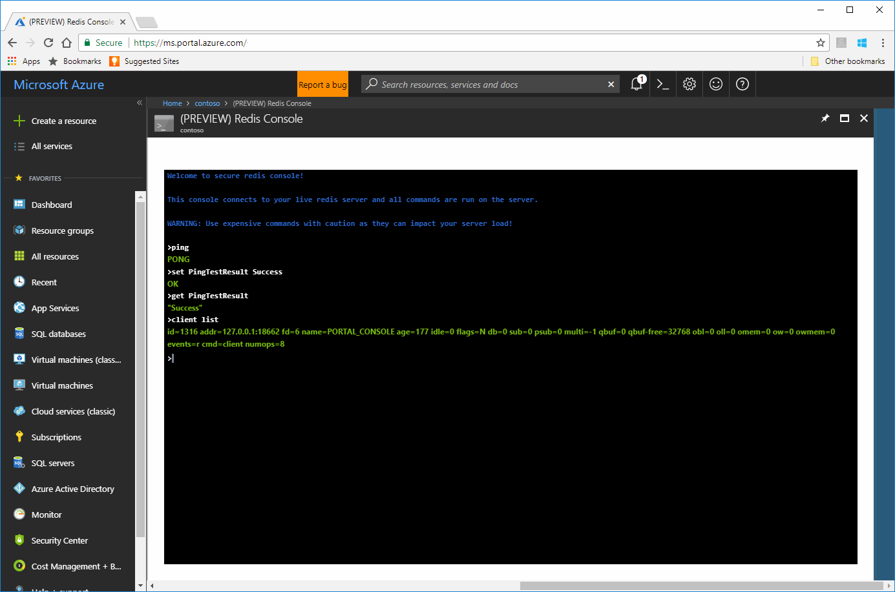
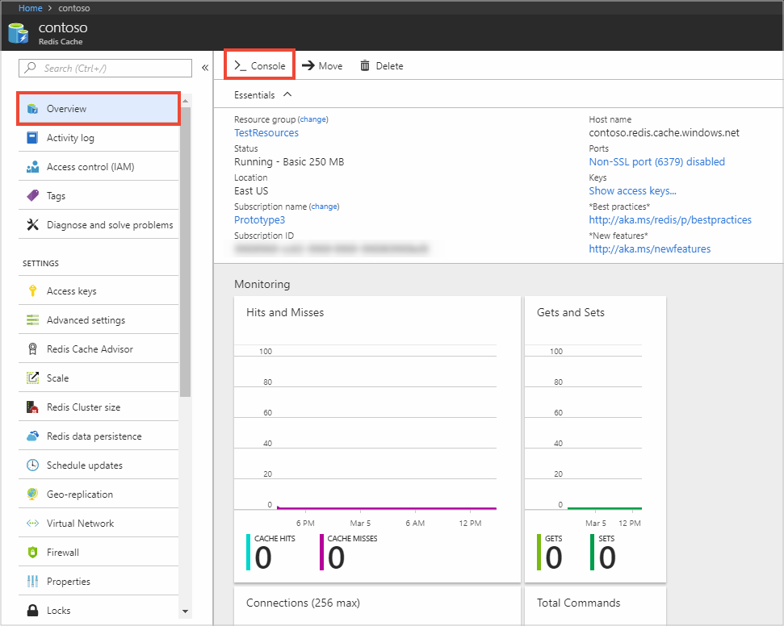

# Quickstart: Create an Azure Redis Cache

 Microsoft Azure Redis Cache is based on the popular open-source [Redis Cache](https://redis.io/). It gives you access to a secure, dedicated Redis cache, managed by Microsoft. Redis Cache is primarily used to improve the performance and scalability of systems that rely heavily on backend data-stores. A cache created using Azure Redis Cache is accessible from any application within Microsoft Azure. This guide shows you how to get started with Azure Redis Cache. You will create your first cache and test the cache using commands in the Redis Console.

[!INCLUDE [quickstarts-free-trial-note](../../includes/quickstarts-free-trial-note.md)]

## Create a cache

Getting started with Azure Redis Cache is easy. To get started, you provision and configure a cache. Next, you configure the cache clients so they can access the cache. Once the cache clients are configured, you can begin working with them.

## Testing the cache with the Redis Console

In this section, you use the [Redis Console](cache-configure.md#redis-console) to connect to the cache and issue some test commands directly from the Azure portal. This console can be useful to help isolate a problem if an application is failing to communicate with a cache. 

In your Redis Cache blade, click the **Overview** tab, and then click the **Console** button at the top of the blade.

The Redis Console opens in the Azure portal. In this console, you can issue [Redis Cache commands](https://redis.io/commands)

The following example the cache was tested with these commands:

* `PING`
* `SET Message "Hello! The cache is working!"` 
* `GET Message`
* `CLIENT LIST`

## Next Steps

Now that you created and tested an Azure Redis Cache, follow these links to integrate the cache into your application.

* [ASP.NET Web App Quickstart](cache-web-app-howto.md)  
  Create a simple ASP.NET web app that uses an Azure Redis Cache.
* [.NET Quickstart](cache-dotnet-how-to-use-azure-redis-cache.md)  
  Create a .NET app that uses an Azure Redis Cache.
* [Node.js Quickstart](cache-nodejs-get-started.md)  
  Create a simple Node.js app that uses an Azure Redis Cache.
* [Java Quickstart](cache-java-get-started.md)  
  Create a simple Java app that uses an Azure Redis Cache.
* [Python Quickstart](cache-python-get-started.md)  
  Create a Python app that uses an Azure Redis Cache.
* Check out the ASP.NET providers for Azure Redis Cache.
  * [Azure Redis Session State Provider](cache-aspnet-session-state-provider.md)
  * [Azure Redis Cache ASP.NET Output Cache Provider](cache-aspnet-output-cache-provider.md)
* [Enable cache diagnostics](cache-how-to-monitor.md#enable-cache-diagnostics) so you can [monitor](cache-how-to-monitor.md) the health of your cache. You can view the metrics in the Azure portal and you can also [download and review](https://github.com/rustd/RedisSamples/tree/master/CustomMonitoring) them using the tools of your choice.
* Check out the [StackExchange.Redis cache client documentation](http://github.com/StackExchange/StackExchange.Redis#documentation).
  * Azure Redis Cache can be accessed from many Redis clients and development languages. For more information, see [http://redis.io/clients](http://redis.io/clients).
* Azure Redis Cache can also be used with third-party services and tools such as Redsmin and Redis Desktop Manager.
  * For more information about Redsmin, see [How to retrieve an Azure Redis connection string and use it with Redsmin](https://redsmin.uservoice.com/knowledgebase/articles/485711-how-to-connect-redsmin-to-azure-redis-cache).
  * Access and inspect your data in Azure Redis Cache with a GUI using [RedisDesktopManager](https://github.com/uglide/RedisDesktopManager).
* See the [redis](http://redis.io/documentation) documentation and read about [redis data types](http://redis.io/topics/data-types) and [a fifteen-minute introduction to Redis data types](http://redis.io/topics/data-types-intro).

