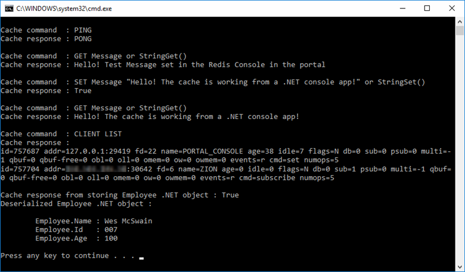

# Quickstart: Use Azure Redis Cache with a .NET application

> [!div class="op_single_selector"]
> * [.NET](cache-dotnet-how-to-use-azure-redis-cache.md)
> * [ASP.NET](cache-web-app-howto.md)
> * [Node.js](cache-nodejs-get-started.md)
> * [Java](cache-java-get-started.md)
> * [Python](cache-python-get-started.md)
> 
> 

This quickstart shows you how to get started using Microsoft Azure Redis Cache with .NET. Microsoft Azure Redis Cache is based on the popular open source Redis Cache. It gives you access to a secure, dedicated Redis cache, managed by Microsoft. A cache created using Azure Redis Cache is accessible from any application within Microsoft Azure.

In this quickstart, you will use the [StackExchange.Redis][StackExchange.Redis] client with C\# code in a console app. You will create and configure a cache, configuring a .NET cache client, and add and update objects in the cache. 



If you don’t have an Azure subscription, create a [free account](https://azure.microsoft.com/free/?WT.mc_id=A261C142F) before you begin.

## Prerequisites

* Visual Studio
* The StackExchange.Redis client requires .NET Framework 4 or higher.

## Create a cache
[!INCLUDE [redis-cache-create](../../includes/redis-cache-create.md)]

[!INCLUDE [redis-cache-access-keys](../../includes/redis-cache-access-keys.md)]

Create a file on your computer named *CacheSecrets.config* and place it in a location where it won't be checked in with the source code of your sample application. For this quickstart, the *CacheSecrets.config* file is located here, *C:\AppSecrets\CacheSecrets.config*.

Edit the *CacheSecrets.config* file and add the following contents:

```xml
<appSettings>
    <add key="CacheConnection" value="<cache-name>.redis.cache.windows.net,abortConnect=false,ssl=true,password=<access-key>"/>
</appSettings>
```

Replace `<cache-name>` with your cache host name.

Replace `<access-key>` with the primary key for your cache.


## Create a console app

In Visual Studio, click **File** > **New** > **Project**.

Under **Visual C#**, click **Windows Classic Desktop** and then click **Console App** and **OK** to create a new console application.

## Configure the cache client

In Visual Studio, click **Tools** > **NuGet Package Manager** > **Package Manager Console**, and run the following command from the Package Manager Console window.

```powershell
Install-Package StackExchange.Redis
```

Once the installation is completed, the *StackExchange.Redis* cache client is available to use with your project.


## Connect to the cache

In Visual Studio, open your *App.config* file and update it to with the `appSettings` `file` attribute that references the *CacheSecrets.config* file.

```xml
<?xml version="1.0" encoding="utf-8" ?>
<configuration>
    <startup> 
        <supportedRuntime version="v4.0" sku=".NETFramework,Version=v4.7.1" />
    </startup>

    <appSettings file="C:\AppSecrets\CacheSecrets.config"></appSettings>  

</configuration>
```

In Solution Explorer, right click *References* and click **Add a reference**. Add a reference to the *System.Configuration* assembly.

Add the following `using` statements to *Program.cs*:

```csharp
using StackExchange.Redis;
using System.Configuration;
```

The connection to the Azure Redis Cache is managed by the `ConnectionMultiplexer` class. This class should be shared and reused throughout your client application. You should not create a new connection for each operation. 

Never store credentials in source code. To keep this sample simple, I’m only using an external secrets config file. A better approach would be to use [Azure Key Vault with certificates](https://docs.microsoft.com/rest/api/keyvault/certificate-scenarios).

In *Program.cs*, add the following members to the `Program` class of your console application:

```csharp
        private static Lazy<ConnectionMultiplexer> lazyConnection = new Lazy<ConnectionMultiplexer>(() =>
        {
            string cacheConnection = ConfigurationManager.AppSettings["CacheConnection"].ToString();
            return ConnectionMultiplexer.Connect(cacheConnection);
        });

        public static ConnectionMultiplexer Connection
        {
            get
            {
                return lazyConnection.Value;
            }
        }
```


This approach to sharing a `ConnectionMultiplexer` instance in your application uses a static property that returns a connected instance. The code provides a thread-safe way to initialize only a single connected `ConnectionMultiplexer` instance. `abortConnect` is set to false, which means that the call succeeds even if a connection to the Azure Redis Cache is not established. One key feature of `ConnectionMultiplexer` is that it automatically restores connectivity to the cache once the network issue or other causes are resolved.

The value of the *CacheConnection* appSetting is used to reference the cache connection string from the Azure portal as the password parameter.

## Executing cache commands

Add the following code for the `Main` procedure of the `Program` class for your console application:

```csharp
        static void Main(string[] args)
        {
            // Connection refers to a property that returns a ConnectionMultiplexer
            // as shown in the previous example.
            IDatabase cache = lazyConnection.Value.GetDatabase();

            // Perform cache operations using the cache object...

            // Simple PING command

            string cacheCommand = "PING";
            Console.WriteLine("\nCache command  : " + cacheCommand);
            Console.WriteLine("Cache response : " + cache.Execute(cacheCommand).ToString());

            // Simple get and put of integral data types into the cache
            cacheCommand = "GET Message";
            Console.WriteLine("\nCache command  : " + cacheCommand + " or StringGet()");
            Console.WriteLine("Cache response : " + cache.StringGet("Message").ToString());

            cacheCommand = "SET Message \"Hello! The cache is working from a .NET console app!\"";
            Console.WriteLine("\nCache command  : " + cacheCommand + " or StringSet()");
            Console.WriteLine("Cache response : " + cache.StringSet("Message", "Hello! The cache is working from a .NET console app!").ToString());

            // Demostrate "SET Message" executed as expected...
            cacheCommand = "GET Message";
            Console.WriteLine("\nCache command  : " + cacheCommand + " or StringGet()");
            Console.WriteLine("Cache response : " + cache.StringGet("Message").ToString());

            // Get the client list, useful to see if connection list is growing...
            cacheCommand = "CLIENT LIST";
            Console.WriteLine("\nCache command  : " + cacheCommand);
            Console.WriteLine("Cache response : \n" + cache.Execute("CLIENT", "LIST").ToString().Replace("id=", "id="));

            lazyConnection.Value.Dispose();
        }
```

Azure Redis caches have a configurable number of databases (default of 16) that can be used to logically separate the data within a Redis cache. The code connects to the default database, DB 0. For more information, see [What are Redis databases?](cache-faq.md#what-are-redis-databases) and [Default Redis server configuration](cache-configure.md#default-redis-server-configuration).

Cache items can be stored and retrieved by using the `StringSet` and `StringGet` methods.

Redis stores most data as Redis strings, but these strings can contain many types of data, including serialized binary data, which can be used when storing .NET objects in the cache.

In the example below, you can see the `Message` key previously had a cached value, which was set using the Redis Console in the Azure portal. The app updated that cached value. The app also executed the `PING` and `CLIENT LIST` commands.


## Clean up resources

If you will be continuing to the next tutorial, you can keep the resources created in this quickstart and reuse them.

Otherwise, if you are finished with the quickstart sample application, you can delete the Azure resources created in this quickstart to avoid charges. 

> [!IMPORTANT]
> Deleting a resource group is irreversible and that the resource group and all the resources in it are permanently deleted. Make sure that you do not accidentally delete the wrong resource group or resources. If you created the resources for hosting this sample inside an existing resource group that contains resources you want to keep, you can delete each resource individually from their respective blades instead of deleting the resource group.
>

Sign in to the [Azure portal](https://portal.azure.com) and click **Resource groups**.

In the **Filter by name...** textbox, type the name of your resource group. The instructions for this topic used a resource group named *TestResources*. On your resource group in the result list, click **...** then **Delete resource group**.


You will be asked to confirm the deletion of the resource group. Type the name of your resource group to confirm, and click **Delete**.

After a few moments the resource group and all of its contained resources are deleted.


<a name="next-steps"></a>

## Next steps

In this quickstart you learned how to use Azure Redis Cache from a .NET application. Continue to the next quickstart to use Redis Cache with an ASP.NET web app.

> [!div class="nextstepaction"]
> [Create a simple ASP.NET web app that uses an Azure Redis Cache.](./cache-web-app-howto.md)


<!-- INTRA-TOPIC LINKS -->
[Next Steps]: #next-steps
[Introduction to Azure Redis Cache (Video)]: #video
[What is Azure Redis Cache?]: #what-is
[Create an Azure Cache]: #create-cache
[Which type of caching is right for me?]: #choosing-cache
[Prepare Your Visual Studio Project to Use Azure Caching]: #prepare-vs
[Configure Your Application to Use Caching]: #configure-app
[Get Started with Azure Redis Cache]: #getting-started-cache-service
[Create the cache]: #create-cache
[Configure the cache]: #enable-caching
[Configure the cache clients]: #NuGet
[Working with Caches]: #working-with-caches
[Connect to the cache]: #connect-to-cache
[Add and retrieve objects from the cache]: #add-object
[Specify the expiration of an object in the cache]: #specify-expiration
[Store ASP.NET session state in the cache]: #store-session


<!-- IMAGES -->


[StackExchangeNuget]: ./media/cache-dotnet-how-to-use-azure-redis-cache/redis-cache-stackexchange-redis.png

[NuGetMenu]: ./media/cache-dotnet-how-to-use-azure-redis-cache/redis-cache-manage-nuget-menu.png

[CacheProperties]: ./media/cache-dotnet-how-to-use-azure-redis-cache/redis-cache-properties.png

[ManageKeys]: ./media/cache-dotnet-how-to-use-azure-redis-cache/redis-cache-manage-keys.png

[SessionStateNuGet]: ./media/cache-dotnet-how-to-use-azure-redis-cache/redis-cache-session-state-provider.png

[BrowseCaches]: ./media/cache-dotnet-how-to-use-azure-redis-cache/redis-cache-browse-caches.png

[Caches]: ./media/cache-dotnet-how-to-use-azure-redis-cache/redis-cache-caches.png


<!-- LINKS -->
[http://redis.io/clients]: http://redis.io/clients
[Develop in other languages for Azure Redis Cache]: http://msdn.microsoft.com/library/azure/dn690470.aspx
[How to retrieve an Azure Redis connection string and use it with Redsmin]: https://redsmin.uservoice.com/knowledgebase/articles/485711-how-to-connect-redsmin-to-azure-redis-cache
[Azure Redis Session State Provider]: http://go.microsoft.com/fwlink/?LinkId=398249
[How to: Configure a Cache Client Programmatically]: http://msdn.microsoft.com/library/windowsazure/gg618003.aspx
[Session State Provider for Azure Cache]: http://go.microsoft.com/fwlink/?LinkId=320835
[Azure AppFabric Cache: Caching Session State]: http://www.microsoft.com/showcase/details.aspx?uuid=87c833e9-97a9-42b2-8bb1-7601f9b5ca20
[Output Cache Provider for Azure Cache]: http://go.microsoft.com/fwlink/?LinkId=320837
[Azure Shared Caching]: http://msdn.microsoft.com/library/windowsazure/gg278356.aspx
[Team Blog]: http://blogs.msdn.com/b/windowsazure/
[Azure Caching]: http://www.microsoft.com/showcase/Search.aspx?phrase=azure+caching
[How to Configure Virtual Machine Sizes]: http://go.microsoft.com/fwlink/?LinkId=164387
[Azure Caching Capacity Planning Considerations]: http://go.microsoft.com/fwlink/?LinkId=320167
[Azure Caching]: http://go.microsoft.com/fwlink/?LinkId=252658
[How to: Set the Cacheability of an ASP.NET Page Declaratively]: http://msdn.microsoft.com/library/zd1ysf1y.aspx
[How to: Set a Page's Cacheability Programmatically]: http://msdn.microsoft.com/library/z852zf6b.aspx
[Configure a cache in Azure Redis Cache]: http://msdn.microsoft.com/library/azure/dn793612.aspx

[StackExchange.Redis configuration model]: https://stackexchange.github.io/StackExchange.Redis/Configuration

[Work with .NET objects in the cache]: http://msdn.microsoft.com/library/dn690521.aspx#Objects


[NuGet Package Manager Installation]: http://go.microsoft.com/fwlink/?LinkId=240311
[Cache Pricing Details]: http://www.windowsazure.com/pricing/details/cache/
[Azure portal]: https://portal.azure.com/

[Overview of Azure Redis Cache]: http://go.microsoft.com/fwlink/?LinkId=320830
[Azure Redis Cache]: http://go.microsoft.com/fwlink/?LinkId=398247

[Migrate to Azure Redis Cache]: http://go.microsoft.com/fwlink/?LinkId=317347
[Azure Redis Cache Samples]: http://go.microsoft.com/fwlink/?LinkId=320840
[Using Resource groups to manage your Azure resources]: ../azure-resource-manager/resource-group-overview.md

[StackExchange.Redis]: http://github.com/StackExchange/StackExchange.Redis
[StackExchange.Redis cache client documentation]: http://github.com/StackExchange/StackExchange.Redis#documentation

[Redis]: http://redis.io/documentation
[Redis data types]: http://redis.io/topics/data-types
[a fifteen minute introduction to Redis data types]: http://redis.io/topics/data-types-intro

[How Application Strings and Connection Strings Work]: http://azure.microsoft.com/blog/2013/07/17/windows-azure-web-sites-how-application-strings-and-connection-strings-work/


