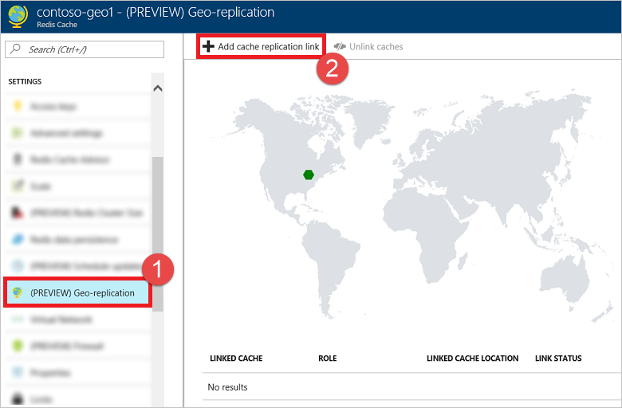
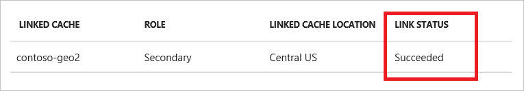

# How to configure Geo-replication for Azure Redis Cache

Geo-replication provides a mechanism for linking two Premium tier Azure Redis Cache instances. One cache is designated as the primary linked cache, and the other as the secondary linked cache. The secondary linked cache becomes read-only, and data written to the primary cache is replicated to the secondary linked cache. This functionality can be used to replicate a cache across Azure regions. This article provides a guide to configuring Geo-replication for your Premium tier Azure Redis Cache instances.

## Geo-replication prerequisites

To configure Geo-replication between two caches, the following prerequisites must be met:

- Both caches must be [Premium tier](cache-premium-tier-intro.md) caches.
- Both caches must be in the same Azure subscription.
- The secondary linked cache must be either the same pricing tier or a larger pricing tier than the primary linked cache.
- If the primary linked cache has clustering enabled, the secondary linked cache must have clustering enabled with the same number of shards as the primary linked cache.
- Both caches must be created and in a running state.
- Persistence must not be enabled on either cache.
- Geo-replication between caches in the same VNET is supported. 
- Geo-replication between caches in peered VNETs within the same region is currently a preview feature. The two VNETs need to be configured in such a way that resources in the VNETs are able to reach each other via TCP connections.
- Geo-replication between caches in peered VNETs in different regions is not yet supported, but will be in preview soon.

After Geo-replication is configured, the following restrictions apply to your linked cache pair:

- The secondary linked cache is read-only; you can read from it, but you can't write any data to it. 
- Any data that was in the secondary linked cache before the link was added is removed. If the Geo-replication is subsequently removed however, the replicated data remains in the secondary linked cache.
- You can't initiate a [scaling operation](cache-how-to-scale.md) on either cache or [change the number of shards](cache-how-to-premium-clustering.md) if the cache has clustering enabled.
- You can't enable persistence on either cache.
- You can use [Export](cache-how-to-import-export-data.md#export) with either cache, but you can only [Import](cache-how-to-import-export-data.md#import) into the primary linked cache.
- You can't delete either linked cache, or the resource group that contains them, until you remove the Geo-replication link. For more information, see [Why did the operation fail when I tried to delete my linked cache?](#why-did-the-operation-fail-when-i-tried-to-delete-my-linked-cache)
- If the two caches are in different regions, network egress costs will apply to the data replicated across regions to the secondary linked cache. For more information, see [How much does it cost to replicate my data across Azure regions?](#how-much-does-it-cost-to-replicate-my-data-across-azure-regions)
- There is no automatic failover to the secondary linked cache if the primary cache (and its replica) go down. In order to failover client applications, you would need to manually remove the Geo-replication link and point the client applications to the cache that was formerly the secondary linked cache. For more information, see [How does failing over to the secondary linked cache work?](#how-does-failing-over-to-the-secondary-linked-cache-work)

## Add a Geo-replication link

1. To link two premium caches together for geo-replication, click **Geo-replication** from the Resource menu of the cache intended as the primary linked cache, and then click **Add cache replication link** from the **Geo-replication** blade.

    

2. Click the name of the desired secondary cache from the **Compatible caches** list. If your desired cache isn't displayed in the list, verify that the [Geo-replication prerequisites](#geo-replication-prerequisites) for the desired secondary cache are met. To filter the caches by region, click the desired region in the map to display only those caches in the **Compatible caches** list.

    
    
    You can also initiate the linking process or view details about the secondary cache by using the context menu.

    

3. Click **Link** to link the two caches together and begin the replication process.

    

4. You can view the progress of the replication process on the **Geo-replication** blade.

    

    You can also view the linking status on the **Overview** blade for both the primary and secondary caches.

    

    Once the replication process is complete, the **Link status** changes to **Succeeded**.

    

    During the linking process, the primary linked cache remains available for use but the secondary linked cache is not available until the linking process completes.

## Remove a Geo-replication link

1. To remove the link between two caches and stop Geo-replication, click **Unlink caches** from the **Geo-replication** blade.
    
    

    When the unlinking process completes, the secondary cache is available for both reads and writes.

>[!NOTE]
>When the Geo-replication link is removed, the replicated data from the primary linked cache remains in the secondary cache.
>
>

## Geo-replication FAQ

- [Can I use Geo-replication with a Standard or Basic tier cache?](#can-i-use-geo-replication-with-a-standard-or-basic-tier-cache)
- [Is my cache available for use during the linking or unlinking process?](#is-my-cache-available-for-use-during-the-linking-or-unlinking-process)
- [Can I link more than two caches together?](#can-i-link-more-than-two-caches-together)
- [Can I link two caches from different Azure subscriptions?](#can-i-link-two-caches-from-different-azure-subscriptions)
- [Can I link two caches with different sizes?](#can-i-link-two-caches-with-different-sizes)
- [Can I use Geo-replication with clustering enabled?](#can-i-use-geo-replication-with-clustering-enabled)
- [Can I use Geo-replication with my caches in a VNET?](#can-i-use-geo-replication-with-my-caches-in-a-vnet)
- [What is the replication schedule for Redis geo-replication?](#what-is-the-replication-schedule-for-redis-geo-replication)
- [How long does geo-replication replication take?](#how-long-does-geo-replication-replication-take)
- [Is the replication recovery point guaranteed?](#is-the-replication-recovery-point-guaranteed)
- [Can I use PowerShell or Azure CLI to manage Geo-replication?](#can-i-use-powershell-or-azure-cli-to-manage-geo-replication)
- [How much does it cost to replicate my data across Azure regions?](#how-much-does-it-cost-to-replicate-my-data-across-azure-regions)
- [Why did the operation fail when I tried to delete my linked cache?](#why-did-the-operation-fail-when-i-tried-to-delete-my-linked-cache)
- [What region should I use for my secondary linked cache?](#what-region-should-i-use-for-my-secondary-linked-cache)
- [How does failing over to the secondary linked cache work?](#how-does-failing-over-to-the-secondary-linked-cache-work)

### Can I use Geo-replication with a Standard or Basic tier cache?

No, Geo-replication is only available for Premium tier caches.

### Is my cache available for use during the linking or unlinking process?

- When linking two caches together for Geo-replication, the primary linked cache remains available for use but the secondary linked cache is not available until the linking process completes.
- When removing the Geo-replication link between two caches, both caches remain available for use.

### Can I link more than two caches together?

No, when using Geo-replication you can only link two caches together.

### Can I link two caches from different Azure subscriptions?

No, both caches must be in the same Azure subscription.

### Can I link two caches with different sizes?

Yes, as long as the secondary linked cache is larger than the primary linked cache.

### Can I use Geo-replication with clustering enabled?

Yes, as long as both caches have the same number of shards.

### Can I use Geo-replication with my caches in a VNET?

Yes, Geo-replication of caches in VNETs are supported. 

- Geo-replication between caches in the same VNET is supported.
- Geo-replication between caches in different VNETs is also supported, as long as the two VNETs are configured in such a way that resources in the VNETs are able to reach each other via TCP connections.

### What is the replication schedule for Redis geo-replication?

Replication does not happen on a specific schedule, it is continuous and asynchronous i.e all the writes done to the primary are instantaneously asynchronously replicated on the secondary.

### How long does geo-replication replication take?

Replication is incremental, asynchronous and continuous and the time taken is usually not much different from the latency across regions. Under certain circumstances, at certain times, the secondary may be required to do a full sync of the data from the primary. The replication time in this case is dependent on number of factors like: load on the primary cache, bandwidth available on the cache machine, inter region latency etc. As an example, based on some testing we have found out that replication time for a full 53 GB geo-replicated pair in East US and West US regions can be anywhere between 5 to 10 minutes.

### Is the replication recovery point guaranteed?

Currently, for caches in a geo-replicated mode, persistence and import/export functionality is disabled. So in case of a customer initiated failover or in cases where a replication link has been broken between the geo-replicated pair, the secondary will retain the in memory data that it has synced from the primary until that point of time. There is no recovery point guarantee provided in such situations.

### Can I use PowerShell or Azure CLI to manage Geo-replication?

At this time you can only manage Geo-replication using the Azure portal.

### How much does it cost to replicate my data across Azure regions?

When using Geo-replication, data from the primary linked cache is replicated to the secondary linked cache. If the two linked caches are in the same Azure region, there is no charge for the data transfer. If the two linked caches are in different Azure regions, the Geo-Replication data transfer charge is the bandwidth cost of replicating that data to the other Azure region. For more information, see [Bandwidth Pricing Details](https://azure.microsoft.com/pricing/details/bandwidth/).

### Why did the operation fail when I tried to delete my linked cache?

When two caches are linked together, you can't delete either cache or the resource group that contains them until you remove the Geo-replication link. If you attempt to delete the resource group that contains one or both of the linked caches, the other resources in the resource group are deleted, but the resource group stays in the `deleting` state and any linked caches in the resource group remain in the `running` state. To complete the deletion of the resource group and the linked caches within it, break the Geo-replication link as described in [Remove a Geo-replication link](#remove-a-geo-replication-link).

### What region should I use for my secondary linked cache?

In general, it is recommended for your cache to exist in the same Azure region as the application that accesses it. If your application has a primary and fallback region, then your primary and secondary caches should exist in those same regions. For more information about paired regions, see [Best Practices – Azure Paired regions](../best-practices-availability-paired-regions.md).

### How does failing over to the secondary linked cache work?

In the initial release of Geo-replication, Azure Redis Cache does not support automatic failover across Azure regions. Geo-replication is used primarily in a disaster recovery scenario. In a distater recovery scenario, customers should bring up the entire application stack in a backup region in a coordinated manner rather than letting individual application components decide when to switch to their backups on their own. This is especially relevant to Redis. One of the key benefits of Redis is that it is a very low-latency store. If Redis used by an application fails over to a different Azure region but the compute tier does not, the added round trip time would have a noticeable impact on performance. For this reason, we would like to avoid Redis failing over automatically due to transient availability issues.

Currently, to initiate the failover, you need to remove the Geo-replication link in the Azure portal, and then change the connection end-point in the Redis client from the primary linked cache to the (formerly linked) secondary cache. When the two caches are disassociated, the replica becomes a regular read-write cache again and accepts requests directly from Redis clients.

## Next steps

Learn more about the [Azure Redis Cache Premium tier](cache-premium-tier-intro.md).

