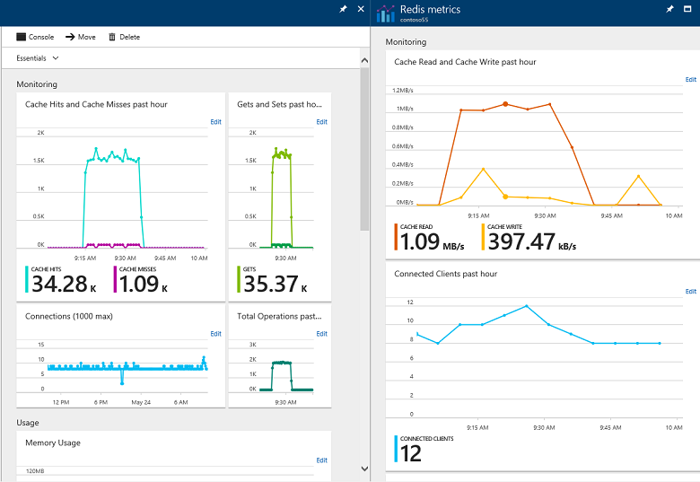
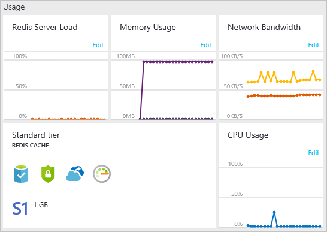
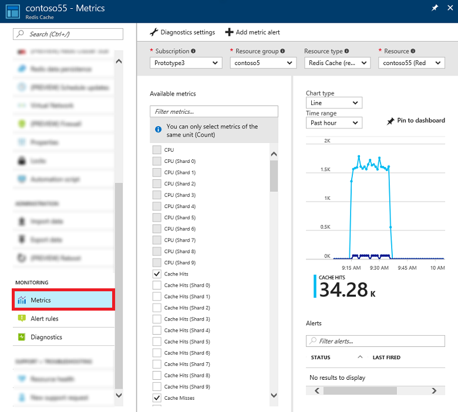
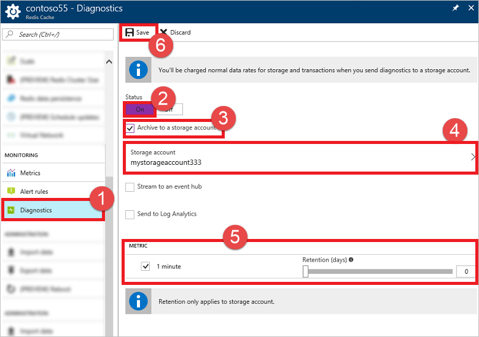
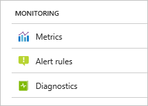

# How to monitor Azure Redis Cache
Azure Redis Cache uses [Azure Monitor](https://docs.microsoft.com/azure/monitoring-and-diagnostics/) to provide several options for monitoring your cache instances. You can view metrics, pin metrics charts to the Startboard, customize the date and time range of monitoring charts, add and remove metrics from the charts, and set alerts when certain conditions are met. These tools enable you to monitor the health of your Azure Redis Cache instances and help you manage your caching applications.

Metrics for Azure Redis Cache instances are collected using the Redis [INFO](http://redis.io/commands/info) command approximately twice per minute and automatically stored for 30 days (see [Export cache metrics](#export-cache-metrics) to configure a different retention policy) so they can be displayed in the metrics charts and evaluated by alert rules. For more information about the different INFO values used for each cache metric, see [Available metrics and reporting intervals](#available-metrics-and-reporting-intervals).

To view cache metrics, [browse](cache-configure.md#configure-redis-cache-settings) to your cache instance in the [Azure portal](https://portal.azure.com).  Azure Redis Cache provides some built-in charts on the **Overview** blade and the **Redis metrics** blade. Each chart can be customized by adding or removing metrics and changing the reporting interval.

## View pre-configured metrics charts

The **Overview** blade has the following pre-configured monitoring charts.

* [Monitoring charts](#monitoring-charts)
* [Usage charts](#usage-charts)

### Monitoring charts
The **Monitoring** section in the **Overview** blade has **Hits and Misses**, **Gets and Sets**, **Connections**, and **Total Commands** charts.

### Usage charts
The **Usage** section in the **Overview** blade has **Redis Server Load**, **Memory Usage**, **Network Bandwidth**, and **CPU Usage** charts, and also displays the **Pricing tier** for the cache instance.

The **Pricing tier** displays the cache pricing tier, and can be used to [scale](cache-how-to-scale.md) the cache to a different pricing tier.

## View metrics with Azure monitor
To view Redis metrics and create custom charts using Azure Monitor, click **Metrics** from the **Resource menu**, and customize your chart using the desired metrics, reporting interval, chart type, and more.

For more information on working with metrics using Azure Monitor, see [Overview of metrics in Microsoft Azure](../monitoring-and-diagnostics/monitoring-overview-metrics.md).

## Export cache metrics
By default, cache metrics in Azure Monitor are [stored for 30 days](../monitoring/monitoring-data-collection.md#metrics) and then deleted. To persist your cache metrics for longer than 30 days, you can [designate a storage account](../monitoring-and-diagnostics/monitoring-archive-diagnostic-logs.md) and specify a **Retention (days)** policy for your cache metrics. 

To configure a storage account for your cache metrics:

1. Click **Diagnostics** from the **Resource menu** in the **Redis Cache** blade.
2. Click **On**.
3. Check **Archive to a storage account**.
4. Select the storage account in which to store the cache metrics.
5. Check the **1 minute** checkbox and specify a **Retention (days)** policy. If you do not want to apply any retention policy and retain data forever, set **Retention (days)** to **0**.
6. Click **Save**.

>[!NOTE]
>In addition to archiving your cache metrics to storage, you can also [stream them to an Event hub or send them to Log Analytics](../monitoring-and-diagnostics/monitoring-rest-api-walkthrough.md#retrieve-metric-values).
>
>

To access your metrics, you can view them in the Azure portal as previously described in this article, and you can also access them using the [Azure Monitor Metrics REST API](../monitoring-and-diagnostics/monitor-stream-monitoring-data-event-hubs.md).

> [!NOTE]
> If you change storage accounts, the data in the previously configured storage account remains available for download, but it is not displayed in the Azure portal.  
> 
> 

## Available metrics and reporting intervals
Cache metrics are reported using several reporting intervals, including **Past hour**, **Today**, **Past week**, and **Custom**. The **Metric** blade for each metrics chart displays the average, minimum, and maximum values for each metric in the chart, and some metrics display a total for the reporting interval. 

Each metric includes two versions. One metric measures performance for the entire cache, and for caches that use [clustering](cache-how-to-premium-clustering.md), a second version of the metric that includes `(Shard 0-9)` in the name measures performance for a single shard in a cache. For example if a cache has 4 shards, `Cache Hits` is the total amount of hits for the entire cache, and `Cache Hits (Shard 3)` is just the hits for that shard of the cache.

> [!NOTE]
> Even when the cache is idle with no connected active client applications, you may see some cache activity, such as connected clients, memory usage, and operations being performed. This activity is normal during the operation of an Azure Redis Cache instance.
> 
> 

| Metric | Description |
| --- | --- |
| Cache Hits |The number of successful key lookups during the specified reporting interval. This maps to `keyspace_hits` from the Redis [INFO](http://redis.io/commands/info) command. |
| Cache Latency (Preview) | The latency of the cache calculated based off the internode latency of the cache. This metric is measured in microseconds, and has three dimensions: "Avg", "Min", and "Max" which represent the average, minimum, and maximum latency of the cache respectively during the specified reporting interval. |
| Cache Misses |The number of failed key lookups during the specified reporting interval. This maps to `keyspace_misses` from the Redis INFO command. Cache misses do not necessarily mean there is an issue with the cache. For example, when using the cache-aside programming pattern, an application looks first in the cache for an item. If the item is not there (cache miss), the item is retrieved from the database and added to the cache for next time. Cache misses are normal behavior for the cache-aside programming pattern. If the number of cache misses is higher than expected, examine the application logic that populates and reads from the cache. If items are being evicted from the cache due to memory pressure then there may be some cache misses, but a better metric to monitor for memory pressure would be `Used Memory` or `Evicted Keys`. |
| Cache Read |The amount of data read from the cache in Megabytes per second (MB/s) during the specified reporting interval. This value is derived from the network interface cards that support the virtual machine that hosts the cache and is not Redis specific. **This value corresponds to the network bandwidth used by this cache. If you want to set up alerts for server-side network bandwidth limits, then create it using this `Cache Read` counter. See [this table](cache-faq.md#cache-performance) for the observed bandwidth limits for various cache pricing tiers and sizes.** |
| Cache Write |The amount of data written to the cache in Megabytes per second (MB/s) during the specified reporting interval. This value is derived from the network interface cards that support the virtual machine that hosts the cache and is not Redis specific. This value corresponds to the network bandwidth of data sent to the cache from the client. |
| Connected Clients |The number of client connections to the cache during the specified reporting interval. This maps to `connected_clients` from the Redis INFO command. Once the [connection limit](cache-configure.md#default-redis-server-configuration) is reached subsequent connection attempts to the cache will fail. Note that even if there are no active client applications, there may still be a few instances of connected clients due to internal processes and connections. |
| CPU |The CPU utilization of the Azure Redis Cache server as a percentage during the specified reporting interval. This value maps to the operating system `\Processor(_Total)\% Processor Time` performance counter. |
| Errors | Specific failures and performance issues that the cache could be experiencing during a specified reporting interval. This metric has eight dimensions representing different error types, but could have more added in the future. The error types represented now are as follows:  <ul><li>**Failover** – when a cache fails over (slave promotes to master)</li><li>**Crash** – when the cache crashes unexpectedly on either of the nodes</li><li>**Dataloss** – when there is dataloss on the cache</li><li>**UnresponsiveClients** – when the clients are not reading data from the server fast enough</li><li>**AOF** – when there is an issue related to AOF persistence</li><li>**RDB** – when there is an issue related to RDB persistence</li><li>**Import** – when there is an issue related to Import RDB</li><li>**Export** – when there is an issue related to Export RDB</li></ul> |
| Evicted Keys |The number of items evicted from the cache during the specified reporting interval due to the `maxmemory` limit. This maps to `evicted_keys` from the Redis INFO command. |
| Expired Keys |The number of items expired from the cache during the specified reporting interval. This value maps to `expired_keys` from the Redis INFO command.|
| Gets |The number of get operations from the cache during the specified reporting interval. This value is the sum of the following values from the Redis INFO all command: `cmdstat_get`, `cmdstat_hget`, `cmdstat_hgetall`, `cmdstat_hmget`, `cmdstat_mget`, `cmdstat_getbit`, and `cmdstat_getrange`, and is equivalent to the sum of cache hits and misses during the reporting interval. |
| Operations per Second | The total number of commands processed per second by the cache server during the specified reporting interval.  This value maps to "instantaneous_ops_per_sec" from the Redis INFO command. |
| Redis Server Load |The percentage of cycles in which the Redis server is busy processing and not waiting idle for messages. If this counter reaches 100 it means the Redis server has hit a performance ceiling and the CPU can't process work any faster. If you are seeing high Redis Server Load then you will see timeout exceptions in the client. In this case you should consider scaling up or partitioning your data into multiple caches. |
| Sets |The number of set operations to the cache during the specified reporting interval. This value is the sum of the following values from the Redis INFO all command: `cmdstat_set`, `cmdstat_hset`, `cmdstat_hmset`, `cmdstat_hsetnx`, `cmdstat_lset`, `cmdstat_mset`, `cmdstat_msetnx`, `cmdstat_setbit`, `cmdstat_setex`, `cmdstat_setrange`, and `cmdstat_setnx`. |
| Total Keys  | The maximum number of keys in the cache during the past reporting time period. This maps to `keyspace` from the Redis INFO command. Due to a limitation of the underlying metrics system, for caches with clustering enabled, Total Keys returns the maximum number of keys of the shard that had the maximum number of keys during the reporting interval.  |
| Total Operations |The total number of commands processed by the cache server during the specified reporting interval. This value maps to `total_commands_processed` from the Redis INFO command. Note that when Azure Redis Cache is used purely for pub/sub there will be no metrics for `Cache Hits`, `Cache Misses`, `Gets`, or `Sets`, but there will be `Total Operations` metrics that reflect the cache usage for pub/sub operations. |
| Used Memory |The amount of cache memory used for key/value pairs in the cache in MB during the specified reporting interval. This value maps to `used_memory` from the Redis INFO command. This does not include metadata or fragmentation. |
| Used Memory Percentage | The % of total memory that is being used during the specified reporting interval.  This references the "used_memory" value from the Redis INFO command to calculate the percentage. |
| Used Memory RSS |The amount of cache memory used in MB during the specified reporting interval, including fragmentation and metadata. This value maps to `used_memory_rss` from the Redis INFO command. |

## Alerts
You can configure to receive alerts based on metrics and activity logs. Azure Monitor allows you to configure an alert to do the following when it triggers:

* Send an email notification
* Call a webhook
* Invoke an Azure Logic App

To configure Alert rules for your cache, click **Alert rules** from the **Resource menu**.

For more information about configuring and using Alerts, see [Overview of Alerts](../monitoring-and-diagnostics/insights-alerts-portal.md).

## Activity Logs
Activity logs provide insight into the operations that were performed on your Azure Redis Cache instances. It was previously known as "audit logs" or "operational logs". Using activity logs, you can determine the "what, who, and when" for any write operations (PUT, POST, DELETE) taken on your Azure Redis Cache instances. 

> [!NOTE]
> Activity logs do not include read (GET) operations.
>
>

To view activity logs for your cache, click **Activity logs** from the **Resource menu**.

For more information about Activity logs, see [Overview of the Azure Activity Log](../monitoring-and-diagnostics/monitoring-overview-activity-logs.md).

