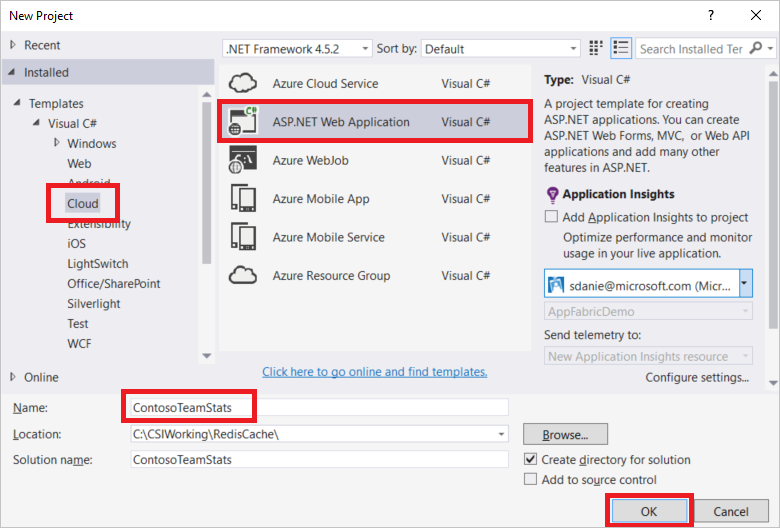
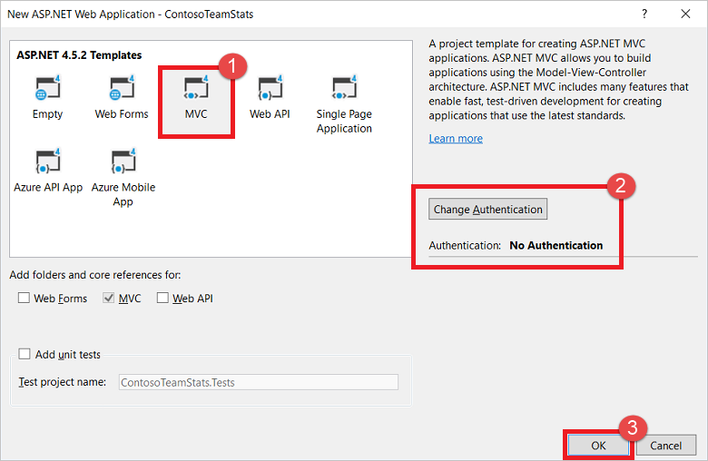
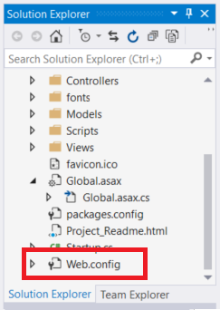
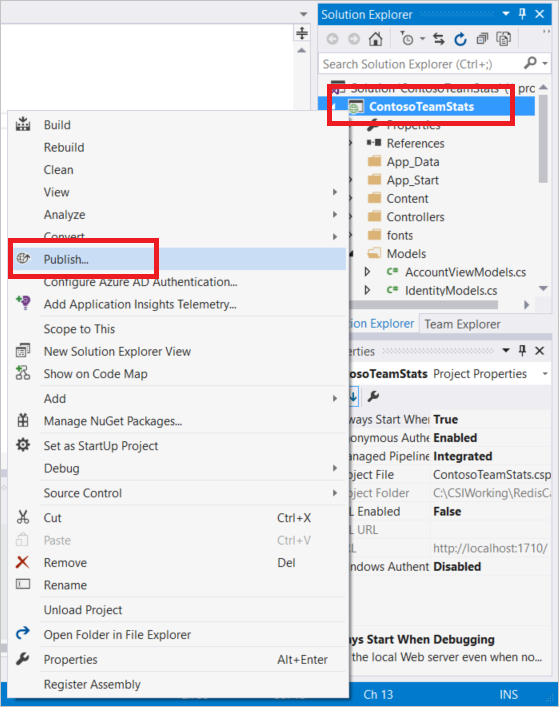
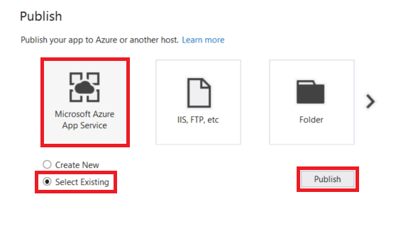
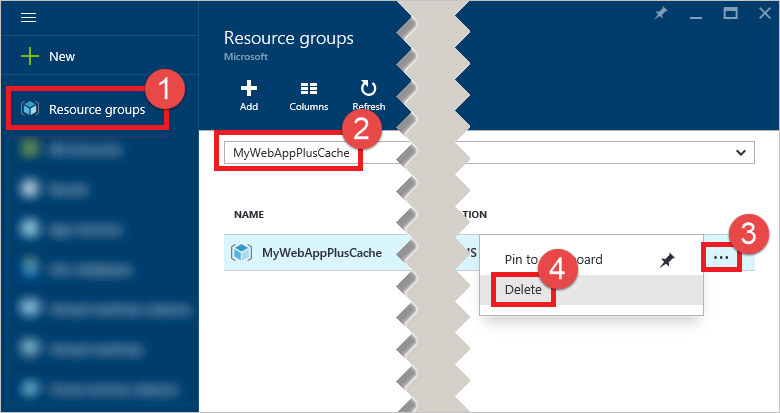

# Quickstart: Create a ASP.NET Web App with Redis Cache
> [!div class="op_single_selector"]
> * [.NET](cache-dotnet-how-to-use-azure-redis-cache.md)
> * [ASP.NET](cache-web-app-howto.md)
> * [Node.js](cache-nodejs-get-started.md)
> * [Java](cache-java-get-started.md)
> * [Python](cache-python-get-started.md)
> 
> 

## Overview

This quickstart shows how to create and deploy an ASP.NET web application to a web app in Azure App Service using Visual Studio 2017. The sample application connects to an Azure Redis Cache to store and retrieve data from the cache. When you complete the tutorial you have a running web app that reads and writes to a database, optimized with Azure Redis Cache, and hosted in Azure.


You learn:

* How to create an ASP.NET MVC 5 web application in Visual Studio.
* How to create an Azure Redis Cache
* How to connect to the cache using the [StackExchange.Redis](https://github.com/StackExchange/StackExchange.Redis) client.
* How to publish the application to Azure using Visual Studio.

## Prerequisites
To complete the tutorial, you must have the following prerequisites:

* [Azure account](#azure-account)
* [Visual Studio 2017 with the Azure SDK for .NET](#visual-studio-2017-with-the-azure-sdk-for-net)

### Azure account
You need an Azure account to complete the tutorial. You can:

* [Open an Azure account for free](https://azure.microsoft.com/pricing/free-trial/?WT.mc_id=redis_cache_hero). You get credits that can be used to try out paid Azure services. Even after the credits are used up, you can keep the account and use free Azure services and features.
* [Activate Visual Studio subscriber benefits](https://azure.microsoft.com/pricing/member-offers/msdn-benefits-details/?WT.mc_id=redis_cache_hero). Your MSDN subscription gives you credits every month that you can use for paid Azure services.


## Create the Visual Studio project

1. Open Visual Studio and click **File**, **New**, **Project**.
2. Expand the **Visual C#** node in the **Templates** list, select **Cloud**, and click **ASP.NET Web Application**. Ensure that **.NET Framework 4.5.2** or higher is selected.  Type **ContosoTeamStats** into the **Name** textbox and click **OK**.
   
    

3. Select **MVC** as the project type. 

    Ensure that **No Authentication** is specified for the **Authentication** settings. Depending on your version of Visual Studio, the default may be set to something else. To change it, click **Change Authentication** and select **No Authentication**.

  
    

4. Click **OK** to create the project.


## Create a cache

Getting started with Azure Redis Cache is easy. To get started, you provision and configure a cache. Next, you configure the cache clients so they can access the cache. Once the cache clients are configured, you can begin working with them.

[!INCLUDE [redis-cache-create](../../includes/redis-cache-create.md)]

[!INCLUDE [redis-cache-create](../../includes/redis-cache-access-keys.md)]


## Update the MVC application

In this section, you update the application to support a new view that will display a simple test against an Azure Redis Cache.

* [Update the web.config file with an app setting for the cache](#Update-the-webconfig-file-with-an-app-setting-for-the-cache)
* [Configure the application to use the StackExchange.Redis client]((#configure-the-application-to-use-stackexchangeredis)
* [Update the HomeController and Layout](#update-the-homecontroller-and-layout)
* [Add a new RedisCache view](#add-a-new-rediscache-view)


### Update the web.config file with an app setting for the cache

Create a file on your computer named *CacheSecrets.config* and place it in a location that won't be checked in with the source code of your sample application. For this quickstart, the *CacheSecrets.config* file is located here, *C:\AppSecrets\CacheSecrets.config*.
   
Edit the *CacheSecrets.config* file and add the following contents:

```xml
<appSettings>
    <add key="CacheConnection" value="YourCacheName.redis.cache.windows.net,abortConnect=false,ssl=true,password=YourAccessKey"/>
</appSettings>
```

Replace **YourCacheName** with the cache host name you copied earlier.

Replace **YourAccessKey** with the key (primary or secondary) that you copied earlier.

If you run the application locally this information is used to connect to your Azure Redis Cache instance. Later in the tutorial you'll deploy this application to Azure. At that time, you will also configure an app setting in Azure that the application will use to retrieve the cache connection information instead of this file. Since the `CacheSecrets.config` is not deployed to Azure with your application, you only use it while testing the application locally.

In **Solution Explorer**, double-click the *web.config* file to open it.
   


In the *web.config* file, add the following `file` attribute to the `appSettings` element. If you used a different file name or location, substitute those values for the ones shown in the example.
   
   * Before: `<appSettings>`
   * After: ` <appSettings file="C:\AppSecrets\CacheSecrets.config">`
  
The ASP.NET runtime merges the contents of the external file with the markup in the `<appSettings>` element. The runtime ignores the file attribute if the specified file cannot be found. Your secrets (the connection string to your cache) are not included as part of the source code for the application. When you deploy your web app to Azure, the *CacheSecrests.config* file won't be deployed. 


### Configure the application to use StackExchange.Redis

1. To configure the app to use the [StackExchange.Redis](https://github.com/StackExchange/StackExchange.Redis) NuGet package for Visual Studio, click **Tools > NuGet Package Manager > Package Manager Console**.
2. Run the following command from the `Package Manager Console` window:
    
    ```
    Install-Package StackExchange.Redis
    ```
   
    The NuGet package downloads and adds the required assembly references for your client application to access Azure Redis Cache with the StackExchange.Redis cache client. If you prefer to use a strong-named version of the `StackExchange.Redis` client library, install the `StackExchange.Redis.StrongName` package.


### Update the HomeController and Layout

1. In **Solution Explorer**, expand the **Controllers** folder, and open the *HomeController.cs* file.

2. Add the following method to the `HomeController` class to support a new `RedisCache` action.

	```csharp
    public ActionResult RedisCache()
    {
        ViewBag.Message = "A simple test with Azure Redis Cache on ASP.NET.";

        return View();
    }
	```
3.  In **Solution Explorer**, expand **Views**>**Shared** folder, and open the *_Layout.cshtml* file.   

    Replace :
    ```
    @Html.ActionLink("Application name", "Index", "Home", new { area = "" }, new { @class = "navbar-brand" })
    ```

    With:
    ```
    @Html.ActionLink("Azure Redis Cache Test", "RedisCache", "Home", new { area = "" }, new { @class = "navbar-brand" })
    ```


### Add a new RedisCache view

1. In **Solution Explorer**, expand the **Views** folder and then right-click the **Home** folder, and choose **Add** > **View...**. 

2. In the Add View dialog, enter **RedisCache** for the View Name and click **Add**.
   
3. Replace the code in the *RedisCache.cshtml* file with the following code:

    ```
    @using System.Configuration;
    @using StackExchange.Redis;

    @{
        ViewBag.Title = "Azure Redis Cache Test";

        var lazyConnection = new Lazy<ConnectionMultiplexer>(() =>
        {
            string cacheConnection = ConfigurationManager.AppSettings["CacheConnection"].ToString();
            return ConnectionMultiplexer.Connect(cacheConnection);
        });

        // Connection refers to a property that returns a ConnectionMultiplexer
        // as shown in the previous example.
        IDatabase cache = lazyConnection.Value.GetDatabase();

        // Perform cache operations using the cache object...
        // Simple put of integral data types into the cache

        string pingResult = cache.Execute("PING").ToString();

        string key1 = cache.StringGet("Message").ToString();
        string setResult = cache.StringSet("Message", "Hello! The cache is working from ASP.NET!").ToString();
        string key2 = cache.StringGet("Message");

        string clientListResult = cache.Execute("CLIENT", "LIST").ToString().Replace(" id=", "\rid=");

        lazyConnection.Value.Dispose();

    }

    <h2>@ViewBag.Title.</h2>
    <h3>@ViewBag.Message</h3>
    <br /><br />
    <table border="1" cellpadding="10">
        <tr>
            <th>Command</th>
            <th>Result</th>
        </tr>
        <tr>
            <td>PING</td>
            <td><pre>@pingResult</pre></td>
        </tr>
        <tr>
            <td>GET Message</td>
            <td><pre>@key1</pre></td>
        </tr>
        <tr>
            <td>SET Message "Hello! The cache is working from ASP.NET!"</td>
            <td>@setResult</td>
        </tr>
        <tr>
            <td>GET Message</td>
            <td><pre>@key2</pre></td>
        </tr>
        <tr>
            <td>CLIENT LIST</td>
            <td><pre>@clientListResult</pre></td>
        </tr>
    </table>
    ```


## Run the app locally


## Publish the application to Azure

Once you have successfully test the app locally, you will deploy the app to Azure from Visual Studio.

In this step of the tutorial, you'll publish the application to Azure and run it in the cloud.

1. Right-click the **ContosoTeamStats** project in Visual Studio and choose **Publish**.
   
    
2. Click **Microsoft Azure App Service**, choose **Select Existing**, and click **Publish**.
   
    
3. Select the subscription used when creating the Azure resources, expand the resource group containing the resources, and select the desired Web App. If you used the **Deploy to Azure** button your Web App name starts with **webSite** followed by some additional characters.
   
 


## Delete the resources when you are finished with the application
When you are finished with the sample tutorial application, you can delete the Azure resources used in order to conserve cost and resources. If you use the **Deploy to Azure** button in the [Provision the Azure resources](#provision-the-azure-resources) section and all of your resources are contained in the same resource group, you can delete them together in one operation by deleting the resource group.

1. Sign in to the [Azure portal](https://portal.azure.com) and click **Resource groups**.
2. Type the name of your resource group into the **Filter items...** textbox.
3. Click **...** to the right of your resource group.
4. Click **Delete**.
   
    
5. Type the name of your resource group and click **Delete**.
   
    

After a few moments the resource group and all of its contained resources are deleted.

> [!IMPORTANT]
> Note that deleting a resource group is irreversible and that the resource group and all the resources in it are permanently deleted. Make sure that you do not accidentally delete the wrong resource group or resources. If you created the resources for hosting this sample inside an existing resource group, you can delete each resource individually from their respective blades.
> 
> 


## Next steps
* Learn more about [Getting Started with ASP.NET MVC 5](http://www.asp.net/mvc/overview/getting-started/introduction/getting-started) on the [ASP.NET](http://asp.net/) site.
* For more examples of creating an ASP.NET Web App in App Service, see [Create and deploy an ASP.NET web app in Azure App Service](https://github.com/Microsoft/HealthClinic.biz/wiki/Create-and-deploy-an-ASP.NET-web-app-in-Azure-App-Service) from the [HealthClinic.biz](https://github.com/Microsoft/HealthClinic.biz) 2015 Connect [demo](https://blogs.msdn.microsoft.com/visualstudio/2015/12/08/connectdemos-2015-healthclinic-biz/).
  * For more quickstarts from the HealthClinic.biz demo, see [Azure Developer Tools Quickstarts](https://github.com/Microsoft/HealthClinic.biz/wiki/Azure-Developer-Tools-Quickstarts).
* Learn more about the [Code first to a new database](https://msdn.microsoft.com/data/jj193542) approach to Entity Framework that's used in this tutorial.
* Learn more about [web apps in Azure App Service](../app-service/app-service-web-overview.md).
* Learn how to [monitor](cache-how-to-monitor.md) your cache in the Azure portal.
* Explore Azure Redis Cache premium features
  
  * [How to configure persistence for a Premium Azure Redis Cache](cache-how-to-premium-persistence.md)
  * [How to configure clustering for a Premium Azure Redis Cache](cache-how-to-premium-clustering.md)
  * [How to configure Virtual Network support for a Premium Azure Redis Cache](cache-how-to-premium-vnet.md)
  * See the [Azure Redis Cache FAQ](cache-faq.md#what-redis-cache-offering-and-size-should-i-use) for more details about size, throughput, and bandwidth with premium caches.

