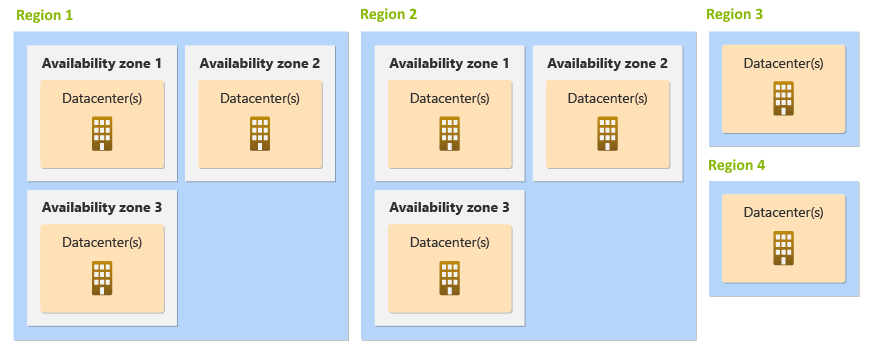

# What are Azure regions and availability zones?

An Azure *region* is a geographic perimeter that contains a set of datacenters. 

Azure regions have a variety of configurations, which are also called *region architectures*.

Many Azure regions provide availability zones, which are separated groups of datacenters. Within a region, availability zones are close enough to have low-latency connections to other availability zones, but they're far enough apart to reduce the likelihood that more than one will be affected by local outages or weather. Availability zones have independent power, cooling, and networking infrastructure. They're designed so that if one zone experiences an outage, then regional services, capacity, and high availability are supported by the remaining zones.

The following diagram shows several example Azure regions. Regions 1 and 2 support availability zones.

To see which regions support availability zones, see [Azure regions with availability zone support](availability-zones-service-support.md#azure-regions-with-availability-zone-support).

## Paired and unpaired regions

Many regions also have a [*paired region*](./cross-region-replication-azure.md#azure-cross-region-replication-pairings-for-all-geographies). Paired regions support certain types of multi-region deployment approaches. Some newer regions have [multiple availability zones and don't have a paired region](./cross-region-replication-azure.md#regions-with-availability-zones-and-no-region-pair). You can still deploy multi-region solutions into these regions, but the approaches you use might be different.

## Availability zones

If you deploy into an Azure region that contains availability zones, you can use multiple availability zones together. By using multiple availability zones, you can keep separate copies of your application and data within separate physical datacenters in a large metropolitan area.

There are two ways to use availability zones in a solution:

- **Zonal** resources are pinned to a specific availability zone. You can combine multiple zonal deployments across different zones to meet high reliability requirements. You're responsible for managing data replication and distributing requests across zones. If an outage occurs in a single availability zone, you're responsible for failover to another availability zone.

- **Zone-redundant** resources are spread across multiple availability zones. Microsoft manages spreading requests across zones and the replication of data across zones. If an outage occurs in a single availability zone, Microsoft manages failover automatically.

Azure services support one or both of these approaches. Platform as a service (PaaS) services typically support zone-redundant deployments. Infrastructure as a service (IaaS) services typically support zonal deployments. For more information about how Azure services work with availability zones, see [Azure regions with availability zone support](availability-zones-service-support.md#azure-regions-with-availability-zone-support). 

For information on service-specific reliability support using availability zones as well as recommended disaster recovery guidance see [Reliability guidance overview](./reliability-guidance-overview.md).

## Availability zones and Azure updates

Microsoft aims to deploy updates to Azure services to a single availability zone at a time. This approach reduces the impact that updates might have on an active workload, because the workload can continue to run in other zones while the update is in process. For more information about how Azure deploys updates, see [Advancing safe deployment practices](https://azure.microsoft.com/blog/advancing-safe-deployment-practices/).

## Shared responsibility model

The [shared responsibility model](./overview.md#shared-responsibility) describes how responsibilities are divided between the cloud provider (Microsoft) and you. Depending on the type of services you use, you might take on more or less responsibility for operating the service.

Microsoft provides availability zones and regions to give you flexibility in how you design your solution to meet your requirements. When you use managed services, Microsoft takes on more of the management responsibilities for your resources, which might even include data replication, failover, failback, and other tasks related to operating a distributed system.

<!--
Regardless of the approach you use, your own code needs to follow [recommended practices for handling transient failures](handle-transient-faults.md). These practices are even more important in a multi-zone or multi-region solution, because failover between zones or regions usually requires that your application retry connections to services.
-->

## Next steps

- [Azure services and regions with availability zones](availability-zones-service-support.md)

- [Availability zone migration guidance](availability-zones-migration-overview.md)

- [Availability of service by category](availability-service-by-category.md)

- [Microsoft commitment to expand Azure availability zones to more regions](https://azure.microsoft.com/blog/our-commitment-to-expand-azure-availability-zones-to-more-regions/)

- [Build solutions for high availability using availability zones](/azure/architecture/high-availability/building-solutions-for-high-availability)
