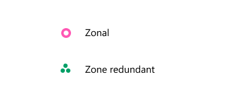

# Availability zone service and regional support

Azure availability zones are physically separate locations within each Azure region. This article shows you which regions and services support availability zones. 

For more information on availability zones and regions, see [What are Azure regions and availability zones?](availability-zones-overview.md),

## Azure regions with availability zone support

Azure provides the most extensive global footprint of any cloud provider and is rapidly opening new regions and availability zones. Azure has availability zones in every country/region in which Azure operates a datacenter region. 

>[!IMPORTANT]
>Some services may have limited support for availability zones. For example, some may only support availability zones for certain tiers, regions, or SKUs. To get more information on service limitations for availability zone support, select that service listed in the [Azure services with availability zone support](#azure-services-with-availability-zone-support) section of this document.

The following regions currently support availability zones:

| Americas | Europe | Middle East | Africa | Asia Pacific |
|---|---|---|---|---|
| Brazil South | France Central | Qatar Central | South Africa North | Australia East |
| Canada Central | Italy North | UAE North | | Central India |
| Central US |  Germany West Central | Israel Central* | | Japan East |
| East US | Norway East | | | Korea Central |
| East US 2 | North Europe  | | | Southeast Asia |
| South Central US | UK South | | | East Asia |
| US Gov Virginia | West Europe  | | | China North 3 |
| West US 2 | Sweden Central | | | |
| West US 3 | Switzerland North | | | |
||Poland Central ||||

\* To learn more about availability zones and available services support in these regions, contact your Microsoft sales or customer representative. For the upcoming regions that will support availability zones, see [Azure geographies](https://azure.microsoft.com/global-infrastructure/geographies/).

## Azure services with availability zone support

Azure services that support availability zones, including zonal and zone-redundant offerings, are continually expanding.

Three types of Azure services support availability zones: *zonal*, *zone-redundant*, and *always-available* services. You can combine all three of these approaches to architecture when you design your reliability strategy.

- **Zonal services**: A resource can be deployed to a specific, self-selected availability zone to achieve more stringent latency or performance requirements. Resiliency is self-architected by replicating applications and data to one or more zones within the region. Resources are aligned to a selected zone. For example, virtual machines, managed disks, or standard IP addresses can be aligned to a same zone, which allows for increased resiliency by having multiple instances of resources deployed to different zones.

- **Zone-redundant services**: Resources are replicated or distributed across zones automatically. For example, zone-redundant services replicate the data across multiple zones so that a failure in one zone doesn't affect the high availability of the data. 

- **Always-available services**: Always available across all Azure geographies and are resilient to zone-wide outages and region-wide outages. For a complete list of always-available services, also called non-regional services, in Azure, see [Products available by region](https://azure.microsoft.com/global-infrastructure/services/).

For more information on older-generation virtual machines, see [Previous generations of virtual machine sizes](../virtual-machines/sizes-previous-gen.md).

The following tables provide a summary of the current offering of zonal, zone-redundant, and always-available Azure services. They list Azure offerings according to the regional availability of each.

>[!IMPORTANT]
>To learn more about availability zones support and available services in your region, contact your Microsoft sales or customer representative.

##### Legend
 

In the Product Catalog, always-available services are listed as "non-regional" services.

Azure offerings are grouped into three categories that reflect their _regional_ availability: *foundational*, *mainstream*, and *strategic* services. Azure's general policy on deploying services into any given region is primarily driven by region type, service category, and customer demand. For more information, see [Azure services](availability-service-by-category.md).

- **Foundational services**: Available in all recommended and alternate regions when a region is generally available, or within 90 days of a new foundational service becoming generally available.
- **Mainstream services**: Available in all recommended regions within 90 days of a region's general availability. Mainstream services are demand-driven in alternate regions, and many are already deployed into a large subset of alternate regions.
- **Strategic services**: Targeted service offerings, often industry-focused or backed by customized hardware. Strategic services are demand-driven for availability across regions, and many are already deployed into a large subset of recommended regions

>[!IMPORTANT]
>Some services, although they are zone-redundant, may have limited support for availability zones. For example, some may only support availability zones for certain tiers, regions, or SKUs. To get more information on service limitations for availability zone support, select that service in the table below.

###  Foundational services 

| **Products**   | **Resiliency**   |
| --- | --- |
| [Azure Application Gateway (V2)](migrate-app-gateway-v2.md) |    |
| [Azure Backup](migrate-recovery-services-vault.md)  |  |
| [Azure Cosmos DB](../cosmos-db/high-availability.md) |    |
| [Azure DNS: Azure DNS Private Zones](../dns/private-dns-getstarted-portal.md) |   |
| [Azure DNS: Azure DNS Private Resolver](../dns/dns-private-resolver-get-started-portal.md) |   |
| [Azure ExpressRoute](../expressroute/designing-for-high-availability-with-expressroute.md) |   |
| [Azure Public IP](../virtual-network/ip-services/public-ip-addresses.md) |   |
| [Azure Site Recovery](migrate-recovery-services-vault.md) |  |
| [Azure SQL Database](migrate-sql-database.md) |  |
| [Azure SQL Managed Instance](/azure/azure-sql/database/business-continuity-high-availability-disaster-recover-hadr-overview?view=azuresql&preserve-view=true) |   |
| [Azure Event Hubs](../event-hubs/event-hubs-geo-dr.md#availability-zones) |  |
| [Azure Key Vault](../key-vault/general/disaster-recovery-guidance.md) |  |
| [Azure Load Balancer](../load-balancer/load-balancer-standard-availability-zones.md) |   |
| [Azure Service Bus](../service-bus-messaging/service-bus-geo-dr.md#availability-zones) |  |
| [Azure Service Fabric](../service-fabric/service-fabric-cross-availability-zones.md) |    |
| [Azure Storage account](migrate-storage.md)  |  |
| [Azure Storage: Azure Data Lake Storage](migrate-storage.md) |   |
| [Azure Storage: Disk Storage](migrate-storage.md) |  |
| [Azure Storage: Blob Storage](migrate-storage.md) |   |
| [Azure Storage: Managed Disks](/azure/virtual-machines/disks-redundancy) |   |
| [Azure Virtual Machine Scale Sets](../virtual-machines/availability.md) |   |
| [Azure Virtual Machines](../virtual-machines/availability.md) |   |
| Virtual Machines: [Av2-Series](../virtual-machines/availability.md) |  |
| Virtual Machines: [Bs-Series](../virtual-machines/availability.md) |  |
| Virtual Machines: [DSv2-Series](../virtual-machines/availability.md) |  |
| Virtual Machines: [DSv3-Series](../virtual-machines/availability.md) |  |
| Virtual Machines: [Dv2-Series](../virtual-machines/availability.md) |  |
| Virtual Machines: [Dv3-Series](../virtual-machines/availability.md) |  |
| Virtual Machines: [ESv3-Series](../virtual-machines/availability.md) |  |
| Virtual Machines: [Ev3-Series](../virtual-machines/availability.md) |  |
| Virtual Machines: [F-Series](../virtual-machines/availability.md) |   |
| Virtual Machines: [FS-Series](../virtual-machines/availability.md) |  |
| Virtual Machines: [Azure Compute Gallery](../virtual-machines/availability.md)|   |
| [Azure Virtual Network](../vpn-gateway/create-zone-redundant-vnet-gateway.md) |  |
| [Azure VPN Gateway](../vpn-gateway/about-zone-redundant-vnet-gateways.md) |  |

\*VMs that support availability zones: AV2-series, B-series, DSv2-series, DSv3-series, Dv2-series, Dv3-series, ESv3-series, Ev3-series, F-series, FS-series, FSv2-series, and M-series.\*

###  Mainstream services

| **Products**   | **Resiliency**   |
| --- | --- |
| [Microsoft Entra Domain Services](../active-directory-domain-services/overview.md) |  |
| [Azure API Management](migrate-api-mgt.md) |  |
| [Azure App Configuration](../azure-app-configuration/faq.yml#how-does-app-configuration-ensure-high-data-availability) |  |
| [Azure App Service](migrate-app-service.md) |  |
| [Azure App Service: App Service Environment](migrate-app-service-environment.md) |   |
| [Azure Bastion](../bastion/bastion-overview.md) |  |
| [Azure Batch](../batch/create-pool-availability-zones.md) |  |
| [Azure Cache for Redis](../azure-cache-for-redis/cache-high-availability.md) |   |
| [Azure Cognitive Search](../search/search-reliability.md#availability-zones) |  |
| [Azure Container Apps](reliability-azure-container-apps.md) |  |
| [Azure Container Instances](../container-instances/availability-zones.md) |  |
| [Azure Container Registry](../container-registry/zone-redundancy.md) |  |
| [Azure Data Explorer](/azure/data-explorer/create-cluster-database-portal) |  |
| [Azure Data Factory](../data-factory/concepts-data-redundancy.md) |  |
| [Azure Database for MySQL – Flexible Server](../mysql/flexible-server/concepts-high-availability.md) |  |
| [Azure Database for PostgreSQL – Flexible Server](../postgresql/flexible-server/overview.md) |  |
| [Azure DDoS Protection](../ddos-protection/ddos-faq.yml) |  |
| [Azure Disk Encryption](../virtual-machines/disks-redundancy.md) |  |
| [Azure Event Grid](../event-grid/overview.md) |  |
| [Azure Firewall](../firewall/deploy-availability-zone-powershell.md) |    |
| [Azure Firewall Manager](../firewall-manager/quick-firewall-policy.md) |  |
| [Azure Functions](./reliability-functions.md) |  |
| [Azure HDInsight](../hdinsight/hdinsight-use-availability-zones.md) |   |
| [Azure IoT Hub](../iot-hub/iot-hub-ha-dr.md) |  |
| [Azure Kubernetes Service (AKS)](../aks/availability-zones.md) |   |
| [Azure Logic Apps](../logic-apps/logic-apps-overview.md) |  |
| [Azure Monitor](../azure-monitor/logs/availability-zones.md)  |  |
| [Azure Monitor: Application Insights](../azure-monitor/logs/availability-zones.md)  |  |
| [Azure Monitor: Log Analytics](../azure-monitor/logs/availability-zones.md) |  |
| [Azure NAT Gateway](../nat-gateway/nat-availability-zones.md) |  | 
| [Azure Network Watcher](../network-watcher/frequently-asked-questions.yml) |  |
| [Azure Network Watcher: Traffic Analytics](../network-watcher/frequently-asked-questions.yml) |  |
| [Azure Notification Hubs](../notification-hubs/availability-zones.md) |  |
| [Azure Private Link](../private-link/private-link-overview.md) |  |
| [Azure Route Server](../route-server/route-server-faq.md) |  |
| Azure Stream Analytics |   |
| [SQL Server on Azure Virtual Machines](/azure/azure-sql/database/high-availability-sla) |  |
| Azure Storage: [Files Storage](migrate-storage.md) |  |
| [Azure Virtual WAN](../virtual-wan/virtual-wan-faq.md#how-are-availability-zones-and-resiliency-handled-in-virtual-wan) |  |
| [Azure Web Application Firewall](../firewall/deploy-availability-zone-powershell.md) |  |
| [Power BI Embedded](/power-bi/admin/service-admin-failover#what-does-high-availability) |  |
| Virtual Machines: [Azure Dedicated Host](../virtual-machines/availability.md) |  |
| Virtual Machines: [Ddsv4-Series](../virtual-machines/availability.md) |  |
| Virtual Machines: [Ddv4-Series](../virtual-machines/availability.md) |  |
| Virtual Machines: [Dsv4-Series](../virtual-machines/availability.md) |  |
| Virtual Machines: [Dv4-Series](../virtual-machines/availability.md) |  |
| Virtual Machines: [Edsv4-Series](../virtual-machines/availability.md) |  |
| Virtual Machines: [Edv4-Series](../virtual-machines/availability.md) |  |
| Virtual Machines: [Esv4-Series](../virtual-machines/availability.md) |  |
| Virtual Machines: [Ev4-Series](../virtual-machines/availability.md) |  |
| Virtual Machines: [Fsv2-Series](../virtual-machines/availability.md) |  |
| Virtual Machines: [M-Series](../virtual-machines/availability.md) |  |
| Virtual WAN: [Azure ExpressRoute](../virtual-wan/virtual-wan-faq.md#how-are-availability-zones-and-resiliency-handled-in-virtual-wan) |  |
| Virtual WAN: [Point-to-site VPN Gateway](../vpn-gateway/about-zone-redundant-vnet-gateways.md) |  |
| Virtual WAN: [Site-to-site VPN Gateway](../vpn-gateway/about-zone-redundant-vnet-gateways.md) |  |

###  Strategic services

| **Products**   | **Resiliency**   |
| --- | --- |
| [Azure Automation](../automation/automation-availability-zones.md)|  |
| [Azure HPC Cache](../hpc-cache/hpc-cache-overview.md) |  |
| [Azure IoT Hub Device Provisioning Service](../iot-dps/about-iot-dps.md) |  |
| [Azure NetApp Files](../azure-netapp-files/use-availability-zones.md) |  |
| Azure Red Hat OpenShift |   |
| [Azure Managed Instance for Apache Cassandra](../managed-instance-apache-cassandra/create-cluster-portal.md) |   |
| Azure Storage: Ultra Disk |  |

###  Non-regional services (always-available services)

| **Products**   | **Resiliency**   |
| --- | --- |
| Microsoft Entra ID  |  |
| Microsoft Defender for Identity  |  |
| Azure Advisor  |  |
| Azure Blueprints  |  |
| Azure Bot Services  |  |
| Azure Cloud Shell  |  |
| Azure Content Delivery Network  |  |
| Azure Cost Management and Billing |  |
| Microsoft Defender for IoT  |  |
| Azure DNS  |  |
| Azure Front Door  |  |
| Azure Information Protection  |  |
| Azure Lighthouse  |  |
| Azure Managed Applications  |  |
| Azure Maps  |  |
| Azure Peering Service  |  |
| Azure Performance Diagnostics  |  |
| Azure Policy  |  |
| Azure portal  |  |
| Azure Resource Graph  |  |
| Azure Stack Edge  |  |
| Azure Traffic Manager  |  |
| Customer Lockbox for Microsoft Azure  |  |
| Microsoft Defender for Cloud  |  |
| Microsoft Graph  |  |
| Microsoft Intune  |  |
| Microsoft Sentinel  |  |

## Pricing for virtual machines in availability zones

You can access Azure availability zones by using your Azure subscription. To learn more, see [Bandwidth pricing](https://azure.microsoft.com/pricing/details/bandwidth/).

## Next steps

> [!div class="nextstepaction"]
> [Azure services and regions with availability zones](availability-zones-service-support.md)

> [!div class="nextstepaction"]
> [Availability zone migration guidance overview](availability-zones-migration-overview.md)

> [!div class="nextstepaction"]
> [Availability of service by category](availability-service-by-category.md)

> [!div class="nextstepaction"]
> [Microsoft commitment to expand Azure availability zones to more regions](https://azure.microsoft.com/blog/our-commitment-to-expand-azure-availability-zones-to-more-regions/)

> [!div class="nextstepaction"]
> [Overview of the reliability pillar](/azure/architecture/framework/resiliency/overview)
