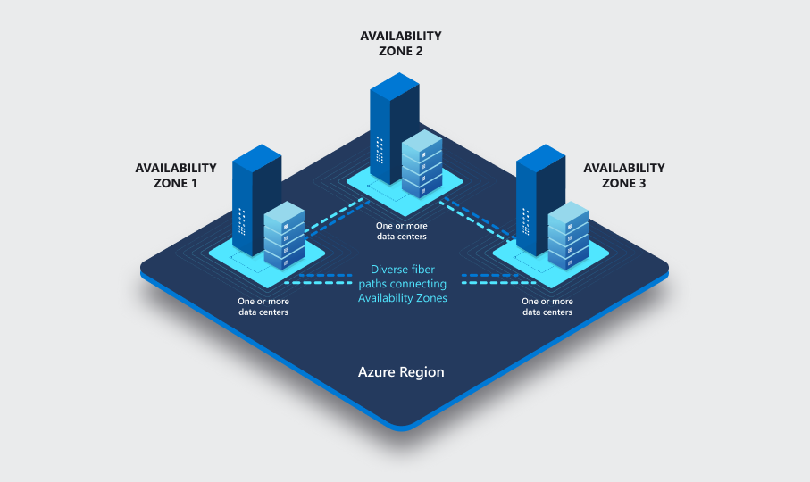

# What are Azure regions and availability zones?

Azure regions and availability zones are designed to help you achieve  reliability for your business-critical workloads. Azure maintains multiple geographies. These discrete demarcations define disaster recovery and data residency boundaries across one or multiple Azure regions. Maintaining many regions ensures customers are supported across the world.

## Regions

Each Azure region features datacenters deployed within a latency-defined perimeter. They're connected through a dedicated regional low-latency network. This design ensures that Azure services within any region offer the best possible performance and security. 

To see which regions support availability zones, see [Azure regions with availability zone support](az-service-support.md#azure-regions-with-availability-zone-support).

## Availability zones

Failures can range from software and hardware failures to events such as earthquakes, floods, and fires. Tolerance to failures is achieved because of redundancy and logical isolation of Azure services. To ensure resiliency, a minimum of three separate availability zones are present in all availability zone-enabled regions.

Azure availability zones are connected by a high-performance network with a round-trip latency of less than 2ms. They help your data stay synchronized and accessible when things go wrong. Each zone is composed of one or more datacenters equipped with independent power, cooling, and networking infrastructure. Availability zones are designed so that if one zone is affected, regional services, capacity, and high availability are supported by the remaining two zones.

Datacenter locations are selected by using rigorous vulnerability risk assessment criteria. This process identifies all significant datacenter-specific risks and considers shared risks between availability zones.

With availability zones, you can design and operate applications and databases that automatically transition between zones without interruption. Azure availability zones are highly available, fault tolerant, and more scalable than traditional single or multiple datacenter infrastructures.

Each data center is assigned to a physical zone. Physical zones are mapped to logical zones in your Azure subscription. Azure subscriptions are automatically assigned this mapping at the time a subscription is created. You can use the dedicated ARM API called: [checkZonePeers](/rest/api/resources/subscriptions/check-zone-peers) to compare zone mapping for resilient solutions that span across multiple subscriptions. 

You can design resilient solutions by using Azure services that use availability zones. Co-locate your compute, storage, networking, and data resources across an availability zone, and replicate this arrangement in other availability zones.

Azure *availability zones-enabled services* are designed to provide the right level of resiliency and flexibility. They can be configured in two ways. They can be either *zone redundant*, with automatic replication across zones, or *zonal*, with instances pinned to a specific zone. You can also combine these approaches.

Some organizations require high availability of availability zones and protection from large-scale phenomena and regional disasters. Azure regions are designed to offer protection against localized disasters with availability zones and protection from regional or large geography disasters with disaster recovery, by making use of another region. To learn more about business continuity, disaster recovery, and cross-region replication, see [Cross-region replication in Azure](cross-region-replication-azure.md).

To see which services support availability zones, see [Azure regions with availability zone support](az-service-support.md#azure-regions-with-availability-zone-support).

## Next steps

> [!div class="nextstepaction"]
> [Azure services and regions with availability zones](az-service-support.md)

> [!div class="nextstepaction"]
> [Availability zone migration guidance overview](az-migration-overview.md)

> [!div class="nextstepaction"]
> [Availability of service by category](availability-service-by-category.md)

> [!div class="nextstepaction"]
> [Microsoft commitment to expand Azure availability zones to more regions](https://azure.microsoft.com/blog/our-commitment-to-expand-azure-availability-zones-to-more-regions/)

> [!div class="nextstepaction"]
> [Build solutions for high availability using availability zones](/azure/architecture/high-availability/building-solutions-for-high-availability)