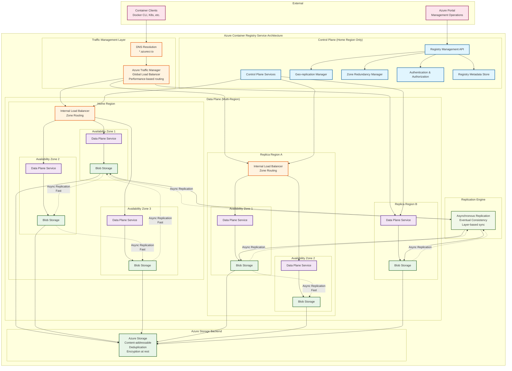
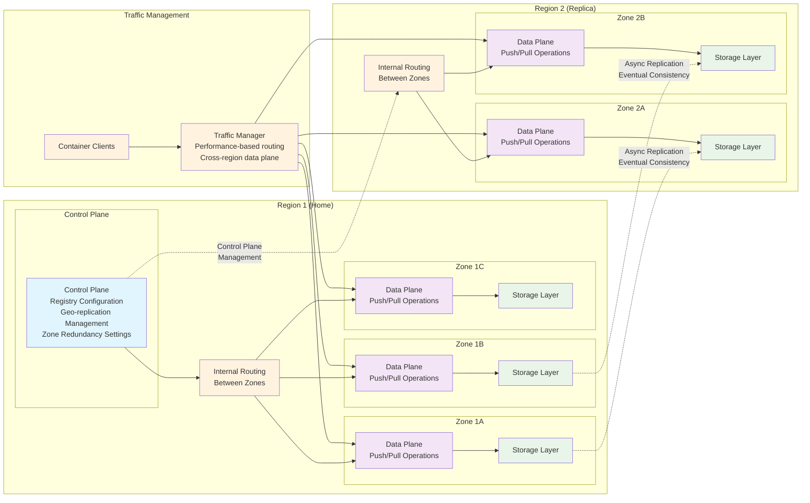
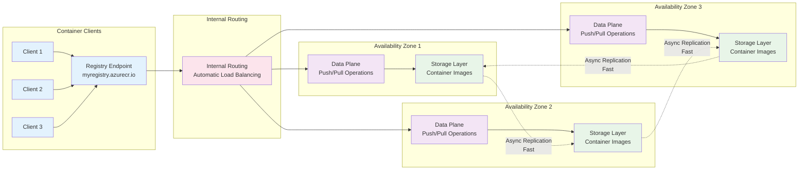
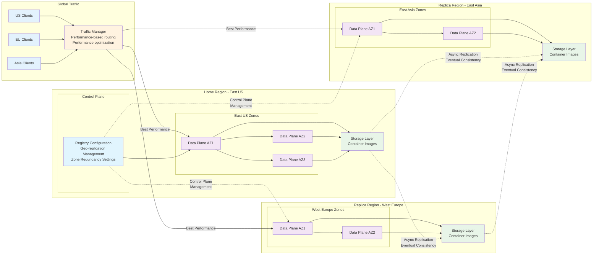

# Reliability in Azure Container Registry

This article describes reliability support in Azure Container Registry (ACR), zone redundancy using availablity zones within a region, and geo-replication to multiple regions without using Azure paired regions. For a more detailed overview of reliability in Azure, see [Azure reliability](/azure/reliability/overview).

Azure Container Registry is a managed container registry service used to store and manage your private Docker container images and related artifacts for your container deployments. For more information, see [What is Azure Container Registry?](/azure/container-registry/container-registry-intro).

## Azure Container Registry service architecture

Azure Container Registry is built as a distributed service with distinct control and data plane operations. The following diagram illustrates the backend architecture and how different components interact:



**Key Architecture Components:**

- **Control Plane**: Centralized in the home region, manages registry configuration, authentication, geo-replication, and zone redundancy settings
- **Data Plane**: Distributed across regions and availability zones, handles container image push/pull operations with automatic routing
- **Traffic Manager**: Routes data plane requests globally using performance criteria based on network latency measurements
- **Internal Routing**: Load balances traffic within regions across availability zones
- **Storage Backend**: Azure Storage provides content-addressable storage with deduplication and encryption
- **Replication Engine**: Manages asynchronous replication between regions with eventual consistency

## Production deployment recommendations

For production workloads, use the Premium tier of Azure Container Registry, which provides the most comprehensive reliability features. Enable zone redundancy to protect against zone-level failures within a region. For multi-region scenarios, configure geo-replication to distribute your registry across multiple regions based on your specific geographic and compliance requirements.

The Premium tier also provides higher performance limits, enhanced security features, and advanced capabilities that are essential for production container workloads. For complete information on service tiers and features, see [Azure Container Registry service tiers](/azure/container-registry/container-registry-skus).

## Reliability architecture overview

Azure Container Registry is built on Azure's distributed infrastructure to provide high availability and data durability. The service consists of several key components that work together to ensure reliability:

- **Registry service**: The core registry service that handles container image storage, authentication, and API operations
- **Storage layer**: Uses Azure Storage to persist container images and artifacts with built-in encryption and redundancy
- **Control plane**: Manages registry configuration, geo-replication, and zone redundancy settings from the home region
- **Data plane**: Handles container image push and pull operations with automatic routing across regions and availability zones

The service provides built-in resiliency through zone redundancy within regions and geo-replication across regions. Control plane requests are always served from the home region, while data plane requests are automatically routed to the optimal location using internal routing for intra-region traffic and Traffic Manager with performance-based criteria for cross-region traffic. Both zone redundancy and geo-replication features are available in the Premium tier and work together to provide comprehensive protection against infrastructure failures.

**Important**: All data replication in Azure Container Registry is asynchronous, including both zone redundancy (intra-region) and geo-replication (inter-region). This design provides eventual consistency across all replicas while maintaining high performance for container image operations. Azure does not provide specific SLAs for replication timing, but the asynchronous replication typically completes within minutes for most scenarios.



### Regional storage

Azure Container Registry stores data in the region where the registry is created, to help customers meet data residency and compliance requirements. In all regions except Brazil South and Southeast Asia, Azure may also store registry data in a paired region in the same geography. In the Brazil South and Southeast Asia regions, registry data is always confined to the region, to accommodate data residency requirements for those regions.

If a regional outage occurs, the registry data may become unavailable and is not automatically recovered. Customers who wish to have their registry data stored in multiple regions for better performance across different geographies or who wish to have resiliency in the event of a regional outage should enable geo-replication.

For zone redundancy, Azure Container Registry automatically distributes registry data across multiple availability zones within a region. This provides protection against datacenter-level failures while maintaining high availability for registry operations including pushing, pulling, and managing container images and artifacts. For details on zone redundancy, see [Enable zone redundancy in Azure Container Registry](/azure/container-registry/zone-redundancy).

For multi-region scenarios, geo-replication creates additional registry replicas in customer-selected regions. For comprehensive information on geo-replication capabilities, see the [Multi-region support](#multi-region-support) section below.

**Important**: ACR Tasks doesn't yet support availability zones. Zone redundancy applies to the registry service itself but not to ACR Tasks operations.

## Transient faults

[!INCLUDE [Transient fault description](includes/reliability-transient-fault-description-include.md)]

Azure Container Registry handles transient faults internally through several mechanisms. The service implements automatic retry logic for registry operations and maintains connection pooling for efficient resource utilization. Container Registry operations are designed to be idempotent, allowing safe retries of push and pull operations.

For client applications using Azure Container Registry, implement appropriate retry policies with exponential backoff when performing registry operations. Use the official Docker client or Azure Container Registry SDKs which include built-in retry mechanisms for common transient failures.

Monitor registry operations through Azure Monitor metrics and logs to identify patterns of transient faults. Set up alerts for registry availability metrics to proactively detect issues that might impact your container workloads.

When using geo-replicated registries, implement failover logic in your applications to automatically switch to alternative registry endpoints if the primary endpoint becomes temporarily unavailable. This provides additional resilience against transient faults that might affect a specific regional endpoint.

## Availability zone support

[!INCLUDE [AZ support description](includes/reliability-availability-zone-description-include.md)]

Azure Container Registry supports zone-redundant deployments in the Premium tier. When you create a Premium registry in a region that supports availability zones, the registry is automatically configured as zone-redundant, distributing registry data and operations across multiple availability zones within the region.

Zone redundancy in Azure Container Registry protects your container images and artifacts against zone-level failures. The service automatically replicates data across multiple zones and can continue operating even if one availability zone becomes unavailable. Zone redundancy provides higher availability compared to single-zone deployments without requiring configuration changes to your container workloads.

### Region support

Zone-redundant Azure Container Registry is supported in the following regions:

| Americas | Europe | Africa | Asia Pacific |
| --- | --- | --- | --- |
| Brazil South<br>Canada Central<br>Central US<br>East US<br>East US 2<br>East US 2 EUAP<br>South Central US<br>US Government Virginia<br>West US 2<br>West US 3 | France Central<br>Germany West Central<br>Italy North<br>North Europe<br>Norway East<br>Sweden Central<br>Switzerland North<br>UK South<br>West Europe | South Africa North | Australia East<br>Central India<br>China North 3<br>East Asia<br>Japan East<br>Korea Central<br>Qatar Central<br>Southeast Asia<br>UAE North |

For the most current list of regions with availability zone support, see [Azure regions with availability zones](/azure/reliability/availability-zones-region-support).

### Requirements

You must use the Premium tier to enable zone redundancy. Zone redundancy is automatically enabled when you create a Premium registry in a region that supports availability zones - no additional configuration is required.

### Considerations

Zone redundancy in Azure Container Registry provides protection against single zone failures, but registry operations may experience slightly higher latency during zone failover scenarios. Container image pulls and pushes continue to function during zone outages with automatic failover to healthy zones.

When using geo-replication with zone-redundant registries, each geo-replicated region can independently have zone redundancy enabled if the region supports availability zones, providing both zone-level and region-level protection.

### Cost

Zone redundancy is included with Premium tier registries at no additional cost. The Premium tier is priced higher than Basic and Standard tiers, but zone redundancy itself does not incur additional charges beyond the Premium tier pricing.

### Configure availability zone support

Zone redundancy is automatically enabled when you create a Premium registry in a region that supports availability zones, as mentioned in the Requirements section above.

- **Create**. Use the Azure portal, Azure CLI, Azure PowerShell, or ARM templates to create Premium registries. For configuration details, see [Create a container registry using the Azure portal](/azure/container-registry/container-registry-get-started-portal).
- **Disable**. Zone redundancy cannot be disabled once enabled for a registry. If you need a non-zone-redundant registry, you must create a new registry and migrate your container images.
- **Migrate**. Existing Basic or Standard tier registries can be upgraded to Premium tier, however upgrading alone does not enable zone redundancy for existing registries. To get zone redundancy, you must create a new Premium registry in a supported region and migrate your container images.

**Important limitations**:
- Region conversions to availability zones are not currently supported
- Zone redundancy cannot be disabled once enabled in a region
- The availability zone property is per region and cannot be changed once replications are created, except by deleting and re-creating the replications

### Normal operations

During normal operations with zone redundancy enabled, Azure Container Registry automatically distributes registry operations across multiple availability zones. Container image pushes and pulls are load-balanced across zones to optimize performance and ensure high availability.



**Traffic routing between zones**. Container Registry uses internal routing functionality to automatically distribute data plane operations across all available zones within a region. The registry service automatically routes requests to healthy zones without requiring external load balancers.

**Data replication between zones**. Registry data including container images, manifests, and metadata are asynchronously replicated across multiple availability zones. Changes are replicated quickly across zones to maintain high availability and data durability. While replication is asynchronous, it typically completes within minutes, and all zones remain available for read and write operations during replication.

### Zone-down experience

When a zone becomes unavailable, Azure Container Registry automatically handles the failover process with minimal impact to registry operations:

```mermaid
graph LR
    subgraph "Container Clients"
        C1[Client 1]
        C2[Client 2]
        C3[Client 3]
        EP[Registry Endpoint<br/>myregistry.azurecr.io]
    end
    
    subgraph "Availability Zone 1 ❌"
        DP1[Data Plane<br/>❌ FAILED]
        ST1[Storage Layer<br/>❌ UNAVAILABLE]
    end
    
    subgraph "Availability Zone 2 ✅"
        DP2[Data Plane<br/>✅ HEALTHY]
        ST2[Storage Layer<br/>✅ AVAILABLE]
    end
    
    subgraph "Availability Zone 3 ✅"
        DP3[Data Plane<br/>✅ HEALTHY]
        ST3[Storage Layer<br/>✅ AVAILABLE]
    end
    
    subgraph "Internal Routing"
        IR[Internal Routing<br/>Auto Failover to Healthy Zones]
    end
    
    C1 --> EP
    C2 --> EP
    C3 --> EP
    
    EP --> IR
    IR -.->|Automatic<br/>Failover| DP2
    IR -.->|Automatic<br/>Failover| DP3
    IR -.x|No Traffic| DP1
    
    DP2 --> ST2
    DP3 --> ST3
    DP1 -.x ST1
    
    ST2 -.->|Async Replication<br/>Continues| ST3
    ST3 -.->|Async Replication<br/>Continues| ST2
    
    classDef client fill:#e3f2fd
    classDef endpoint fill:#fff3e0
    classDef dataPlaneHealthy fill:#e8f5e8
    classDef dataPlaneFailed fill:#ffebee
    classDef storageHealthy fill:#e8f5e8
    classDef storageFailed fill:#ffebee
    classDef routing fill:#fce4ec
    
    class C1,C2,C3,EP client
    class DP2,DP3 dataPlaneHealthy
    class DP1 dataPlaneFailed
    class ST2,ST3 storageHealthy
    class ST1 storageFailed
    class IR routing
```

- **Detection and response**. Microsoft-managed automatic detection and failover occur when a zone becomes unavailable. The service automatically routes traffic to remaining healthy zones.
- **Notification**. Zone-level outages are reflected in Azure Service Health and Azure Monitor metrics. Configure alerts on registry availability metrics to monitor zone health.
- **Active requests**. Active registry operations are automatically retried against healthy zones. Most operations complete successfully with minimal delay.
- **Expected data loss**. Minimal risk of data loss during zone failover due to fast asynchronous replication across zones.
- **Expected downtime**. Minimal downtime during automatic failover, typically seconds for most registry operations.
- **Traffic rerouting**. The platform automatically reroutes traffic to healthy zones without requiring configuration changes.

### Failback

When the affected availability zone recovers, Azure Container Registry automatically distributes operations across all available zones, including the recovered zone. The service rebalances traffic and data distribution without requiring manual intervention or causing service disruption.

### Testing for zone failures

Zone failover is fully automated and managed by Microsoft. Customers cannot simulate zone failures, but the service is designed to automatically handle zone failures without impacting registry availability or data integrity for data plane operations.

## Multi-region support

Azure Container Registry provides native multi-region support through geo-replication in the Premium tier. Geo-replication creates registry replicas in multiple regions of your choice, enabling local access to container images and reducing latency for globally distributed applications. For comprehensive details, see [Geo-replication in Azure Container Registry](/azure/container-registry/container-registry-geo-replication).

Unlike many Azure services, Container Registry geo-replication does not use Azure paired regions. You have complete flexibility to select any combination of Azure regions for replication based on your specific geographic, performance, and compliance requirements. Each geo-replicated registry functions as a complete registry endpoint, supporting all registry operations including image pushes, pulls, and management tasks.

Geo-replication automatically synchronizes container images and artifacts across all configured regions using asynchronous replication with eventual consistency. The service uses content-addressable storage to efficiently replicate only the unique image layers, minimizing bandwidth usage and replication time. Data plane operations (push and pull) are automatically routed using Traffic Manager with performance-based criteria to determine the optimal regional endpoint for performance.



### Region support

Geo-replication is available in all Azure regions where the Premium tier is supported. You can replicate to any combination of regions without restrictions based on paired regions.

### Requirements

You must use the Premium tier to enable geo-replication. Geo-replication can be configured during registry creation or added to existing Premium registries.

### Considerations

Each geo-replicated region functions as an independent registry endpoint that supports read and write operations. Container clients can connect to any regional endpoint for registry operations. Consider configuring your container orchestration platforms to use the regional endpoint closest to their deployment location for optimal performance.

Geo-replication provides eventual consistency across regions using asynchronous replication. There is no SLA on data replication timing, and replication typically completes within minutes of changes. Large container images or high-frequency updates may take longer to replicate across all regions.

### Cost

Each geo-replicated region is billed separately according to Premium tier pricing for the respective region. Additionally, egress charges apply for data transfer between regions during initial replication and ongoing synchronization.

### Configure multi-region support

Geo-replication can be configured through the Azure portal, Azure CLI, Azure PowerShell, or ARM templates.

- **Create**. Configure geo-replication during registry creation by specifying additional regions, or add geo-replication to existing Premium registries.
- **Disable**. Remove individual regional replicas through the Azure portal or command-line tools. The primary registry region cannot be removed.
- **Migrate**. Upgrade existing Basic or Standard tier registries to Premium tier to enable geo-replication capabilities.

### Normal operations

During normal multi-region operations, Azure Container Registry synchronizes data across all configured regions automatically. Container image pushes to any regional endpoint are replicated to all other regions based on the configured replication scope.

**Traffic routing between regions**. Container Registry operates in an active-active configuration where each regional endpoint can serve all data plane operations independently. Traffic Manager uses performance-based routing criteria to automatically direct clients to the optimal regional endpoint for performance.

**Data replication between regions**. Registry data is replicated asynchronously between regions with eventual consistency. Container image layers are synchronized efficiently using content-addressable storage, with only unique layers transferred between regions. Read and write operations work on all geo-replicated regions.

### Region-down experience

When a region becomes unavailable, container operations can continue using alternative regional endpoints:

```mermaid
graph LR
    subgraph "Global Traffic"
        CUS[US Clients]
        CEU[EU Clients]
        CAS[Asia Clients]
        TM[Traffic Manager<br/>Auto-failover routing<br/>Health monitoring]
    end
    
    subgraph "Home Region - East US ✅"
        subgraph "Control Plane"
            CP[Registry Configuration<br/>✅ OPERATIONAL]
        end
        subgraph "East US Zones"
            DPUS1[Data Plane AZ1 ✅]
            DPUS2[Data Plane AZ2 ✅]
            DPUS3[Data Plane AZ3 ✅]
        end
        STUS[Storage Layer ✅<br/>Container Images]
    end
    
    subgraph "Replica Region - West Europe ❌"
        subgraph "West Europe Zones"
            DPEU1[Data Plane AZ1 ❌]
            DPEU2[Data Plane AZ2 ❌]
        end
        STEU[Storage Layer ❌<br/>UNAVAILABLE]
    end
    
    subgraph "Replica Region - East Asia ✅"
        subgraph "East Asia Zones"
            DPAS1[Data Plane AZ1 ✅]
            DPAS2[Data Plane AZ2 ✅]
        end
        STAS[Storage Layer ✅<br/>Container Images]
    end
    
    CUS --> TM
    CEU --> TM
    CAS --> TM
    
    TM -->|Auto Failover| DPUS1
    TM -.x|No Traffic| DPEU1
    TM -->|Auto Failover| DPAS1
    
    DPUS1 --> DPUS2
    DPUS1 --> DPUS3
    DPAS1 --> DPAS2
    
    DPUS1 --> STUS
    DPUS2 --> STUS
    DPUS3 --> STUS
    DPAS1 --> STAS
    DPAS2 --> STAS
    
    STUS -.->|Async Replication<br/>When Available| STAS
    STUS -.x|Replication Blocked| STEU
    STAS -.x|Replication Blocked| STEU
    
    CP --> DPUS1
    CP -.x|Control Unavailable| DPEU1
    CP -.->|Control Available| DPAS1
    
    classDef client fill:#e3f2fd
    classDef traffic fill:#fff3e0
    classDef controlPlane fill:#e1f5fe
    classDef dataPlaneHealthy fill:#e8f5e8
    classDef dataPlaneFailed fill:#ffebee
    classDef storageHealthy fill:#e8f5e8
    classDef storageFailed fill:#ffebee
    
    class CUS,CEU,CAS client
    class TM traffic
    class CP controlPlane
    class DPUS1,DPUS2,DPUS3,DPAS1,DPAS2 dataPlaneHealthy
    class DPEU1,DPEU2 dataPlaneFailed
    class STUS,STAS storageHealthy
    class STEU storageFailed
```
    classDef storageHealthy fill:#e8f5e8
    classDef storageFailed fill:#ffebee
    
    class CUS,CEU,CAS client
    class TM traffic
    class CP controlPlane
    class DPUS1,DPUS2,DPUS3,DPAS1,DPAS2 dataPlaneHealthy
    class DPEU1,DPEU2 dataPlaneFailed
    class STUS,STAS storageHealthy
    class STEU storageFailed
```

- **Detection and response**. Data plane operations automatically route to available regions using Traffic Manager. Configure health checks and failover logic in your container orchestration platforms for application-level resilience.
- **Notification**. Regional outages are reported through Azure Service Health. Monitor registry availability metrics for each regional endpoint to detect issues.
- **Active requests**. Active requests to an unavailable region will fail and must be retried against alternative regional endpoints through automatic Traffic Manager routing.
- **Expected data loss**. No data loss occurs as registry data is replicated across multiple regions. Recent changes that have not yet replicated may be temporarily unavailable due to eventual consistency.
- **Expected downtime**. No downtime for data plane operations when using alternative regional endpoints. Applications benefit from automatic Traffic Manager routing to available regions.
- **Traffic rerouting**. Traffic Manager automatically reroutes data plane traffic to available regional endpoints when a region becomes unavailable.

### Failback

When a region recovers, data plane operations automatically resume for that regional endpoint through Traffic Manager routing. The service synchronizes any changes that occurred during the outage using asynchronous replication with eventual consistency.

### Testing for region failures

Regional failover for data plane operations is fully automated through Traffic Manager and cannot be simulated by customers. The service is designed to automatically handle regional failures without impacting registry availability or data integrity for data plane operations.

## Backups

Azure Container Registry doesn't provide traditional backup and restore capabilities because the service is designed with built-in data durability and redundancy mechanisms. Instead of point-in-time backups, the service ensures data protection through:

- **Zone redundancy**: Asynchronous replication across availability zones within a region
- **Geo-replication**: Asynchronous replication across multiple regions with eventual consistency
- **Azure Storage redundancy**: Built-in storage-level redundancy for container images and artifacts

This architecture approach provides continuous data protection without the need for traditional backup operations.

For additional data protection, you can export container images and artifacts from your registry to external storage or alternative registries. Use Azure Container Registry import/export capabilities or standard Docker commands to create copies of critical container images for disaster recovery scenarios.

Consider implementing container image promotion pipelines that automatically replicate critical images across multiple registries or storage systems as part of your overall backup strategy.

## Service-level agreement

Azure Container Registry provides different service-level agreements based on the configuration and tier:

- **Premium tier with zone redundancy**: Provides higher availability guarantees compared to single-zone deployments
- **Geo-replicated registries**: Each regional replica is covered by the SLA independently for registry availability
- **Service tier requirements**: Only Premium tier configurations with zone redundancy receive the enhanced SLA
- **Data replication**: There is no SLA on data replication timing between regions or zones

The specific availability percentages and conditions that must be met to achieve the SLA guarantees are detailed in the official service-level agreement documentation. For complete SLA terms and conditions, see [SLA for Azure Container Registry](https://azure.microsoft.com/support/legal/sla/container-registry/).

### Related content

- [Azure reliability](/azure/reliability/overview)
- [Azure Container Registry service tiers](/azure/container-registry/container-registry-skus)
- [Azure Container Registry best practices](/azure/container-registry/container-registry-best-practices)
- [Monitor Azure Container Registry](/azure/container-registry/monitor-service)
- [Azure Container Registry pricing](https://azure.microsoft.com/pricing/details/container-registry/)
- [Import container images to a container registry](/azure/container-registry/container-registry-import-images)
- [Multi-region solutions in nonpaired regions](/azure/reliability/regions-multi-region-nonpaired)
