# Reliability in Azure Container Registry

Azure Container Registry is a managed container registry service based on the open-source Docker Registry 2.0. Use Azure Container Registry to store and manage your private Docker container images and related artifacts for your container deployments. Container registries enable efficient distribution of container images to orchestration platforms like Azure Kubernetes Service (AKS), Azure Container Instances, and other Azure services. For more information, see [What is Azure Container Registry?](/azure/container-registry/container-registry-intro).

Azure Container Registry provides reliability features including zone redundancy for high availability within a region, and geo-replication capabilities for multi-region scenarios. The Premium tier offers the most comprehensive reliability features including zone redundancy and geo-replication to multiple regions without using Azure paired regions. For more information on service tiers, see [Azure Container Registry service tiers](/azure/container-registry/container-registry-skus).

This article describes reliability and availability zones support in [Azure Container Registry](/azure/container-registry/). For a more detailed overview of reliability in Azure, see [Azure reliability](/azure/reliability/overview).

## Production deployment recommendations

For production workloads, use the Premium tier of Azure Container Registry, which provides the most comprehensive reliability features. Enable zone redundancy to protect against zone-level failures within a region. For multi-region scenarios, configure geo-replication to distribute your registry across multiple regions based on your specific geographic and compliance requirements. For more information, see [Azure Container Registry service tiers](/azure/container-registry/container-registry-skus).

The Premium tier also provides higher performance limits, enhanced security features, and advanced capabilities that are essential for production container workloads. For details on tier features, see [Azure Container Registry service tier features and limits](/azure/container-registry/container-registry-skus#service-tier-features-and-limits).

## Reliability architecture overview

Azure Container Registry is built on Azure's distributed infrastructure to provide high availability and data durability. The service consists of several key components that work together to ensure reliability:

- **Registry service**: The core registry service that handles container image storage, authentication, and API operations
- **Storage layer**: Uses Azure Storage to persist container images and artifacts with built-in encryption and redundancy
- **Control plane**: Manages registry configuration, geo-replication, and zone redundancy settings
- **Data plane**: Handles container image push and pull operations through regional endpoints

The service provides built-in redundancy through zone redundancy within regions and geo-replication across regions. Zone redundancy automatically distributes data across multiple availability zones, while geo-replication creates independent registry replicas in customer-selected regions. Both features are available in the Premium tier and work together to provide comprehensive protection against infrastructure failures.

### Regional storage

Azure Container Registry stores data in the region where the registry is created, to help customers meet data residency and compliance requirements. In all regions except Brazil South and Southeast Asia, Azure may also store registry data in a paired region in the same geography. In the Brazil South and Southeast Asia regions, registry data is always confined to the region, to accommodate data residency requirements for those regions.

If a regional outage occurs, the registry data may become unavailable and is not automatically recovered. Customers who wish to have their registry data stored in multiple regions for better performance across different geographies or who wish to have resiliency in the event of a regional outage should enable [geo-replication](/azure/container-registry/container-registry-geo-replication).

For zone redundancy, Azure Container Registry automatically distributes registry data across multiple availability zones within a region. This provides protection against datacenter-level failures while maintaining high availability for registry operations including pushing, pulling, and managing container images and artifacts. For details on zone redundancy, see [Enable zone redundancy in Azure Container Registry](/azure/container-registry/zone-redundancy).

For multi-region scenarios, geo-replication creates additional registry replicas in customer-selected regions. For comprehensive information on geo-replication capabilities, see the [Multi-region support](#multi-region-support) section below.

**Important**: ACR Tasks doesn't yet support availability zones. Zone redundancy applies to the registry service itself but not to ACR Tasks operations.

## Transient faults

[!INCLUDE [Transient fault description](includes/reliability-transient-fault-description-include.md)]

Azure Container Registry handles transient faults internally through several mechanisms. The service implements automatic retry logic for registry operations and maintains connection pooling for efficient resource utilization. Container Registry operations are designed to be idempotent, allowing safe retries of push and pull operations. For more information on registry operations, see [Push your first image to your Azure container registry using the Docker CLI](/azure/container-registry/container-registry-get-started-docker-cli).

For client applications using Azure Container Registry, implement appropriate retry policies with exponential backoff when performing registry operations. Use the official Docker client or Azure Container Registry SDKs which include built-in retry mechanisms for common transient failures. For guidance on using SDKs, see [Azure Container Registry client libraries](/azure/container-registry/container-registry-client-libraries).

Monitor registry operations through Azure Monitor metrics and logs to identify patterns of transient faults. Set up alerts for registry availability metrics to proactively detect issues that might impact your container workloads. For monitoring guidance, see [Monitor Azure Container Registry](/azure/container-registry/monitor-service).

When using geo-replicated registries, implement failover logic in your applications to automatically switch to alternative registry endpoints if the primary endpoint becomes temporarily unavailable. This provides additional resilience against transient faults that might affect a specific regional endpoint.

## Availability zone support

[!INCLUDE [AZ support description](includes/reliability-availability-zone-description-include.md)]

Azure Container Registry supports zone-redundant deployments in the Premium tier. When you create a Premium registry in a region that supports availability zones, the registry is automatically configured as zone-redundant, distributing registry data and operations across multiple availability zones within the region. For detailed information, see [Enable zone redundancy in Azure Container Registry](/azure/container-registry/zone-redundancy).

Zone redundancy in Azure Container Registry protects your container images and artifacts against zone-level failures. The service automatically replicates data across multiple zones and can continue operating even if one availability zone becomes unavailable. Zone redundancy provides higher availability compared to single-zone deployments without requiring configuration changes to your container workloads. For availability zone concepts, see [What are Azure availability zones?](/azure/reliability/availability-zones-overview).

### Region support

Zone-redundant Azure Container Registry is supported in the following regions:

| Americas | Europe | Africa | Asia Pacific |
| --- | --- | --- | --- |
| Brazil South Canada Central Central US East US East US 2 East US 2 EUAP South Central US US Government Virginia West US 2 West US 3 | France Central Germany West Central Italy North North Europe Norway East Sweden Central Switzerland North UK South West Europe | South Africa North | Australia East Central India China North 3 East Asia Japan East Korea Central Qatar Central Southeast Asia UAE North |

For the most current list of regions with availability zone support, see [Azure regions with availability zones](/azure/reliability/availability-zones-region-support).

### Requirements

You must use the Premium tier to enable zone redundancy. Zone redundancy is automatically enabled when you create a Premium registry in a region that supports availability zones - no additional configuration is required. For tier comparison details, see [Azure Container Registry service tiers](/azure/container-registry/container-registry-skus).

### Considerations

Zone redundancy in Azure Container Registry provides protection against single zone failures, but registry operations may experience slightly higher latency during zone failover scenarios. Container image pulls and pushes continue to function during zone outages with automatic failover to healthy zones. For performance considerations, see [Azure Container Registry best practices](/azure/container-registry/container-registry-best-practices).

When using geo-replication with zone-redundant registries, each replicated registry inherits the zone redundancy configuration of its deployment region, providing both zone-level and region-level protection. For more information on geo-replication, see [Geo-replication in Azure Container Registry](/azure/container-registry/container-registry-geo-replication).

### Cost

Zone redundancy is included with Premium tier registries at no additional cost. The Premium tier is priced higher than Basic and Standard tiers, but zone redundancy itself does not incur additional charges beyond the Premium tier pricing. For pricing details, see [Azure Container Registry pricing](https://azure.microsoft.com/pricing/details/container-registry/).

### Configure availability zone support

Zone redundancy is automatically enabled when you create a Premium registry in a region that supports availability zones, as mentioned in the Requirements section above.

- **Create**. Use the Azure portal, Azure CLI, Azure PowerShell, or ARM templates to create Premium registries. For configuration details, see [Create a container registry using the Azure portal](/azure/container-registry/container-registry-get-started-portal).
- **Disable**. Zone redundancy cannot be disabled once enabled for a registry. If you need a non-zone-redundant registry, you must create a new registry and migrate your container images.
- **Migrate**. Existing Basic or Standard tier registries can be upgraded to Premium tier, however upgrading alone does not enable zone redundancy for existing registries. To get zone redundancy, you must create a new Premium registry in a supported region and migrate your container images. For migration guidance, see [Upgrade a container registry](/azure/container-registry/container-registry-skus#changing-tiers).

**Important limitations**:
- Region conversions to availability zones are not currently supported
- Zone redundancy cannot be disabled once enabled in a region
- The availability zone property is per region and cannot be changed once replications are created, except by deleting and re-creating the replications

### Normal operations

During normal operations with zone redundancy enabled, Azure Container Registry automatically distributes registry operations across multiple availability zones. Container image pushes and pulls are load-balanced across zones to optimize performance and ensure high availability. For operational details, see [Azure Container Registry best practices](/azure/container-registry/container-registry-best-practices).

**Traffic routing between zones**. Container Registry uses an active-active approach where registry operations are distributed across all available zones. The service automatically routes requests to healthy zones and load-balances traffic to optimize performance.

**Data replication between zones**. Registry data including container images, manifests, and metadata are synchronously replicated across multiple availability zones. Changes are committed only after successful replication to multiple zones, ensuring data consistency and durability. For storage details, see [Container image storage in Azure Container Registry](/azure/container-registry/container-registry-storage).

### Zone-down experience

When a zone becomes unavailable, Azure Container Registry automatically handles the failover process with minimal impact to registry operations:

```mermaid
graph LR
    subgraph "Client Applications"
        C1[Docker Client 1]
        C2[Kubernetes Cluster]
        C3[CI/CD Pipeline]
    end
    
    subgraph "Microsoft-Managed Detection"
        MD[Automatic Zone<br/>Health Detection<br/>- Service Health Monitoring<br/>- Azure Monitor Metrics]
    end
    
    subgraph "Azure Container Registry - Zone Failover"
        subgraph "Zone 1 - FAILED"
            ACR1[Registry Endpoint<br/>Zone 1<br/>🔴 UNAVAILABLE]
            S1[Storage Replica 1<br/>🔴 INACCESSIBLE]
        end
        
        subgraph "Zone 2 - HEALTHY"
            ACR2[Registry Endpoint<br/>Zone 2<br/>✅ ACTIVE<br/>- Handling Increased Load<br/>- Auto-Retry from Zone 1]
            S2[Storage Replica 2<br/>✅ OPERATIONAL]
        end
        
        subgraph "Zone 3 - HEALTHY"
            ACR3[Registry Endpoint<br/>Zone 3<br/>✅ ACTIVE<br/>- Handling Increased Load<br/>- Auto-Retry from Zone 1]
            S3[Storage Replica 3<br/>✅ OPERATIONAL]
        end
    end
    
    subgraph "Automatic Traffic Rerouting"
        TR[Traffic Rerouter<br/>- Automatic Failover<br/>- Load Balancing<br/>- No Config Changes Required]
    end
    
    C1 --> TR
    C2 --> TR
    C3 --> TR
    
    MD -->|Detects Zone 1 Failure| TR
    TR -.->|Traffic Blocked| ACR1
    TR -->|Redirect Traffic| ACR2
    TR -->|Redirect Traffic| ACR3
    
    ACR2 --> S2
    ACR3 --> S3
    
    S2 <-->|Maintains Sync<br/>Data Consistency| S3
    
    style ACR1 fill:#FFB6C1
    style S1 fill:#FFB6C1
    style ACR2 fill:#90EE90
    style ACR3 fill:#90EE90
    style S2 fill:#90EE90
    style S3 fill:#90EE90
    style MD fill:#87CEEB
    style TR fill:#DDA0DD
```

- **Detection and response**. Microsoft-managed automatic detection and failover occur when a zone becomes unavailable. The service automatically routes traffic to remaining healthy zones.
- **Notification**. Zone-level outages are reflected in Azure Service Health and Azure Monitor metrics. Configure alerts on registry availability metrics to monitor zone health. For monitoring setup, see [Monitor Azure Container Registry](/azure/container-registry/monitor-service).
- **Active requests**. Active registry operations are automatically retried against healthy zones. Most operations complete successfully with minimal delay.
- **Expected data loss**. No data loss occurs during zone failover due to synchronous replication across zones.
- **Expected downtime**. Minimal downtime during automatic failover, typically seconds for most registry operations.
- **Traffic rerouting**. The platform automatically reroutes traffic to healthy zones without requiring configuration changes.

### Failback

When the affected availability zone recovers, Azure Container Registry automatically distributes operations across all available zones, including the recovered zone. The service rebalances traffic and data distribution without requiring manual intervention or causing service disruption.

### Testing for zone failures

Zone failover testing is managed by Microsoft and does not require customer-initiated testing. The service is designed to automatically handle zone failures without impacting registry availability or data integrity. For more information on testing strategies, see [Azure reliability testing guidance](/azure/reliability/reliability-testing-guidance).

## Multi-region support

Azure Container Registry provides native multi-region support through geo-replication in the Premium tier. Geo-replication creates registry replicas in multiple regions of your choice, enabling local access to container images and reducing latency for globally distributed applications. For comprehensive details, see [Geo-replication in Azure Container Registry](/azure/container-registry/container-registry-geo-replication).

Unlike many Azure services, Container Registry geo-replication does not use Azure paired regions. You have complete flexibility to select any combination of Azure regions for replication based on your specific geographic, performance, and compliance requirements. Each geo-replicated registry functions as a complete registry endpoint, supporting all registry operations including image pushes, pulls, and management tasks. For information on Azure paired regions, see [Azure paired regions](/azure/reliability/cross-region-replication-azure).

Geo-replication automatically synchronizes container images and artifacts across all configured regions. The service uses content-addressable storage to efficiently replicate only the unique image layers, minimizing bandwidth usage and replication time. Registry operations are automatically routed to the nearest regional endpoint for optimal performance. For storage concepts, see [Container image storage in Azure Container Registry](/azure/container-registry/container-registry-storage).

### Region support

Geo-replication is available in all Azure regions where the Premium tier is supported. You can replicate to any combination of regions without restrictions based on paired regions. For the complete list of supported regions, see [Azure Container Registry service limits](/azure/container-registry/container-registry-skus#service-tier-features-and-limits).

### Requirements

You must use the Premium tier to enable geo-replication. Geo-replication can be configured during registry creation or added to existing Premium registries. For tier details, see [Azure Container Registry service tiers](/azure/container-registry/container-registry-skus).

### Considerations

Each geo-replicated region functions as an independent registry endpoint. Container clients can connect to any regional endpoint for registry operations. Consider configuring your container orchestration platforms to use the regional endpoint closest to their deployment location for optimal performance. For client configuration guidance, see [Azure Container Registry client libraries](/azure/container-registry/container-registry-client-libraries).

Geo-replication provides eventual consistency across regions, with replication typically completing within minutes of changes. Large container images or high-frequency updates may take longer to replicate across all regions.

### Cost

Each geo-replicated region is billed separately according to Premium tier pricing for the respective region. Additionally, egress charges apply for data transfer between regions during initial replication and ongoing synchronization. For details, see [Azure Container Registry pricing](https://azure.microsoft.com/pricing/details/container-registry/).

### Configure multi-region support

Geo-replication can be configured through the Azure portal, Azure CLI, Azure PowerShell, or ARM templates.

- **Create**. Configure geo-replication during registry creation by specifying additional regions, or add geo-replication to existing Premium registries. For detailed steps, see [Geo-replication in Azure Container Registry](/azure/container-registry/container-registry-geo-replication).
- **Disable**. Remove individual regional replicas through the Azure portal or command-line tools. The primary registry region cannot be removed.
- **Migrate**. Upgrade existing Basic or Standard tier registries to Premium tier to enable geo-replication capabilities (Premium tier is required for geo-replication).

### Normal operations

During normal multi-region operations, Azure Container Registry synchronizes data across all configured regions automatically. Container image pushes to any regional endpoint are replicated to all other regions based on the configured replication scope. For operational guidance, see [Azure Container Registry best practices](/azure/container-registry/container-registry-best-practices).

**Traffic routing between regions**. Container Registry operates in an active-active configuration where each regional endpoint can serve all registry operations independently. Clients typically connect to the regional endpoint closest to their location for optimal performance.

**Data replication between regions**. Registry data is replicated asynchronously between regions. Container image layers are synchronized efficiently using content-addressable storage, with only unique layers transferred between regions. For replication details, see [Container image storage in Azure Container Registry](/azure/container-registry/container-registry-storage).

### Region-down experience

When a region becomes unavailable, container operations can continue using alternative regional endpoints:

```mermaid
graph TB
    subgraph "Client Applications"
        direction TB
        C1[AKS Cluster<br/>Primary Region]
        C2[CI/CD Pipeline<br/>Primary Region]
        C3[Docker Client<br/>Primary Region]
    end
    
    subgraph "Health Monitoring"
        HM[Application Health Checks<br/>- Registry endpoint monitoring<br/>- DNS resolution tests<br/>- Container pull/push validation]
    end
    
    subgraph "Before Outage - Normal Operations"
        subgraph "Primary Region - East US"
            PR1[✅ Primary Registry<br/>myregistry.azurecr.io<br/>- All operations available<br/>- Lowest latency]
        end
        
        subgraph "Secondary Region - West Europe"
            RR1[✅ Replica Registry<br/>myregistry.azurecr.io<br/>- Data plane operations<br/>- Standby ready]
        end
        
        subgraph "Tertiary Region - East Asia"
            RR2[✅ Replica Registry<br/>myregistry.azurecr.io<br/>- Data plane operations<br/>- Standby ready]
        end
    end
    
    subgraph "After Outage - Failover State"
        subgraph "Primary Region - East US"
            PR2[🔴 Primary Registry<br/>myregistry.azurecr.io<br/>- Region unavailable<br/>- DNS resolution fails<br/>- Network timeouts]
        end
        
        subgraph "Secondary Region - West Europe"
            RR3[✅ Active Replica Registry<br/>myregistry.azurecr.io<br/>- Handling redirected traffic<br/>- All data plane operations<br/>- Increased load]
        end
        
        subgraph "Tertiary Region - East Asia"
            RR4[✅ Active Replica Registry<br/>myregistry.azurecr.io<br/>- Handling redirected traffic<br/>- All data plane operations<br/>- Increased load]
        end
    end
    
    subgraph "Failover Logic"
        FL[Application Failover<br/>- Automatic endpoint switching<br/>- Retry logic with backoff<br/>- Health check validation<br/>- Load balancing]
    end
    
    C1 --> HM
    C2 --> HM
    C3 --> HM
    
    HM -.->|Normal State<br/>Primary endpoint| PR1
    HM -.->|Detects failure<br/>Switches to replica| RR3
    HM -.->|Load balancing<br/>Multiple replicas| RR4
    
    PR1 -.->|Async replication| RR1
    RR1 -.->|Cross-region sync| RR2
    
    HM -->|Triggers failover| FL
    FL -->|Redirects traffic| RR3
    FL -->|Redirects traffic| RR4
    
    style PR1 fill:#90EE90
    style RR1 fill:#87CEEB
    style RR2 fill:#87CEEB
    style PR2 fill:#FFB6C1
    style RR3 fill:#98FB98
    style RR4 fill:#98FB98
    style HM fill:#DDA0DD
    style FL fill:#F0E68C
```

- **Detection and response**. Customer applications are responsible for detecting regional endpoint unavailability and switching to alternative regions. Configure health checks and failover logic in your container orchestration platforms. For monitoring guidance, see [Monitor Azure Container Registry](/azure/container-registry/monitor-service).
- **Notification**. Regional outages are reported through Azure Service Health. Monitor registry availability metrics for each regional endpoint to detect issues. For service health information, see [Azure Service Health](/azure/service-health/).
- **Active requests**. Active requests to an unavailable region will fail and must be retried against alternative regional endpoints.
- **Expected data loss**. No data loss occurs as registry data is replicated across multiple regions. Recent changes that have not yet replicated may be temporarily unavailable.
- **Expected downtime**. No downtime for registry operations when using alternative regional endpoints. Applications must be configured to failover to available regions.
- **Traffic rerouting**. Applications must implement logic to route traffic to available regional endpoints when the primary region becomes unavailable.

### Failback

When a region recovers, registry operations automatically resume for that regional endpoint. The service synchronizes any changes that occurred during the outage. Applications can resume using the recovered regional endpoint, though this typically requires manual reconfiguration or automated failback logic.

### Testing for region failures

Test your applications' ability to handle regional failures by temporarily blocking access to a regional registry endpoint and verifying that container operations successfully failover to alternative regions. Use Azure Chaos Studio or manual testing procedures to validate your disaster recovery capabilities. For testing guidance, see [Azure Chaos Studio](/azure/chaos-studio/) and [Azure reliability testing guidance](/azure/reliability/reliability-testing-guidance).

## Backups

Azure Container Registry doesn't provide traditional backup and restore capabilities because the service is designed with built-in data durability and redundancy mechanisms. Instead of point-in-time backups, the service ensures data protection through:

- **Zone redundancy**: Synchronous replication across availability zones within a region
- **Geo-replication**: Asynchronous replication across multiple regions
- **Azure Storage redundancy**: Built-in storage-level redundancy for container images and artifacts

This architecture approach provides continuous data protection without the need for traditional backup operations. For more information on data durability, see [Container image storage in Azure Container Registry](/azure/container-registry/container-registry-storage).

For additional data protection, you can export container images and artifacts from your registry to external storage or alternative registries. Use Azure Container Registry import/export capabilities or standard Docker commands to create copies of critical container images for disaster recovery scenarios. For import/export guidance, see [Import container images to a container registry](/azure/container-registry/container-registry-import-images).

Consider implementing container image promotion pipelines that automatically replicate critical images across multiple registries or storage systems as part of your overall backup strategy. For pipeline examples, see [Tutorial: Build and deploy container images in the cloud with Azure Container Registry Tasks](/azure/container-registry/container-registry-tutorial-quick-task).

## Service-level agreement

Azure Container Registry provides different service-level agreements based on the configuration and tier:

- **Premium tier with zone redundancy**: Provides higher availability guarantees compared to single-zone deployments
- **Geo-replicated registries**: Each regional replica is covered by the SLA independently
- **Service tier requirements**: Only Premium tier configurations with zone redundancy receive the enhanced SLA

The specific availability percentages and conditions that must be met to achieve the SLA guarantees are detailed in the official service-level agreement documentation. For complete SLA terms and conditions, see [SLA for Azure Container Registry](https://azure.microsoft.com/support/legal/sla/container-registry/).

### Related content

- [Azure reliability](/azure/reliability/overview)
- [Geo-replication in Azure Container Registry](/azure/container-registry/container-registry-geo-replication)
- [Azure Container Registry service tiers](/azure/container-registry/container-registry-skus)
- [Multi-region solutions in nonpaired regions](/azure/reliability/regions-multi-region-nonpaired)
